# Polyglot Codebase Knowledge Graph

> Generated offline by **readmenator**. Supports C, C++, Python, Go, Rust, JS/TS, Java, C#, Shell, PHP, Dart, GDScript, Nim, ASM.
> No LLMs. No tokens. Pure static analysis. See more [here](https://github.com/grisuno/ReadMenator)

**Total Files Parsed:** 9 | **Total Symbols Extracted:** 405 | **Total Imports:** 7

## Structural Knowledge Map

```mermaid
graph TD
    classDef mod fill:#1e1e1e,stroke:#ff6666,stroke-width:2px,color:#fff;
    classDef cls fill:#2d2d2d,stroke:#4ec9b0,stroke-width:2px,color:#fff;
    classDef fn fill:#333,stroke:#dcdcaa,stroke-width:1px,color:#dcdcaa;
    classDef ext fill:#111,stroke:#666,stroke-dasharray:5 5,color:#aaa;
    minigcc_c["minigcc.c (c)"]
    class minigcc_c mod;
    minigcc_c_save_parser_state["save_parser_state"]
    class minigcc_c_save_parser_state fn;
    minigcc_c --> minigcc_c_save_parser_state
    minigcc_c_restore_parser_state["restore_parser_state"]
    class minigcc_c_restore_parser_state fn;
    minigcc_c --> minigcc_c_restore_parser_state
    minigcc_c_find_macro["find_macro"]
    class minigcc_c_find_macro fn;
    minigcc_c --> minigcc_c_find_macro
    minigcc_c_add_macro["add_macro"]
    class minigcc_c_add_macro fn;
    minigcc_c --> minigcc_c_add_macro
    minigcc_c_error["error"]
    class minigcc_c_error fn;
    minigcc_c --> minigcc_c_error
    test_include_c["test_include.c (c)"]
    class test_include_c mod;
    test_include_c_main["main"]
    class test_include_c_main fn;
    test_include_c --> test_include_c_main
    test_include_c_greet["greet"]
    class test_include_c_greet fn;
    test_include_c --> test_include_c_greet
    test_for_c["test_for.c (c)"]
    class test_for_c mod;
    test_for_c_main["main"]
    class test_for_c_main fn;
    test_for_c --> test_for_c_main
    minigccg2_s["minigccg2.s (s)"]
    class minigccg2_s mod;
    minigccg2_s_input_ptr["input_ptr"]
    class minigccg2_s_input_ptr fn;
    minigccg2_s --> minigccg2_s_input_ptr
    minigccg2_s_source_start["source_start"]
    class minigccg2_s_source_start fn;
    minigccg2_s --> minigccg2_s_source_start
    minigccg2_s_token["token"]
    class minigccg2_s_token fn;
    minigccg2_s --> minigccg2_s_token
    minigccg2_s_tok["tok"]
    class minigccg2_s_tok fn;
    minigccg2_s --> minigccg2_s_tok
    minigccg2_s_line["line"]
    class minigccg2_s_line fn;
    minigccg2_s --> minigccg2_s_line
    minigccg3_s["minigccg3.s (s)"]
    class minigccg3_s mod;
    minigccg3_s_input_ptr["input_ptr"]
    class minigccg3_s_input_ptr fn;
    minigccg3_s --> minigccg3_s_input_ptr
    minigccg3_s_source_start["source_start"]
    class minigccg3_s_source_start fn;
    minigccg3_s --> minigccg3_s_source_start
    minigccg3_s_token["token"]
    class minigccg3_s_token fn;
    minigccg3_s --> minigccg3_s_token
    minigccg3_s_tok["tok"]
    class minigccg3_s_tok fn;
    minigccg3_s --> minigccg3_s_tok
    minigccg3_s_line["line"]
    class minigccg3_s_line fn;
    minigccg3_s --> minigccg3_s_line
    minigccg4_s["minigccg4.s (s)"]
    class minigccg4_s mod;
    minigccg4_s_input_ptr["input_ptr"]
    class minigccg4_s_input_ptr fn;
    minigccg4_s --> minigccg4_s_input_ptr
    minigccg4_s_source_start["source_start"]
    class minigccg4_s_source_start fn;
    minigccg4_s --> minigccg4_s_source_start
    minigccg4_s_token["token"]
    class minigccg4_s_token fn;
    minigccg4_s --> minigccg4_s_token
    minigccg4_s_tok["tok"]
    class minigccg4_s_tok fn;
    minigccg4_s --> minigccg4_s_tok
    minigccg4_s_line["line"]
    class minigccg4_s_line fn;
    minigccg4_s --> minigccg4_s_line
    my_library_h["my_library.h (h)"]
    class my_library_h mod;
    my_library_h_MY_LIBRARY_H["MY_LIBRARY_H"]
    class my_library_h_MY_LIBRARY_H fn;
    my_library_h --> my_library_h_MY_LIBRARY_H
    test_c["test.c (c)"]
    class test_c mod;
    test_c_main["main"]
    class test_c_main fn;
    test_c --> test_c_main
    test_sh["test.sh (sh)"]
    class test_sh mod;
    ext_stdio_h["stdio.h"]
    class ext_stdio_h ext;
    minigcc_c -.->|imports| ext_stdio_h
    ext_stdlib_h["stdlib.h"]
    class ext_stdlib_h ext;
    minigcc_c -.->|imports| ext_stdlib_h
    ext_string_h["string.h"]
    class ext_string_h ext;
    minigcc_c -.->|imports| ext_string_h
    ext_errno_h["errno.h"]
    class ext_errno_h ext;
    minigcc_c -.->|imports| ext_errno_h
    test_for_c -.->|imports| ext_stdio_h
    test_include_c -.->|imports| ext_stdio_h
    ext_my_library_h["my_library.h"]
    class ext_my_library_h ext;
    test_include_c -.->|imports| ext_my_library_h
```

---

## Architecture Reference

### C (4 files)

#### `minigcc.c`
**Path:** `minigcc.c`

**Functions:**
- `save_parser_state` (line 186) `static void save_parser_state(ParserState *state)`
- `restore_parser_state` (line 211) `static void restore_parser_state(ParserState *state)`
- `find_macro` (line 247) `static int find_macro(const char *name)`
- `add_macro` (line 256) `static void add_macro(const char *name, int value)`
- `error` (line 269) `static void error(const char *msg)`
- `safe_malloc` (line 275) `static void *safe_malloc(size_t size)`
- `is_file_processed` (line 284) `static int is_file_processed(const char *path)`
- `mark_file_processed` (line 293) `static void mark_file_processed(const char *path)`
- `get_dir_from_path` (line 305) `static void get_dir_from_path(const char *path, char *dir, int dir_sz)`
- `resolve_local_include` (line 324) `static char *resolve_local_include(const char *target)`
- `read_include_file` (line 363) `static char *read_include_file(const char *path)`
- `hash_name` (line 388) `static int hash_name(const char *name)` - *Must produce identical results under gcc (32-bit int) and under the compiler's own model (64-bit int), so avoid multiplication overflow.*
- `hash_init` (line 397) `static void hash_init(void)`
- `push_scope` (line 402) `static void push_scope(void)`
- `pop_scope` (line 410) `static void pop_scope(void)`
- `truncate_symbols` (line 440) `static void truncate_symbols(int start_idx)` - *Remove all symbols from start_idx onward from the hash table and truncate symbol_count. Does NOT touch the scope stack (needed for the two-pass fun...*
- `my_isspace` (line 458) `static int my_isspace(int c)`
- `my_isalpha` (line 468) `static int my_isalpha(int c)`
- `my_isdigit` (line 474) `static int my_isdigit(int c)`
- `my_isalnum` (line 479) `static int my_isalnum(int c)`
- `next_token` (line 487) `static void next_token(void)` - *} static int my_isdigit(int c) { if (c >= '0' && c <= '9') return 1; return 0; } static int my_isalnum(int c) { if (my_isalpha(c)) return 1; if (my...*
- `match` (line 780) `static void match(int expected)`
- `emit` (line 785) `static void emit(const char *s)`
- `emit_i` (line 799) `static void emit_i(const char *fmt, int v)`
- `emit_s` (line 805) `static void emit_s(const char *fmt, const char *s)`
- `emit_is` (line 811) `static void emit_is(const char *fmt, int v, const char *s)`
- `emit_si` (line 817) `static void emit_si(const char *fmt, const char *s, int v)`
- `emit_label` (line 823) `static void emit_label(int label)`
- `find_symbol` (line 830) `static int find_symbol(const char *name)` - *} static void emit_si(const char *fmt, const char *s, int v) { if (!emit_enabled) return; fprintf(output, fmt, s, v); fputc('\n', output); } static...*
- `add_symbol` (line 840) `static void add_symbol(const char *name, int is_global, int size, int pointed, int is_array, int ...`
- `arg_reg` (line 890) `static const char *arg_reg(int i)` - *Argument/parameter register names by ABI index. Written as a function instead of a local array literal because the compiler does not allocate brace...*
- `libc_global_name` (line 900) `static const char *libc_global_name(int i)` - *Argument/parameter register names by ABI index. Written as a function instead of a local array literal because the compiler does not allocate brace...*
- `unary` (line 912) `static void unary(void)`
- `lvalue_address` (line 1119) `static void lvalue_address(void)`
- `handle_postfix` (line 1168) `static void handle_postfix(int is_lvalue)`
- `unary_expr` (line 1293) `static void unary_expr(void)`
- `multiplicative_expr` (line 1308) `static void multiplicative_expr(void)`
- `additive_expr` (line 1372) `static void additive_expr(void)`
- `relational_expr` (line 1427) `static void relational_expr(void)`
- `equality_expr` (line 1480) `static void equality_expr(void)`
- `bitwise_and_expr` (line 1529) `static void bitwise_and_expr(void)`
- `bitwise_xor_expr` (line 1541) `static void bitwise_xor_expr(void)`
- `bitwise_or_expr` (line 1553) `static void bitwise_or_expr(void)`
- `logical_and_expr` (line 1565) `static void logical_and_expr(void)`
- `logical_or_expr` (line 1585) `static void logical_or_expr(void)`
- `conditional_expr` (line 1605) `static void conditional_expr(void)`
- `assignment_expr` (line 1623) `static void assignment_expr(void)`
- `statement` (line 1784) `static void statement(void)`
- `parse_function` (line 2403) `static void parse_function(const char *name, int ret_type)`
- `parse_enum` (line 2527) `static void parse_enum(void)`
- `skip_struct` (line 2576) `static void skip_struct(void)`
- `skip_typedef` (line 2640) `static void skip_typedef(void)`
- `parse_program` (line 2693) `static void parse_program(void)`
- `emit_float_consts` (line 2825) `static void emit_float_consts(void)`
- `emit_string_pool` (line 2835) `static void emit_string_pool(void)`
- `main` (line 2855) `int main(int argc, char **argv)`

**Macros:**
- `MAX_TOKEN_LEN` (line 14)
- `MAX_SYMBOLS` (line 16)
- `MAX_IDENT_LEN` (line 17)
- `MAX_SOURCE_SIZE` (line 18)
- `MAX_INCLUDE_DEPTH` (line 19)
- `MAX_PROCESSED_FILES` (line 20)
- `STACK_ALIGN` (line 21)
- `HASH_TABLE_SIZE` (line 102)
- `MAX_SCOPE_DEPTH` (line 104)
- `MAX_FLOAT_CONSTS` (line 121)
- `MAX_CASES_PER_SWITCH` (line 126)
- `MAX_STRINGS` (line 139)
- `MAX_STRUCT_MEMBERS` (line 148)
- `MAX_MACROS` (line 158)

#### `test.c`
**Path:** `test.c`

**Functions:**
- `main` (line 1) `int main(void)`

#### `test_for.c`
**Path:** `test_for.c`

**Functions:**
- `main` (line 2) `int main()` - *include <stdio.h>*

#### `test_include.c`
**Path:** `test_include.c`

**Functions:**
- `main` (line 3) `int main(void)` - *include <stdio.h> include "my_library.h"*
- `greet` (line 9) `void greet(void)`

### H (1 files)

#### `my_library.h`
**Path:** `my_library.h`

**Macros:**
- `MY_LIBRARY_H` (line 2)

### S (3 files)

#### `minigccg2.s`
**Path:** `minigccg2.s`

**Functions:**
- `input_ptr` (line 4)
- `source_start` (line 9)
- `token` (line 14)
- `tok` (line 19)
- `line` (line 24)
- `output` (line 29)
- `ctx_stack` (line 34)
- `ctx_top` (line 39)
- `current_file` (line 44)
- `processed_files` (line 49)
- `processed_count` (line 54)
- `symbols` (line 59)
- `symbol_count` (line 64)
- `hash_table` (line 69)
- `scope_stack_sym` (line 74)
- `scope_stack_stk` (line 79)
- `scope_depth` (line 84)
- `stack_size` (line 89)
- `label_counter` (line 94)
- `function_has_return` (line 99)
- `emit_enabled` (line 104)
- `max_func_stack` (line 109)
- `assign_size` (line 114)
- `expr_pointed` (line 119)
- `current_elem_size` (line 124)
- `current_elem_size2` (line 129)
- `no_postfix_deref` (line 134)
- `expr_type` (line 139)
- `float_const_str` (line 144)
- `float_const_is_float` (line 149)
- `float_const_count` (line 154)
- `switch_case_values` (line 159)
- `switch_case_labels` (line 164)
- `switch_case_count` (line 169)
- `switch_has_default` (line 174)
- `switch_default_label` (line 179)
- `break_target` (line 184)
- `break_target_valid` (line 189)
- `continue_target` (line 194)
- `continue_target_valid` (line 199)
- `str_label_counter` (line 204)
- `string_pool` (line 209)
- `string_count` (line 214)
- `struct_total_size` (line 219)
- `struct_member_names` (line 224)
- `struct_member_offsets` (line 229)
- `struct_member_sizes` (line 234)
- `struct_member_elem_sizes` (line 239)
- `struct_member_count` (line 244)
- `macro_count` (line 249)
- `save_parser_state` (line 253)
- `restore_parser_state` (line 392)
- `macros` (line 581)
- `find_macro` (line 585)
- `add_macro` (line 649)
- `error` (line 779)
- `safe_malloc` (line 831)
- `is_file_processed` (line 886)
- `mark_file_processed` (line 947)
- `get_dir_from_path` (line 1059)
- `resolve_local_include` (line 1202)
- `read_include_file` (line 1652)
- `hash_name` (line 1860)
- `hash_init` (line 1918)
- `push_scope` (line 1957)
- `pop_scope` (line 2009)
- `truncate_symbols` (line 2205)
- `my_isspace` (line 2358)
- `my_isalpha` (line 2447)
- `my_isdigit` (line 2516)
- `my_isalnum` (line 2556)
- `next_token` (line 2601)
- `restart` (line 2605)
- `match` (line 6518)
- `emit` (line 6556)
- `emit_i` (line 6670)
- `emit_s` (line 6719)
- `emit_is` (line 6768)
- `emit_si` (line 6821)
- `emit_label` (line 6874)
- `find_symbol` (line 6903)
- `add_symbol` (line 6990)
- `arg_reg` (line 7304)
- `libc_global_name` (line 7380)
- `unary` (line 7508)
- `lvalue_address` (line 9402)
- `handle_postfix` (line 9907)
- `unary_expr` (line 10884)
- `multiplicative_expr` (line 10909)
- `additive_expr` (line 11531)
- `relational_expr` (line 12026)
- `equality_expr` (line 12628)
- `bitwise_and_expr` (line 13106)
- `bitwise_xor_expr` (line 13184)
- `bitwise_or_expr` (line 13262)
- `logical_and_expr` (line 13340)
- `logical_or_expr` (line 13503)
- `conditional_expr` (line 13666)
- `assignment_expr` (line 13798)
- `statement` (line 16318)
- `restart_typedef` (line 19385)
- `restart_int` (line 20416)
- `parse_function` (line 21572)
- `parse_enum` (line 22864)
- `skip_struct` (line 23276)
- `skip_typedef` (line 23862)
- `parse_program` (line 24352)
- `emit_float_consts` (line 25852)
- `emit_string_pool` (line 25951)
- `main` (line 26221)

#### `minigccg3.s`
**Path:** `minigccg3.s`

**Functions:**
- `input_ptr` (line 4)
- `source_start` (line 9)
- `token` (line 14)
- `tok` (line 19)
- `line` (line 24)
- `output` (line 29)
- `ctx_stack` (line 34)
- `ctx_top` (line 39)
- `current_file` (line 44)
- `processed_files` (line 49)
- `processed_count` (line 54)
- `symbols` (line 59)
- `symbol_count` (line 64)
- `hash_table` (line 69)
- `scope_stack_sym` (line 74)
- `scope_stack_stk` (line 79)
- `scope_depth` (line 84)
- `stack_size` (line 89)
- `label_counter` (line 94)
- `function_has_return` (line 99)
- `emit_enabled` (line 104)
- `max_func_stack` (line 109)
- `assign_size` (line 114)
- `expr_pointed` (line 119)
- `current_elem_size` (line 124)
- `current_elem_size2` (line 129)
- `no_postfix_deref` (line 134)
- `expr_type` (line 139)
- `float_const_str` (line 144)
- `float_const_is_float` (line 149)
- `float_const_count` (line 154)
- `switch_case_values` (line 159)
- `switch_case_labels` (line 164)
- `switch_case_count` (line 169)
- `switch_has_default` (line 174)
- `switch_default_label` (line 179)
- `break_target` (line 184)
- `break_target_valid` (line 189)
- `continue_target` (line 194)
- `continue_target_valid` (line 199)
- `str_label_counter` (line 204)
- `string_pool` (line 209)
- `string_count` (line 214)
- `struct_total_size` (line 219)
- `struct_member_names` (line 224)
- `struct_member_offsets` (line 229)
- `struct_member_sizes` (line 234)
- `struct_member_elem_sizes` (line 239)
- `struct_member_count` (line 244)
- `macro_count` (line 249)
- `save_parser_state` (line 253)
- `restore_parser_state` (line 392)
- `macros` (line 581)
- `find_macro` (line 585)
- `add_macro` (line 649)
- `error` (line 779)
- `safe_malloc` (line 831)
- `is_file_processed` (line 886)
- `mark_file_processed` (line 947)
- `get_dir_from_path` (line 1059)
- `resolve_local_include` (line 1202)
- `read_include_file` (line 1652)
- `hash_name` (line 1860)
- `hash_init` (line 1918)
- `push_scope` (line 1957)
- `pop_scope` (line 2009)
- `truncate_symbols` (line 2205)
- `my_isspace` (line 2358)
- `my_isalpha` (line 2447)
- `my_isdigit` (line 2516)
- `my_isalnum` (line 2556)
- `next_token` (line 2601)
- `restart` (line 2605)
- `match` (line 6518)
- `emit` (line 6556)
- `emit_i` (line 6670)
- `emit_s` (line 6719)
- `emit_is` (line 6768)
- `emit_si` (line 6821)
- `emit_label` (line 6874)
- `find_symbol` (line 6903)
- `add_symbol` (line 6990)
- `arg_reg` (line 7304)
- `libc_global_name` (line 7380)
- `unary` (line 7508)
- `lvalue_address` (line 9402)
- `handle_postfix` (line 9907)
- `unary_expr` (line 10884)
- `multiplicative_expr` (line 10909)
- `additive_expr` (line 11531)
- `relational_expr` (line 12026)
- `equality_expr` (line 12628)
- `bitwise_and_expr` (line 13106)
- `bitwise_xor_expr` (line 13184)
- `bitwise_or_expr` (line 13262)
- `logical_and_expr` (line 13340)
- `logical_or_expr` (line 13503)
- `conditional_expr` (line 13666)
- `assignment_expr` (line 13798)
- `statement` (line 16318)
- `restart_typedef` (line 19385)
- `restart_int` (line 20416)
- `parse_function` (line 21572)
- `parse_enum` (line 22864)
- `skip_struct` (line 23276)
- `skip_typedef` (line 23862)
- `parse_program` (line 24352)
- `emit_float_consts` (line 25852)
- `emit_string_pool` (line 25951)
- `main` (line 26221)

#### `minigccg4.s`
**Path:** `minigccg4.s`

**Functions:**
- `input_ptr` (line 4)
- `source_start` (line 9)
- `token` (line 14)
- `tok` (line 19)
- `line` (line 24)
- `output` (line 29)
- `ctx_stack` (line 34)
- `ctx_top` (line 39)
- `current_file` (line 44)
- `processed_files` (line 49)
- `processed_count` (line 54)
- `symbols` (line 59)
- `symbol_count` (line 64)
- `hash_table` (line 69)
- `scope_stack_sym` (line 74)
- `scope_stack_stk` (line 79)
- `scope_depth` (line 84)
- `stack_size` (line 89)
- `label_counter` (line 94)
- `function_has_return` (line 99)
- `emit_enabled` (line 104)
- `max_func_stack` (line 109)
- `assign_size` (line 114)
- `expr_pointed` (line 119)
- `current_elem_size` (line 124)
- `current_elem_size2` (line 129)
- `no_postfix_deref` (line 134)
- `expr_type` (line 139)
- `float_const_str` (line 144)
- `float_const_is_float` (line 149)
- `float_const_count` (line 154)
- `switch_case_values` (line 159)
- `switch_case_labels` (line 164)
- `switch_case_count` (line 169)
- `switch_has_default` (line 174)
- `switch_default_label` (line 179)
- `break_target` (line 184)
- `break_target_valid` (line 189)
- `continue_target` (line 194)
- `continue_target_valid` (line 199)
- `str_label_counter` (line 204)
- `string_pool` (line 209)
- `string_count` (line 214)
- `struct_total_size` (line 219)
- `struct_member_names` (line 224)
- `struct_member_offsets` (line 229)
- `struct_member_sizes` (line 234)
- `struct_member_elem_sizes` (line 239)
- `struct_member_count` (line 244)
- `macro_count` (line 249)
- `save_parser_state` (line 253)
- `restore_parser_state` (line 392)
- `macros` (line 581)
- `find_macro` (line 585)
- `add_macro` (line 649)
- `error` (line 779)
- `safe_malloc` (line 831)
- `is_file_processed` (line 886)
- `mark_file_processed` (line 947)
- `get_dir_from_path` (line 1059)
- `resolve_local_include` (line 1202)
- `read_include_file` (line 1652)
- `hash_name` (line 1860)
- `hash_init` (line 1918)
- `push_scope` (line 1957)
- `pop_scope` (line 2009)
- `truncate_symbols` (line 2205)
- `my_isspace` (line 2358)
- `my_isalpha` (line 2447)
- `my_isdigit` (line 2516)
- `my_isalnum` (line 2556)
- `next_token` (line 2601)
- `restart` (line 2605)
- `match` (line 6518)
- `emit` (line 6556)
- `emit_i` (line 6670)
- `emit_s` (line 6719)
- `emit_is` (line 6768)
- `emit_si` (line 6821)
- `emit_label` (line 6874)
- `find_symbol` (line 6903)
- `add_symbol` (line 6990)
- `arg_reg` (line 7304)
- `libc_global_name` (line 7380)
- `unary` (line 7508)
- `lvalue_address` (line 9402)
- `handle_postfix` (line 9907)
- `unary_expr` (line 10884)
- `multiplicative_expr` (line 10909)
- `additive_expr` (line 11531)
- `relational_expr` (line 12026)
- `equality_expr` (line 12628)
- `bitwise_and_expr` (line 13106)
- `bitwise_xor_expr` (line 13184)
- `bitwise_or_expr` (line 13262)
- `logical_and_expr` (line 13340)
- `logical_or_expr` (line 13503)
- `conditional_expr` (line 13666)
- `assignment_expr` (line 13798)
- `statement` (line 16318)
- `restart_typedef` (line 19385)
- `restart_int` (line 20416)
- `parse_function` (line 21572)
- `parse_enum` (line 22864)
- `skip_struct` (line 23276)
- `skip_typedef` (line 23862)
- `parse_program` (line 24352)
- `emit_float_consts` (line 25852)
- `emit_string_pool` (line 25951)
- `main` (line 26221)

### SH (1 files)

#### `test.sh`
**Path:** `test.sh`

*No symbols extracted*
