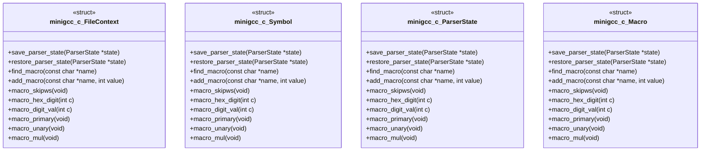

# Polyglot Codebase Knowledge Graph

> Generated offline by **readmenator**. 10 files, 617 symbols, 7 imports. Supports C, C++, Python, Go, Rust, JS/TS, Java, C#, Shell, PHP, Dart, GDScript, Nim, ASM, Ruby, Swift, Kotlin, Scala, Lua, Elixir.
> No LLMs. No tokens. Pure static analysis. See more [here](https://github.com/grisuno/ReadMenator)

**Start here:** Statistics Dashboard for scope, God Nodes for blast radius, Architecture Reference for per-file API. Agents: prefer `readmenator-agent/INDEX.md` + `SYMBOLS.md`.

**Total Files Parsed:** 10 | **Total Symbols Extracted:** 617 | **Total Imports:** 7
 | **Resolved Imports:** 1

<!-- ranking_model: v1.0 | weights: {ppr:0.45,auth:0.2,test:0.15,doc:0.1,fresh:0.1} | alpha:0.85 | commit:f3d9c44 | date:2026-07-18 -->


## Table of Contents

1. [Statistics Dashboard](#statistics-dashboard)
2. [Architectural Layers](#architectural-layers)
3. [Ranked Context](#ranked-context)
4. [God Nodes](#god-nodes)
5. [Community Analysis](#community-analysis)
6. [Suggested Questions](#suggested-questions)
7. [Hotspot Analysis](#hotspot-analysis)
8. [Change Impact Analysis](#change-impact-analysis)
9. [Suggested Linting Rules](#suggested-linting-rules)
10. [Orphans](#orphans)
11. [Query Recipes](#query-recipes)
12. [Structural Knowledge Map](#structural-knowledge-map)
13. [UML Class Diagram](#uml-class-diagram)
14. [Code Property Graph](#code-property-graph)
15. [Architecture Reference](#architecture-reference)
    - [C (4 files)](#c-4-files)
    - [H (1 files)](#h-1-files)
    - [S (3 files)](#s-3-files)
    - [SH (2 files)](#sh-2-files)

---

## Statistics Dashboard

| Metric | Value |
|--------|-------|
| Total Files | 10 |
| Total Symbols | 617 |
| Total Imports | 7 |
| Call Edges | 0 |
| Inheritance Edges | 0 |
| Languages | 4 |
| Avg Symbols/File | 61.7 |
| Avg Imports/File | 0.7 |
| Resolved Imports | 1 |

### Top Files by Import Count (Fan-Out)

| File | Imports | Symbols | Language |
|------|---------|---------|----------|
| `minigcc.c` | 4 | 125 | c |
| `test_include.c` | 2 | 3 | c |
| `test_for.c` | 1 | 1 | c |

### Top Files by Imported-By Count (Fan-In)

| File | Imported By | Symbols | Language |
|------|-------------|---------|----------|
| `my_library.h` | 1 | 2 | h |

---

## Architectural Layers

Auto-detected from path patterns, naming conventions, and imported frameworks.

| Layer | Files |
|-------|-------|
| utility | 5 |
| testing | 5 |

### utility

- `minigcc.c` (c, 125 symbols)
- `minigccg2.s` (s, 161 symbols)
- `minigccg3.s` (s, 161 symbols)
- `minigccg4.s` (s, 161 symbols)
- `my_library.h` (h, 2 symbols)

### testing

- `test.c` (c, 1 symbols)
- `test.sh` (sh, 0 symbols)
- `test_for.c` (c, 1 symbols)
- `test_include.c` (c, 3 symbols)
- `test_ld_selfhost.sh` (sh, 2 symbols)

---

## Ranked Context

Files ranked by composite score for the current query context. The ranking combines Personalized PageRank (query relevance), global authority, test coverage, documentation coverage, and code freshness. Model: v1.0.

| Rank | File | Composite | PPR | Authority | Test | Doc |
|------|------|-----------|-----|-----------|------|-----|
| 1 | `my_library.h` | 0.5219 | 0.6491 | 0.6491 | 0.00 | 1.00 |
| 2 | `test_include.c` | 0.2947 | 0.3509 | 0.3509 | 0.00 | 0.67 |
| 3 | `test_for.c` | 0.2000 | 0.0000 | 0.0000 | 0.00 | 2.00 |
| 4 | `test.sh` | 0.1000 | 0.0000 | 0.0000 | 0.00 | 1.00 |
| 5 | `test_ld_selfhost.sh` | 0.0500 | 0.0000 | 0.0000 | 0.00 | 0.50 |
| 6 | `minigcc.c` | 0.0096 | 0.0000 | 0.0000 | 0.00 | 0.10 |
| 7 | `minigccg2.s` | 0.0000 | 0.0000 | 0.0000 | 0.00 | 0.00 |
| 8 | `minigccg3.s` | 0.0000 | 0.0000 | 0.0000 | 0.00 | 0.00 |
| 9 | `minigccg4.s` | 0.0000 | 0.0000 | 0.0000 | 0.00 | 0.00 |
| 10 | `test.c` | 0.0000 | 0.0000 | 0.0000 | 0.00 | 0.00 |

---

## God Nodes

Most architecturally central files ranked by combined import/export degree and symbol richness.

| File | Score | Connections | PageRank |
|------|-------|-------------|----------|
| `minigccg2.s` | 16.1 | | 0.0000 |
| `minigccg3.s` | 16.1 | | 0.0000 |
| `minigccg4.s` | 16.1 | | 0.0000 |
| `minigcc.c` | 12.5 | | 0.0000 |
| `test_include.c` | 2.3 | | 0.3509 |
| `my_library.h` | 2.2 | | 0.6491 |
| `test_ld_selfhost.sh` | 0.2 | | 0.0000 |
| `test.c` | 0.1 | | 0.0000 |
| `test_for.c` | 0.1 | | 0.0000 |
| `test.sh` | 0.0 | | 0.0000 |

---

## Community Analysis

Files grouped by import-based community detection. Cohesion measures how tightly connected each community is internally.

### root (Cohesion: 1.00)

**2 files** in this community:

- `my_library.h` (h, 2 symbols)
- `test_include.c` (c, 3 symbols)

---

## Suggested Questions

Auto-generated exploration prompts based on graph structure:

- What does minigccg2.s depend on, and what depends on it? (0 connections)
- What does minigccg3.s depend on, and what depends on it? (0 connections)
- What does minigccg4.s depend on, and what depends on it? (0 connections)
- What is FileContext in minigcc.c and how is it used?
- What is the overall architecture of this codebase?

---

## Hotspot Analysis

Files ranked by combined complexity (symbol count) and centrality (connection count). High-scoring files are architecturally critical and may need refactoring attention.

| File | Complexity | Centrality | Combined | Symbols | Connections |
|------|-----------|------------|----------|---------|-------------|
| `my_library.h` | 0.012 | 0.500 | 0.305 | 2 | 2 |
| `test_include.c` | 0.019 | 0.750 | 0.458 | 3 | 3 |
| `test_for.c` | 0.006 | 0.250 | 0.152 | 1 | 1 |
| `test.sh` | 0.000 | 0.000 | 0.000 | 0 | 0 |
| `test_ld_selfhost.sh` | 0.012 | 0.000 | 0.005 | 2 | 0 |
| `minigcc.c` | 0.776 | 1.000 | 0.911 | 125 | 4 |
| `minigccg2.s` | 1.000 | 0.000 | 0.400 | 161 | 0 |
| `minigccg3.s` | 1.000 | 0.000 | 0.400 | 161 | 0 |
| `minigccg4.s` | 1.000 | 0.000 | 0.400 | 161 | 0 |
| `test.c` | 0.006 | 0.000 | 0.003 | 1 | 0 |

---

## Change Impact Analysis

Files sorted by how many other files would be affected if they changed. High-impact files should be changed with caution.

| File | Direct Dependents | Transitive Dependents | Total Impact |
|------|------------------|----------------------|--------------|
| `my_library.h` | 1 | 0 | 1 |
| `minigcc.c` | 0 | 0 | 0 |
| `minigccg2.s` | 0 | 0 | 0 |
| `minigccg3.s` | 0 | 0 | 0 |
| `minigccg4.s` | 0 | 0 | 0 |
| `test.c` | 0 | 0 | 0 |
| `test.sh` | 0 | 0 | 0 |
| `test_for.c` | 0 | 0 | 0 |
| `test_include.c` | 0 | 0 | 0 |
| `test_ld_selfhost.sh` | 0 | 0 | 0 |

---

## Suggested Linting Rules

Automatically suggested linting and security rules based on patterns detected in the codebase. These can be exported as Semgrep rules using the `--export-rules` flag.

| Rule ID | Severity | Description | Language | Matches |
|---------|----------|-------------|----------|---------|
| `RM001` | info | Large number of functions in c: 107 total | c | 107 |
| `RM002` | info | Large number of functions in s: 483 total | s | 483 |

---

## Orphans

Files with no documentation or low connectivity. These are candidates for documentation investment or cleanup.

- `minigccg2.s` (161 symbols, no doc)
- `minigccg3.s` (161 symbols, no doc)
- `minigccg4.s` (161 symbols, no doc)
- `test.c` (1 symbols, no doc)

---

## Query Recipes

Example queries you can run against this knowledge base using the ranking engine:

```
# Find files most relevant to a concept
readmenator query "Where is the import resolver implemented?"

# Rank files by relevance to a topic
readmenator query "How does documentation generation work?"

# Explain why a file ranks highly
readmenator query "explain readmenator/_documentation.py"

# Trace dependency paths with ranked context
readmenator query "path from CLI to exporter"
```

The ranking model uses the following signals:

- **Personalized PageRank** (45% weight): query-specific relevance via seed propagation
- **Global Authority** (20% weight): structural importance via standard PageRank
- **Test Coverage** (15% weight): fraction of symbols referenced in test files
- **Doc Coverage** (10% weight): presence of docstrings and file-level docs
- **Freshness** (10% weight): recent modification activity

Results include score decomposition and justification paths for each ranked item.

---

## Structural Knowledge Map


```mermaid
graph TD
    classDef mod fill:#1e1e1e,stroke:#ff6666,stroke-width:2px,color:#fff;
    classDef cls fill:#2d2d2d,stroke:#4ec9b0,stroke-width:2px,color:#fff;
    classDef fn fill:#333,stroke:#dcdcaa,stroke-width:1px,color:#dcdcaa;
    classDef ext fill:#111,stroke:#666,stroke-dasharray:5 5,color:#aaa;
    minigcc_c["minigcc.c (c)"]
    class minigcc_c mod;
    minigcc_c_FileContext["FileContext"]
    class minigcc_c_FileContext cls;
    minigcc_c --> minigcc_c_FileContext
    minigcc_c_Symbol["Symbol"]
    class minigcc_c_Symbol cls;
    minigcc_c --> minigcc_c_Symbol
    minigcc_c_ParserState["ParserState"]
    class minigcc_c_ParserState cls;
    minigcc_c --> minigcc_c_ParserState
    minigcc_c_Macro["Macro"]
    class minigcc_c_Macro cls;
    minigcc_c --> minigcc_c_Macro
    minigcc_c_save_parser_state["save_parser_state"]
    class minigcc_c_save_parser_state fn;
    minigcc_c --> minigcc_c_save_parser_state
    subgraph community_0 ["root"]
    test_include_c["test_include.c (c)"]
    class test_include_c mod;
    test_for_c["test_for.c (c)"]
    class test_for_c mod;
    minigccg2_s["minigccg2.s (s)"]
    class minigccg2_s mod;
    minigccg3_s["minigccg3.s (s)"]
    class minigccg3_s mod;
    minigccg4_s["minigccg4.s (s)"]
    class minigccg4_s mod;
    my_library_h["my_library.h (h)"]
    class my_library_h mod;
    test_ld_selfhost_sh["test_ld_selfhost.sh (sh)"]
    class test_ld_selfhost_sh mod;
    test_c["test.c (c)"]
    class test_c mod;
    test_sh["test.sh (sh)"]
    class test_sh mod;
    end
    test_include_c -- resolved_imports --> my_library_h
    ext_stdio_h["stdio.h"]
    class ext_stdio_h ext;
    minigcc_c -.->|imports| ext_stdio_h
    ext_stdlib_h["stdlib.h"]
    class ext_stdlib_h ext;
    minigcc_c -.->|imports| ext_stdlib_h
    ext_string_h["string.h"]
    class ext_string_h ext;
    minigcc_c -.->|imports| ext_string_h
    ext_errno_h["errno.h"]
    class ext_errno_h ext;
    minigcc_c -.->|imports| ext_errno_h
    test_for_c -.->|imports| ext_stdio_h
    test_include_c -.->|imports| ext_stdio_h
    ext_my_library_h["my_library.h"]
    class ext_my_library_h ext;
    test_include_c -.->|imports| ext_my_library_h
```

---

## UML Class Diagram

Auto-generated Mermaid class diagram from parsed class-level symbols. Shows classes, structs, interfaces, traits, and their methods with inheritance and dependency relationships.


```mermaid
classDiagram
  class minigcc_c_FileContext {
    <<struct>>
    +save_parser_state(ParserState *state)
    +restore_parser_state(ParserState *state)
    +find_macro(const char *name)
    +add_macro(const char *name, int value)
    +macro_skipws(void)
    +macro_hex_digit(int c)
    +macro_digit_val(int c)
    +macro_primary(void)
    +macro_unary(void)
    +macro_mul(void)
  }
  class minigcc_c_Symbol {
    <<struct>>
    +save_parser_state(ParserState *state)
    +restore_parser_state(ParserState *state)
    +find_macro(const char *name)
    +add_macro(const char *name, int value)
    +macro_skipws(void)
    +macro_hex_digit(int c)
    +macro_digit_val(int c)
    +macro_primary(void)
    +macro_unary(void)
    +macro_mul(void)
  }
  class minigcc_c_ParserState {
    <<struct>>
    +save_parser_state(ParserState *state)
    +restore_parser_state(ParserState *state)
    +find_macro(const char *name)
    +add_macro(const char *name, int value)
    +macro_skipws(void)
    +macro_hex_digit(int c)
    +macro_digit_val(int c)
    +macro_primary(void)
    +macro_unary(void)
    +macro_mul(void)
  }
  class minigcc_c_Macro {
    <<struct>>
    +save_parser_state(ParserState *state)
    +restore_parser_state(ParserState *state)
    +find_macro(const char *name)
    +add_macro(const char *name, int value)
    +macro_skipws(void)
    +macro_hex_digit(int c)
    +macro_digit_val(int c)
    +macro_primary(void)
    +macro_unary(void)
    +macro_mul(void)
  }
```

---

## Code Property Graph

Machine-readable Code Property Graph (CPG) in JSON-LD format. This block allows AI agents to parse the full structural graph without additional file reads. Compatible with GraphRAG pipelines.

```json
{"@context": "https://schema.org", "analysis": {"communities": [{"cohesion": 1.0, "id": 0, "label": "root", "size": 2}], "god_nodes": [{"node_id": "minigccg2.s", "score": 16.1}, {"node_id": "minigccg3.s", "score": 16.1}, {"node_id": "minigccg4.s", "score": 16.1}, {"node_id": "minigcc.c", "score": 12.5}, {"node_id": "test_include.c", "score": 2.3}, {"node_id": "my_library.h", "score": 2.2}, {"node_id": "test_ld_selfhost.sh", "score": 0.2}, {"node_id": "test.c", "score": 0.1}, {"node_id": "test_for.c", "score": 0.1}, {"node_id": "test.sh", "score": 0.0}], "surprising_connections": []}, "edges": [{"confidence": "EXTRACTED", "relation": "imports", "source": "minigcc.c", "target": "stdio.h"}, {"confidence": "EXTRACTED", "relation": "imports", "source": "minigcc.c", "target": "stdlib.h"}, {"confidence": "EXTRACTED", "relation": "imports", "source": "minigcc.c", "target": "string.h"}, {"confidence": "EXTRACTED", "relation": "imports", "source": "minigcc.c", "target": "errno.h"}, {"confidence": "EXTRACTED", "relation": "imports", "source": "test_for.c", "target": "stdio.h"}, {"confidence": "EXTRACTED", "relation": "imports", "source": "test_include.c", "target": "stdio.h"}, {"confidence": "EXTRACTED", "relation": "imports", "source": "test_include.c", "target": "my_library.h"}, {"confidence": "EXTRACTED", "relation": "resolved_imports", "source": "test_include.c", "target": "my_library.h"}], "generator": "readmenator", "metadata": {"edge_count": 8, "file_count": 10, "language_count": 4, "symbol_count": 617}, "nodes": [{"id": "minigcc.c", "kind": "module", "label": "minigcc.c", "language": "c", "sha256": "5f24e1e648047077", "symbol_count": 125, "symbols": [{"kind": "struct", "line": 91, "name": "FileContext"}, {"kind": "struct", "line": 104, "name": "Symbol"}, {"kind": "struct", "line": 206, "name": "ParserState"}, {"kind": "struct", "line": 285, "name": "Macro"}, {"kind": "function", "line": 230, "name": "save_parser_state", "signature": "static void save_parser_state(ParserState *state)"}, {"kind": "function", "line": 255, "name": "restore_parser_state", "signature": "static void restore_parser_state(ParserState *state)"}, {"kind": "function", "line": 291, "name": "find_macro", "signature": "static int find_macro(const char *name)"}, {"kind": "function", "line": 300, "name": "add_macro", "signature": "static void add_macro(const char *name, int value)"}, {"kind": "function", "line": 327, "name": "macro_skipws", "signature": "static void macro_skipws(void)"}, {"kind": "function", "line": 331, "name": "macro_hex_digit", "signature": "static int macro_hex_digit(int c)"}, {"kind": "function", "line": 338, "name": "macro_digit_val", "signature": "static int macro_digit_val(int c)"}, {"kind": "function", "line": 345, "name": "macro_primary", "signature": "static int macro_primary(void)"}, {"kind": "function", "line": 419, "name": "macro_unary", "signature": "static int macro_unary(void)"}, {"kind": "function", "line": 428, "name": "macro_mul", "signature": "static int macro_mul(void)"}, {"kind": "function", "line": 453, "name": "macro_add", "signature": "static int macro_add(void)"}, {"kind": "function", "line": 470, "name": "macro_shift", "signature": "static int macro_shift(void)"}, {"kind": "function", "line": 487, "name": "macro_cmp", "signature": "static int macro_cmp(void)"}, {"kind": "function", "line": 510, "name": "macro_eq", "signature": "static int macro_eq(void)"}, {"kind": "function", "line": 527, "name": "macro_bitand", "signature": "static int macro_bitand(void)"}, {"kind": "function", "line": 541, "name": "macro_bitxor", "signature": "static int macro_bitxor(void)"}, {"kind": "function", "line": 555, "name": "macro_bitor", "signature": "static int macro_bitor(void)"}, {"kind": "function", "line": 569, "name": "macro_logand", "signature": "static int macro_logand(void)"}, {"kind": "function", "line": 583, "name": "macro_or_expr", "signature": "static int macro_or_expr(void)"}, {"kind": "function", "line": 597, "name": "macro_fold", "signature": "static int macro_fold(void)"}, {"kind": "function", "line": 602, "name": "error", "signature": "static void error(const char *msg)"}, {"kind": "function", "line": 608, "name": "safe_malloc", "signature": "static void *safe_malloc(size_t size)"}, {"kind": "function", "line": 617, "name": "safe_strcpy", "signature": "static void safe_strcpy(char *dst, const char *src, size_t dst_sz)"}, {"kind": "function", "line": 626, "name": "safe_strtoll", "signature": "static long safe_strtoll(const char *s)"}, {"kind": "function", "line": 639, "name": "is_file_processed", "signature": "static int is_file_processed(const char *path)"}, {"kind": "function", "line": 648, "name": "mark_file_processed", "signature": "static void mark_file_processed(const char *path)"}, {"kind": "function", "line": 660, "name": "get_dir_from_path", "signature": "static void get_dir_from_path(const char *path, char *dir, int dir_sz)"}, {"kind": "function", "line": 679, "name": "resolve_local_include", "signature": "static char *resolve_local_include(const char *target)"}, {"kind": "function", "line": 718, "name": "read_include_file", "signature": "static char *read_include_file(const char *path)"}, {"doc": "Must produce identical results under gcc (32-bit int) and under the compiler's own model (64-bit int), so avoid multiplication overflow.", "kind": "function", "line": 743, "name": "hash_name", "signature": "static int hash_name(const char *name)"}, {"kind": "function", "line": 752, "name": "hash_init", "signature": "static void hash_init(void)"}, {"kind": "function", "line": 757, "name": "push_scope", "signature": "static void push_scope(void)"}, {"kind": "function", "line": 765, "name": "pop_scope", "signature": "static void pop_scope(void)"}, {"doc": "Remove all symbols from start_idx onward from the hash table and truncate symbol_count. Does NOT touch the scope stack (needed for the two-pass function body parsing pattern).", "kind": "function", "line": 795, "name": "truncate_symbols", "signature": "static void truncate_symbols(int start_idx)"}, {"kind": "function", "line": 813, "name": "my_isspace", "signature": "static int my_isspace(int c)"}, {"kind": "function", "line": 823, "name": "my_isalpha", "signature": "static int my_isalpha(int c)"}, {"kind": "function", "line": 829, "name": "my_isdigit", "signature": "static int my_isdigit(int c)"}, {"kind": "function", "line": 834, "name": "my_isalnum", "signature": "static int my_isalnum(int c)"}, {"kind": "function", "line": 840, "name": "lex_fail", "signature": "static void lex_fail(const char *msg, char *start, char *end)"}, {"kind": "function", "line": 850, "name": "lex_kw_add", "signature": "static void lex_kw_add(const char *name, int id)"}, {"kind": "function", "line": 863, "name": "lex_init_keywords", "signature": "static void lex_init_keywords(void)"}, {"kind": "function", "line": 893, "name": "lex_kw_lookup", "signature": "static int lex_kw_lookup(void)"}, {"kind": "function", "line": 905, "name": "lex_match_op", "signature": "static int lex_match_op(const char *op, int id)"}, {"kind": "function", "line": 917, "name": "lex_hex_val", "signature": "static int lex_hex_val(int c)"}, {"kind": "function", "line": 924, "name": "lex_is_int_suffix", "signature": "static int lex_is_int_suffix(int c)"}, {"kind": "function", "line": 930, "name": "lex_number", "signature": "static void lex_number(void)"}, {"doc": "float_const_is_float[float_const_count] = (sfx == 'f' || sfx == 'F') ? 1 : 0; safe_strcpy(float_const_str[float_const_count], token, MAX_TOKEN_LEN); float_const_count++; return; } while (lex_is_int_suffix(*q)) q++; input_ptr = q; snprintf(token, MAX_TOKEN_LEN, \"%ld\", v); tok = T_NUM; return; } } /* Lexer", "kind": "function", "line": 1049, "name": "next_token", "signature": "static void next_token(void)"}, {"kind": "function", "line": 1463, "name": "match", "signature": "static void match(int expected)"}, {"kind": "function", "line": 1468, "name": "emit", "signature": "static void emit(const char *s)"}, {"kind": "function", "line": 1482, "name": "emit_i", "signature": "static void emit_i(const char *fmt, int v)"}, {"kind": "function", "line": 1488, "name": "emit_s", "signature": "static void emit_s(const char *fmt, const char *s)"}, {"kind": "function", "line": 1494, "name": "emit_is", "signature": "static void emit_is(const char *fmt, int v, const char *s)"}, {"kind": "function", "line": 1500, "name": "emit_si", "signature": "static void emit_si(const char *fmt, const char *s, int v)"}, {"doc": "Write a C string as the body of a .asciz directive, escaping everything the assembler cannot take literally. Shared by the string pool and by string * initializers of global arrays.", "kind": "function", "line": 1510, "name": "emit_asciz_body", "signature": "static void emit_asciz_body(const char *s)"}, {"kind": "function", "line": 1528, "name": "emit_label", "signature": "static void emit_label(int label)"}, {"doc": "else if (c == '\\a') fprintf(output, \"\\\\a\"); else if (c == '\\b') fprintf(output, \"\\\\b\"); else if (c >= 32 && c <= 126) fputc(c, output); else fprintf(output, \"\\\\%03o\", c); s++; } } static void emit_label(int label) { if (emit_enabled) fprintf(output, \".L%d:\\n\", label); } /* Symbol table", "kind": "function", "line": 1535, "name": "find_symbol", "signature": "static int find_symbol(const char *name)"}, {"kind": "function", "line": 1545, "name": "add_symbol", "signature": "static void add_symbol(const char *name, int is_global, int size, int pointed, int is_array, int ..."}, {"doc": "Argument/parameter register names by ABI index. Written as a function instead of a local array literal because the compiler does not allocate brace-initialized local arrays correctly (they overlap adjacent locals).", "kind": "function", "line": 1606, "name": "arg_reg", "signature": "static const char *arg_reg(int i)"}, {"doc": "Argument/parameter register names by ABI index. Written as a function instead of a local array literal because the compiler does not allocate brace-initialized local arrays correctly (they overlap adjacent locals). static const char *arg_reg(int i) { if (i == 0) return \"%rdi\"; if (i == 1) return \"%rsi\"; if (i == 2) return \"%rdx\"; if (i == 3) return \"%rcx\"; if (i == 4) return \"%r8\"; return \"%r9\"; } /* Predefined libc global symbol names, indexed; returns NULL past the end.", "kind": "function", "line": 1616, "name": "libc_global_name", "signature": "static const char *libc_global_name(int i)"}, {"kind": "function", "line": 1628, "name": "unary", "signature": "static void unary(void)"}, {"kind": "function", "line": 1878, "name": "lvalue_address", "signature": "static void lvalue_address(void)"}, {"kind": "function", "line": 1930, "name": "handle_postfix", "signature": "static void handle_postfix(int is_lvalue)"}, {"kind": "function", "line": 2064, "name": "unary_expr", "signature": "static void unary_expr(void)"}, {"kind": "function", "line": 2079, "name": "multiplicative_expr", "signature": "static void multiplicative_expr(void)"}, {"kind": "function", "line": 2143, "name": "additive_expr", "signature": "static void additive_expr(void)"}, {"kind": "function", "line": 2198, "name": "shift_expr", "signature": "static void shift_expr(void)"}, {"kind": "function", "line": 2217, "name": "relational_expr", "signature": "static void relational_expr(void)"}, {"kind": "function", "line": 2270, "name": "equality_expr", "signature": "static void equality_expr(void)"}, {"kind": "function", "line": 2319, "name": "bitwise_and_expr", "signature": "static void bitwise_and_expr(void)"}, {"kind": "function", "line": 2331, "name": "bitwise_xor_expr", "signature": "static void bitwise_xor_expr(void)"}, {"kind": "function", "line": 2343, "name": "bitwise_or_expr", "signature": "static void bitwise_or_expr(void)"}, {"kind": "function", "line": 2355, "name": "logical_and_expr", "signature": "static void logical_and_expr(void)"}, {"kind": "function", "line": 2375, "name": "logical_or_expr", "signature": "static void logical_or_expr(void)"}, {"kind": "function", "line": 2395, "name": "conditional_expr", "signature": "static void conditional_expr(void)"}, {"kind": "function", "line": 2413, "name": "emit_compound_op", "signature": "static void emit_compound_op(int op, int asize)"}, {"kind": "function", "line": 2454, "name": "assignment_expr", "signature": "static void assignment_expr(void)"}, {"kind": "function", "line": 2650, "name": "statement", "signature": "static void statement(void)"}, {"kind": "function", "line": 3307, "name": "parse_function", "signature": "static void parse_function(const char *name, int ret_type)"}, {"kind": "function", "line": 3434, "name": "parse_enum", "signature": "static void parse_enum(void)"}, {"kind": "function", "line": 3483, "name": "skip_struct", "signature": "static void skip_struct(void)"}, {"kind": "function", "line": 3547, "name": "skip_typedef", "signature": "static void skip_typedef(void)"}, {"doc": "s->const_value = 8;  /* just a marker /* If a struct was just parsed, store its size if (struct_total_size > 0) s->const_value = struct_total_size; { int h = hash_name(last_name); s->next_hash = hash_table[h]; hash_table[h] = symbol_count - 1; } } match(';'); } /* Storage directive for a datum of `size` bytes.", "kind": "function", "line": 3602, "name": "data_directive", "signature": "static const char *data_directive(int size)"}, {"doc": "} } match(';'); } /* Storage directive for a datum of `size` bytes. static const char *data_directive(int size) { if (size == 1) return \"    .byte %d\"; if (size == 2) return \"    .word %d\"; if (size == 4) return \"    .long %d\"; return \"    .quad %d\"; } /* Reserve zero-initialized storage for a global.", "kind": "function", "line": 3610, "name": "emit_global_bss", "signature": "static void emit_global_bss(const char *name, int is_static, int size)"}, {"kind": "function", "line": 3617, "name": "emit_global_data_head", "signature": "static void emit_global_data_head(const char *name, int is_static)"}, {"doc": "Parse an integer constant usable as a static initializer: an optionally signed numeric or character literal, or a macro standing for one. * Returns 1 when a constant was consumed.", "kind": "function", "line": 3627, "name": "parse_const_int", "signature": "static int parse_const_int(long long *out)"}, {"doc": "} if (tok == T_ID) { int mi = find_macro(token); if (mi >= 0) { long long v = macros[mi].value; next_token(); out = neg ? -v : v; return 1; } } return 0; } /* Record a string literal in the pool and return its label index.", "kind": "function", "line": 3650, "name": "intern_string", "signature": "static int intern_string(const char *text)"}, {"doc": "Emit the definition of a global that carries an initializer. On entry the current token is the one after '='. `size` is the declared byte size and is updated in place when the initializer determines the length of an unsized array. Returns 1 when the initializer was materialized, 0 when the form is unsupported, in which case nothing was emitted and the caller falls back to * zero-initialized storage.", "kind": "function", "line": 3667, "name": "emit_global_initializer", "signature": "static int emit_global_initializer(const char *name, int is_static, int *size,\n                  ..."}, {"kind": "function", "line": 3731, "name": "parse_program", "signature": "static void parse_program(void)"}, {"kind": "function", "line": 3882, "name": "emit_float_consts", "signature": "static void emit_float_consts(void)"}, {"kind": "function", "line": 3892, "name": "emit_string_pool", "signature": "static void emit_string_pool(void)"}, {"kind": "function", "line": 3902, "name": "main", "signature": "int main(int argc, char **argv)"}, {"kind": "function", "line": 604, "name": "fprintf", "signature": "fprintf(stderr, \"%s:%d: Error at token '%s': %s\\n\", current_file ? current_file : \"(unknown)\", line, token, msg);"}, {"kind": "function", "line": 606, "name": "exit", "signature": "exit(EXIT_FAILURE);"}, {"kind": "function", "line": 683, "name": "fclose", "signature": "fclose(f);"}, {"kind": "function", "line": 722, "name": "fseek", "signature": "fseek(f, 0, SEEK_END);"}, {"kind": "function", "line": 728, "name": "rewind", "signature": "rewind(f);"}, {"kind": "function", "line": 732, "name": "free", "signature": "free(buf);"}, {"kind": "function", "line": 945, "name": "snprintf", "signature": "snprintf(token, MAX_TOKEN_LEN, \"%ld\", v);"}, {"kind": "function", "line": 1473, "name": "fputc", "signature": "fputc('%', output);"}, {"kind": "function", "line": 1551, "name": "strncpy", "signature": "strncpy(d, name, MAX_IDENT_LEN - 1);"}, {"kind": "function", "line": 2459, "name": "strcpy", "signature": "strcpy(saved_token, token);"}, {"kind": "function", "line": 2698, "name": "memcpy", "signature": "memcpy(varname, token, nlen);"}, {"kind": "macro", "line": 14, "name": "MAX_TOKEN_LEN", "signature": "#define MAX_TOKEN_LEN"}, {"kind": "macro", "line": 16, "name": "MAX_SYMBOLS", "signature": "#define MAX_SYMBOLS"}, {"kind": "macro", "line": 17, "name": "MAX_IDENT_LEN", "signature": "#define MAX_IDENT_LEN"}, {"kind": "macro", "line": 18, "name": "MAX_SOURCE_SIZE", "signature": "#define MAX_SOURCE_SIZE"}, {"kind": "macro", "line": 19, "name": "MAX_INCLUDE_DEPTH", "signature": "#define MAX_INCLUDE_DEPTH"}, {"kind": "macro", "line": 20, "name": "MAX_PROCESSED_FILES", "signature": "#define MAX_PROCESSED_FILES"}, {"kind": "macro", "line": 21, "name": "STACK_ALIGN", "signature": "#define STACK_ALIGN"}, {"kind": "macro", "line": 76, "name": "LEX_KW_CAP", "signature": "#define LEX_KW_CAP"}, {"kind": "macro", "line": 78, "name": "LEX_KW_BLOB", "signature": "#define LEX_KW_BLOB"}, {"kind": "macro", "line": 126, "name": "HASH_TABLE_SIZE", "signature": "#define HASH_TABLE_SIZE"}, {"kind": "macro", "line": 128, "name": "MAX_SCOPE_DEPTH", "signature": "#define MAX_SCOPE_DEPTH"}, {"kind": "macro", "line": 150, "name": "MAX_FLOAT_CONSTS", "signature": "#define MAX_FLOAT_CONSTS"}, {"kind": "macro", "line": 155, "name": "MAX_CASES_PER_SWITCH", "signature": "#define MAX_CASES_PER_SWITCH"}, {"kind": "macro", "line": 168, "name": "MAX_STRINGS", "signature": "#define MAX_STRINGS"}, {"kind": "macro", "line": 177, "name": "MAX_PTR_INITS", "signature": "#define MAX_PTR_INITS"}, {"kind": "macro", "line": 187, "name": "MAX_STRUCT_MEMBERS", "signature": "#define MAX_STRUCT_MEMBERS"}, {"kind": "macro", "line": 194, "name": "MAX_IF_NESTING", "signature": "#define MAX_IF_NESTING"}, {"kind": "macro", "line": 196, "name": "CONST_VAR_FLAG", "signature": "#define CONST_VAR_FLAG"}, {"kind": "macro", "line": 202, "name": "MAX_MACROS", "signature": "#define MAX_MACROS"}]}, {"id": "minigccg2.s", "kind": "module", "label": "minigccg2.s", "language": "s", "sha256": "415a115f7671af5f", "symbol_count": 161, "symbols": [{"kind": "function", "line": 3, "name": "lex_kw_blob"}, {"kind": "function", "line": 7, "name": "lex_kw_ids"}, {"kind": "function", "line": 11, "name": "lex_kw_count"}, {"kind": "function", "line": 15, "name": "input_ptr"}, {"kind": "function", "line": 19, "name": "source_start"}, {"kind": "function", "line": 23, "name": "token"}, {"kind": "function", "line": 27, "name": "tok"}, {"kind": "function", "line": 31, "name": "line"}, {"kind": "function", "line": 35, "name": "output"}, {"kind": "function", "line": 39, "name": "ctx_stack"}, {"kind": "function", "line": 43, "name": "ctx_top"}, {"kind": "function", "line": 47, "name": "current_file"}, {"kind": "function", "line": 51, "name": "processed_files"}, {"kind": "function", "line": 55, "name": "processed_count"}, {"kind": "function", "line": 59, "name": "symbols"}, {"kind": "function", "line": 63, "name": "symbol_count"}, {"kind": "function", "line": 67, "name": "hash_table"}, {"kind": "function", "line": 71, "name": "scope_stack_sym"}, {"kind": "function", "line": 75, "name": "scope_stack_stk"}, {"kind": "function", "line": 79, "name": "scope_depth"}, {"kind": "function", "line": 83, "name": "stack_size"}, {"kind": "function", "line": 87, "name": "label_counter"}, {"kind": "function", "line": 91, "name": "function_has_return"}, {"kind": "function", "line": 95, "name": "emit_enabled"}, {"kind": "function", "line": 99, "name": "max_func_stack"}, {"kind": "function", "line": 103, "name": "assign_size"}, {"kind": "function", "line": 107, "name": "expr_pointed"}, {"kind": "function", "line": 111, "name": "current_elem_size"}, {"kind": "function", "line": 115, "name": "current_elem_size2"}, {"kind": "function", "line": 119, "name": "no_postfix_deref"}, {"kind": "function", "line": 123, "name": "expr_type"}, {"kind": "function", "line": 127, "name": "static_flag"}, {"kind": "function", "line": 131, "name": "unsigned_type"}, {"kind": "function", "line": 135, "name": "const_flag"}, {"kind": "function", "line": 139, "name": "extern_flag"}, {"kind": "function", "line": 143, "name": "global_emit_deferred"}, {"kind": "function", "line": 147, "name": "float_const_str"}, {"kind": "function", "line": 151, "name": "float_const_is_float"}, {"kind": "function", "line": 155, "name": "float_const_count"}, {"kind": "function", "line": 159, "name": "switch_case_values"}, {"kind": "function", "line": 163, "name": "switch_case_labels"}, {"kind": "function", "line": 167, "name": "switch_case_count"}, {"kind": "function", "line": 171, "name": "switch_has_default"}, {"kind": "function", "line": 175, "name": "switch_default_label"}, {"kind": "function", "line": 179, "name": "break_target"}, {"kind": "function", "line": 183, "name": "break_target_valid"}, {"kind": "function", "line": 187, "name": "continue_target"}, {"kind": "function", "line": 191, "name": "continue_target_valid"}, {"kind": "function", "line": 195, "name": "str_label_counter"}, {"kind": "function", "line": 199, "name": "string_pool"}, {"kind": "function", "line": 203, "name": "string_count"}, {"kind": "function", "line": 207, "name": "ptr_init_name"}, {"kind": "function", "line": 211, "name": "ptr_init_label"}, {"kind": "function", "line": 215, "name": "ptr_init_count"}, {"kind": "function", "line": 219, "name": "struct_total_size"}, {"kind": "function", "line": 223, "name": "struct_member_names"}, {"kind": "function", "line": 227, "name": "struct_member_offsets"}, {"kind": "function", "line": 231, "name": "struct_member_sizes"}, {"kind": "function", "line": 235, "name": "struct_member_elem_sizes"}, {"kind": "function", "line": 239, "name": "struct_member_count"}, {"kind": "function", "line": 243, "name": "if_nest"}, {"kind": "function", "line": 247, "name": "if_depth"}, {"kind": "function", "line": 252, "name": "macro_count"}, {"kind": "function", "line": 256, "name": "save_parser_state"}, {"kind": "function", "line": 395, "name": "restore_parser_state"}, {"kind": "function", "line": 583, "name": "macros"}, {"kind": "function", "line": 587, "name": "find_macro"}, {"kind": "function", "line": 651, "name": "add_macro"}, {"kind": "function", "line": 781, "name": "macro_p"}, {"kind": "function", "line": 785, "name": "macro_ok"}, {"kind": "function", "line": 789, "name": "macro_skipws"}, {"kind": "function", "line": 830, "name": "macro_hex_digit"}, {"kind": "function", "line": 928, "name": "macro_digit_val"}, {"kind": "function", "line": 1049, "name": "macro_primary"}, {"kind": "function", "line": 1847, "name": "macro_unary"}, {"kind": "function", "line": 1975, "name": "macro_mul"}, {"kind": "function", "line": 2178, "name": "macro_add"}, {"kind": "function", "line": 2276, "name": "macro_shift"}, {"kind": "function", "line": 2429, "name": "macro_cmp"}, {"kind": "function", "line": 2650, "name": "macro_eq"}, {"kind": "function", "line": 2803, "name": "macro_bitand"}, {"kind": "function", "line": 2889, "name": "macro_bitxor"}, {"kind": "function", "line": 2954, "name": "macro_bitor"}, {"kind": "function", "line": 3040, "name": "macro_logand"}, {"kind": "function", "line": 3137, "name": "macro_or_expr"}, {"kind": "function", "line": 3234, "name": "macro_fold"}, {"kind": "function", "line": 3255, "name": "error"}, {"kind": "function", "line": 3307, "name": "safe_malloc"}, {"kind": "function", "line": 3362, "name": "safe_strcpy"}, {"kind": "function", "line": 3439, "name": "safe_strtoll"}, {"kind": "function", "line": 3554, "name": "is_file_processed"}, {"kind": "function", "line": 3615, "name": "mark_file_processed"}, {"kind": "function", "line": 3727, "name": "get_dir_from_path"}, {"kind": "function", "line": 3870, "name": "resolve_local_include"}, {"kind": "function", "line": 4320, "name": "read_include_file"}, {"kind": "function", "line": 4528, "name": "hash_name"}, {"kind": "function", "line": 4586, "name": "hash_init"}, {"kind": "function", "line": 4625, "name": "push_scope"}, {"kind": "function", "line": 4677, "name": "pop_scope"}, {"kind": "function", "line": 4873, "name": "truncate_symbols"}, {"kind": "function", "line": 5026, "name": "my_isspace"}, {"kind": "function", "line": 5115, "name": "my_isalpha"}, {"kind": "function", "line": 5184, "name": "my_isdigit"}, {"kind": "function", "line": 5224, "name": "my_isalnum"}, {"kind": "function", "line": 5269, "name": "lex_fail"}, {"kind": "function", "line": 5373, "name": "lex_kw_add"}, {"kind": "function", "line": 5536, "name": "lex_init_keywords"}, {"kind": "function", "line": 5919, "name": "lex_kw_lookup"}, {"kind": "function", "line": 6013, "name": "lex_match_op"}, {"kind": "function", "line": 6096, "name": "lex_hex_val"}, {"kind": "function", "line": 6218, "name": "lex_is_int_suffix"}, {"kind": "function", "line": 6287, "name": "lex_number"}, {"kind": "function", "line": 7817, "name": "next_token"}, {"kind": "function", "line": 7821, "name": "restart"}, {"kind": "function", "line": 12334, "name": "match"}, {"kind": "function", "line": 12372, "name": "emit"}, {"kind": "function", "line": 12486, "name": "emit_i"}, {"kind": "function", "line": 12535, "name": "emit_s"}, {"kind": "function", "line": 12584, "name": "emit_is"}, {"kind": "function", "line": 12637, "name": "emit_si"}, {"kind": "function", "line": 12690, "name": "emit_asciz_body"}, {"kind": "function", "line": 13014, "name": "emit_label"}, {"kind": "function", "line": 13043, "name": "find_symbol"}, {"kind": "function", "line": 13130, "name": "add_symbol"}, {"kind": "function", "line": 13504, "name": "arg_reg"}, {"kind": "function", "line": 13580, "name": "libc_global_name"}, {"kind": "function", "line": 13708, "name": "unary"}, {"kind": "function", "line": 16252, "name": "lvalue_address"}, {"kind": "function", "line": 16777, "name": "handle_postfix"}, {"kind": "function", "line": 17799, "name": "unary_expr"}, {"kind": "function", "line": 17824, "name": "multiplicative_expr"}, {"kind": "function", "line": 18446, "name": "additive_expr"}, {"kind": "function", "line": 18941, "name": "shift_expr"}, {"kind": "function", "line": 19087, "name": "relational_expr"}, {"kind": "function", "line": 19689, "name": "equality_expr"}, {"kind": "function", "line": 20167, "name": "bitwise_and_expr"}, {"kind": "function", "line": 20245, "name": "bitwise_xor_expr"}, {"kind": "function", "line": 20323, "name": "bitwise_or_expr"}, {"kind": "function", "line": 20401, "name": "logical_and_expr"}, {"kind": "function", "line": 20564, "name": "logical_or_expr"}, {"kind": "function", "line": 20727, "name": "conditional_expr"}, {"kind": "function", "line": 20859, "name": "emit_compound_op"}, {"kind": "function", "line": 21361, "name": "assignment_expr"}, {"kind": "function", "line": 24676, "name": "statement"}, {"kind": "function", "line": 28122, "name": "restart_typedef"}, {"kind": "function", "line": 29154, "name": "restart_int"}, {"kind": "function", "line": 30311, "name": "parse_function"}, {"kind": "function", "line": 31632, "name": "parse_enum"}, {"kind": "function", "line": 32044, "name": "skip_struct"}, {"kind": "function", "line": 32630, "name": "skip_typedef"}, {"kind": "function", "line": 33120, "name": "data_directive"}, {"kind": "function", "line": 33170, "name": "emit_global_bss"}, {"kind": "function", "line": 33261, "name": "emit_global_data_head"}, {"kind": "function", "line": 33316, "name": "parse_const_int"}, {"kind": "function", "line": 33479, "name": "intern_string"}, {"kind": "function", "line": 33572, "name": "emit_global_initializer"}, {"kind": "function", "line": 34289, "name": "parse_program"}, {"kind": "function", "line": 36005, "name": "emit_float_consts"}, {"kind": "function", "line": 36104, "name": "emit_string_pool"}, {"kind": "function", "line": 36206, "name": "main"}, {"kind": "function", "line": 39836, "name": "_start"}]}, {"id": "minigccg3.s", "kind": "module", "label": "minigccg3.s", "language": "s", "sha256": "5f8991910dcb7a56", "symbol_count": 161, "symbols": [{"kind": "function", "line": 3, "name": "lex_kw_blob"}, {"kind": "function", "line": 7, "name": "lex_kw_ids"}, {"kind": "function", "line": 11, "name": "lex_kw_count"}, {"kind": "function", "line": 15, "name": "input_ptr"}, {"kind": "function", "line": 19, "name": "source_start"}, {"kind": "function", "line": 23, "name": "token"}, {"kind": "function", "line": 27, "name": "tok"}, {"kind": "function", "line": 31, "name": "line"}, {"kind": "function", "line": 35, "name": "output"}, {"kind": "function", "line": 39, "name": "ctx_stack"}, {"kind": "function", "line": 43, "name": "ctx_top"}, {"kind": "function", "line": 47, "name": "current_file"}, {"kind": "function", "line": 51, "name": "processed_files"}, {"kind": "function", "line": 55, "name": "processed_count"}, {"kind": "function", "line": 59, "name": "symbols"}, {"kind": "function", "line": 63, "name": "symbol_count"}, {"kind": "function", "line": 67, "name": "hash_table"}, {"kind": "function", "line": 71, "name": "scope_stack_sym"}, {"kind": "function", "line": 75, "name": "scope_stack_stk"}, {"kind": "function", "line": 79, "name": "scope_depth"}, {"kind": "function", "line": 83, "name": "stack_size"}, {"kind": "function", "line": 87, "name": "label_counter"}, {"kind": "function", "line": 91, "name": "function_has_return"}, {"kind": "function", "line": 95, "name": "emit_enabled"}, {"kind": "function", "line": 99, "name": "max_func_stack"}, {"kind": "function", "line": 103, "name": "assign_size"}, {"kind": "function", "line": 107, "name": "expr_pointed"}, {"kind": "function", "line": 111, "name": "current_elem_size"}, {"kind": "function", "line": 115, "name": "current_elem_size2"}, {"kind": "function", "line": 119, "name": "no_postfix_deref"}, {"kind": "function", "line": 123, "name": "expr_type"}, {"kind": "function", "line": 127, "name": "static_flag"}, {"kind": "function", "line": 131, "name": "unsigned_type"}, {"kind": "function", "line": 135, "name": "const_flag"}, {"kind": "function", "line": 139, "name": "extern_flag"}, {"kind": "function", "line": 143, "name": "global_emit_deferred"}, {"kind": "function", "line": 147, "name": "float_const_str"}, {"kind": "function", "line": 151, "name": "float_const_is_float"}, {"kind": "function", "line": 155, "name": "float_const_count"}, {"kind": "function", "line": 159, "name": "switch_case_values"}, {"kind": "function", "line": 163, "name": "switch_case_labels"}, {"kind": "function", "line": 167, "name": "switch_case_count"}, {"kind": "function", "line": 171, "name": "switch_has_default"}, {"kind": "function", "line": 175, "name": "switch_default_label"}, {"kind": "function", "line": 179, "name": "break_target"}, {"kind": "function", "line": 183, "name": "break_target_valid"}, {"kind": "function", "line": 187, "name": "continue_target"}, {"kind": "function", "line": 191, "name": "continue_target_valid"}, {"kind": "function", "line": 195, "name": "str_label_counter"}, {"kind": "function", "line": 199, "name": "string_pool"}, {"kind": "function", "line": 203, "name": "string_count"}, {"kind": "function", "line": 207, "name": "ptr_init_name"}, {"kind": "function", "line": 211, "name": "ptr_init_label"}, {"kind": "function", "line": 215, "name": "ptr_init_count"}, {"kind": "function", "line": 219, "name": "struct_total_size"}, {"kind": "function", "line": 223, "name": "struct_member_names"}, {"kind": "function", "line": 227, "name": "struct_member_offsets"}, {"kind": "function", "line": 231, "name": "struct_member_sizes"}, {"kind": "function", "line": 235, "name": "struct_member_elem_sizes"}, {"kind": "function", "line": 239, "name": "struct_member_count"}, {"kind": "function", "line": 243, "name": "if_nest"}, {"kind": "function", "line": 247, "name": "if_depth"}, {"kind": "function", "line": 252, "name": "macro_count"}, {"kind": "function", "line": 256, "name": "save_parser_state"}, {"kind": "function", "line": 395, "name": "restore_parser_state"}, {"kind": "function", "line": 583, "name": "macros"}, {"kind": "function", "line": 587, "name": "find_macro"}, {"kind": "function", "line": 651, "name": "add_macro"}, {"kind": "function", "line": 781, "name": "macro_p"}, {"kind": "function", "line": 785, "name": "macro_ok"}, {"kind": "function", "line": 789, "name": "macro_skipws"}, {"kind": "function", "line": 830, "name": "macro_hex_digit"}, {"kind": "function", "line": 928, "name": "macro_digit_val"}, {"kind": "function", "line": 1049, "name": "macro_primary"}, {"kind": "function", "line": 1847, "name": "macro_unary"}, {"kind": "function", "line": 1975, "name": "macro_mul"}, {"kind": "function", "line": 2178, "name": "macro_add"}, {"kind": "function", "line": 2276, "name": "macro_shift"}, {"kind": "function", "line": 2429, "name": "macro_cmp"}, {"kind": "function", "line": 2650, "name": "macro_eq"}, {"kind": "function", "line": 2803, "name": "macro_bitand"}, {"kind": "function", "line": 2889, "name": "macro_bitxor"}, {"kind": "function", "line": 2954, "name": "macro_bitor"}, {"kind": "function", "line": 3040, "name": "macro_logand"}, {"kind": "function", "line": 3137, "name": "macro_or_expr"}, {"kind": "function", "line": 3234, "name": "macro_fold"}, {"kind": "function", "line": 3255, "name": "error"}, {"kind": "function", "line": 3307, "name": "safe_malloc"}, {"kind": "function", "line": 3362, "name": "safe_strcpy"}, {"kind": "function", "line": 3439, "name": "safe_strtoll"}, {"kind": "function", "line": 3554, "name": "is_file_processed"}, {"kind": "function", "line": 3615, "name": "mark_file_processed"}, {"kind": "function", "line": 3727, "name": "get_dir_from_path"}, {"kind": "function", "line": 3870, "name": "resolve_local_include"}, {"kind": "function", "line": 4320, "name": "read_include_file"}, {"kind": "function", "line": 4528, "name": "hash_name"}, {"kind": "function", "line": 4586, "name": "hash_init"}, {"kind": "function", "line": 4625, "name": "push_scope"}, {"kind": "function", "line": 4677, "name": "pop_scope"}, {"kind": "function", "line": 4873, "name": "truncate_symbols"}, {"kind": "function", "line": 5026, "name": "my_isspace"}, {"kind": "function", "line": 5115, "name": "my_isalpha"}, {"kind": "function", "line": 5184, "name": "my_isdigit"}, {"kind": "function", "line": 5224, "name": "my_isalnum"}, {"kind": "function", "line": 5269, "name": "lex_fail"}, {"kind": "function", "line": 5373, "name": "lex_kw_add"}, {"kind": "function", "line": 5536, "name": "lex_init_keywords"}, {"kind": "function", "line": 5919, "name": "lex_kw_lookup"}, {"kind": "function", "line": 6013, "name": "lex_match_op"}, {"kind": "function", "line": 6096, "name": "lex_hex_val"}, {"kind": "function", "line": 6218, "name": "lex_is_int_suffix"}, {"kind": "function", "line": 6287, "name": "lex_number"}, {"kind": "function", "line": 7817, "name": "next_token"}, {"kind": "function", "line": 7821, "name": "restart"}, {"kind": "function", "line": 12334, "name": "match"}, {"kind": "function", "line": 12372, "name": "emit"}, {"kind": "function", "line": 12486, "name": "emit_i"}, {"kind": "function", "line": 12535, "name": "emit_s"}, {"kind": "function", "line": 12584, "name": "emit_is"}, {"kind": "function", "line": 12637, "name": "emit_si"}, {"kind": "function", "line": 12690, "name": "emit_asciz_body"}, {"kind": "function", "line": 13014, "name": "emit_label"}, {"kind": "function", "line": 13043, "name": "find_symbol"}, {"kind": "function", "line": 13130, "name": "add_symbol"}, {"kind": "function", "line": 13504, "name": "arg_reg"}, {"kind": "function", "line": 13580, "name": "libc_global_name"}, {"kind": "function", "line": 13708, "name": "unary"}, {"kind": "function", "line": 16252, "name": "lvalue_address"}, {"kind": "function", "line": 16777, "name": "handle_postfix"}, {"kind": "function", "line": 17799, "name": "unary_expr"}, {"kind": "function", "line": 17824, "name": "multiplicative_expr"}, {"kind": "function", "line": 18446, "name": "additive_expr"}, {"kind": "function", "line": 18941, "name": "shift_expr"}, {"kind": "function", "line": 19087, "name": "relational_expr"}, {"kind": "function", "line": 19689, "name": "equality_expr"}, {"kind": "function", "line": 20167, "name": "bitwise_and_expr"}, {"kind": "function", "line": 20245, "name": "bitwise_xor_expr"}, {"kind": "function", "line": 20323, "name": "bitwise_or_expr"}, {"kind": "function", "line": 20401, "name": "logical_and_expr"}, {"kind": "function", "line": 20564, "name": "logical_or_expr"}, {"kind": "function", "line": 20727, "name": "conditional_expr"}, {"kind": "function", "line": 20859, "name": "emit_compound_op"}, {"kind": "function", "line": 21361, "name": "assignment_expr"}, {"kind": "function", "line": 24676, "name": "statement"}, {"kind": "function", "line": 28122, "name": "restart_typedef"}, {"kind": "function", "line": 29154, "name": "restart_int"}, {"kind": "function", "line": 30311, "name": "parse_function"}, {"kind": "function", "line": 31632, "name": "parse_enum"}, {"kind": "function", "line": 32044, "name": "skip_struct"}, {"kind": "function", "line": 32630, "name": "skip_typedef"}, {"kind": "function", "line": 33120, "name": "data_directive"}, {"kind": "function", "line": 33170, "name": "emit_global_bss"}, {"kind": "function", "line": 33261, "name": "emit_global_data_head"}, {"kind": "function", "line": 33316, "name": "parse_const_int"}, {"kind": "function", "line": 33479, "name": "intern_string"}, {"kind": "function", "line": 33572, "name": "emit_global_initializer"}, {"kind": "function", "line": 34289, "name": "parse_program"}, {"kind": "function", "line": 36005, "name": "emit_float_consts"}, {"kind": "function", "line": 36104, "name": "emit_string_pool"}, {"kind": "function", "line": 36206, "name": "main"}, {"kind": "function", "line": 39836, "name": "_start"}]}, {"id": "minigccg4.s", "kind": "module", "label": "minigccg4.s", "language": "s", "sha256": "4ed91f2f9cc00bab", "symbol_count": 161, "symbols": [{"kind": "function", "line": 3, "name": "lex_kw_blob"}, {"kind": "function", "line": 7, "name": "lex_kw_ids"}, {"kind": "function", "line": 11, "name": "lex_kw_count"}, {"kind": "function", "line": 15, "name": "input_ptr"}, {"kind": "function", "line": 19, "name": "source_start"}, {"kind": "function", "line": 23, "name": "token"}, {"kind": "function", "line": 27, "name": "tok"}, {"kind": "function", "line": 31, "name": "line"}, {"kind": "function", "line": 35, "name": "output"}, {"kind": "function", "line": 39, "name": "ctx_stack"}, {"kind": "function", "line": 43, "name": "ctx_top"}, {"kind": "function", "line": 47, "name": "current_file"}, {"kind": "function", "line": 51, "name": "processed_files"}, {"kind": "function", "line": 55, "name": "processed_count"}, {"kind": "function", "line": 59, "name": "symbols"}, {"kind": "function", "line": 63, "name": "symbol_count"}, {"kind": "function", "line": 67, "name": "hash_table"}, {"kind": "function", "line": 71, "name": "scope_stack_sym"}, {"kind": "function", "line": 75, "name": "scope_stack_stk"}, {"kind": "function", "line": 79, "name": "scope_depth"}, {"kind": "function", "line": 83, "name": "stack_size"}, {"kind": "function", "line": 87, "name": "label_counter"}, {"kind": "function", "line": 91, "name": "function_has_return"}, {"kind": "function", "line": 95, "name": "emit_enabled"}, {"kind": "function", "line": 99, "name": "max_func_stack"}, {"kind": "function", "line": 103, "name": "assign_size"}, {"kind": "function", "line": 107, "name": "expr_pointed"}, {"kind": "function", "line": 111, "name": "current_elem_size"}, {"kind": "function", "line": 115, "name": "current_elem_size2"}, {"kind": "function", "line": 119, "name": "no_postfix_deref"}, {"kind": "function", "line": 123, "name": "expr_type"}, {"kind": "function", "line": 127, "name": "static_flag"}, {"kind": "function", "line": 131, "name": "unsigned_type"}, {"kind": "function", "line": 135, "name": "const_flag"}, {"kind": "function", "line": 139, "name": "extern_flag"}, {"kind": "function", "line": 143, "name": "global_emit_deferred"}, {"kind": "function", "line": 147, "name": "float_const_str"}, {"kind": "function", "line": 151, "name": "float_const_is_float"}, {"kind": "function", "line": 155, "name": "float_const_count"}, {"kind": "function", "line": 159, "name": "switch_case_values"}, {"kind": "function", "line": 163, "name": "switch_case_labels"}, {"kind": "function", "line": 167, "name": "switch_case_count"}, {"kind": "function", "line": 171, "name": "switch_has_default"}, {"kind": "function", "line": 175, "name": "switch_default_label"}, {"kind": "function", "line": 179, "name": "break_target"}, {"kind": "function", "line": 183, "name": "break_target_valid"}, {"kind": "function", "line": 187, "name": "continue_target"}, {"kind": "function", "line": 191, "name": "continue_target_valid"}, {"kind": "function", "line": 195, "name": "str_label_counter"}, {"kind": "function", "line": 199, "name": "string_pool"}, {"kind": "function", "line": 203, "name": "string_count"}, {"kind": "function", "line": 207, "name": "ptr_init_name"}, {"kind": "function", "line": 211, "name": "ptr_init_label"}, {"kind": "function", "line": 215, "name": "ptr_init_count"}, {"kind": "function", "line": 219, "name": "struct_total_size"}, {"kind": "function", "line": 223, "name": "struct_member_names"}, {"kind": "function", "line": 227, "name": "struct_member_offsets"}, {"kind": "function", "line": 231, "name": "struct_member_sizes"}, {"kind": "function", "line": 235, "name": "struct_member_elem_sizes"}, {"kind": "function", "line": 239, "name": "struct_member_count"}, {"kind": "function", "line": 243, "name": "if_nest"}, {"kind": "function", "line": 247, "name": "if_depth"}, {"kind": "function", "line": 252, "name": "macro_count"}, {"kind": "function", "line": 256, "name": "save_parser_state"}, {"kind": "function", "line": 395, "name": "restore_parser_state"}, {"kind": "function", "line": 583, "name": "macros"}, {"kind": "function", "line": 587, "name": "find_macro"}, {"kind": "function", "line": 651, "name": "add_macro"}, {"kind": "function", "line": 781, "name": "macro_p"}, {"kind": "function", "line": 785, "name": "macro_ok"}, {"kind": "function", "line": 789, "name": "macro_skipws"}, {"kind": "function", "line": 830, "name": "macro_hex_digit"}, {"kind": "function", "line": 928, "name": "macro_digit_val"}, {"kind": "function", "line": 1049, "name": "macro_primary"}, {"kind": "function", "line": 1847, "name": "macro_unary"}, {"kind": "function", "line": 1975, "name": "macro_mul"}, {"kind": "function", "line": 2178, "name": "macro_add"}, {"kind": "function", "line": 2276, "name": "macro_shift"}, {"kind": "function", "line": 2429, "name": "macro_cmp"}, {"kind": "function", "line": 2650, "name": "macro_eq"}, {"kind": "function", "line": 2803, "name": "macro_bitand"}, {"kind": "function", "line": 2889, "name": "macro_bitxor"}, {"kind": "function", "line": 2954, "name": "macro_bitor"}, {"kind": "function", "line": 3040, "name": "macro_logand"}, {"kind": "function", "line": 3137, "name": "macro_or_expr"}, {"kind": "function", "line": 3234, "name": "macro_fold"}, {"kind": "function", "line": 3255, "name": "error"}, {"kind": "function", "line": 3307, "name": "safe_malloc"}, {"kind": "function", "line": 3362, "name": "safe_strcpy"}, {"kind": "function", "line": 3439, "name": "safe_strtoll"}, {"kind": "function", "line": 3554, "name": "is_file_processed"}, {"kind": "function", "line": 3615, "name": "mark_file_processed"}, {"kind": "function", "line": 3727, "name": "get_dir_from_path"}, {"kind": "function", "line": 3870, "name": "resolve_local_include"}, {"kind": "function", "line": 4320, "name": "read_include_file"}, {"kind": "function", "line": 4528, "name": "hash_name"}, {"kind": "function", "line": 4586, "name": "hash_init"}, {"kind": "function", "line": 4625, "name": "push_scope"}, {"kind": "function", "line": 4677, "name": "pop_scope"}, {"kind": "function", "line": 4873, "name": "truncate_symbols"}, {"kind": "function", "line": 5026, "name": "my_isspace"}, {"kind": "function", "line": 5115, "name": "my_isalpha"}, {"kind": "function", "line": 5184, "name": "my_isdigit"}, {"kind": "function", "line": 5224, "name": "my_isalnum"}, {"kind": "function", "line": 5269, "name": "lex_fail"}, {"kind": "function", "line": 5373, "name": "lex_kw_add"}, {"kind": "function", "line": 5536, "name": "lex_init_keywords"}, {"kind": "function", "line": 5919, "name": "lex_kw_lookup"}, {"kind": "function", "line": 6013, "name": "lex_match_op"}, {"kind": "function", "line": 6096, "name": "lex_hex_val"}, {"kind": "function", "line": 6218, "name": "lex_is_int_suffix"}, {"kind": "function", "line": 6287, "name": "lex_number"}, {"kind": "function", "line": 7817, "name": "next_token"}, {"kind": "function", "line": 7821, "name": "restart"}, {"kind": "function", "line": 12334, "name": "match"}, {"kind": "function", "line": 12372, "name": "emit"}, {"kind": "function", "line": 12486, "name": "emit_i"}, {"kind": "function", "line": 12535, "name": "emit_s"}, {"kind": "function", "line": 12584, "name": "emit_is"}, {"kind": "function", "line": 12637, "name": "emit_si"}, {"kind": "function", "line": 12690, "name": "emit_asciz_body"}, {"kind": "function", "line": 13014, "name": "emit_label"}, {"kind": "function", "line": 13043, "name": "find_symbol"}, {"kind": "function", "line": 13130, "name": "add_symbol"}, {"kind": "function", "line": 13504, "name": "arg_reg"}, {"kind": "function", "line": 13580, "name": "libc_global_name"}, {"kind": "function", "line": 13708, "name": "unary"}, {"kind": "function", "line": 16252, "name": "lvalue_address"}, {"kind": "function", "line": 16777, "name": "handle_postfix"}, {"kind": "function", "line": 17799, "name": "unary_expr"}, {"kind": "function", "line": 17824, "name": "multiplicative_expr"}, {"kind": "function", "line": 18446, "name": "additive_expr"}, {"kind": "function", "line": 18941, "name": "shift_expr"}, {"kind": "function", "line": 19087, "name": "relational_expr"}, {"kind": "function", "line": 19689, "name": "equality_expr"}, {"kind": "function", "line": 20167, "name": "bitwise_and_expr"}, {"kind": "function", "line": 20245, "name": "bitwise_xor_expr"}, {"kind": "function", "line": 20323, "name": "bitwise_or_expr"}, {"kind": "function", "line": 20401, "name": "logical_and_expr"}, {"kind": "function", "line": 20564, "name": "logical_or_expr"}, {"kind": "function", "line": 20727, "name": "conditional_expr"}, {"kind": "function", "line": 20859, "name": "emit_compound_op"}, {"kind": "function", "line": 21361, "name": "assignment_expr"}, {"kind": "function", "line": 24676, "name": "statement"}, {"kind": "function", "line": 28122, "name": "restart_typedef"}, {"kind": "function", "line": 29154, "name": "restart_int"}, {"kind": "function", "line": 30311, "name": "parse_function"}, {"kind": "function", "line": 31632, "name": "parse_enum"}, {"kind": "function", "line": 32044, "name": "skip_struct"}, {"kind": "function", "line": 32630, "name": "skip_typedef"}, {"kind": "function", "line": 33120, "name": "data_directive"}, {"kind": "function", "line": 33170, "name": "emit_global_bss"}, {"kind": "function", "line": 33261, "name": "emit_global_data_head"}, {"kind": "function", "line": 33316, "name": "parse_const_int"}, {"kind": "function", "line": 33479, "name": "intern_string"}, {"kind": "function", "line": 33572, "name": "emit_global_initializer"}, {"kind": "function", "line": 34289, "name": "parse_program"}, {"kind": "function", "line": 36005, "name": "emit_float_consts"}, {"kind": "function", "line": 36104, "name": "emit_string_pool"}, {"kind": "function", "line": 36206, "name": "main"}, {"kind": "function", "line": 39836, "name": "_start"}]}, {"doc": "ifndef MY_LIBRARY_H define MY_LIBRARY_H  Test function to verify that inclusion works correctly", "id": "my_library.h", "kind": "module", "label": "my_library.h", "language": "h", "sha256": "e0f4932331e5dce6", "symbol_count": 2, "symbols": [{"doc": "Test function to verify that inclusion works correctly", "kind": "function", "line": 5, "name": "greet", "signature": "void greet(void);"}, {"kind": "macro", "line": 2, "name": "MY_LIBRARY_H", "signature": "#define MY_LIBRARY_H"}]}, {"id": "test.c", "kind": "module", "label": "test.c", "language": "c", "sha256": "2106b8757a54e31b", "symbol_count": 1, "symbols": [{"kind": "function", "line": 1, "name": "main", "signature": "int main(void)"}]}, {"doc": "Cleaning env", "id": "test.sh", "kind": "module", "label": "test.sh", "language": "sh", "sha256": "2a5a4539c1bfb714", "symbol_count": 0, "symbols": []}, {"doc": "include <stdio.h>", "id": "test_for.c", "kind": "module", "label": "test_for.c", "language": "c", "sha256": "b41cecb08d6bd4c5", "symbol_count": 1, "symbols": [{"doc": "include <stdio.h>", "kind": "function", "line": 2, "name": "main", "signature": "int main()"}]}, {"doc": "include <stdio.h> include \"my_library.h\"", "id": "test_include.c", "kind": "module", "label": "test_include.c", "language": "c", "sha256": "45945f57091716b5", "symbol_count": 3, "symbols": [{"doc": "include <stdio.h> include \"my_library.h\"", "kind": "function", "line": 3, "name": "main", "signature": "int main(void)"}, {"kind": "function", "line": 9, "name": "greet", "signature": "void greet(void)"}, {"kind": "function", "line": 5, "name": "printf", "signature": "printf(\"Compilation successful! The compiler includes files correctly.\\n\");"}]}, {"doc": "Self-host test: miniGCC bootstraps itself with the sibling 'ld' repository as the assembler and linker. GNU as/ld are not used after generation 1:  gcc    -> minigcc (gen1, the only foreign binary) gen1   -> g2.s  -> ld -> g2.elf g2.elf -> g3.s  -> ld -> g3.elf g3.elf -> g4.s  Success requires the fixed point (g3.s == g4.s) and that the self-hosted compiler behaves exactly like generation 1 on the test fixtures.  Environment overrides: LD_DIR (path to the ld repository, default ../ld).", "id": "test_ld_selfhost.sh", "kind": "module", "label": "test_ld_selfhost.sh", "language": "sh", "sha256": "0a33ea3718b4aa9d", "symbol_count": 2, "symbols": [{"kind": "function", "line": 27, "name": "pass"}, {"kind": "function", "line": 32, "name": "fail"}]}], "type": "CodePropertyGraph", "version": "1.0"}
```

---

## Architecture Reference

### C (4 files)

#### `minigcc.c`
**Path:** `minigcc.c`

**Functions:**
- `save_parser_state` (line 230) `static void save_parser_state(ParserState *state)`
- `restore_parser_state` (line 255) `static void restore_parser_state(ParserState *state)`
- `find_macro` (line 291) `static int find_macro(const char *name)`
- `add_macro` (line 300) `static void add_macro(const char *name, int value)`
- `macro_skipws` (line 327) `static void macro_skipws(void)`
- `macro_hex_digit` (line 331) `static int macro_hex_digit(int c)`
- `macro_digit_val` (line 338) `static int macro_digit_val(int c)`
- `macro_primary` (line 345) `static int macro_primary(void)`
- `macro_unary` (line 419) `static int macro_unary(void)`
- `macro_mul` (line 428) `static int macro_mul(void)`
- `macro_add` (line 453) `static int macro_add(void)`
- `macro_shift` (line 470) `static int macro_shift(void)`
- `macro_cmp` (line 487) `static int macro_cmp(void)`
- `macro_eq` (line 510) `static int macro_eq(void)`
- `macro_bitand` (line 527) `static int macro_bitand(void)`
- `macro_bitxor` (line 541) `static int macro_bitxor(void)`
- `macro_bitor` (line 555) `static int macro_bitor(void)`
- `macro_logand` (line 569) `static int macro_logand(void)`
- `macro_or_expr` (line 583) `static int macro_or_expr(void)`
- `macro_fold` (line 597) `static int macro_fold(void)`
- `error` (line 602) `static void error(const char *msg)`
- `safe_malloc` (line 608) `static void *safe_malloc(size_t size)`
- `safe_strcpy` (line 617) `static void safe_strcpy(char *dst, const char *src, size_t dst_sz)`
- `safe_strtoll` (line 626) `static long safe_strtoll(const char *s)`
- `is_file_processed` (line 639) `static int is_file_processed(const char *path)`
- `mark_file_processed` (line 648) `static void mark_file_processed(const char *path)`
- `get_dir_from_path` (line 660) `static void get_dir_from_path(const char *path, char *dir, int dir_sz)`
- `resolve_local_include` (line 679) `static char *resolve_local_include(const char *target)`
- `read_include_file` (line 718) `static char *read_include_file(const char *path)`
- `hash_name` (line 743) `static int hash_name(const char *name)` - *Must produce identical results under gcc (32-bit int) and under the compiler's own model (64-bit int), so avoid multiplication overflow.*
- `hash_init` (line 752) `static void hash_init(void)`
- `push_scope` (line 757) `static void push_scope(void)`
- `pop_scope` (line 765) `static void pop_scope(void)`
- `truncate_symbols` (line 795) `static void truncate_symbols(int start_idx)` - *Remove all symbols from start_idx onward from the hash table and truncate symbol_count. Does NOT touch the scope stack (needed for the two-pass function body parsing pattern).*
- `my_isspace` (line 813) `static int my_isspace(int c)`
- `my_isalpha` (line 823) `static int my_isalpha(int c)`
- `my_isdigit` (line 829) `static int my_isdigit(int c)`
- `my_isalnum` (line 834) `static int my_isalnum(int c)`
- `lex_fail` (line 840) `static void lex_fail(const char *msg, char *start, char *end)`
- `lex_kw_add` (line 850) `static void lex_kw_add(const char *name, int id)`
- `lex_init_keywords` (line 863) `static void lex_init_keywords(void)`
- `lex_kw_lookup` (line 893) `static int lex_kw_lookup(void)`
- `lex_match_op` (line 905) `static int lex_match_op(const char *op, int id)`
- `lex_hex_val` (line 917) `static int lex_hex_val(int c)`
- `lex_is_int_suffix` (line 924) `static int lex_is_int_suffix(int c)`
- `lex_number` (line 930) `static void lex_number(void)`
- `next_token` (line 1049) `static void next_token(void)` - *float_const_is_float[float_const_count] = (sfx == 'f' || sfx == 'F') ? 1 : 0; safe_strcpy(float_const_str[float_const_count], token, MAX_TOKEN_LEN); float_const_count++; return; } while (lex_is_int_suffix(*q)) q++; input_ptr = q; snprintf(token, MAX_TOKEN_LEN, "%ld", v); tok = T_NUM; return; } } /* Lexer*
- `match` (line 1463) `static void match(int expected)`
- `emit` (line 1468) `static void emit(const char *s)`
- `emit_i` (line 1482) `static void emit_i(const char *fmt, int v)`
- `emit_s` (line 1488) `static void emit_s(const char *fmt, const char *s)`
- `emit_is` (line 1494) `static void emit_is(const char *fmt, int v, const char *s)`
- `emit_si` (line 1500) `static void emit_si(const char *fmt, const char *s, int v)`
- `emit_asciz_body` (line 1510) `static void emit_asciz_body(const char *s)` - *Write a C string as the body of a .asciz directive, escaping everything the assembler cannot take literally. Shared by the string pool and by string * initializers of global arrays.*
- `emit_label` (line 1528) `static void emit_label(int label)`
- `find_symbol` (line 1535) `static int find_symbol(const char *name)` - *else if (c == '\a') fprintf(output, "\\a"); else if (c == '\b') fprintf(output, "\\b"); else if (c >= 32 && c <= 126) fputc(c, output); else fprintf(output, "\\%03o", c); s++; } } static void emit_label(int label) { if (emit_enabled) fprintf(output, ".L%d:\n", label); } /* Symbol table*
- `add_symbol` (line 1545) `static void add_symbol(const char *name, int is_global, int size, int pointed, int is_array, int ...`
- `arg_reg` (line 1606) `static const char *arg_reg(int i)` - *Argument/parameter register names by ABI index. Written as a function instead of a local array literal because the compiler does not allocate brace-initialized local arrays correctly (they overlap adjacent locals).*
- `libc_global_name` (line 1616) `static const char *libc_global_name(int i)` - *Argument/parameter register names by ABI index. Written as a function instead of a local array literal because the compiler does not allocate brace-initialized local arrays correctly (they overlap adjacent locals). static const char *arg_reg(int i) { if (i == 0) return "%rdi"; if (i == 1) return "%rsi"; if (i == 2) return "%rdx"; if (i == 3) return "%rcx"; if (i == 4) return "%r8"; return "%r9"; } /* Predefined libc global symbol names, indexed; returns NULL past the end.*
- `unary` (line 1628) `static void unary(void)`
- `lvalue_address` (line 1878) `static void lvalue_address(void)`
- `handle_postfix` (line 1930) `static void handle_postfix(int is_lvalue)`
- `unary_expr` (line 2064) `static void unary_expr(void)`
- `multiplicative_expr` (line 2079) `static void multiplicative_expr(void)`
- `additive_expr` (line 2143) `static void additive_expr(void)`
- `shift_expr` (line 2198) `static void shift_expr(void)`
- `relational_expr` (line 2217) `static void relational_expr(void)`
- `equality_expr` (line 2270) `static void equality_expr(void)`
- `bitwise_and_expr` (line 2319) `static void bitwise_and_expr(void)`
- `bitwise_xor_expr` (line 2331) `static void bitwise_xor_expr(void)`
- `bitwise_or_expr` (line 2343) `static void bitwise_or_expr(void)`
- `logical_and_expr` (line 2355) `static void logical_and_expr(void)`
- `logical_or_expr` (line 2375) `static void logical_or_expr(void)`
- `conditional_expr` (line 2395) `static void conditional_expr(void)`
- `emit_compound_op` (line 2413) `static void emit_compound_op(int op, int asize)`
- `assignment_expr` (line 2454) `static void assignment_expr(void)`
- `statement` (line 2650) `static void statement(void)`
- `parse_function` (line 3307) `static void parse_function(const char *name, int ret_type)`
- `parse_enum` (line 3434) `static void parse_enum(void)`
- `skip_struct` (line 3483) `static void skip_struct(void)`
- `skip_typedef` (line 3547) `static void skip_typedef(void)`
- `data_directive` (line 3602) `static const char *data_directive(int size)` - *s->const_value = 8;  /* just a marker /* If a struct was just parsed, store its size if (struct_total_size > 0) s->const_value = struct_total_size; { int h = hash_name(last_name); s->next_hash = hash_table[h]; hash_table[h] = symbol_count - 1; } } match(';'); } /* Storage directive for a datum of `size` bytes.*
- `emit_global_bss` (line 3610) `static void emit_global_bss(const char *name, int is_static, int size)` - *} } match(';'); } /* Storage directive for a datum of `size` bytes. static const char *data_directive(int size) { if (size == 1) return "    .byte %d"; if (size == 2) return "    .word %d"; if (size == 4) return "    .long %d"; return "    .quad %d"; } /* Reserve zero-initialized storage for a global.*
- `emit_global_data_head` (line 3617) `static void emit_global_data_head(const char *name, int is_static)`
- `parse_const_int` (line 3627) `static int parse_const_int(long long *out)` - *Parse an integer constant usable as a static initializer: an optionally signed numeric or character literal, or a macro standing for one. * Returns 1 when a constant was consumed.*
- `intern_string` (line 3650) `static int intern_string(const char *text)` - *} if (tok == T_ID) { int mi = find_macro(token); if (mi >= 0) { long long v = macros[mi].value; next_token(); out = neg ? -v : v; return 1; } } return 0; } /* Record a string literal in the pool and return its label index.*
- `emit_global_initializer` (line 3667) `static int emit_global_initializer(const char *name, int is_static, int *size,
                  ...` - *Emit the definition of a global that carries an initializer. On entry the current token is the one after '='. `size` is the declared byte size and is updated in place when the initializer determines the length of an unsized array. Returns 1 when the initializer was materialized, 0 when the form is unsupported, in which case nothing was emitted and the caller falls back to * zero-initialized storage.*
- `parse_program` (line 3731) `static void parse_program(void)`
- `emit_float_consts` (line 3882) `static void emit_float_consts(void)`
- `emit_string_pool` (line 3892) `static void emit_string_pool(void)`
- `main` (line 3902) `int main(int argc, char **argv)`
- `fprintf` (line 604) `fprintf(stderr, "%s:%d: Error at token '%s': %s\n", current_file ? current_file : "(unknown)", line, token, msg);`
- `exit` (line 606) `exit(EXIT_FAILURE);`
- `fclose` (line 683) `fclose(f);`
- `fseek` (line 722) `fseek(f, 0, SEEK_END);`
- `rewind` (line 728) `rewind(f);`
- `free` (line 732) `free(buf);`
- `snprintf` (line 945) `snprintf(token, MAX_TOKEN_LEN, "%ld", v);`
- `fputc` (line 1473) `fputc('%', output);`
- `strncpy` (line 1551) `strncpy(d, name, MAX_IDENT_LEN - 1);`
- `strcpy` (line 2459) `strcpy(saved_token, token);`
- `memcpy` (line 2698) `memcpy(varname, token, nlen);`

**Macros:**
- `MAX_TOKEN_LEN` (line 14) `#define MAX_TOKEN_LEN`
- `MAX_SYMBOLS` (line 16) `#define MAX_SYMBOLS`
- `MAX_IDENT_LEN` (line 17) `#define MAX_IDENT_LEN`
- `MAX_SOURCE_SIZE` (line 18) `#define MAX_SOURCE_SIZE`
- `MAX_INCLUDE_DEPTH` (line 19) `#define MAX_INCLUDE_DEPTH`
- `MAX_PROCESSED_FILES` (line 20) `#define MAX_PROCESSED_FILES`
- `STACK_ALIGN` (line 21) `#define STACK_ALIGN`
- `LEX_KW_CAP` (line 76) `#define LEX_KW_CAP`
- `LEX_KW_BLOB` (line 78) `#define LEX_KW_BLOB`
- `HASH_TABLE_SIZE` (line 126) `#define HASH_TABLE_SIZE`
- `MAX_SCOPE_DEPTH` (line 128) `#define MAX_SCOPE_DEPTH`
- `MAX_FLOAT_CONSTS` (line 150) `#define MAX_FLOAT_CONSTS`
- `MAX_CASES_PER_SWITCH` (line 155) `#define MAX_CASES_PER_SWITCH`
- `MAX_STRINGS` (line 168) `#define MAX_STRINGS`
- `MAX_PTR_INITS` (line 177) `#define MAX_PTR_INITS`
- `MAX_STRUCT_MEMBERS` (line 187) `#define MAX_STRUCT_MEMBERS`
- `MAX_IF_NESTING` (line 194) `#define MAX_IF_NESTING`
- `CONST_VAR_FLAG` (line 196) `#define CONST_VAR_FLAG`
- `MAX_MACROS` (line 202) `#define MAX_MACROS`

**Structs:**
- `FileContext` (line 91)
- `Symbol` (line 104)
- `ParserState` (line 206)
- `Macro` (line 285)

#### `test.c`
**Path:** `test.c`

**Functions:**
- `main` (line 1) `int main(void)`

#### `test_for.c`
**Path:** `test_for.c`
**File Doc:** *include <stdio.h>*

**Functions:**
- `main` (line 2) `int main()` - *include <stdio.h>*

#### `test_include.c`
**Path:** `test_include.c`
**File Doc:** *include <stdio.h> include "my_library.h"*

**Functions:**
- `main` (line 3) `int main(void)` - *include <stdio.h> include "my_library.h"*
- `greet` (line 9) `void greet(void)`
- `printf` (line 5) `printf("Compilation successful! The compiler includes files correctly.\n");`

### H (1 files)

#### `my_library.h`
**Path:** `my_library.h`
**File Doc:** *ifndef MY_LIBRARY_H define MY_LIBRARY_H  Test function to verify that inclusion works correctly*

**Imported by:** `test_include.c`

**Functions:**
- `greet` (line 5) `void greet(void);` - *Test function to verify that inclusion works correctly*

**Macros:**
- `MY_LIBRARY_H` (line 2) `#define MY_LIBRARY_H`

### S (3 files)

#### `minigccg2.s`
**Path:** `minigccg2.s`

**Functions:**
- `lex_kw_blob` (line 3)
- `lex_kw_ids` (line 7)
- `lex_kw_count` (line 11)
- `input_ptr` (line 15)
- `source_start` (line 19)
- `token` (line 23)
- `tok` (line 27)
- `line` (line 31)
- `output` (line 35)
- `ctx_stack` (line 39)
- `ctx_top` (line 43)
- `current_file` (line 47)
- `processed_files` (line 51)
- `processed_count` (line 55)
- `symbols` (line 59)
- `symbol_count` (line 63)
- `hash_table` (line 67)
- `scope_stack_sym` (line 71)
- `scope_stack_stk` (line 75)
- `scope_depth` (line 79)
- `stack_size` (line 83)
- `label_counter` (line 87)
- `function_has_return` (line 91)
- `emit_enabled` (line 95)
- `max_func_stack` (line 99)
- `assign_size` (line 103)
- `expr_pointed` (line 107)
- `current_elem_size` (line 111)
- `current_elem_size2` (line 115)
- `no_postfix_deref` (line 119)
- `expr_type` (line 123)
- `static_flag` (line 127)
- `unsigned_type` (line 131)
- `const_flag` (line 135)
- `extern_flag` (line 139)
- `global_emit_deferred` (line 143)
- `float_const_str` (line 147)
- `float_const_is_float` (line 151)
- `float_const_count` (line 155)
- `switch_case_values` (line 159)
- `switch_case_labels` (line 163)
- `switch_case_count` (line 167)
- `switch_has_default` (line 171)
- `switch_default_label` (line 175)
- `break_target` (line 179)
- `break_target_valid` (line 183)
- `continue_target` (line 187)
- `continue_target_valid` (line 191)
- `str_label_counter` (line 195)
- `string_pool` (line 199)
- `string_count` (line 203)
- `ptr_init_name` (line 207)
- `ptr_init_label` (line 211)
- `ptr_init_count` (line 215)
- `struct_total_size` (line 219)
- `struct_member_names` (line 223)
- `struct_member_offsets` (line 227)
- `struct_member_sizes` (line 231)
- `struct_member_elem_sizes` (line 235)
- `struct_member_count` (line 239)
- `if_nest` (line 243)
- `if_depth` (line 247)
- `macro_count` (line 252)
- `save_parser_state` (line 256)
- `restore_parser_state` (line 395)
- `macros` (line 583)
- `find_macro` (line 587)
- `add_macro` (line 651)
- `macro_p` (line 781)
- `macro_ok` (line 785)
- `macro_skipws` (line 789)
- `macro_hex_digit` (line 830)
- `macro_digit_val` (line 928)
- `macro_primary` (line 1049)
- `macro_unary` (line 1847)
- `macro_mul` (line 1975)
- `macro_add` (line 2178)
- `macro_shift` (line 2276)
- `macro_cmp` (line 2429)
- `macro_eq` (line 2650)
- `macro_bitand` (line 2803)
- `macro_bitxor` (line 2889)
- `macro_bitor` (line 2954)
- `macro_logand` (line 3040)
- `macro_or_expr` (line 3137)
- `macro_fold` (line 3234)
- `error` (line 3255)
- `safe_malloc` (line 3307)
- `safe_strcpy` (line 3362)
- `safe_strtoll` (line 3439)
- `is_file_processed` (line 3554)
- `mark_file_processed` (line 3615)
- `get_dir_from_path` (line 3727)
- `resolve_local_include` (line 3870)
- `read_include_file` (line 4320)
- `hash_name` (line 4528)
- `hash_init` (line 4586)
- `push_scope` (line 4625)
- `pop_scope` (line 4677)
- `truncate_symbols` (line 4873)
- `my_isspace` (line 5026)
- `my_isalpha` (line 5115)
- `my_isdigit` (line 5184)
- `my_isalnum` (line 5224)
- `lex_fail` (line 5269)
- `lex_kw_add` (line 5373)
- `lex_init_keywords` (line 5536)
- `lex_kw_lookup` (line 5919)
- `lex_match_op` (line 6013)
- `lex_hex_val` (line 6096)
- `lex_is_int_suffix` (line 6218)
- `lex_number` (line 6287)
- `next_token` (line 7817)
- `restart` (line 7821)
- `match` (line 12334)
- `emit` (line 12372)
- `emit_i` (line 12486)
- `emit_s` (line 12535)
- `emit_is` (line 12584)
- `emit_si` (line 12637)
- `emit_asciz_body` (line 12690)
- `emit_label` (line 13014)
- `find_symbol` (line 13043)
- `add_symbol` (line 13130)
- `arg_reg` (line 13504)
- `libc_global_name` (line 13580)
- `unary` (line 13708)
- `lvalue_address` (line 16252)
- `handle_postfix` (line 16777)
- `unary_expr` (line 17799)
- `multiplicative_expr` (line 17824)
- `additive_expr` (line 18446)
- `shift_expr` (line 18941)
- `relational_expr` (line 19087)
- `equality_expr` (line 19689)
- `bitwise_and_expr` (line 20167)
- `bitwise_xor_expr` (line 20245)
- `bitwise_or_expr` (line 20323)
- `logical_and_expr` (line 20401)
- `logical_or_expr` (line 20564)
- `conditional_expr` (line 20727)
- `emit_compound_op` (line 20859)
- `assignment_expr` (line 21361)
- `statement` (line 24676)
- `restart_typedef` (line 28122)
- `restart_int` (line 29154)
- `parse_function` (line 30311)
- `parse_enum` (line 31632)
- `skip_struct` (line 32044)
- `skip_typedef` (line 32630)
- `data_directive` (line 33120)
- `emit_global_bss` (line 33170)
- `emit_global_data_head` (line 33261)
- `parse_const_int` (line 33316)
- `intern_string` (line 33479)
- `emit_global_initializer` (line 33572)
- `parse_program` (line 34289)
- `emit_float_consts` (line 36005)
- `emit_string_pool` (line 36104)
- `main` (line 36206)
- `_start` (line 39836)

#### `minigccg3.s`
**Path:** `minigccg3.s`

**Functions:**
- `lex_kw_blob` (line 3)
- `lex_kw_ids` (line 7)
- `lex_kw_count` (line 11)
- `input_ptr` (line 15)
- `source_start` (line 19)
- `token` (line 23)
- `tok` (line 27)
- `line` (line 31)
- `output` (line 35)
- `ctx_stack` (line 39)
- `ctx_top` (line 43)
- `current_file` (line 47)
- `processed_files` (line 51)
- `processed_count` (line 55)
- `symbols` (line 59)
- `symbol_count` (line 63)
- `hash_table` (line 67)
- `scope_stack_sym` (line 71)
- `scope_stack_stk` (line 75)
- `scope_depth` (line 79)
- `stack_size` (line 83)
- `label_counter` (line 87)
- `function_has_return` (line 91)
- `emit_enabled` (line 95)
- `max_func_stack` (line 99)
- `assign_size` (line 103)
- `expr_pointed` (line 107)
- `current_elem_size` (line 111)
- `current_elem_size2` (line 115)
- `no_postfix_deref` (line 119)
- `expr_type` (line 123)
- `static_flag` (line 127)
- `unsigned_type` (line 131)
- `const_flag` (line 135)
- `extern_flag` (line 139)
- `global_emit_deferred` (line 143)
- `float_const_str` (line 147)
- `float_const_is_float` (line 151)
- `float_const_count` (line 155)
- `switch_case_values` (line 159)
- `switch_case_labels` (line 163)
- `switch_case_count` (line 167)
- `switch_has_default` (line 171)
- `switch_default_label` (line 175)
- `break_target` (line 179)
- `break_target_valid` (line 183)
- `continue_target` (line 187)
- `continue_target_valid` (line 191)
- `str_label_counter` (line 195)
- `string_pool` (line 199)
- `string_count` (line 203)
- `ptr_init_name` (line 207)
- `ptr_init_label` (line 211)
- `ptr_init_count` (line 215)
- `struct_total_size` (line 219)
- `struct_member_names` (line 223)
- `struct_member_offsets` (line 227)
- `struct_member_sizes` (line 231)
- `struct_member_elem_sizes` (line 235)
- `struct_member_count` (line 239)
- `if_nest` (line 243)
- `if_depth` (line 247)
- `macro_count` (line 252)
- `save_parser_state` (line 256)
- `restore_parser_state` (line 395)
- `macros` (line 583)
- `find_macro` (line 587)
- `add_macro` (line 651)
- `macro_p` (line 781)
- `macro_ok` (line 785)
- `macro_skipws` (line 789)
- `macro_hex_digit` (line 830)
- `macro_digit_val` (line 928)
- `macro_primary` (line 1049)
- `macro_unary` (line 1847)
- `macro_mul` (line 1975)
- `macro_add` (line 2178)
- `macro_shift` (line 2276)
- `macro_cmp` (line 2429)
- `macro_eq` (line 2650)
- `macro_bitand` (line 2803)
- `macro_bitxor` (line 2889)
- `macro_bitor` (line 2954)
- `macro_logand` (line 3040)
- `macro_or_expr` (line 3137)
- `macro_fold` (line 3234)
- `error` (line 3255)
- `safe_malloc` (line 3307)
- `safe_strcpy` (line 3362)
- `safe_strtoll` (line 3439)
- `is_file_processed` (line 3554)
- `mark_file_processed` (line 3615)
- `get_dir_from_path` (line 3727)
- `resolve_local_include` (line 3870)
- `read_include_file` (line 4320)
- `hash_name` (line 4528)
- `hash_init` (line 4586)
- `push_scope` (line 4625)
- `pop_scope` (line 4677)
- `truncate_symbols` (line 4873)
- `my_isspace` (line 5026)
- `my_isalpha` (line 5115)
- `my_isdigit` (line 5184)
- `my_isalnum` (line 5224)
- `lex_fail` (line 5269)
- `lex_kw_add` (line 5373)
- `lex_init_keywords` (line 5536)
- `lex_kw_lookup` (line 5919)
- `lex_match_op` (line 6013)
- `lex_hex_val` (line 6096)
- `lex_is_int_suffix` (line 6218)
- `lex_number` (line 6287)
- `next_token` (line 7817)
- `restart` (line 7821)
- `match` (line 12334)
- `emit` (line 12372)
- `emit_i` (line 12486)
- `emit_s` (line 12535)
- `emit_is` (line 12584)
- `emit_si` (line 12637)
- `emit_asciz_body` (line 12690)
- `emit_label` (line 13014)
- `find_symbol` (line 13043)
- `add_symbol` (line 13130)
- `arg_reg` (line 13504)
- `libc_global_name` (line 13580)
- `unary` (line 13708)
- `lvalue_address` (line 16252)
- `handle_postfix` (line 16777)
- `unary_expr` (line 17799)
- `multiplicative_expr` (line 17824)
- `additive_expr` (line 18446)
- `shift_expr` (line 18941)
- `relational_expr` (line 19087)
- `equality_expr` (line 19689)
- `bitwise_and_expr` (line 20167)
- `bitwise_xor_expr` (line 20245)
- `bitwise_or_expr` (line 20323)
- `logical_and_expr` (line 20401)
- `logical_or_expr` (line 20564)
- `conditional_expr` (line 20727)
- `emit_compound_op` (line 20859)
- `assignment_expr` (line 21361)
- `statement` (line 24676)
- `restart_typedef` (line 28122)
- `restart_int` (line 29154)
- `parse_function` (line 30311)
- `parse_enum` (line 31632)
- `skip_struct` (line 32044)
- `skip_typedef` (line 32630)
- `data_directive` (line 33120)
- `emit_global_bss` (line 33170)
- `emit_global_data_head` (line 33261)
- `parse_const_int` (line 33316)
- `intern_string` (line 33479)
- `emit_global_initializer` (line 33572)
- `parse_program` (line 34289)
- `emit_float_consts` (line 36005)
- `emit_string_pool` (line 36104)
- `main` (line 36206)
- `_start` (line 39836)

#### `minigccg4.s`
**Path:** `minigccg4.s`

**Functions:**
- `lex_kw_blob` (line 3)
- `lex_kw_ids` (line 7)
- `lex_kw_count` (line 11)
- `input_ptr` (line 15)
- `source_start` (line 19)
- `token` (line 23)
- `tok` (line 27)
- `line` (line 31)
- `output` (line 35)
- `ctx_stack` (line 39)
- `ctx_top` (line 43)
- `current_file` (line 47)
- `processed_files` (line 51)
- `processed_count` (line 55)
- `symbols` (line 59)
- `symbol_count` (line 63)
- `hash_table` (line 67)
- `scope_stack_sym` (line 71)
- `scope_stack_stk` (line 75)
- `scope_depth` (line 79)
- `stack_size` (line 83)
- `label_counter` (line 87)
- `function_has_return` (line 91)
- `emit_enabled` (line 95)
- `max_func_stack` (line 99)
- `assign_size` (line 103)
- `expr_pointed` (line 107)
- `current_elem_size` (line 111)
- `current_elem_size2` (line 115)
- `no_postfix_deref` (line 119)
- `expr_type` (line 123)
- `static_flag` (line 127)
- `unsigned_type` (line 131)
- `const_flag` (line 135)
- `extern_flag` (line 139)
- `global_emit_deferred` (line 143)
- `float_const_str` (line 147)
- `float_const_is_float` (line 151)
- `float_const_count` (line 155)
- `switch_case_values` (line 159)
- `switch_case_labels` (line 163)
- `switch_case_count` (line 167)
- `switch_has_default` (line 171)
- `switch_default_label` (line 175)
- `break_target` (line 179)
- `break_target_valid` (line 183)
- `continue_target` (line 187)
- `continue_target_valid` (line 191)
- `str_label_counter` (line 195)
- `string_pool` (line 199)
- `string_count` (line 203)
- `ptr_init_name` (line 207)
- `ptr_init_label` (line 211)
- `ptr_init_count` (line 215)
- `struct_total_size` (line 219)
- `struct_member_names` (line 223)
- `struct_member_offsets` (line 227)
- `struct_member_sizes` (line 231)
- `struct_member_elem_sizes` (line 235)
- `struct_member_count` (line 239)
- `if_nest` (line 243)
- `if_depth` (line 247)
- `macro_count` (line 252)
- `save_parser_state` (line 256)
- `restore_parser_state` (line 395)
- `macros` (line 583)
- `find_macro` (line 587)
- `add_macro` (line 651)
- `macro_p` (line 781)
- `macro_ok` (line 785)
- `macro_skipws` (line 789)
- `macro_hex_digit` (line 830)
- `macro_digit_val` (line 928)
- `macro_primary` (line 1049)
- `macro_unary` (line 1847)
- `macro_mul` (line 1975)
- `macro_add` (line 2178)
- `macro_shift` (line 2276)
- `macro_cmp` (line 2429)
- `macro_eq` (line 2650)
- `macro_bitand` (line 2803)
- `macro_bitxor` (line 2889)
- `macro_bitor` (line 2954)
- `macro_logand` (line 3040)
- `macro_or_expr` (line 3137)
- `macro_fold` (line 3234)
- `error` (line 3255)
- `safe_malloc` (line 3307)
- `safe_strcpy` (line 3362)
- `safe_strtoll` (line 3439)
- `is_file_processed` (line 3554)
- `mark_file_processed` (line 3615)
- `get_dir_from_path` (line 3727)
- `resolve_local_include` (line 3870)
- `read_include_file` (line 4320)
- `hash_name` (line 4528)
- `hash_init` (line 4586)
- `push_scope` (line 4625)
- `pop_scope` (line 4677)
- `truncate_symbols` (line 4873)
- `my_isspace` (line 5026)
- `my_isalpha` (line 5115)
- `my_isdigit` (line 5184)
- `my_isalnum` (line 5224)
- `lex_fail` (line 5269)
- `lex_kw_add` (line 5373)
- `lex_init_keywords` (line 5536)
- `lex_kw_lookup` (line 5919)
- `lex_match_op` (line 6013)
- `lex_hex_val` (line 6096)
- `lex_is_int_suffix` (line 6218)
- `lex_number` (line 6287)
- `next_token` (line 7817)
- `restart` (line 7821)
- `match` (line 12334)
- `emit` (line 12372)
- `emit_i` (line 12486)
- `emit_s` (line 12535)
- `emit_is` (line 12584)
- `emit_si` (line 12637)
- `emit_asciz_body` (line 12690)
- `emit_label` (line 13014)
- `find_symbol` (line 13043)
- `add_symbol` (line 13130)
- `arg_reg` (line 13504)
- `libc_global_name` (line 13580)
- `unary` (line 13708)
- `lvalue_address` (line 16252)
- `handle_postfix` (line 16777)
- `unary_expr` (line 17799)
- `multiplicative_expr` (line 17824)
- `additive_expr` (line 18446)
- `shift_expr` (line 18941)
- `relational_expr` (line 19087)
- `equality_expr` (line 19689)
- `bitwise_and_expr` (line 20167)
- `bitwise_xor_expr` (line 20245)
- `bitwise_or_expr` (line 20323)
- `logical_and_expr` (line 20401)
- `logical_or_expr` (line 20564)
- `conditional_expr` (line 20727)
- `emit_compound_op` (line 20859)
- `assignment_expr` (line 21361)
- `statement` (line 24676)
- `restart_typedef` (line 28122)
- `restart_int` (line 29154)
- `parse_function` (line 30311)
- `parse_enum` (line 31632)
- `skip_struct` (line 32044)
- `skip_typedef` (line 32630)
- `data_directive` (line 33120)
- `emit_global_bss` (line 33170)
- `emit_global_data_head` (line 33261)
- `parse_const_int` (line 33316)
- `intern_string` (line 33479)
- `emit_global_initializer` (line 33572)
- `parse_program` (line 34289)
- `emit_float_consts` (line 36005)
- `emit_string_pool` (line 36104)
- `main` (line 36206)
- `_start` (line 39836)

### SH (2 files)

#### `test.sh`
**Path:** `test.sh`
**File Doc:** *Cleaning env*

*No symbols extracted*

#### `test_ld_selfhost.sh`
**Path:** `test_ld_selfhost.sh`
**File Doc:** *Self-host test: miniGCC bootstraps itself with the sibling 'ld' repository as the assembler and linker. GNU as/ld are not used after generation 1:  gcc    -> minigcc (gen1, the only foreign binary) gen1   -> g2.s  -> ld -> g2.elf g2.elf -> g3.s  -> ld -> g3.elf g3.elf -> g4.s  Success requires the fixed point (g3.s == g4.s) and that the self-hosted compiler behaves exactly like generation 1 on the test fixtures.  Environment overrides: LD_DIR (path to the ld repository, default ../ld).*

**Functions:**
- `pass` (line 27)
- `fail` (line 32)
