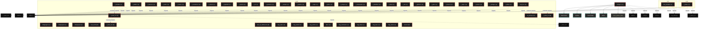
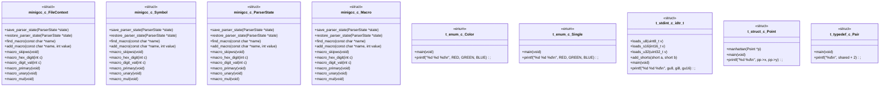

# Polyglot Codebase Knowledge Graph

> Generated offline by **readmenator**. 49 files, 836 symbols, 39 imports. Supports C, C++, Python, Go, Rust, JS/TS, Java, C#, Shell, PHP, Dart, GDScript, Nim, ASM, Ruby, Swift, Kotlin, Scala, Lua, Elixir.
> No LLMs. No tokens. Pure static analysis. See more [here](https://github.com/grisuno/ReadMenator)

**Start here:** Statistics Dashboard for scope, God Nodes for blast radius, Architecture Reference for per-file API. Agents: prefer `readmenator-agent/INDEX.md` + `SYMBOLS.md`.

**Total Files Parsed:** 49 | **Total Symbols Extracted:** 836 | **Total Imports:** 39
 | **Resolved Imports:** 4

<!-- ranking_model: v1.0 | weights: {ppr:0.45,auth:0.2,test:0.15,doc:0.1,fresh:0.1} | alpha:0.85 | commit:7158b82 | date:2026-07-18 -->


## Table of Contents

1. [Statistics Dashboard](#statistics-dashboard)
2. [Architectural Layers](#architectural-layers)
3. [Ranked Context](#ranked-context)
4. [God Nodes](#god-nodes)
5. [Community Analysis](#community-analysis)
6. [Suggested Questions](#suggested-questions)
7. [Hotspot Analysis](#hotspot-analysis)
8. [Change Impact Analysis](#change-impact-analysis)
9. [Suggested Linting Rules](#suggested-linting-rules)
10. [Orphans](#orphans)
11. [Query Recipes](#query-recipes)
12. [Structural Knowledge Map](#structural-knowledge-map)
13. [UML Class Diagram](#uml-class-diagram)
14. [Code Property Graph](#code-property-graph)
15. [Architecture Reference](#architecture-reference)
    - [C (39 files)](#c-39-files)
    - [H (4 files)](#h-4-files)
    - [S (3 files)](#s-3-files)
    - [SH (3 files)](#sh-3-files)

---

## Statistics Dashboard

| Metric | Value |
|--------|-------|
| Total Files | 49 |
| Total Symbols | 836 |
| Total Imports | 39 |
| Call Edges | 0 |
| Inheritance Edges | 0 |
| Languages | 4 |
| Avg Symbols/File | 17.1 |
| Avg Imports/File | 0.8 |
| Resolved Imports | 4 |

### Top Files by Import Count (Fan-Out)

| File | Imports | Symbols | Language |
|------|---------|---------|----------|
| `minigcc.c` | 4 | 144 | c |
| `test_include.c` | 2 | 3 | c |
| `t_include.c` | 2 | 2 | c |
| `t_inline.c` | 2 | 5 | c |
| `t_stdint.c` | 2 | 7 | c |
| `test_for.c` | 1 | 1 | c |
| `t_args.c` | 1 | 2 | c |
| `t_arith.c` | 1 | 2 | c |
| `t_arrays.c` | 1 | 2 | c |
| `t_asm.c` | 1 | 5 | c |

### Top Files by Imported-By Count (Fan-In)

| File | Imported By | Symbols | Language |
|------|-------------|---------|----------|
| `my_library.h` | 1 | 2 | h |

---

## Architectural Layers

Auto-detected from path patterns, naming conventions, and imported frameworks.

| Layer | Files |
|-------|-------|
| testing | 42 |
| utility | 5 |
| business_logic | 1 |
| infrastructure | 1 |

### utility

- `minigcc.c` (c, 144 symbols)
- `minigccg2.s` (s, 192 symbols)
- `minigccg3.s` (s, 192 symbols)
- `minigccg4.s` (s, 192 symbols)
- `my_library.h` (h, 2 symbols)

### testing

- `test.c` (c, 1 symbols)
- `test.sh` (sh, 0 symbols)
- `test_all.sh` (sh, 4 symbols)
- `test_for.c` (c, 1 symbols)
- `test_include.c` (c, 3 symbols)
- `test_ld_selfhost.sh` (sh, 2 symbols)
- `neg_asm.c` (c, 2 symbols)
- `neg_asm2.c` (c, 2 symbols)
- `neg_asm3.c` (c, 2 symbols)
- `neg_comment.c` (c, 1 symbols)
- `neg_float.c` (c, 1 symbols)
- `neg_hex.c` (c, 1 symbols)
- `neg_octal.c` (c, 1 symbols)
- `t_args.c` (c, 2 symbols)
- `t_arith.c` (c, 2 symbols)
- *... and 27 more*

### business_logic

- `t_logic.c` (c, 2 symbols)

### infrastructure

- `t_stdint.c` (c, 7 symbols)

---

## Ranked Context

Files ranked by composite score for the current query context. The ranking combines Personalized PageRank (query relevance), global authority, test coverage, documentation coverage, and code freshness. Model: v1.0.

| Rank | File | Composite | PPR | Authority | Test | Doc |
|------|------|-----------|-----|-----------|------|-----|
| 1 | `t_inner_h.h` | 0.2170 | 0.2313 | 0.2313 | 0.00 | 0.67 |
| 2 | `my_library.h` | 0.2081 | 0.1663 | 0.1663 | 0.00 | 1.00 |
| 3 | `t_inline_h.h` | 0.2081 | 0.1663 | 0.1663 | 0.00 | 1.00 |
| 4 | `test_for.c` | 0.2000 | 0.0000 | 0.0000 | 0.00 | 2.00 |
| 5 | `t_include.c` | 0.1584 | 0.0899 | 0.0899 | 0.00 | 1.00 |
| 6 | `t_outer_h.h` | 0.1581 | 0.1663 | 0.1663 | 0.00 | 0.50 |
| 7 | `test_include.c` | 0.1251 | 0.0899 | 0.0899 | 0.00 | 0.67 |
| 8 | `test.sh` | 0.1000 | 0.0000 | 0.0000 | 0.00 | 1.00 |
| 9 | `t_args.c` | 0.1000 | 0.0000 | 0.0000 | 0.00 | 1.00 |
| 10 | `t_arith.c` | 0.1000 | 0.0000 | 0.0000 | 0.00 | 1.00 |

---

## God Nodes

Most architecturally central files ranked by combined import/export degree and symbol richness.

| File | Score | Connections | PageRank |
|------|-------|-------------|----------|
| `minigccg2.s` | 19.2 | | 0.0000 |
| `minigccg3.s` | 19.2 | | 0.0000 |
| `minigccg4.s` | 19.2 | | 0.0000 |
| `minigcc.c` | 14.4 | | 0.0000 |
| `t_outer_h.h` | 4.2 | | 0.1663 |
| `t_inline.c` | 2.5 | | 0.0000 |
| `test_include.c` | 2.3 | | 0.0899 |
| `t_inner_h.h` | 2.3 | | 0.2313 |
| `my_library.h` | 2.2 | | 0.1663 |
| `t_include.c` | 2.2 | | 0.0899 |

---

## Community Analysis

Files grouped by import-based community detection. Cohesion measures how tightly connected each community is internally.

### root (Cohesion: 1.00)

**2 files** in this community:

- `my_library.h` (h, 2 symbols)
- `test_include.c` (c, 3 symbols)

### tests (Cohesion: 1.00)

**3 files** in this community:

- `t_include.c` (c, 2 symbols)
- `t_inner_h.h` (h, 3 symbols)
- `t_outer_h.h` (h, 2 symbols)

### tests (Cohesion: 1.00)

**2 files** in this community:

- `t_inline.c` (c, 5 symbols)
- `t_inline_h.h` (h, 2 symbols)

---

## Suggested Questions

Auto-generated exploration prompts based on graph structure:

- What does minigccg2.s depend on, and what depends on it? (0 connections)
- What does minigccg3.s depend on, and what depends on it? (0 connections)
- What does minigccg4.s depend on, and what depends on it? (0 connections)
- How are the 3 files in 'tests' related to each other?
- What is FileContext in minigcc.c and how is it used?

---

## Hotspot Analysis

Files ranked by combined complexity (symbol count) and centrality (connection count). High-scoring files are architecturally critical and may need refactoring attention.

| File | Complexity | Centrality | Combined | Symbols | Connections |
|------|-----------|------------|----------|---------|-------------|
| `t_inner_h.h` | 0.016 | 0.250 | 0.156 | 3 | 1 |
| `my_library.h` | 0.010 | 0.500 | 0.304 | 2 | 2 |
| `t_inline_h.h` | 0.010 | 0.250 | 0.154 | 2 | 1 |
| `test_for.c` | 0.005 | 0.250 | 0.152 | 1 | 1 |
| `t_include.c` | 0.010 | 0.750 | 0.454 | 2 | 3 |
| `t_outer_h.h` | 0.010 | 0.750 | 0.454 | 2 | 3 |
| `test_include.c` | 0.016 | 0.750 | 0.456 | 3 | 3 |
| `test.sh` | 0.000 | 0.000 | 0.000 | 0 | 0 |
| `t_args.c` | 0.010 | 0.250 | 0.154 | 2 | 1 |
| `t_arith.c` | 0.010 | 0.250 | 0.154 | 2 | 1 |
| `minigcc.c` | 0.750 | 1.000 | 0.900 | 144 | 4 |
| `t_inline.c` | 0.026 | 0.750 | 0.460 | 5 | 3 |
| `minigccg2.s` | 1.000 | 0.000 | 0.400 | 192 | 0 |
| `minigccg3.s` | 1.000 | 0.000 | 0.400 | 192 | 0 |
| `minigccg4.s` | 1.000 | 0.000 | 0.400 | 192 | 0 |

---

## Change Impact Analysis

Files sorted by how many other files would be affected if they changed. High-impact files should be changed with caution.

| File | Direct Dependents | Transitive Dependents | Total Impact |
|------|------------------|----------------------|--------------|
| `t_inner_h.h` | 1 | 1 | 2 |
| `my_library.h` | 1 | 0 | 1 |
| `t_inline_h.h` | 1 | 0 | 1 |
| `t_outer_h.h` | 1 | 0 | 1 |
| `minigcc.c` | 0 | 0 | 0 |
| `minigccg2.s` | 0 | 0 | 0 |
| `minigccg3.s` | 0 | 0 | 0 |
| `minigccg4.s` | 0 | 0 | 0 |
| `test.c` | 0 | 0 | 0 |
| `test.sh` | 0 | 0 | 0 |
| `test_all.sh` | 0 | 0 | 0 |
| `test_for.c` | 0 | 0 | 0 |
| `test_include.c` | 0 | 0 | 0 |
| `test_ld_selfhost.sh` | 0 | 0 | 0 |
| `neg_asm.c` | 0 | 0 | 0 |

---

## Suggested Linting Rules

Automatically suggested linting and security rules based on patterns detected in the codebase. These can be exported as Semgrep rules using the `--export-rules` flag.

| Rule ID | Severity | Description | Language | Matches |
|---------|----------|-------------|----------|---------|
| `RM001` | info | Large number of functions in c: 207 total | c | 207 |
| `RM002` | info | Large number of functions in s: 576 total | s | 576 |
| `RM003` | info | Large number of functions in h: 3 total | h | 3 |
| `RM004` | info | Large number of functions in sh: 6 total | sh | 6 |

---

## Orphans

Files with no documentation or low connectivity. These are candidates for documentation investment or cleanup.

- `minigccg2.s` (192 symbols, no doc)
- `minigccg3.s` (192 symbols, no doc)
- `minigccg4.s` (192 symbols, no doc)
- `test.c` (1 symbols, no doc)
- `neg_asm.c` (2 symbols, no doc)
- `neg_asm2.c` (2 symbols, no doc)
- `neg_asm3.c` (2 symbols, no doc)
- `neg_comment.c` (1 symbols, no doc)
- `neg_float.c` (1 symbols, no doc)
- `neg_hex.c` (1 symbols, no doc)
- `neg_octal.c` (1 symbols, no doc)

---

## Query Recipes

Example queries you can run against this knowledge base using the ranking engine:

```
# Find files most relevant to a concept
readmenator query "Where is the import resolver implemented?"

# Rank files by relevance to a topic
readmenator query "How does documentation generation work?"

# Explain why a file ranks highly
readmenator query "explain readmenator/_documentation.py"

# Trace dependency paths with ranked context
readmenator query "path from CLI to exporter"
```

The ranking model uses the following signals:

- **Personalized PageRank** (45% weight): query-specific relevance via seed propagation
- **Global Authority** (20% weight): structural importance via standard PageRank
- **Test Coverage** (15% weight): fraction of symbols referenced in test files
- **Doc Coverage** (10% weight): presence of docstrings and file-level docs
- **Freshness** (10% weight): recent modification activity

Results include score decomposition and justification paths for each ranked item.

---

## Structural Knowledge Map


```mermaid
graph TD
    classDef mod fill:#1e1e1e,stroke:#ff6666,stroke-width:2px,color:#fff;
    classDef cls fill:#2d2d2d,stroke:#4ec9b0,stroke-width:2px,color:#fff;
    classDef fn fill:#333,stroke:#dcdcaa,stroke-width:1px,color:#dcdcaa;
    classDef ext fill:#111,stroke:#666,stroke-dasharray:5 5,color:#aaa;
    minigcc_c["minigcc.c (c)"]
    class minigcc_c mod;
    minigcc_c_FileContext["FileContext"]
    class minigcc_c_FileContext cls;
    minigcc_c --> minigcc_c_FileContext
    minigcc_c_Symbol["Symbol"]
    class minigcc_c_Symbol cls;
    minigcc_c --> minigcc_c_Symbol
    minigcc_c_ParserState["ParserState"]
    class minigcc_c_ParserState cls;
    minigcc_c --> minigcc_c_ParserState
    minigcc_c_Macro["Macro"]
    class minigcc_c_Macro cls;
    minigcc_c --> minigcc_c_Macro
    minigcc_c_save_parser_state["save_parser_state"]
    class minigcc_c_save_parser_state fn;
    minigcc_c --> minigcc_c_save_parser_state
    subgraph community_2 ["tests"]
    tests_t_inline_c["t_inline.c (c)"]
    class tests_t_inline_c mod;
    end
    subgraph community_0 ["root"]
    test_include_c["test_include.c (c)"]
    class test_include_c mod;
    end
    subgraph community_1 ["tests"]
    tests_t_include_c["t_include.c (c)"]
    class tests_t_include_c mod;
    tests_t_stdint_c["t_stdint.c (c)"]
    class tests_t_stdint_c mod;
    tests_t_outer_h_h["t_outer_h.h (h)"]
    class tests_t_outer_h_h mod;
    tests_t_macros_c["t_macros.c (c)"]
    class tests_t_macros_c mod;
    tests_t_asm_c["t_asm.c (c)"]
    class tests_t_asm_c mod;
    tests_t_enum_c["t_enum.c (c)"]
    class tests_t_enum_c mod;
    tests_t_recursion_c["t_recursion.c (c)"]
    class tests_t_recursion_c mod;
    tests_t_struct_c["t_struct.c (c)"]
    class tests_t_struct_c mod;
    tests_t_typedef_c["t_typedef.c (c)"]
    class tests_t_typedef_c mod;
    tests_t_asm3_c["t_asm3.c (c)"]
    class tests_t_asm3_c mod;
    tests_t_if_c["t_if.c (c)"]
    class tests_t_if_c mod;
    tests_t_pointers_c["t_pointers.c (c)"]
    class tests_t_pointers_c mod;
    tests_t_scope_c["t_scope.c (c)"]
    class tests_t_scope_c mod;
    tests_t_switch_c["t_switch.c (c)"]
    class tests_t_switch_c mod;
    tests_t_args_c["t_args.c (c)"]
    class tests_t_args_c mod;
    tests_t_arith_c["t_arith.c (c)"]
    class tests_t_arith_c mod;
    tests_t_arrays_c["t_arrays.c (c)"]
    class tests_t_arrays_c mod;
    tests_t_compound_c["t_compound.c (c)"]
    class tests_t_compound_c mod;
    tests_t_dowhile_c["t_dowhile.c (c)"]
    class tests_t_dowhile_c mod;
    tests_t_float_c["t_float.c (c)"]
    class tests_t_float_c mod;
    tests_t_for_c["t_for.c (c)"]
    class tests_t_for_c mod;
    tests_t_globinit_c["t_globinit.c (c)"]
    class tests_t_globinit_c mod;
    tests_t_goto_c["t_goto.c (c)"]
    class tests_t_goto_c mod;
    tests_t_hexoct_c["t_hexoct.c (c)"]
    class tests_t_hexoct_c mod;
    tests_t_logic_c["t_logic.c (c)"]
    class tests_t_logic_c mod;
    tests_t_sizeof_c["t_sizeof.c (c)"]
    class tests_t_sizeof_c mod;
    tests_t_strings_c["t_strings.c (c)"]
    class tests_t_strings_c mod;
    tests_t_while_c["t_while.c (c)"]
    class tests_t_while_c mod;
    test_for_c["test_for.c (c)"]
    class test_for_c mod;
    minigccg2_s["minigccg2.s (s)"]
    class minigccg2_s mod;
    minigccg3_s["minigccg3.s (s)"]
    class minigccg3_s mod;
    minigccg4_s["minigccg4.s (s)"]
    class minigccg4_s mod;
    test_all_sh["test_all.sh (sh)"]
    class test_all_sh mod;
    tests_t_inner_h_h["t_inner_h.h (h)"]
    class tests_t_inner_h_h mod;
    my_library_h["my_library.h (h)"]
    class my_library_h mod;
    test_ld_selfhost_sh["test_ld_selfhost.sh (sh)"]
    class test_ld_selfhost_sh mod;
    tests_neg_asm_c["neg_asm.c (c)"]
    class tests_neg_asm_c mod;
    tests_neg_asm2_c["neg_asm2.c (c)"]
    class tests_neg_asm2_c mod;
    tests_neg_asm3_c["neg_asm3.c (c)"]
    class tests_neg_asm3_c mod;
    tests_t_inline_h_h["t_inline_h.h (h)"]
    class tests_t_inline_h_h mod;
    test_c["test.c (c)"]
    class test_c mod;
    tests_neg_comment_c["neg_comment.c (c)"]
    class tests_neg_comment_c mod;
    tests_neg_float_c["neg_float.c (c)"]
    class tests_neg_float_c mod;
    tests_neg_hex_c["neg_hex.c (c)"]
    class tests_neg_hex_c mod;
    tests_neg_octal_c["neg_octal.c (c)"]
    class tests_neg_octal_c mod;
    test_sh["test.sh (sh)"]
    class test_sh mod;
    end
    test_include_c -- resolved_imports --> my_library_h
    tests_t_include_c -- resolved_imports --> tests_t_outer_h_h
    tests_t_inline_c -- resolved_imports --> tests_t_inline_h_h
    tests_t_outer_h_h -- resolved_imports --> tests_t_inner_h_h
    ext_stdio_h["stdio.h"]
    class ext_stdio_h ext;
    minigcc_c -.->|imports| ext_stdio_h
    ext_stdlib_h["stdlib.h"]
    class ext_stdlib_h ext;
    minigcc_c -.->|imports| ext_stdlib_h
    ext_string_h["string.h"]
    class ext_string_h ext;
    minigcc_c -.->|imports| ext_string_h
    ext_errno_h["errno.h"]
    class ext_errno_h ext;
    minigcc_c -.->|imports| ext_errno_h
    test_for_c -.->|imports| ext_stdio_h
    test_include_c -.->|imports| ext_stdio_h
    ext_my_library_h["my_library.h"]
    class ext_my_library_h ext;
    test_include_c -.->|imports| ext_my_library_h
    tests_t_args_c -.->|imports| ext_stdio_h
    tests_t_arith_c -.->|imports| ext_stdio_h
    tests_t_arrays_c -.->|imports| ext_stdio_h
    tests_t_asm_c -.->|imports| ext_stdio_h
    tests_t_asm3_c -.->|imports| ext_stdio_h
    tests_t_compound_c -.->|imports| ext_stdio_h
    tests_t_dowhile_c -.->|imports| ext_stdio_h
    tests_t_enum_c -.->|imports| ext_stdio_h
    tests_t_float_c -.->|imports| ext_stdio_h
    tests_t_for_c -.->|imports| ext_stdio_h
    tests_t_globinit_c -.->|imports| ext_stdio_h
    tests_t_goto_c -.->|imports| ext_stdio_h
    tests_t_hexoct_c -.->|imports| ext_stdio_h
    tests_t_if_c -.->|imports| ext_stdio_h
    tests_t_include_c -.->|imports| ext_stdio_h
    ext_t_outer_h_h["t_outer_h.h"]
    class ext_t_outer_h_h ext;
    tests_t_include_c -.->|imports| ext_t_outer_h_h
    tests_t_inline_c -.->|imports| ext_stdio_h
    ext_t_inline_h_h["t_inline_h.h"]
    class ext_t_inline_h_h ext;
    tests_t_inline_c -.->|imports| ext_t_inline_h_h
    tests_t_logic_c -.->|imports| ext_stdio_h
    tests_t_macros_c -.->|imports| ext_stdio_h
    ext_t_inner_h_h["t_inner_h.h"]
    class ext_t_inner_h_h ext;
    tests_t_outer_h_h -.->|imports| ext_t_inner_h_h
    tests_t_pointers_c -.->|imports| ext_stdio_h
    tests_t_recursion_c -.->|imports| ext_stdio_h
    tests_t_scope_c -.->|imports| ext_stdio_h
    tests_t_sizeof_c -.->|imports| ext_stdio_h
    tests_t_stdint_c -.->|imports| ext_stdio_h
    ext_stdint_h["stdint.h"]
    class ext_stdint_h ext;
    tests_t_stdint_c -.->|imports| ext_stdint_h
    tests_t_strings_c -.->|imports| ext_stdio_h
    tests_t_struct_c -.->|imports| ext_stdio_h
    tests_t_switch_c -.->|imports| ext_stdio_h
    tests_t_typedef_c -.->|imports| ext_stdio_h
    tests_t_while_c -.->|imports| ext_stdio_h
```

---

## UML Class Diagram

Auto-generated Mermaid class diagram from parsed class-level symbols. Shows classes, structs, interfaces, traits, and their methods with inheritance and dependency relationships.


```mermaid
classDiagram
  class minigcc_c_FileContext {
    <<struct>>
    +save_parser_state(ParserState *state)
    +restore_parser_state(ParserState *state)
    +find_macro(const char *name)
    +add_macro(const char *name, int value)
    +macro_skipws(void)
    +macro_hex_digit(int c)
    +macro_digit_val(int c)
    +macro_primary(void)
    +macro_unary(void)
    +macro_mul(void)
  }
  class minigcc_c_Symbol {
    <<struct>>
    +save_parser_state(ParserState *state)
    +restore_parser_state(ParserState *state)
    +find_macro(const char *name)
    +add_macro(const char *name, int value)
    +macro_skipws(void)
    +macro_hex_digit(int c)
    +macro_digit_val(int c)
    +macro_primary(void)
    +macro_unary(void)
    +macro_mul(void)
  }
  class minigcc_c_ParserState {
    <<struct>>
    +save_parser_state(ParserState *state)
    +restore_parser_state(ParserState *state)
    +find_macro(const char *name)
    +add_macro(const char *name, int value)
    +macro_skipws(void)
    +macro_hex_digit(int c)
    +macro_digit_val(int c)
    +macro_primary(void)
    +macro_unary(void)
    +macro_mul(void)
  }
  class minigcc_c_Macro {
    <<struct>>
    +save_parser_state(ParserState *state)
    +restore_parser_state(ParserState *state)
    +find_macro(const char *name)
    +add_macro(const char *name, int value)
    +macro_skipws(void)
    +macro_hex_digit(int c)
    +macro_digit_val(int c)
    +macro_primary(void)
    +macro_unary(void)
    +macro_mul(void)
  }
  class t_enum_c_Color {
    <<enum>>
    +main(void)
    +printf("%d %d %d\n", RED, GREEN, BLUE);
  }
  class t_enum_c_Single {
    <<enum>>
    +main(void)
    +printf("%d %d %d\n", RED, GREEN, BLUE);
  }
  class t_stdint_c_idtr_t {
    <<struct>>
    +loads_u8(uint8_t v)
    +loads_s16(int16_t v)
    +loads_u32(uint32_t v)
    +add_shorts(short a, short b)
    +main(void)
    +printf("%d %d %d\n", gu8, gi8, gu16);
  }
  class t_struct_c_Point {
    <<struct>>
    +manhattan(Point *p)
    +main(void)
    +printf("%d %d\n", pp->x, pp->y);
  }
  class t_typedef_c_Pair {
    <<struct>>
    +main(void)
    +printf("%d\n", shared + 2);
  }
```

---

## Code Property Graph

Machine-readable Code Property Graph (CPG) in JSON-LD format. This block allows AI agents to parse the full structural graph without additional file reads. Compatible with GraphRAG pipelines.

```json
{"@context": "https://schema.org", "analysis": {"communities": [{"cohesion": 1.0, "id": 0, "label": "root", "size": 2}, {"cohesion": 1.0, "id": 1, "label": "tests", "size": 3}, {"cohesion": 1.0, "id": 2, "label": "tests", "size": 2}], "god_nodes": [{"node_id": "minigccg2.s", "score": 19.2}, {"node_id": "minigccg3.s", "score": 19.2}, {"node_id": "minigccg4.s", "score": 19.2}, {"node_id": "minigcc.c", "score": 14.4}, {"node_id": "tests/t_outer_h.h", "score": 4.2}, {"node_id": "tests/t_inline.c", "score": 2.5}, {"node_id": "test_include.c", "score": 2.3}, {"node_id": "tests/t_inner_h.h", "score": 2.3}, {"node_id": "my_library.h", "score": 2.2}, {"node_id": "tests/t_include.c", "score": 2.2}], "surprising_connections": []}, "edges": [{"confidence": "EXTRACTED", "relation": "imports", "source": "minigcc.c", "target": "stdio.h"}, {"confidence": "EXTRACTED", "relation": "imports", "source": "minigcc.c", "target": "stdlib.h"}, {"confidence": "EXTRACTED", "relation": "imports", "source": "minigcc.c", "target": "string.h"}, {"confidence": "EXTRACTED", "relation": "imports", "source": "minigcc.c", "target": "errno.h"}, {"confidence": "EXTRACTED", "relation": "imports", "source": "test_for.c", "target": "stdio.h"}, {"confidence": "EXTRACTED", "relation": "imports", "source": "test_include.c", "target": "stdio.h"}, {"confidence": "EXTRACTED", "relation": "imports", "source": "test_include.c", "target": "my_library.h"}, {"confidence": "EXTRACTED", "relation": "imports", "source": "tests/t_args.c", "target": "stdio.h"}, {"confidence": "EXTRACTED", "relation": "imports", "source": "tests/t_arith.c", "target": "stdio.h"}, {"confidence": "EXTRACTED", "relation": "imports", "source": "tests/t_arrays.c", "target": "stdio.h"}, {"confidence": "EXTRACTED", "relation": "imports", "source": "tests/t_asm.c", "target": "stdio.h"}, {"confidence": "EXTRACTED", "relation": "imports", "source": "tests/t_asm3.c", "target": "stdio.h"}, {"confidence": "EXTRACTED", "relation": "imports", "source": "tests/t_compound.c", "target": "stdio.h"}, {"confidence": "EXTRACTED", "relation": "imports", "source": "tests/t_dowhile.c", "target": "stdio.h"}, {"confidence": "EXTRACTED", "relation": "imports", "source": "tests/t_enum.c", "target": "stdio.h"}, {"confidence": "EXTRACTED", "relation": "imports", "source": "tests/t_float.c", "target": "stdio.h"}, {"confidence": "EXTRACTED", "relation": "imports", "source": "tests/t_for.c", "target": "stdio.h"}, {"confidence": "EXTRACTED", "relation": "imports", "source": "tests/t_globinit.c", "target": "stdio.h"}, {"confidence": "EXTRACTED", "relation": "imports", "source": "tests/t_goto.c", "target": "stdio.h"}, {"confidence": "EXTRACTED", "relation": "imports", "source": "tests/t_hexoct.c", "target": "stdio.h"}, {"confidence": "EXTRACTED", "relation": "imports", "source": "tests/t_if.c", "target": "stdio.h"}, {"confidence": "EXTRACTED", "relation": "imports", "source": "tests/t_include.c", "target": "stdio.h"}, {"confidence": "EXTRACTED", "relation": "imports", "source": "tests/t_include.c", "target": "t_outer_h.h"}, {"confidence": "EXTRACTED", "relation": "imports", "source": "tests/t_inline.c", "target": "stdio.h"}, {"confidence": "EXTRACTED", "relation": "imports", "source": "tests/t_inline.c", "target": "t_inline_h.h"}, {"confidence": "EXTRACTED", "relation": "imports", "source": "tests/t_logic.c", "target": "stdio.h"}, {"confidence": "EXTRACTED", "relation": "imports", "source": "tests/t_macros.c", "target": "stdio.h"}, {"confidence": "EXTRACTED", "relation": "imports", "source": "tests/t_outer_h.h", "target": "t_inner_h.h"}, {"confidence": "EXTRACTED", "relation": "imports", "source": "tests/t_pointers.c", "target": "stdio.h"}, {"confidence": "EXTRACTED", "relation": "imports", "source": "tests/t_recursion.c", "target": "stdio.h"}, {"confidence": "EXTRACTED", "relation": "imports", "source": "tests/t_scope.c", "target": "stdio.h"}, {"confidence": "EXTRACTED", "relation": "imports", "source": "tests/t_sizeof.c", "target": "stdio.h"}, {"confidence": "EXTRACTED", "relation": "imports", "source": "tests/t_stdint.c", "target": "stdio.h"}, {"confidence": "EXTRACTED", "relation": "imports", "source": "tests/t_stdint.c", "target": "stdint.h"}, {"confidence": "EXTRACTED", "relation": "imports", "source": "tests/t_strings.c", "target": "stdio.h"}, {"confidence": "EXTRACTED", "relation": "imports", "source": "tests/t_struct.c", "target": "stdio.h"}, {"confidence": "EXTRACTED", "relation": "imports", "source": "tests/t_switch.c", "target": "stdio.h"}, {"confidence": "EXTRACTED", "relation": "imports", "source": "tests/t_typedef.c", "target": "stdio.h"}, {"confidence": "EXTRACTED", "relation": "imports", "source": "tests/t_while.c", "target": "stdio.h"}, {"confidence": "EXTRACTED", "relation": "resolved_imports", "source": "test_include.c", "target": "my_library.h"}, {"confidence": "EXTRACTED", "relation": "resolved_imports", "source": "tests/t_include.c", "target": "tests/t_outer_h.h"}, {"confidence": "EXTRACTED", "relation": "resolved_imports", "source": "tests/t_inline.c", "target": "tests/t_inline_h.h"}, {"confidence": "EXTRACTED", "relation": "resolved_imports", "source": "tests/t_outer_h.h", "target": "tests/t_inner_h.h"}], "generator": "readmenator", "metadata": {"edge_count": 43, "file_count": 49, "language_count": 4, "symbol_count": 836}, "nodes": [{"id": "minigcc.c", "kind": "module", "label": "minigcc.c", "language": "c", "sha256": "7e94d383ec072dfb", "symbol_count": 144, "symbols": [{"kind": "struct", "line": 95, "name": "FileContext"}, {"kind": "struct", "line": 108, "name": "Symbol"}, {"kind": "struct", "line": 215, "name": "ParserState"}, {"kind": "struct", "line": 303, "name": "Macro"}, {"kind": "function", "line": 242, "name": "save_parser_state", "signature": "static void save_parser_state(ParserState *state)"}, {"kind": "function", "line": 270, "name": "restore_parser_state", "signature": "static void restore_parser_state(ParserState *state)"}, {"kind": "function", "line": 309, "name": "find_macro", "signature": "static int find_macro(const char *name)"}, {"kind": "function", "line": 318, "name": "add_macro", "signature": "static void add_macro(const char *name, int value)"}, {"kind": "function", "line": 345, "name": "macro_skipws", "signature": "static void macro_skipws(void)"}, {"kind": "function", "line": 349, "name": "macro_hex_digit", "signature": "static int macro_hex_digit(int c)"}, {"kind": "function", "line": 356, "name": "macro_digit_val", "signature": "static int macro_digit_val(int c)"}, {"kind": "function", "line": 363, "name": "macro_primary", "signature": "static int macro_primary(void)"}, {"kind": "function", "line": 437, "name": "macro_unary", "signature": "static int macro_unary(void)"}, {"kind": "function", "line": 446, "name": "macro_mul", "signature": "static int macro_mul(void)"}, {"kind": "function", "line": 471, "name": "macro_add", "signature": "static int macro_add(void)"}, {"kind": "function", "line": 488, "name": "macro_shift", "signature": "static int macro_shift(void)"}, {"kind": "function", "line": 505, "name": "macro_cmp", "signature": "static int macro_cmp(void)"}, {"kind": "function", "line": 528, "name": "macro_eq", "signature": "static int macro_eq(void)"}, {"kind": "function", "line": 545, "name": "macro_bitand", "signature": "static int macro_bitand(void)"}, {"kind": "function", "line": 559, "name": "macro_bitxor", "signature": "static int macro_bitxor(void)"}, {"kind": "function", "line": 573, "name": "macro_bitor", "signature": "static int macro_bitor(void)"}, {"kind": "function", "line": 587, "name": "macro_logand", "signature": "static int macro_logand(void)"}, {"kind": "function", "line": 601, "name": "macro_or_expr", "signature": "static int macro_or_expr(void)"}, {"kind": "function", "line": 615, "name": "macro_fold", "signature": "static int macro_fold(void)"}, {"kind": "function", "line": 620, "name": "error", "signature": "static void error(const char *msg)"}, {"kind": "function", "line": 626, "name": "safe_malloc", "signature": "static void *safe_malloc(size_t size)"}, {"kind": "function", "line": 635, "name": "safe_strcpy", "signature": "static void safe_strcpy(char *dst, const char *src, size_t dst_sz)"}, {"kind": "function", "line": 644, "name": "safe_strtoll", "signature": "static long safe_strtoll(const char *s)"}, {"kind": "function", "line": 657, "name": "is_file_processed", "signature": "static int is_file_processed(const char *path)"}, {"kind": "function", "line": 666, "name": "mark_file_processed", "signature": "static void mark_file_processed(const char *path)"}, {"kind": "function", "line": 678, "name": "get_dir_from_path", "signature": "static void get_dir_from_path(const char *path, char *dir, int dir_sz)"}, {"kind": "function", "line": 697, "name": "resolve_local_include", "signature": "static char *resolve_local_include(const char *target)"}, {"kind": "function", "line": 736, "name": "read_include_file", "signature": "static char *read_include_file(const char *path)"}, {"doc": "Must produce identical results under gcc (32-bit int) and under the compiler's own model (64-bit int), so avoid multiplication overflow.", "kind": "function", "line": 761, "name": "hash_name", "signature": "static int hash_name(const char *name)"}, {"kind": "function", "line": 770, "name": "hash_init", "signature": "static void hash_init(void)"}, {"kind": "function", "line": 775, "name": "push_scope", "signature": "static void push_scope(void)"}, {"kind": "function", "line": 783, "name": "pop_scope", "signature": "static void pop_scope(void)"}, {"doc": "Remove all symbols from start_idx onward from the hash table and truncate symbol_count. Does NOT touch the scope stack (needed for the two-pass function body parsing pattern).", "kind": "function", "line": 813, "name": "truncate_symbols", "signature": "static void truncate_symbols(int start_idx)"}, {"kind": "function", "line": 831, "name": "my_isspace", "signature": "static int my_isspace(int c)"}, {"kind": "function", "line": 841, "name": "my_isalpha", "signature": "static int my_isalpha(int c)"}, {"kind": "function", "line": 847, "name": "my_isdigit", "signature": "static int my_isdigit(int c)"}, {"kind": "function", "line": 852, "name": "my_isalnum", "signature": "static int my_isalnum(int c)"}, {"kind": "function", "line": 858, "name": "lex_fail", "signature": "static void lex_fail(const char *msg, char *start, char *end)"}, {"kind": "function", "line": 868, "name": "lex_kw_add", "signature": "static void lex_kw_add(const char *name, int id)"}, {"kind": "function", "line": 881, "name": "lex_init_keywords", "signature": "static void lex_init_keywords(void)"}, {"kind": "function", "line": 919, "name": "lex_kw_lookup", "signature": "static int lex_kw_lookup(void)"}, {"kind": "function", "line": 931, "name": "lex_match_op", "signature": "static int lex_match_op(const char *op, int id)"}, {"kind": "function", "line": 943, "name": "lex_hex_val", "signature": "static int lex_hex_val(int c)"}, {"kind": "function", "line": 950, "name": "lex_is_int_suffix", "signature": "static int lex_is_int_suffix(int c)"}, {"kind": "function", "line": 956, "name": "lex_number", "signature": "static void lex_number(void)"}, {"doc": "float_const_is_float[float_const_count] = (sfx == 'f' || sfx == 'F') ? 1 : 0; safe_strcpy(float_const_str[float_const_count], token, MAX_TOKEN_LEN); float_const_count++; return; } while (lex_is_int_suffix(*q)) q++; input_ptr = q; snprintf(token, MAX_TOKEN_LEN, \"%ld\", v); tok = T_NUM; return; } } /* Lexer", "kind": "function", "line": 1075, "name": "next_token", "signature": "static void next_token(void)"}, {"kind": "function", "line": 1503, "name": "match", "signature": "static void match(int expected)"}, {"kind": "function", "line": 1508, "name": "emit", "signature": "static void emit(const char *s)"}, {"kind": "function", "line": 1522, "name": "emit_i", "signature": "static void emit_i(const char *fmt, int v)"}, {"kind": "function", "line": 1528, "name": "emit_s", "signature": "static void emit_s(const char *fmt, const char *s)"}, {"kind": "function", "line": 1534, "name": "emit_is", "signature": "static void emit_is(const char *fmt, int v, const char *s)"}, {"kind": "function", "line": 1540, "name": "emit_si", "signature": "static void emit_si(const char *fmt, const char *s, int v)"}, {"doc": "Write a C string as the body of a .asciz directive, escaping everything the assembler cannot take literally. Shared by the string pool and by string * initializers of global arrays.", "kind": "function", "line": 1550, "name": "emit_asciz_body", "signature": "static void emit_asciz_body(const char *s)"}, {"kind": "function", "line": 1568, "name": "emit_label", "signature": "static void emit_label(int label)"}, {"doc": "else if (c == '\\a') fprintf(output, \"\\\\a\"); else if (c == '\\b') fprintf(output, \"\\\\b\"); else if (c >= 32 && c <= 126) fputc(c, output); else fprintf(output, \"\\\\%03o\", c); s++; } } static void emit_label(int label) { if (emit_enabled) fprintf(output, \".L%d:\\n\", label); } /* Symbol table", "kind": "function", "line": 1575, "name": "find_symbol", "signature": "static int find_symbol(const char *name)"}, {"kind": "function", "line": 1585, "name": "add_symbol", "signature": "static void add_symbol(const char *name, int is_global, int size, int pointed, int is_array, int ..."}, {"doc": "Argument/parameter register names by ABI index. Written as a function instead of a local array literal because the compiler does not allocate brace-initialized local arrays correctly (they overlap adjacent locals).", "kind": "function", "line": 1648, "name": "arg_reg", "signature": "static const char *arg_reg(int i)"}, {"doc": "Argument/parameter register names by ABI index. Written as a function instead of a local array literal because the compiler does not allocate brace-initialized local arrays correctly (they overlap adjacent locals). static const char *arg_reg(int i) { if (i == 0) return \"%rdi\"; if (i == 1) return \"%rsi\"; if (i == 2) return \"%rdx\"; if (i == 3) return \"%rcx\"; if (i == 4) return \"%r8\"; return \"%r9\"; } /* Predefined libc global symbol names, indexed; returns NULL past the end.", "kind": "function", "line": 1658, "name": "libc_global_name", "signature": "static const char *libc_global_name(int i)"}, {"kind": "function", "line": 1670, "name": "typedef_name", "signature": "static const char *typedef_name(int i)"}, {"kind": "function", "line": 1685, "name": "typedef_size", "signature": "static int typedef_size(int i)"}, {"kind": "function", "line": 1700, "name": "typedef_uns", "signature": "static int typedef_uns(int i)"}, {"kind": "function", "line": 1709, "name": "unary", "signature": "static void unary(void)"}, {"kind": "function", "line": 2056, "name": "lvalue_address", "signature": "static void lvalue_address(void)"}, {"kind": "function", "line": 2113, "name": "handle_postfix", "signature": "static void handle_postfix(int is_lvalue)"}, {"kind": "function", "line": 2274, "name": "unary_expr", "signature": "static void unary_expr(void)"}, {"kind": "function", "line": 2289, "name": "multiplicative_expr", "signature": "static void multiplicative_expr(void)"}, {"kind": "function", "line": 2353, "name": "additive_expr", "signature": "static void additive_expr(void)"}, {"kind": "function", "line": 2414, "name": "shift_expr", "signature": "static void shift_expr(void)"}, {"kind": "function", "line": 2433, "name": "relational_expr", "signature": "static void relational_expr(void)"}, {"kind": "function", "line": 2486, "name": "equality_expr", "signature": "static void equality_expr(void)"}, {"kind": "function", "line": 2535, "name": "bitwise_and_expr", "signature": "static void bitwise_and_expr(void)"}, {"kind": "function", "line": 2547, "name": "bitwise_xor_expr", "signature": "static void bitwise_xor_expr(void)"}, {"kind": "function", "line": 2559, "name": "bitwise_or_expr", "signature": "static void bitwise_or_expr(void)"}, {"kind": "function", "line": 2571, "name": "logical_and_expr", "signature": "static void logical_and_expr(void)"}, {"kind": "function", "line": 2591, "name": "logical_or_expr", "signature": "static void logical_or_expr(void)"}, {"kind": "function", "line": 2611, "name": "conditional_expr", "signature": "static void conditional_expr(void)"}, {"kind": "function", "line": 2629, "name": "emit_compound_op", "signature": "static void emit_compound_op(int op, int asize)"}, {"kind": "function", "line": 2670, "name": "assignment_expr", "signature": "static void assignment_expr(void)"}, {"kind": "function", "line": 2891, "name": "asm_scratch", "signature": "static const char *asm_scratch(int i)"}, {"kind": "function", "line": 2900, "name": "asm_home_text", "signature": "static void asm_home_text(int home, char *buf)"}, {"kind": "function", "line": 2908, "name": "asm_reg_sized", "signature": "static void asm_reg_sized(int home, int size, char *buf)"}, {"kind": "function", "line": 2944, "name": "asm_fixed_home", "signature": "static int asm_fixed_home(int c)"}, {"kind": "function", "line": 2952, "name": "asm_emit_template", "signature": "static void asm_emit_template(void)"}, {"kind": "function", "line": 2979, "name": "asm_parse_mem", "signature": "static void asm_parse_mem(int idx, int is_out)"}, {"kind": "function", "line": 3037, "name": "asm_emit_ss", "signature": "static void asm_emit_ss(const char *fmt, const char *a, const char *b)"}, {"kind": "function", "line": 3043, "name": "asm_parse_one", "signature": "static void asm_parse_one(int idx, int is_out)"}, {"kind": "function", "line": 3107, "name": "asm_assign_homes", "signature": "static void asm_assign_homes(void)"}, {"kind": "function", "line": 3152, "name": "asm_emit_all", "signature": "static void asm_emit_all(void)"}, {"kind": "function", "line": 3200, "name": "parse_asm_block", "signature": "static void parse_asm_block(void)"}, {"kind": "function", "line": 3264, "name": "statement", "signature": "static void statement(void)"}, {"kind": "function", "line": 3947, "name": "parse_function", "signature": "static void parse_function(const char *name, int ret_type)"}, {"kind": "function", "line": 4101, "name": "parse_enum", "signature": "static void parse_enum(void)"}, {"kind": "function", "line": 4150, "name": "skip_struct_fields", "signature": "static void skip_struct_fields(int fsize, int funs, int ffloat)"}, {"kind": "function", "line": 4185, "name": "skip_struct", "signature": "static void skip_struct(void)"}, {"kind": "function", "line": 4247, "name": "skip_typedef", "signature": "static void skip_typedef(void)"}, {"doc": "s->const_value = 8;  /* just a marker /* If a struct was just parsed, store its size if (struct_total_size > 0) s->const_value = struct_total_size; { int h = hash_name(last_name); s->next_hash = hash_table[h]; hash_table[h] = symbol_count - 1; } } match(';'); } /* Storage directive for a datum of `size` bytes.", "kind": "function", "line": 4306, "name": "data_directive", "signature": "static const char *data_directive(int size)"}, {"doc": "} } match(';'); } /* Storage directive for a datum of `size` bytes. static const char *data_directive(int size) { if (size == 1) return \"    .byte %d\"; if (size == 2) return \"    .word %d\"; if (size == 4) return \"    .long %d\"; return \"    .quad %d\"; } /* Reserve zero-initialized storage for a global.", "kind": "function", "line": 4314, "name": "emit_global_bss", "signature": "static void emit_global_bss(const char *name, int is_static, int size)"}, {"kind": "function", "line": 4321, "name": "emit_global_data_head", "signature": "static void emit_global_data_head(const char *name, int is_static)"}, {"doc": "Parse an integer constant usable as a static initializer: an optionally signed numeric or character literal, or a macro standing for one. * Returns 1 when a constant was consumed.", "kind": "function", "line": 4331, "name": "parse_const_int", "signature": "static int parse_const_int(long long *out)"}, {"doc": "} if (tok == T_ID) { int mi = find_macro(token); if (mi >= 0) { long long v = macros[mi].value; next_token(); out = neg ? -v : v; return 1; } } return 0; } /* Record a string literal in the pool and return its label index.", "kind": "function", "line": 4354, "name": "intern_string", "signature": "static int intern_string(const char *text)"}, {"doc": "Emit the definition of a global that carries an initializer. On entry the current token is the one after '='. `size` is the declared byte size and is updated in place when the initializer determines the length of an unsized array. Returns 1 when the initializer was materialized, 0 when the form is unsupported, in which case nothing was emitted and the caller falls back to * zero-initialized storage.", "kind": "function", "line": 4371, "name": "emit_global_initializer", "signature": "static int emit_global_initializer(const char *name, int is_static, int *size,\n                  ..."}, {"kind": "function", "line": 4435, "name": "parse_program", "signature": "static void parse_program(void)"}, {"kind": "function", "line": 4609, "name": "emit_float_consts", "signature": "static void emit_float_consts(void)"}, {"kind": "function", "line": 4619, "name": "emit_string_pool", "signature": "static void emit_string_pool(void)"}, {"kind": "function", "line": 4629, "name": "main", "signature": "int main(int argc, char **argv)"}, {"kind": "function", "line": 622, "name": "fprintf", "signature": "fprintf(stderr, \"%s:%d: Error at token '%s': %s\\n\", current_file ? current_file : \"(unknown)\", line, token, msg);"}, {"kind": "function", "line": 624, "name": "exit", "signature": "exit(EXIT_FAILURE);"}, {"kind": "function", "line": 701, "name": "fclose", "signature": "fclose(f);"}, {"kind": "function", "line": 740, "name": "fseek", "signature": "fseek(f, 0, SEEK_END);"}, {"kind": "function", "line": 746, "name": "rewind", "signature": "rewind(f);"}, {"kind": "function", "line": 750, "name": "free", "signature": "free(buf);"}, {"kind": "function", "line": 971, "name": "snprintf", "signature": "snprintf(token, MAX_TOKEN_LEN, \"%ld\", v);"}, {"kind": "function", "line": 1513, "name": "fputc", "signature": "fputc('%', output);"}, {"kind": "function", "line": 1591, "name": "strncpy", "signature": "strncpy(d, name, MAX_IDENT_LEN - 1);"}, {"kind": "function", "line": 2675, "name": "strcpy", "signature": "strcpy(saved_token, token);"}, {"kind": "function", "line": 2968, "name": "fputs", "signature": "fputs(asm_text[oi], output);"}, {"kind": "function", "line": 3317, "name": "memcpy", "signature": "memcpy(varname, token, nlen);"}, {"kind": "macro", "line": 14, "name": "MAX_TOKEN_LEN", "signature": "#define MAX_TOKEN_LEN"}, {"kind": "macro", "line": 16, "name": "MAX_SYMBOLS", "signature": "#define MAX_SYMBOLS"}, {"kind": "macro", "line": 17, "name": "MAX_IDENT_LEN", "signature": "#define MAX_IDENT_LEN"}, {"kind": "macro", "line": 18, "name": "MAX_SOURCE_SIZE", "signature": "#define MAX_SOURCE_SIZE"}, {"kind": "macro", "line": 19, "name": "MAX_INCLUDE_DEPTH", "signature": "#define MAX_INCLUDE_DEPTH"}, {"kind": "macro", "line": 20, "name": "MAX_PROCESSED_FILES", "signature": "#define MAX_PROCESSED_FILES"}, {"kind": "macro", "line": 21, "name": "STACK_ALIGN", "signature": "#define STACK_ALIGN"}, {"kind": "macro", "line": 79, "name": "LEX_KW_CAP", "signature": "#define LEX_KW_CAP"}, {"kind": "macro", "line": 81, "name": "LEX_KW_BLOB", "signature": "#define LEX_KW_BLOB"}, {"kind": "macro", "line": 130, "name": "HASH_TABLE_SIZE", "signature": "#define HASH_TABLE_SIZE"}, {"kind": "macro", "line": 132, "name": "MAX_SCOPE_DEPTH", "signature": "#define MAX_SCOPE_DEPTH"}, {"kind": "macro", "line": 157, "name": "MAX_FLOAT_CONSTS", "signature": "#define MAX_FLOAT_CONSTS"}, {"kind": "macro", "line": 162, "name": "MAX_CASES_PER_SWITCH", "signature": "#define MAX_CASES_PER_SWITCH"}, {"kind": "macro", "line": 175, "name": "MAX_STRINGS", "signature": "#define MAX_STRINGS"}, {"kind": "macro", "line": 184, "name": "MAX_PTR_INITS", "signature": "#define MAX_PTR_INITS"}, {"kind": "macro", "line": 194, "name": "MAX_STRUCT_MEMBERS", "signature": "#define MAX_STRUCT_MEMBERS"}, {"kind": "macro", "line": 203, "name": "MAX_IF_NESTING", "signature": "#define MAX_IF_NESTING"}, {"kind": "macro", "line": 205, "name": "CONST_VAR_FLAG", "signature": "#define CONST_VAR_FLAG"}, {"kind": "macro", "line": 211, "name": "MAX_MACROS", "signature": "#define MAX_MACROS"}, {"kind": "macro", "line": 2876, "name": "ASM_MAX_OPS", "signature": "#define ASM_MAX_OPS"}, {"kind": "macro", "line": 2878, "name": "ASM_TMPL_SZ", "signature": "#define ASM_TMPL_SZ"}, {"kind": "macro", "line": 2879, "name": "ASM_TXT_SZ", "signature": "#define ASM_TXT_SZ"}]}, {"id": "minigccg2.s", "kind": "module", "label": "minigccg2.s", "language": "s", "sha256": "cbc86a467b76c24c", "symbol_count": 192, "symbols": [{"kind": "function", "line": 3, "name": "lex_kw_blob"}, {"kind": "function", "line": 7, "name": "lex_kw_ids"}, {"kind": "function", "line": 11, "name": "lex_kw_count"}, {"kind": "function", "line": 15, "name": "lex_pass_top"}, {"kind": "function", "line": 19, "name": "input_ptr"}, {"kind": "function", "line": 23, "name": "source_start"}, {"kind": "function", "line": 27, "name": "token"}, {"kind": "function", "line": 31, "name": "tok"}, {"kind": "function", "line": 35, "name": "line"}, {"kind": "function", "line": 39, "name": "output"}, {"kind": "function", "line": 43, "name": "ctx_stack"}, {"kind": "function", "line": 47, "name": "ctx_top"}, {"kind": "function", "line": 51, "name": "current_file"}, {"kind": "function", "line": 55, "name": "processed_files"}, {"kind": "function", "line": 59, "name": "processed_count"}, {"kind": "function", "line": 63, "name": "symbols"}, {"kind": "function", "line": 67, "name": "symbol_count"}, {"kind": "function", "line": 71, "name": "hash_table"}, {"kind": "function", "line": 75, "name": "scope_stack_sym"}, {"kind": "function", "line": 79, "name": "scope_stack_stk"}, {"kind": "function", "line": 83, "name": "scope_depth"}, {"kind": "function", "line": 87, "name": "stack_size"}, {"kind": "function", "line": 91, "name": "label_counter"}, {"kind": "function", "line": 95, "name": "function_has_return"}, {"kind": "function", "line": 99, "name": "emit_enabled"}, {"kind": "function", "line": 103, "name": "max_func_stack"}, {"kind": "function", "line": 107, "name": "assign_size"}, {"kind": "function", "line": 111, "name": "expr_pointed"}, {"kind": "function", "line": 115, "name": "current_elem_size"}, {"kind": "function", "line": 119, "name": "current_elem_size2"}, {"kind": "function", "line": 123, "name": "current_elem_unsigned"}, {"kind": "function", "line": 127, "name": "deref_w"}, {"kind": "function", "line": 131, "name": "deref_u"}, {"kind": "function", "line": 135, "name": "no_postfix_deref"}, {"kind": "function", "line": 139, "name": "expr_type"}, {"kind": "function", "line": 143, "name": "static_flag"}, {"kind": "function", "line": 147, "name": "unsigned_type"}, {"kind": "function", "line": 151, "name": "const_flag"}, {"kind": "function", "line": 155, "name": "extern_flag"}, {"kind": "function", "line": 159, "name": "global_emit_deferred"}, {"kind": "function", "line": 163, "name": "float_const_str"}, {"kind": "function", "line": 167, "name": "float_const_is_float"}, {"kind": "function", "line": 171, "name": "float_const_count"}, {"kind": "function", "line": 175, "name": "switch_case_values"}, {"kind": "function", "line": 179, "name": "switch_case_labels"}, {"kind": "function", "line": 183, "name": "switch_case_count"}, {"kind": "function", "line": 187, "name": "switch_has_default"}, {"kind": "function", "line": 191, "name": "switch_default_label"}, {"kind": "function", "line": 195, "name": "break_target"}, {"kind": "function", "line": 199, "name": "break_target_valid"}, {"kind": "function", "line": 203, "name": "continue_target"}, {"kind": "function", "line": 207, "name": "continue_target_valid"}, {"kind": "function", "line": 211, "name": "str_label_counter"}, {"kind": "function", "line": 215, "name": "string_pool"}, {"kind": "function", "line": 219, "name": "string_count"}, {"kind": "function", "line": 223, "name": "ptr_init_name"}, {"kind": "function", "line": 227, "name": "ptr_init_label"}, {"kind": "function", "line": 231, "name": "ptr_init_count"}, {"kind": "function", "line": 235, "name": "struct_total_size"}, {"kind": "function", "line": 239, "name": "struct_member_names"}, {"kind": "function", "line": 243, "name": "struct_member_offsets"}, {"kind": "function", "line": 247, "name": "struct_member_sizes"}, {"kind": "function", "line": 251, "name": "struct_member_elem_sizes"}, {"kind": "function", "line": 255, "name": "struct_member_unsigned"}, {"kind": "function", "line": 259, "name": "struct_member_is_float"}, {"kind": "function", "line": 263, "name": "struct_member_count"}, {"kind": "function", "line": 267, "name": "if_nest"}, {"kind": "function", "line": 271, "name": "if_depth"}, {"kind": "function", "line": 276, "name": "macro_count"}, {"kind": "function", "line": 280, "name": "save_parser_state"}, {"kind": "function", "line": 437, "name": "restore_parser_state"}, {"kind": "function", "line": 646, "name": "macros"}, {"kind": "function", "line": 650, "name": "find_macro"}, {"kind": "function", "line": 714, "name": "add_macro"}, {"kind": "function", "line": 844, "name": "macro_p"}, {"kind": "function", "line": 848, "name": "macro_ok"}, {"kind": "function", "line": 852, "name": "macro_skipws"}, {"kind": "function", "line": 893, "name": "macro_hex_digit"}, {"kind": "function", "line": 991, "name": "macro_digit_val"}, {"kind": "function", "line": 1112, "name": "macro_primary"}, {"kind": "function", "line": 1910, "name": "macro_unary"}, {"kind": "function", "line": 2038, "name": "macro_mul"}, {"kind": "function", "line": 2241, "name": "macro_add"}, {"kind": "function", "line": 2339, "name": "macro_shift"}, {"kind": "function", "line": 2492, "name": "macro_cmp"}, {"kind": "function", "line": 2713, "name": "macro_eq"}, {"kind": "function", "line": 2866, "name": "macro_bitand"}, {"kind": "function", "line": 2952, "name": "macro_bitxor"}, {"kind": "function", "line": 3017, "name": "macro_bitor"}, {"kind": "function", "line": 3103, "name": "macro_logand"}, {"kind": "function", "line": 3200, "name": "macro_or_expr"}, {"kind": "function", "line": 3297, "name": "macro_fold"}, {"kind": "function", "line": 3318, "name": "error"}, {"kind": "function", "line": 3370, "name": "safe_malloc"}, {"kind": "function", "line": 3425, "name": "safe_strcpy"}, {"kind": "function", "line": 3502, "name": "safe_strtoll"}, {"kind": "function", "line": 3617, "name": "is_file_processed"}, {"kind": "function", "line": 3678, "name": "mark_file_processed"}, {"kind": "function", "line": 3790, "name": "get_dir_from_path"}, {"kind": "function", "line": 3933, "name": "resolve_local_include"}, {"kind": "function", "line": 4383, "name": "read_include_file"}, {"kind": "function", "line": 4591, "name": "hash_name"}, {"kind": "function", "line": 4649, "name": "hash_init"}, {"kind": "function", "line": 4688, "name": "push_scope"}, {"kind": "function", "line": 4740, "name": "pop_scope"}, {"kind": "function", "line": 4936, "name": "truncate_symbols"}, {"kind": "function", "line": 5089, "name": "my_isspace"}, {"kind": "function", "line": 5178, "name": "my_isalpha"}, {"kind": "function", "line": 5247, "name": "my_isdigit"}, {"kind": "function", "line": 5287, "name": "my_isalnum"}, {"kind": "function", "line": 5332, "name": "lex_fail"}, {"kind": "function", "line": 5436, "name": "lex_kw_add"}, {"kind": "function", "line": 5599, "name": "lex_init_keywords"}, {"kind": "function", "line": 6094, "name": "lex_kw_lookup"}, {"kind": "function", "line": 6188, "name": "lex_match_op"}, {"kind": "function", "line": 6271, "name": "lex_hex_val"}, {"kind": "function", "line": 6393, "name": "lex_is_int_suffix"}, {"kind": "function", "line": 6462, "name": "lex_number"}, {"kind": "function", "line": 7992, "name": "next_token"}, {"kind": "function", "line": 7996, "name": "restart"}, {"kind": "function", "line": 12675, "name": "match"}, {"kind": "function", "line": 12713, "name": "emit"}, {"kind": "function", "line": 12827, "name": "emit_i"}, {"kind": "function", "line": 12876, "name": "emit_s"}, {"kind": "function", "line": 12925, "name": "emit_is"}, {"kind": "function", "line": 12978, "name": "emit_si"}, {"kind": "function", "line": 13031, "name": "emit_asciz_body"}, {"kind": "function", "line": 13355, "name": "emit_label"}, {"kind": "function", "line": 13384, "name": "find_symbol"}, {"kind": "function", "line": 13471, "name": "add_symbol"}, {"kind": "function", "line": 13845, "name": "arg_reg"}, {"kind": "function", "line": 13921, "name": "libc_global_name"}, {"kind": "function", "line": 14049, "name": "typedef_name"}, {"kind": "function", "line": 14203, "name": "typedef_size"}, {"kind": "function", "line": 14357, "name": "typedef_uns"}, {"kind": "function", "line": 14433, "name": "unary"}, {"kind": "function", "line": 17882, "name": "lvalue_address"}, {"kind": "function", "line": 18443, "name": "handle_postfix"}, {"kind": "function", "line": 19809, "name": "unary_expr"}, {"kind": "function", "line": 19834, "name": "multiplicative_expr"}, {"kind": "function", "line": 20456, "name": "additive_expr"}, {"kind": "function", "line": 20969, "name": "shift_expr"}, {"kind": "function", "line": 21115, "name": "relational_expr"}, {"kind": "function", "line": 21717, "name": "equality_expr"}, {"kind": "function", "line": 22195, "name": "bitwise_and_expr"}, {"kind": "function", "line": 22273, "name": "bitwise_xor_expr"}, {"kind": "function", "line": 22351, "name": "bitwise_or_expr"}, {"kind": "function", "line": 22429, "name": "logical_and_expr"}, {"kind": "function", "line": 22592, "name": "logical_or_expr"}, {"kind": "function", "line": 22755, "name": "conditional_expr"}, {"kind": "function", "line": 22887, "name": "emit_compound_op"}, {"kind": "function", "line": 23389, "name": "assignment_expr"}, {"kind": "function", "line": 27019, "name": "asm_tmpl"}, {"kind": "function", "line": 27023, "name": "asm_text"}, {"kind": "function", "line": 27027, "name": "asm_mem"}, {"kind": "function", "line": 27031, "name": "asm_is_out"}, {"kind": "function", "line": 27035, "name": "asm_home"}, {"kind": "function", "line": 27039, "name": "asm_slot"}, {"kind": "function", "line": 27043, "name": "asm_size"}, {"kind": "function", "line": 27047, "name": "asm_nops"}, {"kind": "function", "line": 27051, "name": "asm_nslots"}, {"kind": "function", "line": 27055, "name": "asm_unique"}, {"kind": "function", "line": 27059, "name": "asm_scratch"}, {"kind": "function", "line": 27135, "name": "asm_home_text"}, {"kind": "function", "line": 27292, "name": "asm_reg_sized"}, {"kind": "function", "line": 28099, "name": "asm_fixed_home"}, {"kind": "function", "line": 28163, "name": "asm_emit_template"}, {"kind": "function", "line": 28403, "name": "asm_parse_mem"}, {"kind": "function", "line": 28964, "name": "asm_emit_ss"}, {"kind": "function", "line": 29017, "name": "asm_parse_one"}, {"kind": "function", "line": 29988, "name": "asm_assign_homes"}, {"kind": "function", "line": 30433, "name": "asm_emit_all"}, {"kind": "function", "line": 31015, "name": "parse_asm_block"}, {"kind": "function", "line": 31584, "name": "statement"}, {"kind": "function", "line": 35172, "name": "restart_typedef"}, {"kind": "function", "line": 36284, "name": "restart_int"}, {"kind": "function", "line": 37546, "name": "parse_function"}, {"kind": "function", "line": 39117, "name": "parse_enum"}, {"kind": "function", "line": 39529, "name": "skip_struct_fields"}, {"kind": "function", "line": 39867, "name": "skip_struct"}, {"kind": "function", "line": 40483, "name": "skip_typedef"}, {"kind": "function", "line": 41037, "name": "data_directive"}, {"kind": "function", "line": 41087, "name": "emit_global_bss"}, {"kind": "function", "line": 41178, "name": "emit_global_data_head"}, {"kind": "function", "line": 41233, "name": "parse_const_int"}, {"kind": "function", "line": 41396, "name": "intern_string"}, {"kind": "function", "line": 41489, "name": "emit_global_initializer"}, {"kind": "function", "line": 42206, "name": "parse_program"}, {"kind": "function", "line": 44177, "name": "emit_float_consts"}, {"kind": "function", "line": 44276, "name": "emit_string_pool"}, {"kind": "function", "line": 44378, "name": "main"}, {"kind": "function", "line": 48970, "name": "_start"}]}, {"id": "minigccg3.s", "kind": "module", "label": "minigccg3.s", "language": "s", "sha256": "9ea0760dfe24e69d", "symbol_count": 192, "symbols": [{"kind": "function", "line": 3, "name": "lex_kw_blob"}, {"kind": "function", "line": 7, "name": "lex_kw_ids"}, {"kind": "function", "line": 11, "name": "lex_kw_count"}, {"kind": "function", "line": 15, "name": "lex_pass_top"}, {"kind": "function", "line": 19, "name": "input_ptr"}, {"kind": "function", "line": 23, "name": "source_start"}, {"kind": "function", "line": 27, "name": "token"}, {"kind": "function", "line": 31, "name": "tok"}, {"kind": "function", "line": 35, "name": "line"}, {"kind": "function", "line": 39, "name": "output"}, {"kind": "function", "line": 43, "name": "ctx_stack"}, {"kind": "function", "line": 47, "name": "ctx_top"}, {"kind": "function", "line": 51, "name": "current_file"}, {"kind": "function", "line": 55, "name": "processed_files"}, {"kind": "function", "line": 59, "name": "processed_count"}, {"kind": "function", "line": 63, "name": "symbols"}, {"kind": "function", "line": 67, "name": "symbol_count"}, {"kind": "function", "line": 71, "name": "hash_table"}, {"kind": "function", "line": 75, "name": "scope_stack_sym"}, {"kind": "function", "line": 79, "name": "scope_stack_stk"}, {"kind": "function", "line": 83, "name": "scope_depth"}, {"kind": "function", "line": 87, "name": "stack_size"}, {"kind": "function", "line": 91, "name": "label_counter"}, {"kind": "function", "line": 95, "name": "function_has_return"}, {"kind": "function", "line": 99, "name": "emit_enabled"}, {"kind": "function", "line": 103, "name": "max_func_stack"}, {"kind": "function", "line": 107, "name": "assign_size"}, {"kind": "function", "line": 111, "name": "expr_pointed"}, {"kind": "function", "line": 115, "name": "current_elem_size"}, {"kind": "function", "line": 119, "name": "current_elem_size2"}, {"kind": "function", "line": 123, "name": "current_elem_unsigned"}, {"kind": "function", "line": 127, "name": "deref_w"}, {"kind": "function", "line": 131, "name": "deref_u"}, {"kind": "function", "line": 135, "name": "no_postfix_deref"}, {"kind": "function", "line": 139, "name": "expr_type"}, {"kind": "function", "line": 143, "name": "static_flag"}, {"kind": "function", "line": 147, "name": "unsigned_type"}, {"kind": "function", "line": 151, "name": "const_flag"}, {"kind": "function", "line": 155, "name": "extern_flag"}, {"kind": "function", "line": 159, "name": "global_emit_deferred"}, {"kind": "function", "line": 163, "name": "float_const_str"}, {"kind": "function", "line": 167, "name": "float_const_is_float"}, {"kind": "function", "line": 171, "name": "float_const_count"}, {"kind": "function", "line": 175, "name": "switch_case_values"}, {"kind": "function", "line": 179, "name": "switch_case_labels"}, {"kind": "function", "line": 183, "name": "switch_case_count"}, {"kind": "function", "line": 187, "name": "switch_has_default"}, {"kind": "function", "line": 191, "name": "switch_default_label"}, {"kind": "function", "line": 195, "name": "break_target"}, {"kind": "function", "line": 199, "name": "break_target_valid"}, {"kind": "function", "line": 203, "name": "continue_target"}, {"kind": "function", "line": 207, "name": "continue_target_valid"}, {"kind": "function", "line": 211, "name": "str_label_counter"}, {"kind": "function", "line": 215, "name": "string_pool"}, {"kind": "function", "line": 219, "name": "string_count"}, {"kind": "function", "line": 223, "name": "ptr_init_name"}, {"kind": "function", "line": 227, "name": "ptr_init_label"}, {"kind": "function", "line": 231, "name": "ptr_init_count"}, {"kind": "function", "line": 235, "name": "struct_total_size"}, {"kind": "function", "line": 239, "name": "struct_member_names"}, {"kind": "function", "line": 243, "name": "struct_member_offsets"}, {"kind": "function", "line": 247, "name": "struct_member_sizes"}, {"kind": "function", "line": 251, "name": "struct_member_elem_sizes"}, {"kind": "function", "line": 255, "name": "struct_member_unsigned"}, {"kind": "function", "line": 259, "name": "struct_member_is_float"}, {"kind": "function", "line": 263, "name": "struct_member_count"}, {"kind": "function", "line": 267, "name": "if_nest"}, {"kind": "function", "line": 271, "name": "if_depth"}, {"kind": "function", "line": 276, "name": "macro_count"}, {"kind": "function", "line": 280, "name": "save_parser_state"}, {"kind": "function", "line": 437, "name": "restore_parser_state"}, {"kind": "function", "line": 646, "name": "macros"}, {"kind": "function", "line": 650, "name": "find_macro"}, {"kind": "function", "line": 714, "name": "add_macro"}, {"kind": "function", "line": 844, "name": "macro_p"}, {"kind": "function", "line": 848, "name": "macro_ok"}, {"kind": "function", "line": 852, "name": "macro_skipws"}, {"kind": "function", "line": 893, "name": "macro_hex_digit"}, {"kind": "function", "line": 991, "name": "macro_digit_val"}, {"kind": "function", "line": 1112, "name": "macro_primary"}, {"kind": "function", "line": 1910, "name": "macro_unary"}, {"kind": "function", "line": 2038, "name": "macro_mul"}, {"kind": "function", "line": 2241, "name": "macro_add"}, {"kind": "function", "line": 2339, "name": "macro_shift"}, {"kind": "function", "line": 2492, "name": "macro_cmp"}, {"kind": "function", "line": 2713, "name": "macro_eq"}, {"kind": "function", "line": 2866, "name": "macro_bitand"}, {"kind": "function", "line": 2952, "name": "macro_bitxor"}, {"kind": "function", "line": 3017, "name": "macro_bitor"}, {"kind": "function", "line": 3103, "name": "macro_logand"}, {"kind": "function", "line": 3200, "name": "macro_or_expr"}, {"kind": "function", "line": 3297, "name": "macro_fold"}, {"kind": "function", "line": 3318, "name": "error"}, {"kind": "function", "line": 3370, "name": "safe_malloc"}, {"kind": "function", "line": 3425, "name": "safe_strcpy"}, {"kind": "function", "line": 3502, "name": "safe_strtoll"}, {"kind": "function", "line": 3617, "name": "is_file_processed"}, {"kind": "function", "line": 3678, "name": "mark_file_processed"}, {"kind": "function", "line": 3790, "name": "get_dir_from_path"}, {"kind": "function", "line": 3933, "name": "resolve_local_include"}, {"kind": "function", "line": 4383, "name": "read_include_file"}, {"kind": "function", "line": 4591, "name": "hash_name"}, {"kind": "function", "line": 4649, "name": "hash_init"}, {"kind": "function", "line": 4688, "name": "push_scope"}, {"kind": "function", "line": 4740, "name": "pop_scope"}, {"kind": "function", "line": 4936, "name": "truncate_symbols"}, {"kind": "function", "line": 5089, "name": "my_isspace"}, {"kind": "function", "line": 5178, "name": "my_isalpha"}, {"kind": "function", "line": 5247, "name": "my_isdigit"}, {"kind": "function", "line": 5287, "name": "my_isalnum"}, {"kind": "function", "line": 5332, "name": "lex_fail"}, {"kind": "function", "line": 5436, "name": "lex_kw_add"}, {"kind": "function", "line": 5599, "name": "lex_init_keywords"}, {"kind": "function", "line": 6094, "name": "lex_kw_lookup"}, {"kind": "function", "line": 6188, "name": "lex_match_op"}, {"kind": "function", "line": 6271, "name": "lex_hex_val"}, {"kind": "function", "line": 6393, "name": "lex_is_int_suffix"}, {"kind": "function", "line": 6462, "name": "lex_number"}, {"kind": "function", "line": 7992, "name": "next_token"}, {"kind": "function", "line": 7996, "name": "restart"}, {"kind": "function", "line": 12675, "name": "match"}, {"kind": "function", "line": 12713, "name": "emit"}, {"kind": "function", "line": 12827, "name": "emit_i"}, {"kind": "function", "line": 12876, "name": "emit_s"}, {"kind": "function", "line": 12925, "name": "emit_is"}, {"kind": "function", "line": 12978, "name": "emit_si"}, {"kind": "function", "line": 13031, "name": "emit_asciz_body"}, {"kind": "function", "line": 13355, "name": "emit_label"}, {"kind": "function", "line": 13384, "name": "find_symbol"}, {"kind": "function", "line": 13471, "name": "add_symbol"}, {"kind": "function", "line": 13845, "name": "arg_reg"}, {"kind": "function", "line": 13921, "name": "libc_global_name"}, {"kind": "function", "line": 14049, "name": "typedef_name"}, {"kind": "function", "line": 14203, "name": "typedef_size"}, {"kind": "function", "line": 14357, "name": "typedef_uns"}, {"kind": "function", "line": 14433, "name": "unary"}, {"kind": "function", "line": 17882, "name": "lvalue_address"}, {"kind": "function", "line": 18443, "name": "handle_postfix"}, {"kind": "function", "line": 19809, "name": "unary_expr"}, {"kind": "function", "line": 19834, "name": "multiplicative_expr"}, {"kind": "function", "line": 20456, "name": "additive_expr"}, {"kind": "function", "line": 20969, "name": "shift_expr"}, {"kind": "function", "line": 21115, "name": "relational_expr"}, {"kind": "function", "line": 21717, "name": "equality_expr"}, {"kind": "function", "line": 22195, "name": "bitwise_and_expr"}, {"kind": "function", "line": 22273, "name": "bitwise_xor_expr"}, {"kind": "function", "line": 22351, "name": "bitwise_or_expr"}, {"kind": "function", "line": 22429, "name": "logical_and_expr"}, {"kind": "function", "line": 22592, "name": "logical_or_expr"}, {"kind": "function", "line": 22755, "name": "conditional_expr"}, {"kind": "function", "line": 22887, "name": "emit_compound_op"}, {"kind": "function", "line": 23389, "name": "assignment_expr"}, {"kind": "function", "line": 27019, "name": "asm_tmpl"}, {"kind": "function", "line": 27023, "name": "asm_text"}, {"kind": "function", "line": 27027, "name": "asm_mem"}, {"kind": "function", "line": 27031, "name": "asm_is_out"}, {"kind": "function", "line": 27035, "name": "asm_home"}, {"kind": "function", "line": 27039, "name": "asm_slot"}, {"kind": "function", "line": 27043, "name": "asm_size"}, {"kind": "function", "line": 27047, "name": "asm_nops"}, {"kind": "function", "line": 27051, "name": "asm_nslots"}, {"kind": "function", "line": 27055, "name": "asm_unique"}, {"kind": "function", "line": 27059, "name": "asm_scratch"}, {"kind": "function", "line": 27135, "name": "asm_home_text"}, {"kind": "function", "line": 27292, "name": "asm_reg_sized"}, {"kind": "function", "line": 28099, "name": "asm_fixed_home"}, {"kind": "function", "line": 28163, "name": "asm_emit_template"}, {"kind": "function", "line": 28403, "name": "asm_parse_mem"}, {"kind": "function", "line": 28964, "name": "asm_emit_ss"}, {"kind": "function", "line": 29017, "name": "asm_parse_one"}, {"kind": "function", "line": 29988, "name": "asm_assign_homes"}, {"kind": "function", "line": 30433, "name": "asm_emit_all"}, {"kind": "function", "line": 31015, "name": "parse_asm_block"}, {"kind": "function", "line": 31584, "name": "statement"}, {"kind": "function", "line": 35172, "name": "restart_typedef"}, {"kind": "function", "line": 36284, "name": "restart_int"}, {"kind": "function", "line": 37546, "name": "parse_function"}, {"kind": "function", "line": 39117, "name": "parse_enum"}, {"kind": "function", "line": 39529, "name": "skip_struct_fields"}, {"kind": "function", "line": 39867, "name": "skip_struct"}, {"kind": "function", "line": 40483, "name": "skip_typedef"}, {"kind": "function", "line": 41037, "name": "data_directive"}, {"kind": "function", "line": 41087, "name": "emit_global_bss"}, {"kind": "function", "line": 41178, "name": "emit_global_data_head"}, {"kind": "function", "line": 41233, "name": "parse_const_int"}, {"kind": "function", "line": 41396, "name": "intern_string"}, {"kind": "function", "line": 41489, "name": "emit_global_initializer"}, {"kind": "function", "line": 42206, "name": "parse_program"}, {"kind": "function", "line": 44177, "name": "emit_float_consts"}, {"kind": "function", "line": 44276, "name": "emit_string_pool"}, {"kind": "function", "line": 44378, "name": "main"}, {"kind": "function", "line": 48970, "name": "_start"}]}, {"id": "minigccg4.s", "kind": "module", "label": "minigccg4.s", "language": "s", "sha256": "b0e694bb77f76848", "symbol_count": 192, "symbols": [{"kind": "function", "line": 3, "name": "lex_kw_blob"}, {"kind": "function", "line": 7, "name": "lex_kw_ids"}, {"kind": "function", "line": 11, "name": "lex_kw_count"}, {"kind": "function", "line": 15, "name": "lex_pass_top"}, {"kind": "function", "line": 19, "name": "input_ptr"}, {"kind": "function", "line": 23, "name": "source_start"}, {"kind": "function", "line": 27, "name": "token"}, {"kind": "function", "line": 31, "name": "tok"}, {"kind": "function", "line": 35, "name": "line"}, {"kind": "function", "line": 39, "name": "output"}, {"kind": "function", "line": 43, "name": "ctx_stack"}, {"kind": "function", "line": 47, "name": "ctx_top"}, {"kind": "function", "line": 51, "name": "current_file"}, {"kind": "function", "line": 55, "name": "processed_files"}, {"kind": "function", "line": 59, "name": "processed_count"}, {"kind": "function", "line": 63, "name": "symbols"}, {"kind": "function", "line": 67, "name": "symbol_count"}, {"kind": "function", "line": 71, "name": "hash_table"}, {"kind": "function", "line": 75, "name": "scope_stack_sym"}, {"kind": "function", "line": 79, "name": "scope_stack_stk"}, {"kind": "function", "line": 83, "name": "scope_depth"}, {"kind": "function", "line": 87, "name": "stack_size"}, {"kind": "function", "line": 91, "name": "label_counter"}, {"kind": "function", "line": 95, "name": "function_has_return"}, {"kind": "function", "line": 99, "name": "emit_enabled"}, {"kind": "function", "line": 103, "name": "max_func_stack"}, {"kind": "function", "line": 107, "name": "assign_size"}, {"kind": "function", "line": 111, "name": "expr_pointed"}, {"kind": "function", "line": 115, "name": "current_elem_size"}, {"kind": "function", "line": 119, "name": "current_elem_size2"}, {"kind": "function", "line": 123, "name": "current_elem_unsigned"}, {"kind": "function", "line": 127, "name": "deref_w"}, {"kind": "function", "line": 131, "name": "deref_u"}, {"kind": "function", "line": 135, "name": "no_postfix_deref"}, {"kind": "function", "line": 139, "name": "expr_type"}, {"kind": "function", "line": 143, "name": "static_flag"}, {"kind": "function", "line": 147, "name": "unsigned_type"}, {"kind": "function", "line": 151, "name": "const_flag"}, {"kind": "function", "line": 155, "name": "extern_flag"}, {"kind": "function", "line": 159, "name": "global_emit_deferred"}, {"kind": "function", "line": 163, "name": "float_const_str"}, {"kind": "function", "line": 167, "name": "float_const_is_float"}, {"kind": "function", "line": 171, "name": "float_const_count"}, {"kind": "function", "line": 175, "name": "switch_case_values"}, {"kind": "function", "line": 179, "name": "switch_case_labels"}, {"kind": "function", "line": 183, "name": "switch_case_count"}, {"kind": "function", "line": 187, "name": "switch_has_default"}, {"kind": "function", "line": 191, "name": "switch_default_label"}, {"kind": "function", "line": 195, "name": "break_target"}, {"kind": "function", "line": 199, "name": "break_target_valid"}, {"kind": "function", "line": 203, "name": "continue_target"}, {"kind": "function", "line": 207, "name": "continue_target_valid"}, {"kind": "function", "line": 211, "name": "str_label_counter"}, {"kind": "function", "line": 215, "name": "string_pool"}, {"kind": "function", "line": 219, "name": "string_count"}, {"kind": "function", "line": 223, "name": "ptr_init_name"}, {"kind": "function", "line": 227, "name": "ptr_init_label"}, {"kind": "function", "line": 231, "name": "ptr_init_count"}, {"kind": "function", "line": 235, "name": "struct_total_size"}, {"kind": "function", "line": 239, "name": "struct_member_names"}, {"kind": "function", "line": 243, "name": "struct_member_offsets"}, {"kind": "function", "line": 247, "name": "struct_member_sizes"}, {"kind": "function", "line": 251, "name": "struct_member_elem_sizes"}, {"kind": "function", "line": 255, "name": "struct_member_unsigned"}, {"kind": "function", "line": 259, "name": "struct_member_is_float"}, {"kind": "function", "line": 263, "name": "struct_member_count"}, {"kind": "function", "line": 267, "name": "if_nest"}, {"kind": "function", "line": 271, "name": "if_depth"}, {"kind": "function", "line": 276, "name": "macro_count"}, {"kind": "function", "line": 280, "name": "save_parser_state"}, {"kind": "function", "line": 437, "name": "restore_parser_state"}, {"kind": "function", "line": 646, "name": "macros"}, {"kind": "function", "line": 650, "name": "find_macro"}, {"kind": "function", "line": 714, "name": "add_macro"}, {"kind": "function", "line": 844, "name": "macro_p"}, {"kind": "function", "line": 848, "name": "macro_ok"}, {"kind": "function", "line": 852, "name": "macro_skipws"}, {"kind": "function", "line": 893, "name": "macro_hex_digit"}, {"kind": "function", "line": 991, "name": "macro_digit_val"}, {"kind": "function", "line": 1112, "name": "macro_primary"}, {"kind": "function", "line": 1910, "name": "macro_unary"}, {"kind": "function", "line": 2038, "name": "macro_mul"}, {"kind": "function", "line": 2241, "name": "macro_add"}, {"kind": "function", "line": 2339, "name": "macro_shift"}, {"kind": "function", "line": 2492, "name": "macro_cmp"}, {"kind": "function", "line": 2713, "name": "macro_eq"}, {"kind": "function", "line": 2866, "name": "macro_bitand"}, {"kind": "function", "line": 2952, "name": "macro_bitxor"}, {"kind": "function", "line": 3017, "name": "macro_bitor"}, {"kind": "function", "line": 3103, "name": "macro_logand"}, {"kind": "function", "line": 3200, "name": "macro_or_expr"}, {"kind": "function", "line": 3297, "name": "macro_fold"}, {"kind": "function", "line": 3318, "name": "error"}, {"kind": "function", "line": 3370, "name": "safe_malloc"}, {"kind": "function", "line": 3425, "name": "safe_strcpy"}, {"kind": "function", "line": 3502, "name": "safe_strtoll"}, {"kind": "function", "line": 3617, "name": "is_file_processed"}, {"kind": "function", "line": 3678, "name": "mark_file_processed"}, {"kind": "function", "line": 3790, "name": "get_dir_from_path"}, {"kind": "function", "line": 3933, "name": "resolve_local_include"}, {"kind": "function", "line": 4383, "name": "read_include_file"}, {"kind": "function", "line": 4591, "name": "hash_name"}, {"kind": "function", "line": 4649, "name": "hash_init"}, {"kind": "function", "line": 4688, "name": "push_scope"}, {"kind": "function", "line": 4740, "name": "pop_scope"}, {"kind": "function", "line": 4936, "name": "truncate_symbols"}, {"kind": "function", "line": 5089, "name": "my_isspace"}, {"kind": "function", "line": 5178, "name": "my_isalpha"}, {"kind": "function", "line": 5247, "name": "my_isdigit"}, {"kind": "function", "line": 5287, "name": "my_isalnum"}, {"kind": "function", "line": 5332, "name": "lex_fail"}, {"kind": "function", "line": 5436, "name": "lex_kw_add"}, {"kind": "function", "line": 5599, "name": "lex_init_keywords"}, {"kind": "function", "line": 6094, "name": "lex_kw_lookup"}, {"kind": "function", "line": 6188, "name": "lex_match_op"}, {"kind": "function", "line": 6271, "name": "lex_hex_val"}, {"kind": "function", "line": 6393, "name": "lex_is_int_suffix"}, {"kind": "function", "line": 6462, "name": "lex_number"}, {"kind": "function", "line": 7992, "name": "next_token"}, {"kind": "function", "line": 7996, "name": "restart"}, {"kind": "function", "line": 12675, "name": "match"}, {"kind": "function", "line": 12713, "name": "emit"}, {"kind": "function", "line": 12827, "name": "emit_i"}, {"kind": "function", "line": 12876, "name": "emit_s"}, {"kind": "function", "line": 12925, "name": "emit_is"}, {"kind": "function", "line": 12978, "name": "emit_si"}, {"kind": "function", "line": 13031, "name": "emit_asciz_body"}, {"kind": "function", "line": 13355, "name": "emit_label"}, {"kind": "function", "line": 13384, "name": "find_symbol"}, {"kind": "function", "line": 13471, "name": "add_symbol"}, {"kind": "function", "line": 13845, "name": "arg_reg"}, {"kind": "function", "line": 13921, "name": "libc_global_name"}, {"kind": "function", "line": 14049, "name": "typedef_name"}, {"kind": "function", "line": 14203, "name": "typedef_size"}, {"kind": "function", "line": 14357, "name": "typedef_uns"}, {"kind": "function", "line": 14433, "name": "unary"}, {"kind": "function", "line": 17882, "name": "lvalue_address"}, {"kind": "function", "line": 18443, "name": "handle_postfix"}, {"kind": "function", "line": 19809, "name": "unary_expr"}, {"kind": "function", "line": 19834, "name": "multiplicative_expr"}, {"kind": "function", "line": 20456, "name": "additive_expr"}, {"kind": "function", "line": 20969, "name": "shift_expr"}, {"kind": "function", "line": 21115, "name": "relational_expr"}, {"kind": "function", "line": 21717, "name": "equality_expr"}, {"kind": "function", "line": 22195, "name": "bitwise_and_expr"}, {"kind": "function", "line": 22273, "name": "bitwise_xor_expr"}, {"kind": "function", "line": 22351, "name": "bitwise_or_expr"}, {"kind": "function", "line": 22429, "name": "logical_and_expr"}, {"kind": "function", "line": 22592, "name": "logical_or_expr"}, {"kind": "function", "line": 22755, "name": "conditional_expr"}, {"kind": "function", "line": 22887, "name": "emit_compound_op"}, {"kind": "function", "line": 23389, "name": "assignment_expr"}, {"kind": "function", "line": 27019, "name": "asm_tmpl"}, {"kind": "function", "line": 27023, "name": "asm_text"}, {"kind": "function", "line": 27027, "name": "asm_mem"}, {"kind": "function", "line": 27031, "name": "asm_is_out"}, {"kind": "function", "line": 27035, "name": "asm_home"}, {"kind": "function", "line": 27039, "name": "asm_slot"}, {"kind": "function", "line": 27043, "name": "asm_size"}, {"kind": "function", "line": 27047, "name": "asm_nops"}, {"kind": "function", "line": 27051, "name": "asm_nslots"}, {"kind": "function", "line": 27055, "name": "asm_unique"}, {"kind": "function", "line": 27059, "name": "asm_scratch"}, {"kind": "function", "line": 27135, "name": "asm_home_text"}, {"kind": "function", "line": 27292, "name": "asm_reg_sized"}, {"kind": "function", "line": 28099, "name": "asm_fixed_home"}, {"kind": "function", "line": 28163, "name": "asm_emit_template"}, {"kind": "function", "line": 28403, "name": "asm_parse_mem"}, {"kind": "function", "line": 28964, "name": "asm_emit_ss"}, {"kind": "function", "line": 29017, "name": "asm_parse_one"}, {"kind": "function", "line": 29988, "name": "asm_assign_homes"}, {"kind": "function", "line": 30433, "name": "asm_emit_all"}, {"kind": "function", "line": 31015, "name": "parse_asm_block"}, {"kind": "function", "line": 31584, "name": "statement"}, {"kind": "function", "line": 35172, "name": "restart_typedef"}, {"kind": "function", "line": 36284, "name": "restart_int"}, {"kind": "function", "line": 37546, "name": "parse_function"}, {"kind": "function", "line": 39117, "name": "parse_enum"}, {"kind": "function", "line": 39529, "name": "skip_struct_fields"}, {"kind": "function", "line": 39867, "name": "skip_struct"}, {"kind": "function", "line": 40483, "name": "skip_typedef"}, {"kind": "function", "line": 41037, "name": "data_directive"}, {"kind": "function", "line": 41087, "name": "emit_global_bss"}, {"kind": "function", "line": 41178, "name": "emit_global_data_head"}, {"kind": "function", "line": 41233, "name": "parse_const_int"}, {"kind": "function", "line": 41396, "name": "intern_string"}, {"kind": "function", "line": 41489, "name": "emit_global_initializer"}, {"kind": "function", "line": 42206, "name": "parse_program"}, {"kind": "function", "line": 44177, "name": "emit_float_consts"}, {"kind": "function", "line": 44276, "name": "emit_string_pool"}, {"kind": "function", "line": 44378, "name": "main"}, {"kind": "function", "line": 48970, "name": "_start"}]}, {"doc": "ifndef MY_LIBRARY_H define MY_LIBRARY_H  Test function to verify that inclusion works correctly", "id": "my_library.h", "kind": "module", "label": "my_library.h", "language": "h", "sha256": "e0f4932331e5dce6", "symbol_count": 2, "symbols": [{"doc": "Test function to verify that inclusion works correctly", "kind": "function", "line": 5, "name": "greet", "signature": "void greet(void);"}, {"kind": "macro", "line": 2, "name": "MY_LIBRARY_H", "signature": "#define MY_LIBRARY_H"}]}, {"id": "test.c", "kind": "module", "label": "test.c", "language": "c", "sha256": "2106b8757a54e31b", "symbol_count": 1, "symbols": [{"kind": "function", "line": 1, "name": "main", "signature": "int main(void)"}]}, {"doc": "Cleaning env", "id": "test.sh", "kind": "module", "label": "test.sh", "language": "sh", "sha256": "2a5a4539c1bfb714", "symbol_count": 0, "symbols": []}, {"doc": "test_all.sh: feature test suite for miniGCC. For each tests/t_NAME.c: build a gcc reference, run it, and require its stdout to equal tests/t_NAME.expected; then build the same file with the miniGCC under test and require byte-identical stdout. Negative tests (tests/neg_NAME.c) must fail compilation with a diagnostic. Usage: bash test_all.sh", "id": "test_all.sh", "kind": "module", "label": "test_all.sh", "language": "sh", "sha256": "a218e95e9a304374", "symbol_count": 4, "symbols": [{"kind": "function", "line": 20, "name": "pass"}, {"kind": "function", "line": 25, "name": "fail"}, {"kind": "function", "line": 37, "name": "run_test"}, {"kind": "function", "line": 101, "name": "run_neg"}]}, {"doc": "include <stdio.h>", "id": "test_for.c", "kind": "module", "label": "test_for.c", "language": "c", "sha256": "b41cecb08d6bd4c5", "symbol_count": 1, "symbols": [{"doc": "include <stdio.h>", "kind": "function", "line": 2, "name": "main", "signature": "int main()"}]}, {"doc": "include <stdio.h> include \"my_library.h\"", "id": "test_include.c", "kind": "module", "label": "test_include.c", "language": "c", "sha256": "45945f57091716b5", "symbol_count": 3, "symbols": [{"doc": "include <stdio.h> include \"my_library.h\"", "kind": "function", "line": 3, "name": "main", "signature": "int main(void)"}, {"kind": "function", "line": 9, "name": "greet", "signature": "void greet(void)"}, {"kind": "function", "line": 5, "name": "printf", "signature": "printf(\"Compilation successful! The compiler includes files correctly.\\n\");"}]}, {"doc": "Self-host test: miniGCC bootstraps itself with the sibling 'ld' repository as the assembler and linker. GNU as/ld are not used after generation 1:  gcc    -> minigcc (gen1, the only foreign binary) gen1   -> g2.s  -> ld -> g2.elf g2.elf -> g3.s  -> ld -> g3.elf g3.elf -> g4.s  Success requires the fixed point (g3.s == g4.s) and that the self-hosted compiler behaves exactly like generation 1 on the test fixtures.  Environment overrides: LD_DIR (path to the ld repository, default ../ld).", "id": "test_ld_selfhost.sh", "kind": "module", "label": "test_ld_selfhost.sh", "language": "sh", "sha256": "0a33ea3718b4aa9d", "symbol_count": 2, "symbols": [{"kind": "function", "line": 27, "name": "pass"}, {"kind": "function", "line": 32, "name": "fail"}]}, {"id": "tests/neg_asm.c", "kind": "module", "label": "neg_asm.c", "language": "c", "sha256": "01456f7b7d44db4d", "symbol_count": 2, "symbols": [{"kind": "function", "line": 1, "name": "main", "signature": "int main(void)"}, {"kind": "function", "line": 3, "name": "volatile", "signature": "__asm__ volatile(\"mov %0, %%rax\" : \"=z\"(x));"}]}, {"id": "tests/neg_asm2.c", "kind": "module", "label": "neg_asm2.c", "language": "c", "sha256": "2ad20e0fb631d496", "symbol_count": 2, "symbols": [{"kind": "function", "line": 1, "name": "main", "signature": "int main(void)"}, {"kind": "function", "line": 4, "name": "volatile", "signature": "__asm__ volatile(\"nop\" : \"=a\"(a), \"=a\"(b));"}]}, {"id": "tests/neg_asm3.c", "kind": "module", "label": "neg_asm3.c", "language": "c", "sha256": "14fb51576f5caf67", "symbol_count": 2, "symbols": [{"kind": "function", "line": 1, "name": "main", "signature": "int main(void)"}, {"kind": "function", "line": 3, "name": "volatile", "signature": "__asm__ volatile(\"nop\" : \"+r\"(a));"}]}, {"id": "tests/neg_comment.c", "kind": "module", "label": "neg_comment.c", "language": "c", "sha256": "8ee84447be8bfbef", "symbol_count": 1, "symbols": [{"kind": "function", "line": 1, "name": "main", "signature": "int main(void)"}]}, {"id": "tests/neg_float.c", "kind": "module", "label": "neg_float.c", "language": "c", "sha256": "e97ae19b21bf2226", "symbol_count": 1, "symbols": [{"kind": "function", "line": 1, "name": "main", "signature": "int main(void)"}]}, {"id": "tests/neg_hex.c", "kind": "module", "label": "neg_hex.c", "language": "c", "sha256": "ce25304b92b78b88", "symbol_count": 1, "symbols": [{"kind": "function", "line": 1, "name": "main", "signature": "int main(void)"}]}, {"id": "tests/neg_octal.c", "kind": "module", "label": "neg_octal.c", "language": "c", "sha256": "105a58287fab8c13", "symbol_count": 1, "symbols": [{"kind": "function", "line": 1, "name": "main", "signature": "int main(void)"}]}, {"doc": "include <stdio.h>", "id": "tests/t_args.c", "kind": "module", "label": "t_args.c", "language": "c", "sha256": "6b5049a63a2c82b2", "symbol_count": 2, "symbols": [{"doc": "include <stdio.h>", "kind": "function", "line": 2, "name": "main", "signature": "int main(int argc, char **argv)"}, {"kind": "function", "line": 4, "name": "printf", "signature": "printf(\"%d\\n\", argc);"}]}, {"doc": "include <stdio.h>", "id": "tests/t_arith.c", "kind": "module", "label": "t_arith.c", "language": "c", "sha256": "1901989a3ed53e33", "symbol_count": 2, "symbols": [{"doc": "include <stdio.h>", "kind": "function", "line": 2, "name": "main", "signature": "int main(void)"}, {"kind": "function", "line": 19, "name": "printf", "signature": "printf(\"%d %d %d\\n\", a, b, c);"}]}, {"doc": "include <stdio.h>", "id": "tests/t_arrays.c", "kind": "module", "label": "t_arrays.c", "language": "c", "sha256": "2d0c72f8fde02b18", "symbol_count": 2, "symbols": [{"doc": "include <stdio.h>", "kind": "function", "line": 2, "name": "main", "signature": "int main(void)"}, {"kind": "function", "line": 7, "name": "printf", "signature": "printf(\"%d %d %d\\n\", a[0], a[2], a[4]);"}]}, {"doc": "include <stdio.h>", "id": "tests/t_asm.c", "kind": "module", "label": "t_asm.c", "language": "c", "sha256": "142f726901bf1976", "symbol_count": 5, "symbols": [{"kind": "function", "line": 4, "name": "main", "signature": "int main(void)"}, {"kind": "function", "line": 6, "name": "volatile", "signature": "__asm__ volatile(\"nop\");"}, {"kind": "function", "line": 7, "name": "__asm", "signature": "__asm(\"nop\");"}, {"kind": "function", "line": 8, "name": "__asm__", "signature": "__asm__(\"nop\");"}, {"kind": "function", "line": 11, "name": "printf", "signature": "printf(\"%d %d\\n\", probe, v);"}]}, {"doc": "include <stdio.h>", "id": "tests/t_asm3.c", "kind": "module", "label": "t_asm3.c", "language": "c", "sha256": "1a22526bcaf218f3", "symbol_count": 3, "symbols": [{"kind": "function", "line": 5, "name": "main", "signature": "int main(void)"}, {"kind": "function", "line": 9, "name": "volatile", "signature": "__asm__ volatile(\"rdtsc\" : \"=a\"(lo), \"=d\"(hi));"}, {"kind": "function", "line": 10, "name": "printf", "signature": "printf(\"%d\\n\", (lo == 0 && hi == 0) ? 0 : 1);"}]}, {"doc": "include <stdio.h>", "id": "tests/t_compound.c", "kind": "module", "label": "t_compound.c", "language": "c", "sha256": "923a5d0b23fe163a", "symbol_count": 2, "symbols": [{"doc": "include <stdio.h>", "kind": "function", "line": 2, "name": "main", "signature": "int main(void)"}, {"kind": "function", "line": 8, "name": "printf", "signature": "printf(\"%d\\n\", m);"}]}, {"doc": "include <stdio.h>", "id": "tests/t_dowhile.c", "kind": "module", "label": "t_dowhile.c", "language": "c", "sha256": "f25fdd38b22b0f00", "symbol_count": 2, "symbols": [{"doc": "include <stdio.h>", "kind": "function", "line": 2, "name": "main", "signature": "int main(void)"}, {"kind": "function", "line": 10, "name": "printf", "signature": "printf(\"%d %d\\n\", sum, i);"}]}, {"doc": "include <stdio.h>", "id": "tests/t_enum.c", "kind": "module", "label": "t_enum.c", "language": "c", "sha256": "b2a6867030d2d783", "symbol_count": 4, "symbols": [{"kind": "enum", "line": 3, "name": "Color"}, {"kind": "enum", "line": 9, "name": "Single"}, {"kind": "function", "line": 12, "name": "main", "signature": "int main(void)"}, {"kind": "function", "line": 14, "name": "printf", "signature": "printf(\"%d %d %d\\n\", RED, GREEN, BLUE);"}]}, {"doc": "include <stdio.h>", "id": "tests/t_float.c", "kind": "module", "label": "t_float.c", "language": "c", "sha256": "23e05c08e3e206b9", "symbol_count": 2, "symbols": [{"doc": "include <stdio.h>", "kind": "function", "line": 2, "name": "main", "signature": "int main(void)"}, {"kind": "function", "line": 6, "name": "printf", "signature": "printf(\"%d %d %d\\n\", a + b == 4.0, a * b == 3.75, b - a == 1.0);"}]}, {"doc": "include <stdio.h>", "id": "tests/t_for.c", "kind": "module", "label": "t_for.c", "language": "c", "sha256": "993ee69ecb709a99", "symbol_count": 2, "symbols": [{"doc": "include <stdio.h>", "kind": "function", "line": 2, "name": "main", "signature": "int main(void)"}, {"kind": "function", "line": 7, "name": "printf", "signature": "printf(\"%d\\n\", sum);"}]}, {"doc": "include <stdio.h>", "id": "tests/t_globinit.c", "kind": "module", "label": "t_globinit.c", "language": "c", "sha256": "f581febeac28dec7", "symbol_count": 2, "symbols": [{"kind": "function", "line": 7, "name": "main", "signature": "int main(void)"}, {"kind": "function", "line": 9, "name": "printf", "signature": "printf(\"%d %d %d\\n\", gscalar, garr[0], garr[3]);"}]}, {"doc": "include <stdio.h>", "id": "tests/t_goto.c", "kind": "module", "label": "t_goto.c", "language": "c", "sha256": "39ee40529d2492ec", "symbol_count": 2, "symbols": [{"doc": "include <stdio.h>", "kind": "function", "line": 2, "name": "main", "signature": "int main(void)"}, {"kind": "function", "line": 13, "name": "printf", "signature": "end: printf(\"%d\\n\", i);"}]}, {"doc": "include <stdio.h>", "id": "tests/t_hexoct.c", "kind": "module", "label": "t_hexoct.c", "language": "c", "sha256": "5be8c846970fb4cd", "symbol_count": 2, "symbols": [{"doc": "include <stdio.h>", "kind": "function", "line": 2, "name": "main", "signature": "int main(void)"}, {"kind": "function", "line": 11, "name": "printf", "signature": "printf(\"%d %d %d\\n\", h1, h2, h3);"}]}, {"doc": "include <stdio.h>", "id": "tests/t_if.c", "kind": "module", "label": "t_if.c", "language": "c", "sha256": "0ce4796e198be80e", "symbol_count": 3, "symbols": [{"doc": "include <stdio.h>", "kind": "function", "line": 2, "name": "grade", "signature": "int grade(int s)"}, {"kind": "function", "line": 9, "name": "main", "signature": "int main(void)"}, {"kind": "function", "line": 12, "name": "printf", "signature": "printf(\"%d %d %d\\n\", grade(95), grade(80), grade(60));"}]}, {"doc": "include <stdio.h> include \"t_outer_h.h\" include \"t_outer_h.h\"", "id": "tests/t_include.c", "kind": "module", "label": "t_include.c", "language": "c", "sha256": "612c2691ac5f0d26", "symbol_count": 2, "symbols": [{"doc": "include <stdio.h> include \"t_outer_h.h\" include \"t_outer_h.h\"", "kind": "function", "line": 4, "name": "main", "signature": "int main(void)"}, {"kind": "function", "line": 6, "name": "printf", "signature": "printf(\"%d %d %d\\n\", INNER_VAL, OUTER_VAL, inner_add(40, 2));"}]}, {"doc": "include <stdio.h> include \"t_inline_h.h\"", "id": "tests/t_inline.c", "kind": "module", "label": "t_inline.c", "language": "c", "sha256": "5dc864bbea88491c", "symbol_count": 5, "symbols": [{"doc": "include <stdio.h> include \"t_inline_h.h\"", "kind": "function", "line": 3, "name": "icube", "signature": "static inline int icube(int x)"}, {"kind": "function", "line": 7, "name": "idbl", "signature": "__inline__ static int idbl(int x)"}, {"kind": "function", "line": 11, "name": "iinc", "signature": "__inline static int iinc(int x)"}, {"kind": "function", "line": 15, "name": "main", "signature": "int main(void)"}, {"kind": "function", "line": 17, "name": "printf", "signature": "printf(\"%d %d %d\\n\", isq(6), icube(3), idbl(20));"}]}, {"doc": "ifndef T_INLINE_H define T_INLINE_H", "id": "tests/t_inline_h.h", "kind": "module", "label": "t_inline_h.h", "language": "h", "sha256": "9f4b879a3f5369a2", "symbol_count": 2, "symbols": [{"doc": "ifndef T_INLINE_H define T_INLINE_H", "kind": "function", "line": 3, "name": "isq", "signature": "static inline int isq(int x)"}, {"kind": "macro", "line": 2, "name": "T_INLINE_H", "signature": "#define T_INLINE_H"}]}, {"doc": "ifndef T_INNER_H define T_INNER_H  define INNER_VAL 111", "id": "tests/t_inner_h.h", "kind": "module", "label": "t_inner_h.h", "language": "h", "sha256": "1643c5d6d10288dd", "symbol_count": 3, "symbols": [{"doc": "define INNER_VAL 111", "kind": "function", "line": 5, "name": "inner_add", "signature": "static inline int inner_add(int a, int b)"}, {"kind": "macro", "line": 2, "name": "T_INNER_H", "signature": "#define T_INNER_H"}, {"kind": "macro", "line": 3, "name": "INNER_VAL", "signature": "#define INNER_VAL"}]}, {"doc": "include <stdio.h>", "id": "tests/t_logic.c", "kind": "module", "label": "t_logic.c", "language": "c", "sha256": "06dede3d6be3228f", "symbol_count": 2, "symbols": [{"doc": "include <stdio.h>", "kind": "function", "line": 2, "name": "main", "signature": "int main(void)"}, {"kind": "function", "line": 6, "name": "printf", "signature": "printf(\"%d %d %d\\n\", t && t, t && f, f || f);"}]}, {"doc": "include <stdio.h>  define KONST 40 define SHIFTED (1 << 4) define HEXED 0x10 define SUMMED (KONST + 2) define NEGD (0 - 3) define SZ 4", "id": "tests/t_macros.c", "kind": "module", "label": "t_macros.c", "language": "c", "sha256": "569c4fcbb02fa9ad", "symbol_count": 8, "symbols": [{"doc": "define KONST 40 define SHIFTED (1 << 4) define HEXED 0x10 define SUMMED (KONST + 2) define NEGD (0 - 3) define SZ 4", "kind": "function", "line": 9, "name": "main", "signature": "int main(void)"}, {"kind": "function", "line": 11, "name": "printf", "signature": "printf(\"%d %d %d\\n\", KONST, SHIFTED, HEXED);"}, {"kind": "macro", "line": 2, "name": "KONST", "signature": "#define KONST"}, {"kind": "macro", "line": 4, "name": "SHIFTED", "signature": "#define SHIFTED"}, {"kind": "macro", "line": 5, "name": "HEXED", "signature": "#define HEXED"}, {"kind": "macro", "line": 6, "name": "SUMMED", "signature": "#define SUMMED"}, {"kind": "macro", "line": 7, "name": "NEGD", "signature": "#define NEGD"}, {"kind": "macro", "line": 8, "name": "SZ", "signature": "#define SZ"}]}, {"doc": "ifndef T_OUTER_H define T_OUTER_H  include \"t_inner_h.h\"  define OUTER_VAL (INNER_VAL + 1)  endif", "id": "tests/t_outer_h.h", "kind": "module", "label": "t_outer_h.h", "language": "h", "sha256": "c5ed9baa42459bdf", "symbol_count": 2, "symbols": [{"kind": "macro", "line": 2, "name": "T_OUTER_H", "signature": "#define T_OUTER_H"}, {"kind": "macro", "line": 5, "name": "OUTER_VAL", "signature": "#define OUTER_VAL"}]}, {"doc": "include <stdio.h>", "id": "tests/t_pointers.c", "kind": "module", "label": "t_pointers.c", "language": "c", "sha256": "c0393104065ffccb", "symbol_count": 3, "symbols": [{"doc": "include <stdio.h>", "kind": "function", "line": 2, "name": "bump", "signature": "void bump(int *p)"}, {"kind": "function", "line": 6, "name": "main", "signature": "int main(void)"}, {"kind": "function", "line": 10, "name": "printf", "signature": "printf(\"%d %d\\n\", x, *p);"}]}, {"doc": "include <stdio.h>", "id": "tests/t_recursion.c", "kind": "module", "label": "t_recursion.c", "language": "c", "sha256": "aac220a1c6ec0c10", "symbol_count": 4, "symbols": [{"doc": "include <stdio.h>", "kind": "function", "line": 2, "name": "fib", "signature": "int fib(int n)"}, {"kind": "function", "line": 7, "name": "fact", "signature": "int fact(int n)"}, {"kind": "function", "line": 12, "name": "main", "signature": "int main(void)"}, {"kind": "function", "line": 14, "name": "printf", "signature": "printf(\"%d %d\\n\", fib(15), fact(7));"}]}, {"doc": "include <stdio.h>", "id": "tests/t_scope.c", "kind": "module", "label": "t_scope.c", "language": "c", "sha256": "58f07246a9f3a180", "symbol_count": 3, "symbols": [{"kind": "function", "line": 6, "name": "touch", "signature": "void touch(void)"}, {"kind": "function", "line": 11, "name": "main", "signature": "int main(void)"}, {"kind": "function", "line": 13, "name": "printf", "signature": "printf(\"%d %d\\n\", g, K);"}]}, {"doc": "include <stdio.h>", "id": "tests/t_sizeof.c", "kind": "module", "label": "t_sizeof.c", "language": "c", "sha256": "07b0ef4dc47353d5", "symbol_count": 2, "symbols": [{"doc": "include <stdio.h>", "kind": "function", "line": 2, "name": "main", "signature": "int main(void)"}, {"kind": "function", "line": 4, "name": "printf", "signature": "printf(\"%d %d %d\\n\", sizeof(char), sizeof(float), sizeof(double));"}]}, {"doc": "include <stdio.h> include <stdint.h>", "id": "tests/t_stdint.c", "kind": "module", "label": "t_stdint.c", "language": "c", "sha256": "b09028044c585fd2", "symbol_count": 7, "symbols": [{"kind": "struct", "line": 4, "name": "idtr_t"}, {"kind": "function", "line": 21, "name": "loads_u8", "signature": "uint8_t loads_u8(uint8_t v)"}, {"kind": "function", "line": 25, "name": "loads_s16", "signature": "int16_t loads_s16(int16_t v)"}, {"kind": "function", "line": 29, "name": "loads_u32", "signature": "uint32_t loads_u32(uint32_t v)"}, {"kind": "function", "line": 33, "name": "add_shorts", "signature": "short add_shorts(short a, short b)"}, {"kind": "function", "line": 37, "name": "main", "signature": "int main(void)"}, {"kind": "function", "line": 49, "name": "printf", "signature": "printf(\"%d %d %d\\n\", gu8, gi8, gu16);"}]}, {"doc": "include <stdio.h>", "id": "tests/t_strings.c", "kind": "module", "label": "t_strings.c", "language": "c", "sha256": "b50c81f41638c591", "symbol_count": 2, "symbols": [{"doc": "include <stdio.h>", "kind": "function", "line": 2, "name": "main", "signature": "int main(void)"}, {"kind": "function", "line": 4, "name": "printf", "signature": "printf(\"hello\\n\");"}]}, {"doc": "include <stdio.h>", "id": "tests/t_struct.c", "kind": "module", "label": "t_struct.c", "language": "c", "sha256": "fb459a59f7bfbcea", "symbol_count": 4, "symbols": [{"kind": "struct", "line": 3, "name": "Point"}, {"kind": "function", "line": 9, "name": "manhattan", "signature": "int manhattan(Point *p)"}, {"kind": "function", "line": 17, "name": "main", "signature": "int main(void)"}, {"kind": "function", "line": 22, "name": "printf", "signature": "printf(\"%d %d\\n\", pp->x, pp->y);"}]}, {"doc": "include <stdio.h>", "id": "tests/t_switch.c", "kind": "module", "label": "t_switch.c", "language": "c", "sha256": "f4eba85664ae6c37", "symbol_count": 3, "symbols": [{"doc": "include <stdio.h>", "kind": "function", "line": 2, "name": "classify", "signature": "int classify(int v)"}, {"kind": "function", "line": 13, "name": "main", "signature": "int main(void)"}, {"kind": "function", "line": 15, "name": "printf", "signature": "printf(\"%d %d %d\\n\", classify(1), classify(2), classify(3));"}]}, {"doc": "include <stdio.h>", "id": "tests/t_typedef.c", "kind": "module", "label": "t_typedef.c", "language": "c", "sha256": "3edf0838bee96bbe", "symbol_count": 4, "symbols": [{"kind": "struct", "line": 9, "name": "Pair"}, {"doc": "include <stdio.h>", "kind": "type_alias", "line": 2, "name": "myint", "signature": "typedef int myint;"}, {"kind": "function", "line": 15, "name": "main", "signature": "int main(void)"}, {"kind": "function", "line": 18, "name": "printf", "signature": "printf(\"%d\\n\", shared + 2);"}]}, {"doc": "include <stdio.h>", "id": "tests/t_while.c", "kind": "module", "label": "t_while.c", "language": "c", "sha256": "51ed4363fd1fc124", "symbol_count": 2, "symbols": [{"doc": "include <stdio.h>", "kind": "function", "line": 2, "name": "main", "signature": "int main(void)"}, {"kind": "function", "line": 12, "name": "printf", "signature": "printf(\"%d %d\\n\", i, sum);"}]}], "type": "CodePropertyGraph", "version": "1.0"}
```

---

## Architecture Reference

### C (39 files)

#### `minigcc.c`
**Path:** `minigcc.c`

**Functions:**
- `save_parser_state` (line 242) `static void save_parser_state(ParserState *state)`
- `restore_parser_state` (line 270) `static void restore_parser_state(ParserState *state)`
- `find_macro` (line 309) `static int find_macro(const char *name)`
- `add_macro` (line 318) `static void add_macro(const char *name, int value)`
- `macro_skipws` (line 345) `static void macro_skipws(void)`
- `macro_hex_digit` (line 349) `static int macro_hex_digit(int c)`
- `macro_digit_val` (line 356) `static int macro_digit_val(int c)`
- `macro_primary` (line 363) `static int macro_primary(void)`
- `macro_unary` (line 437) `static int macro_unary(void)`
- `macro_mul` (line 446) `static int macro_mul(void)`
- `macro_add` (line 471) `static int macro_add(void)`
- `macro_shift` (line 488) `static int macro_shift(void)`
- `macro_cmp` (line 505) `static int macro_cmp(void)`
- `macro_eq` (line 528) `static int macro_eq(void)`
- `macro_bitand` (line 545) `static int macro_bitand(void)`
- `macro_bitxor` (line 559) `static int macro_bitxor(void)`
- `macro_bitor` (line 573) `static int macro_bitor(void)`
- `macro_logand` (line 587) `static int macro_logand(void)`
- `macro_or_expr` (line 601) `static int macro_or_expr(void)`
- `macro_fold` (line 615) `static int macro_fold(void)`
- `error` (line 620) `static void error(const char *msg)`
- `safe_malloc` (line 626) `static void *safe_malloc(size_t size)`
- `safe_strcpy` (line 635) `static void safe_strcpy(char *dst, const char *src, size_t dst_sz)`
- `safe_strtoll` (line 644) `static long safe_strtoll(const char *s)`
- `is_file_processed` (line 657) `static int is_file_processed(const char *path)`
- `mark_file_processed` (line 666) `static void mark_file_processed(const char *path)`
- `get_dir_from_path` (line 678) `static void get_dir_from_path(const char *path, char *dir, int dir_sz)`
- `resolve_local_include` (line 697) `static char *resolve_local_include(const char *target)`
- `read_include_file` (line 736) `static char *read_include_file(const char *path)`
- `hash_name` (line 761) `static int hash_name(const char *name)` - *Must produce identical results under gcc (32-bit int) and under the compiler's own model (64-bit int), so avoid multiplication overflow.*
- `hash_init` (line 770) `static void hash_init(void)`
- `push_scope` (line 775) `static void push_scope(void)`
- `pop_scope` (line 783) `static void pop_scope(void)`
- `truncate_symbols` (line 813) `static void truncate_symbols(int start_idx)` - *Remove all symbols from start_idx onward from the hash table and truncate symbol_count. Does NOT touch the scope stack (needed for the two-pass function body parsing pattern).*
- `my_isspace` (line 831) `static int my_isspace(int c)`
- `my_isalpha` (line 841) `static int my_isalpha(int c)`
- `my_isdigit` (line 847) `static int my_isdigit(int c)`
- `my_isalnum` (line 852) `static int my_isalnum(int c)`
- `lex_fail` (line 858) `static void lex_fail(const char *msg, char *start, char *end)`
- `lex_kw_add` (line 868) `static void lex_kw_add(const char *name, int id)`
- `lex_init_keywords` (line 881) `static void lex_init_keywords(void)`
- `lex_kw_lookup` (line 919) `static int lex_kw_lookup(void)`
- `lex_match_op` (line 931) `static int lex_match_op(const char *op, int id)`
- `lex_hex_val` (line 943) `static int lex_hex_val(int c)`
- `lex_is_int_suffix` (line 950) `static int lex_is_int_suffix(int c)`
- `lex_number` (line 956) `static void lex_number(void)`
- `next_token` (line 1075) `static void next_token(void)` - *float_const_is_float[float_const_count] = (sfx == 'f' || sfx == 'F') ? 1 : 0; safe_strcpy(float_const_str[float_const_count], token, MAX_TOKEN_LEN); float_const_count++; return; } while (lex_is_int_suffix(*q)) q++; input_ptr = q; snprintf(token, MAX_TOKEN_LEN, "%ld", v); tok = T_NUM; return; } } /* Lexer*
- `match` (line 1503) `static void match(int expected)`
- `emit` (line 1508) `static void emit(const char *s)`
- `emit_i` (line 1522) `static void emit_i(const char *fmt, int v)`
- `emit_s` (line 1528) `static void emit_s(const char *fmt, const char *s)`
- `emit_is` (line 1534) `static void emit_is(const char *fmt, int v, const char *s)`
- `emit_si` (line 1540) `static void emit_si(const char *fmt, const char *s, int v)`
- `emit_asciz_body` (line 1550) `static void emit_asciz_body(const char *s)` - *Write a C string as the body of a .asciz directive, escaping everything the assembler cannot take literally. Shared by the string pool and by string * initializers of global arrays.*
- `emit_label` (line 1568) `static void emit_label(int label)`
- `find_symbol` (line 1575) `static int find_symbol(const char *name)` - *else if (c == '\a') fprintf(output, "\\a"); else if (c == '\b') fprintf(output, "\\b"); else if (c >= 32 && c <= 126) fputc(c, output); else fprintf(output, "\\%03o", c); s++; } } static void emit_label(int label) { if (emit_enabled) fprintf(output, ".L%d:\n", label); } /* Symbol table*
- `add_symbol` (line 1585) `static void add_symbol(const char *name, int is_global, int size, int pointed, int is_array, int ...`
- `arg_reg` (line 1648) `static const char *arg_reg(int i)` - *Argument/parameter register names by ABI index. Written as a function instead of a local array literal because the compiler does not allocate brace-initialized local arrays correctly (they overlap adjacent locals).*
- `libc_global_name` (line 1658) `static const char *libc_global_name(int i)` - *Argument/parameter register names by ABI index. Written as a function instead of a local array literal because the compiler does not allocate brace-initialized local arrays correctly (they overlap adjacent locals). static const char *arg_reg(int i) { if (i == 0) return "%rdi"; if (i == 1) return "%rsi"; if (i == 2) return "%rdx"; if (i == 3) return "%rcx"; if (i == 4) return "%r8"; return "%r9"; } /* Predefined libc global symbol names, indexed; returns NULL past the end.*
- `typedef_name` (line 1670) `static const char *typedef_name(int i)`
- `typedef_size` (line 1685) `static int typedef_size(int i)`
- `typedef_uns` (line 1700) `static int typedef_uns(int i)`
- `unary` (line 1709) `static void unary(void)`
- `lvalue_address` (line 2056) `static void lvalue_address(void)`
- `handle_postfix` (line 2113) `static void handle_postfix(int is_lvalue)`
- `unary_expr` (line 2274) `static void unary_expr(void)`
- `multiplicative_expr` (line 2289) `static void multiplicative_expr(void)`
- `additive_expr` (line 2353) `static void additive_expr(void)`
- `shift_expr` (line 2414) `static void shift_expr(void)`
- `relational_expr` (line 2433) `static void relational_expr(void)`
- `equality_expr` (line 2486) `static void equality_expr(void)`
- `bitwise_and_expr` (line 2535) `static void bitwise_and_expr(void)`
- `bitwise_xor_expr` (line 2547) `static void bitwise_xor_expr(void)`
- `bitwise_or_expr` (line 2559) `static void bitwise_or_expr(void)`
- `logical_and_expr` (line 2571) `static void logical_and_expr(void)`
- `logical_or_expr` (line 2591) `static void logical_or_expr(void)`
- `conditional_expr` (line 2611) `static void conditional_expr(void)`
- `emit_compound_op` (line 2629) `static void emit_compound_op(int op, int asize)`
- `assignment_expr` (line 2670) `static void assignment_expr(void)`
- `asm_scratch` (line 2891) `static const char *asm_scratch(int i)`
- `asm_home_text` (line 2900) `static void asm_home_text(int home, char *buf)`
- `asm_reg_sized` (line 2908) `static void asm_reg_sized(int home, int size, char *buf)`
- `asm_fixed_home` (line 2944) `static int asm_fixed_home(int c)`
- `asm_emit_template` (line 2952) `static void asm_emit_template(void)`
- `asm_parse_mem` (line 2979) `static void asm_parse_mem(int idx, int is_out)`
- `asm_emit_ss` (line 3037) `static void asm_emit_ss(const char *fmt, const char *a, const char *b)`
- `asm_parse_one` (line 3043) `static void asm_parse_one(int idx, int is_out)`
- `asm_assign_homes` (line 3107) `static void asm_assign_homes(void)`
- `asm_emit_all` (line 3152) `static void asm_emit_all(void)`
- `parse_asm_block` (line 3200) `static void parse_asm_block(void)`
- `statement` (line 3264) `static void statement(void)`
- `parse_function` (line 3947) `static void parse_function(const char *name, int ret_type)`
- `parse_enum` (line 4101) `static void parse_enum(void)`
- `skip_struct_fields` (line 4150) `static void skip_struct_fields(int fsize, int funs, int ffloat)`
- `skip_struct` (line 4185) `static void skip_struct(void)`
- `skip_typedef` (line 4247) `static void skip_typedef(void)`
- `data_directive` (line 4306) `static const char *data_directive(int size)` - *s->const_value = 8;  /* just a marker /* If a struct was just parsed, store its size if (struct_total_size > 0) s->const_value = struct_total_size; { int h = hash_name(last_name); s->next_hash = hash_table[h]; hash_table[h] = symbol_count - 1; } } match(';'); } /* Storage directive for a datum of `size` bytes.*
- `emit_global_bss` (line 4314) `static void emit_global_bss(const char *name, int is_static, int size)` - *} } match(';'); } /* Storage directive for a datum of `size` bytes. static const char *data_directive(int size) { if (size == 1) return "    .byte %d"; if (size == 2) return "    .word %d"; if (size == 4) return "    .long %d"; return "    .quad %d"; } /* Reserve zero-initialized storage for a global.*
- `emit_global_data_head` (line 4321) `static void emit_global_data_head(const char *name, int is_static)`
- `parse_const_int` (line 4331) `static int parse_const_int(long long *out)` - *Parse an integer constant usable as a static initializer: an optionally signed numeric or character literal, or a macro standing for one. * Returns 1 when a constant was consumed.*
- `intern_string` (line 4354) `static int intern_string(const char *text)` - *} if (tok == T_ID) { int mi = find_macro(token); if (mi >= 0) { long long v = macros[mi].value; next_token(); out = neg ? -v : v; return 1; } } return 0; } /* Record a string literal in the pool and return its label index.*
- `emit_global_initializer` (line 4371) `static int emit_global_initializer(const char *name, int is_static, int *size,
                  ...` - *Emit the definition of a global that carries an initializer. On entry the current token is the one after '='. `size` is the declared byte size and is updated in place when the initializer determines the length of an unsized array. Returns 1 when the initializer was materialized, 0 when the form is unsupported, in which case nothing was emitted and the caller falls back to * zero-initialized storage.*
- `parse_program` (line 4435) `static void parse_program(void)`
- `emit_float_consts` (line 4609) `static void emit_float_consts(void)`
- `emit_string_pool` (line 4619) `static void emit_string_pool(void)`
- `main` (line 4629) `int main(int argc, char **argv)`
- `fprintf` (line 622) `fprintf(stderr, "%s:%d: Error at token '%s': %s\n", current_file ? current_file : "(unknown)", line, token, msg);`
- `exit` (line 624) `exit(EXIT_FAILURE);`
- `fclose` (line 701) `fclose(f);`
- `fseek` (line 740) `fseek(f, 0, SEEK_END);`
- `rewind` (line 746) `rewind(f);`
- `free` (line 750) `free(buf);`
- `snprintf` (line 971) `snprintf(token, MAX_TOKEN_LEN, "%ld", v);`
- `fputc` (line 1513) `fputc('%', output);`
- `strncpy` (line 1591) `strncpy(d, name, MAX_IDENT_LEN - 1);`
- `strcpy` (line 2675) `strcpy(saved_token, token);`
- `fputs` (line 2968) `fputs(asm_text[oi], output);`
- `memcpy` (line 3317) `memcpy(varname, token, nlen);`

**Macros:**
- `MAX_TOKEN_LEN` (line 14) `#define MAX_TOKEN_LEN`
- `MAX_SYMBOLS` (line 16) `#define MAX_SYMBOLS`
- `MAX_IDENT_LEN` (line 17) `#define MAX_IDENT_LEN`
- `MAX_SOURCE_SIZE` (line 18) `#define MAX_SOURCE_SIZE`
- `MAX_INCLUDE_DEPTH` (line 19) `#define MAX_INCLUDE_DEPTH`
- `MAX_PROCESSED_FILES` (line 20) `#define MAX_PROCESSED_FILES`
- `STACK_ALIGN` (line 21) `#define STACK_ALIGN`
- `LEX_KW_CAP` (line 79) `#define LEX_KW_CAP`
- `LEX_KW_BLOB` (line 81) `#define LEX_KW_BLOB`
- `HASH_TABLE_SIZE` (line 130) `#define HASH_TABLE_SIZE`
- `MAX_SCOPE_DEPTH` (line 132) `#define MAX_SCOPE_DEPTH`
- `MAX_FLOAT_CONSTS` (line 157) `#define MAX_FLOAT_CONSTS`
- `MAX_CASES_PER_SWITCH` (line 162) `#define MAX_CASES_PER_SWITCH`
- `MAX_STRINGS` (line 175) `#define MAX_STRINGS`
- `MAX_PTR_INITS` (line 184) `#define MAX_PTR_INITS`
- `MAX_STRUCT_MEMBERS` (line 194) `#define MAX_STRUCT_MEMBERS`
- `MAX_IF_NESTING` (line 203) `#define MAX_IF_NESTING`
- `CONST_VAR_FLAG` (line 205) `#define CONST_VAR_FLAG`
- `MAX_MACROS` (line 211) `#define MAX_MACROS`
- `ASM_MAX_OPS` (line 2876) `#define ASM_MAX_OPS`
- `ASM_TMPL_SZ` (line 2878) `#define ASM_TMPL_SZ`
- `ASM_TXT_SZ` (line 2879) `#define ASM_TXT_SZ`

**Structs:**
- `FileContext` (line 95)
- `Symbol` (line 108)
- `ParserState` (line 215)
- `Macro` (line 303)

#### `test.c`
**Path:** `test.c`

**Functions:**
- `main` (line 1) `int main(void)`

#### `test_for.c`
**Path:** `test_for.c`
**File Doc:** *include <stdio.h>*

**Functions:**
- `main` (line 2) `int main()` - *include <stdio.h>*

#### `test_include.c`
**Path:** `test_include.c`
**File Doc:** *include <stdio.h> include "my_library.h"*

**Functions:**
- `main` (line 3) `int main(void)` - *include <stdio.h> include "my_library.h"*
- `greet` (line 9) `void greet(void)`
- `printf` (line 5) `printf("Compilation successful! The compiler includes files correctly.\n");`

#### `neg_asm.c`
**Path:** `tests/neg_asm.c`

**Functions:**
- `main` (line 1) `int main(void)`
- `volatile` (line 3) `__asm__ volatile("mov %0, %%rax" : "=z"(x));`

#### `neg_asm2.c`
**Path:** `tests/neg_asm2.c`

**Functions:**
- `main` (line 1) `int main(void)`
- `volatile` (line 4) `__asm__ volatile("nop" : "=a"(a), "=a"(b));`

#### `neg_asm3.c`
**Path:** `tests/neg_asm3.c`

**Functions:**
- `main` (line 1) `int main(void)`
- `volatile` (line 3) `__asm__ volatile("nop" : "+r"(a));`

#### `neg_comment.c`
**Path:** `tests/neg_comment.c`

**Functions:**
- `main` (line 1) `int main(void)`

#### `neg_float.c`
**Path:** `tests/neg_float.c`

**Functions:**
- `main` (line 1) `int main(void)`

#### `neg_hex.c`
**Path:** `tests/neg_hex.c`

**Functions:**
- `main` (line 1) `int main(void)`

#### `neg_octal.c`
**Path:** `tests/neg_octal.c`

**Functions:**
- `main` (line 1) `int main(void)`

#### `t_args.c`
**Path:** `tests/t_args.c`
**File Doc:** *include <stdio.h>*

**Functions:**
- `main` (line 2) `int main(int argc, char **argv)` - *include <stdio.h>*
- `printf` (line 4) `printf("%d\n", argc);`

#### `t_arith.c`
**Path:** `tests/t_arith.c`
**File Doc:** *include <stdio.h>*

**Functions:**
- `main` (line 2) `int main(void)` - *include <stdio.h>*
- `printf` (line 19) `printf("%d %d %d\n", a, b, c);`

#### `t_arrays.c`
**Path:** `tests/t_arrays.c`
**File Doc:** *include <stdio.h>*

**Functions:**
- `main` (line 2) `int main(void)` - *include <stdio.h>*
- `printf` (line 7) `printf("%d %d %d\n", a[0], a[2], a[4]);`

#### `t_asm.c`
**Path:** `tests/t_asm.c`
**File Doc:** *include <stdio.h>*

**Functions:**
- `main` (line 4) `int main(void)`
- `volatile` (line 6) `__asm__ volatile("nop");`
- `__asm` (line 7) `__asm("nop");`
- `__asm__` (line 8) `__asm__("nop");`
- `printf` (line 11) `printf("%d %d\n", probe, v);`

#### `t_asm3.c`
**Path:** `tests/t_asm3.c`
**File Doc:** *include <stdio.h>*

**Functions:**
- `main` (line 5) `int main(void)`
- `volatile` (line 9) `__asm__ volatile("rdtsc" : "=a"(lo), "=d"(hi));`
- `printf` (line 10) `printf("%d\n", (lo == 0 && hi == 0) ? 0 : 1);`

#### `t_compound.c`
**Path:** `tests/t_compound.c`
**File Doc:** *include <stdio.h>*

**Functions:**
- `main` (line 2) `int main(void)` - *include <stdio.h>*
- `printf` (line 8) `printf("%d\n", m);`

#### `t_dowhile.c`
**Path:** `tests/t_dowhile.c`
**File Doc:** *include <stdio.h>*

**Functions:**
- `main` (line 2) `int main(void)` - *include <stdio.h>*
- `printf` (line 10) `printf("%d %d\n", sum, i);`

#### `t_enum.c`
**Path:** `tests/t_enum.c`
**File Doc:** *include <stdio.h>*

**Enums:**
- `Color` (line 3)
- `Single` (line 9)

**Functions:**
- `main` (line 12) `int main(void)`
- `printf` (line 14) `printf("%d %d %d\n", RED, GREEN, BLUE);`

#### `t_float.c`
**Path:** `tests/t_float.c`
**File Doc:** *include <stdio.h>*

**Functions:**
- `main` (line 2) `int main(void)` - *include <stdio.h>*
- `printf` (line 6) `printf("%d %d %d\n", a + b == 4.0, a * b == 3.75, b - a == 1.0);`

#### `t_for.c`
**Path:** `tests/t_for.c`
**File Doc:** *include <stdio.h>*

**Functions:**
- `main` (line 2) `int main(void)` - *include <stdio.h>*
- `printf` (line 7) `printf("%d\n", sum);`

#### `t_globinit.c`
**Path:** `tests/t_globinit.c`
**File Doc:** *include <stdio.h>*

**Functions:**
- `main` (line 7) `int main(void)`
- `printf` (line 9) `printf("%d %d %d\n", gscalar, garr[0], garr[3]);`

#### `t_goto.c`
**Path:** `tests/t_goto.c`
**File Doc:** *include <stdio.h>*

**Functions:**
- `main` (line 2) `int main(void)` - *include <stdio.h>*
- `printf` (line 13) `end: printf("%d\n", i);`

#### `t_hexoct.c`
**Path:** `tests/t_hexoct.c`
**File Doc:** *include <stdio.h>*

**Functions:**
- `main` (line 2) `int main(void)` - *include <stdio.h>*
- `printf` (line 11) `printf("%d %d %d\n", h1, h2, h3);`

#### `t_if.c`
**Path:** `tests/t_if.c`
**File Doc:** *include <stdio.h>*

**Functions:**
- `grade` (line 2) `int grade(int s)` - *include <stdio.h>*
- `main` (line 9) `int main(void)`
- `printf` (line 12) `printf("%d %d %d\n", grade(95), grade(80), grade(60));`

#### `t_include.c`
**Path:** `tests/t_include.c`
**File Doc:** *include <stdio.h> include "t_outer_h.h" include "t_outer_h.h"*

**Functions:**
- `main` (line 4) `int main(void)` - *include <stdio.h> include "t_outer_h.h" include "t_outer_h.h"*
- `printf` (line 6) `printf("%d %d %d\n", INNER_VAL, OUTER_VAL, inner_add(40, 2));`

#### `t_inline.c`
**Path:** `tests/t_inline.c`
**File Doc:** *include <stdio.h> include "t_inline_h.h"*

**Functions:**
- `icube` (line 3) `static inline int icube(int x)` - *include <stdio.h> include "t_inline_h.h"*
- `idbl` (line 7) `__inline__ static int idbl(int x)`
- `iinc` (line 11) `__inline static int iinc(int x)`
- `main` (line 15) `int main(void)`
- `printf` (line 17) `printf("%d %d %d\n", isq(6), icube(3), idbl(20));`

#### `t_logic.c`
**Path:** `tests/t_logic.c`
**File Doc:** *include <stdio.h>*

**Functions:**
- `main` (line 2) `int main(void)` - *include <stdio.h>*
- `printf` (line 6) `printf("%d %d %d\n", t && t, t && f, f || f);`

#### `t_macros.c`
**Path:** `tests/t_macros.c`
**File Doc:** *include <stdio.h>  define KONST 40 define SHIFTED (1 << 4) define HEXED 0x10 define SUMMED (KONST + 2) define NEGD (0 - 3) define SZ 4*

**Functions:**
- `main` (line 9) `int main(void)` - *define KONST 40 define SHIFTED (1 << 4) define HEXED 0x10 define SUMMED (KONST + 2) define NEGD (0 - 3) define SZ 4*
- `printf` (line 11) `printf("%d %d %d\n", KONST, SHIFTED, HEXED);`

**Macros:**
- `KONST` (line 2) `#define KONST`
- `SHIFTED` (line 4) `#define SHIFTED`
- `HEXED` (line 5) `#define HEXED`
- `SUMMED` (line 6) `#define SUMMED`
- `NEGD` (line 7) `#define NEGD`
- `SZ` (line 8) `#define SZ`

#### `t_pointers.c`
**Path:** `tests/t_pointers.c`
**File Doc:** *include <stdio.h>*

**Functions:**
- `bump` (line 2) `void bump(int *p)` - *include <stdio.h>*
- `main` (line 6) `int main(void)`
- `printf` (line 10) `printf("%d %d\n", x, *p);`

#### `t_recursion.c`
**Path:** `tests/t_recursion.c`
**File Doc:** *include <stdio.h>*

**Functions:**
- `fib` (line 2) `int fib(int n)` - *include <stdio.h>*
- `fact` (line 7) `int fact(int n)`
- `main` (line 12) `int main(void)`
- `printf` (line 14) `printf("%d %d\n", fib(15), fact(7));`

#### `t_scope.c`
**Path:** `tests/t_scope.c`
**File Doc:** *include <stdio.h>*

**Functions:**
- `touch` (line 6) `void touch(void)`
- `main` (line 11) `int main(void)`
- `printf` (line 13) `printf("%d %d\n", g, K);`

#### `t_sizeof.c`
**Path:** `tests/t_sizeof.c`
**File Doc:** *include <stdio.h>*

**Functions:**
- `main` (line 2) `int main(void)` - *include <stdio.h>*
- `printf` (line 4) `printf("%d %d %d\n", sizeof(char), sizeof(float), sizeof(double));`

#### `t_stdint.c`
**Path:** `tests/t_stdint.c`
**File Doc:** *include <stdio.h> include <stdint.h>*

**Functions:**
- `loads_u8` (line 21) `uint8_t loads_u8(uint8_t v)`
- `loads_s16` (line 25) `int16_t loads_s16(int16_t v)`
- `loads_u32` (line 29) `uint32_t loads_u32(uint32_t v)`
- `add_shorts` (line 33) `short add_shorts(short a, short b)`
- `main` (line 37) `int main(void)`
- `printf` (line 49) `printf("%d %d %d\n", gu8, gi8, gu16);`

**Structs:**
- `idtr_t` (line 4)

#### `t_strings.c`
**Path:** `tests/t_strings.c`
**File Doc:** *include <stdio.h>*

**Functions:**
- `main` (line 2) `int main(void)` - *include <stdio.h>*
- `printf` (line 4) `printf("hello\n");`

#### `t_struct.c`
**Path:** `tests/t_struct.c`
**File Doc:** *include <stdio.h>*

**Functions:**
- `manhattan` (line 9) `int manhattan(Point *p)`
- `main` (line 17) `int main(void)`
- `printf` (line 22) `printf("%d %d\n", pp->x, pp->y);`

**Structs:**
- `Point` (line 3)

#### `t_switch.c`
**Path:** `tests/t_switch.c`
**File Doc:** *include <stdio.h>*

**Functions:**
- `classify` (line 2) `int classify(int v)` - *include <stdio.h>*
- `main` (line 13) `int main(void)`
- `printf` (line 15) `printf("%d %d %d\n", classify(1), classify(2), classify(3));`

#### `t_typedef.c`
**Path:** `tests/t_typedef.c`
**File Doc:** *include <stdio.h>*

**Functions:**
- `main` (line 15) `int main(void)`
- `printf` (line 18) `printf("%d\n", shared + 2);`

**Structs:**
- `Pair` (line 9)

**Type_Aliases:**
- `myint` (line 2) `typedef int myint;` - *include <stdio.h>*

#### `t_while.c`
**Path:** `tests/t_while.c`
**File Doc:** *include <stdio.h>*

**Functions:**
- `main` (line 2) `int main(void)` - *include <stdio.h>*
- `printf` (line 12) `printf("%d %d\n", i, sum);`

### H (4 files)

#### `my_library.h`
**Path:** `my_library.h`
**File Doc:** *ifndef MY_LIBRARY_H define MY_LIBRARY_H  Test function to verify that inclusion works correctly*

**Imported by:** `test_include.c`

**Functions:**
- `greet` (line 5) `void greet(void);` - *Test function to verify that inclusion works correctly*

**Macros:**
- `MY_LIBRARY_H` (line 2) `#define MY_LIBRARY_H`

#### `t_inline_h.h`
**Path:** `tests/t_inline_h.h`
**File Doc:** *ifndef T_INLINE_H define T_INLINE_H*

**Functions:**
- `isq` (line 3) `static inline int isq(int x)` - *ifndef T_INLINE_H define T_INLINE_H*

**Macros:**
- `T_INLINE_H` (line 2) `#define T_INLINE_H`

#### `t_inner_h.h`
**Path:** `tests/t_inner_h.h`
**File Doc:** *ifndef T_INNER_H define T_INNER_H  define INNER_VAL 111*

**Functions:**
- `inner_add` (line 5) `static inline int inner_add(int a, int b)` - *define INNER_VAL 111*

**Macros:**
- `T_INNER_H` (line 2) `#define T_INNER_H`
- `INNER_VAL` (line 3) `#define INNER_VAL`

#### `t_outer_h.h`
**Path:** `tests/t_outer_h.h`
**File Doc:** *ifndef T_OUTER_H define T_OUTER_H  include "t_inner_h.h"  define OUTER_VAL (INNER_VAL + 1)  endif*

**Macros:**
- `T_OUTER_H` (line 2) `#define T_OUTER_H`
- `OUTER_VAL` (line 5) `#define OUTER_VAL`

### S (3 files)

#### `minigccg2.s`
**Path:** `minigccg2.s`

**Functions:**
- `lex_kw_blob` (line 3)
- `lex_kw_ids` (line 7)
- `lex_kw_count` (line 11)
- `lex_pass_top` (line 15)
- `input_ptr` (line 19)
- `source_start` (line 23)
- `token` (line 27)
- `tok` (line 31)
- `line` (line 35)
- `output` (line 39)
- `ctx_stack` (line 43)
- `ctx_top` (line 47)
- `current_file` (line 51)
- `processed_files` (line 55)
- `processed_count` (line 59)
- `symbols` (line 63)
- `symbol_count` (line 67)
- `hash_table` (line 71)
- `scope_stack_sym` (line 75)
- `scope_stack_stk` (line 79)
- `scope_depth` (line 83)
- `stack_size` (line 87)
- `label_counter` (line 91)
- `function_has_return` (line 95)
- `emit_enabled` (line 99)
- `max_func_stack` (line 103)
- `assign_size` (line 107)
- `expr_pointed` (line 111)
- `current_elem_size` (line 115)
- `current_elem_size2` (line 119)
- `current_elem_unsigned` (line 123)
- `deref_w` (line 127)
- `deref_u` (line 131)
- `no_postfix_deref` (line 135)
- `expr_type` (line 139)
- `static_flag` (line 143)
- `unsigned_type` (line 147)
- `const_flag` (line 151)
- `extern_flag` (line 155)
- `global_emit_deferred` (line 159)
- `float_const_str` (line 163)
- `float_const_is_float` (line 167)
- `float_const_count` (line 171)
- `switch_case_values` (line 175)
- `switch_case_labels` (line 179)
- `switch_case_count` (line 183)
- `switch_has_default` (line 187)
- `switch_default_label` (line 191)
- `break_target` (line 195)
- `break_target_valid` (line 199)
- `continue_target` (line 203)
- `continue_target_valid` (line 207)
- `str_label_counter` (line 211)
- `string_pool` (line 215)
- `string_count` (line 219)
- `ptr_init_name` (line 223)
- `ptr_init_label` (line 227)
- `ptr_init_count` (line 231)
- `struct_total_size` (line 235)
- `struct_member_names` (line 239)
- `struct_member_offsets` (line 243)
- `struct_member_sizes` (line 247)
- `struct_member_elem_sizes` (line 251)
- `struct_member_unsigned` (line 255)
- `struct_member_is_float` (line 259)
- `struct_member_count` (line 263)
- `if_nest` (line 267)
- `if_depth` (line 271)
- `macro_count` (line 276)
- `save_parser_state` (line 280)
- `restore_parser_state` (line 437)
- `macros` (line 646)
- `find_macro` (line 650)
- `add_macro` (line 714)
- `macro_p` (line 844)
- `macro_ok` (line 848)
- `macro_skipws` (line 852)
- `macro_hex_digit` (line 893)
- `macro_digit_val` (line 991)
- `macro_primary` (line 1112)
- `macro_unary` (line 1910)
- `macro_mul` (line 2038)
- `macro_add` (line 2241)
- `macro_shift` (line 2339)
- `macro_cmp` (line 2492)
- `macro_eq` (line 2713)
- `macro_bitand` (line 2866)
- `macro_bitxor` (line 2952)
- `macro_bitor` (line 3017)
- `macro_logand` (line 3103)
- `macro_or_expr` (line 3200)
- `macro_fold` (line 3297)
- `error` (line 3318)
- `safe_malloc` (line 3370)
- `safe_strcpy` (line 3425)
- `safe_strtoll` (line 3502)
- `is_file_processed` (line 3617)
- `mark_file_processed` (line 3678)
- `get_dir_from_path` (line 3790)
- `resolve_local_include` (line 3933)
- `read_include_file` (line 4383)
- `hash_name` (line 4591)
- `hash_init` (line 4649)
- `push_scope` (line 4688)
- `pop_scope` (line 4740)
- `truncate_symbols` (line 4936)
- `my_isspace` (line 5089)
- `my_isalpha` (line 5178)
- `my_isdigit` (line 5247)
- `my_isalnum` (line 5287)
- `lex_fail` (line 5332)
- `lex_kw_add` (line 5436)
- `lex_init_keywords` (line 5599)
- `lex_kw_lookup` (line 6094)
- `lex_match_op` (line 6188)
- `lex_hex_val` (line 6271)
- `lex_is_int_suffix` (line 6393)
- `lex_number` (line 6462)
- `next_token` (line 7992)
- `restart` (line 7996)
- `match` (line 12675)
- `emit` (line 12713)
- `emit_i` (line 12827)
- `emit_s` (line 12876)
- `emit_is` (line 12925)
- `emit_si` (line 12978)
- `emit_asciz_body` (line 13031)
- `emit_label` (line 13355)
- `find_symbol` (line 13384)
- `add_symbol` (line 13471)
- `arg_reg` (line 13845)
- `libc_global_name` (line 13921)
- `typedef_name` (line 14049)
- `typedef_size` (line 14203)
- `typedef_uns` (line 14357)
- `unary` (line 14433)
- `lvalue_address` (line 17882)
- `handle_postfix` (line 18443)
- `unary_expr` (line 19809)
- `multiplicative_expr` (line 19834)
- `additive_expr` (line 20456)
- `shift_expr` (line 20969)
- `relational_expr` (line 21115)
- `equality_expr` (line 21717)
- `bitwise_and_expr` (line 22195)
- `bitwise_xor_expr` (line 22273)
- `bitwise_or_expr` (line 22351)
- `logical_and_expr` (line 22429)
- `logical_or_expr` (line 22592)
- `conditional_expr` (line 22755)
- `emit_compound_op` (line 22887)
- `assignment_expr` (line 23389)
- `asm_tmpl` (line 27019)
- `asm_text` (line 27023)
- `asm_mem` (line 27027)
- `asm_is_out` (line 27031)
- `asm_home` (line 27035)
- `asm_slot` (line 27039)
- `asm_size` (line 27043)
- `asm_nops` (line 27047)
- `asm_nslots` (line 27051)
- `asm_unique` (line 27055)
- `asm_scratch` (line 27059)
- `asm_home_text` (line 27135)
- `asm_reg_sized` (line 27292)
- `asm_fixed_home` (line 28099)
- `asm_emit_template` (line 28163)
- `asm_parse_mem` (line 28403)
- `asm_emit_ss` (line 28964)
- `asm_parse_one` (line 29017)
- `asm_assign_homes` (line 29988)
- `asm_emit_all` (line 30433)
- `parse_asm_block` (line 31015)
- `statement` (line 31584)
- `restart_typedef` (line 35172)
- `restart_int` (line 36284)
- `parse_function` (line 37546)
- `parse_enum` (line 39117)
- `skip_struct_fields` (line 39529)
- `skip_struct` (line 39867)
- `skip_typedef` (line 40483)
- `data_directive` (line 41037)
- `emit_global_bss` (line 41087)
- `emit_global_data_head` (line 41178)
- `parse_const_int` (line 41233)
- `intern_string` (line 41396)
- `emit_global_initializer` (line 41489)
- `parse_program` (line 42206)
- `emit_float_consts` (line 44177)
- `emit_string_pool` (line 44276)
- `main` (line 44378)
- `_start` (line 48970)

#### `minigccg3.s`
**Path:** `minigccg3.s`

**Functions:**
- `lex_kw_blob` (line 3)
- `lex_kw_ids` (line 7)
- `lex_kw_count` (line 11)
- `lex_pass_top` (line 15)
- `input_ptr` (line 19)
- `source_start` (line 23)
- `token` (line 27)
- `tok` (line 31)
- `line` (line 35)
- `output` (line 39)
- `ctx_stack` (line 43)
- `ctx_top` (line 47)
- `current_file` (line 51)
- `processed_files` (line 55)
- `processed_count` (line 59)
- `symbols` (line 63)
- `symbol_count` (line 67)
- `hash_table` (line 71)
- `scope_stack_sym` (line 75)
- `scope_stack_stk` (line 79)
- `scope_depth` (line 83)
- `stack_size` (line 87)
- `label_counter` (line 91)
- `function_has_return` (line 95)
- `emit_enabled` (line 99)
- `max_func_stack` (line 103)
- `assign_size` (line 107)
- `expr_pointed` (line 111)
- `current_elem_size` (line 115)
- `current_elem_size2` (line 119)
- `current_elem_unsigned` (line 123)
- `deref_w` (line 127)
- `deref_u` (line 131)
- `no_postfix_deref` (line 135)
- `expr_type` (line 139)
- `static_flag` (line 143)
- `unsigned_type` (line 147)
- `const_flag` (line 151)
- `extern_flag` (line 155)
- `global_emit_deferred` (line 159)
- `float_const_str` (line 163)
- `float_const_is_float` (line 167)
- `float_const_count` (line 171)
- `switch_case_values` (line 175)
- `switch_case_labels` (line 179)
- `switch_case_count` (line 183)
- `switch_has_default` (line 187)
- `switch_default_label` (line 191)
- `break_target` (line 195)
- `break_target_valid` (line 199)
- `continue_target` (line 203)
- `continue_target_valid` (line 207)
- `str_label_counter` (line 211)
- `string_pool` (line 215)
- `string_count` (line 219)
- `ptr_init_name` (line 223)
- `ptr_init_label` (line 227)
- `ptr_init_count` (line 231)
- `struct_total_size` (line 235)
- `struct_member_names` (line 239)
- `struct_member_offsets` (line 243)
- `struct_member_sizes` (line 247)
- `struct_member_elem_sizes` (line 251)
- `struct_member_unsigned` (line 255)
- `struct_member_is_float` (line 259)
- `struct_member_count` (line 263)
- `if_nest` (line 267)
- `if_depth` (line 271)
- `macro_count` (line 276)
- `save_parser_state` (line 280)
- `restore_parser_state` (line 437)
- `macros` (line 646)
- `find_macro` (line 650)
- `add_macro` (line 714)
- `macro_p` (line 844)
- `macro_ok` (line 848)
- `macro_skipws` (line 852)
- `macro_hex_digit` (line 893)
- `macro_digit_val` (line 991)
- `macro_primary` (line 1112)
- `macro_unary` (line 1910)
- `macro_mul` (line 2038)
- `macro_add` (line 2241)
- `macro_shift` (line 2339)
- `macro_cmp` (line 2492)
- `macro_eq` (line 2713)
- `macro_bitand` (line 2866)
- `macro_bitxor` (line 2952)
- `macro_bitor` (line 3017)
- `macro_logand` (line 3103)
- `macro_or_expr` (line 3200)
- `macro_fold` (line 3297)
- `error` (line 3318)
- `safe_malloc` (line 3370)
- `safe_strcpy` (line 3425)
- `safe_strtoll` (line 3502)
- `is_file_processed` (line 3617)
- `mark_file_processed` (line 3678)
- `get_dir_from_path` (line 3790)
- `resolve_local_include` (line 3933)
- `read_include_file` (line 4383)
- `hash_name` (line 4591)
- `hash_init` (line 4649)
- `push_scope` (line 4688)
- `pop_scope` (line 4740)
- `truncate_symbols` (line 4936)
- `my_isspace` (line 5089)
- `my_isalpha` (line 5178)
- `my_isdigit` (line 5247)
- `my_isalnum` (line 5287)
- `lex_fail` (line 5332)
- `lex_kw_add` (line 5436)
- `lex_init_keywords` (line 5599)
- `lex_kw_lookup` (line 6094)
- `lex_match_op` (line 6188)
- `lex_hex_val` (line 6271)
- `lex_is_int_suffix` (line 6393)
- `lex_number` (line 6462)
- `next_token` (line 7992)
- `restart` (line 7996)
- `match` (line 12675)
- `emit` (line 12713)
- `emit_i` (line 12827)
- `emit_s` (line 12876)
- `emit_is` (line 12925)
- `emit_si` (line 12978)
- `emit_asciz_body` (line 13031)
- `emit_label` (line 13355)
- `find_symbol` (line 13384)
- `add_symbol` (line 13471)
- `arg_reg` (line 13845)
- `libc_global_name` (line 13921)
- `typedef_name` (line 14049)
- `typedef_size` (line 14203)
- `typedef_uns` (line 14357)
- `unary` (line 14433)
- `lvalue_address` (line 17882)
- `handle_postfix` (line 18443)
- `unary_expr` (line 19809)
- `multiplicative_expr` (line 19834)
- `additive_expr` (line 20456)
- `shift_expr` (line 20969)
- `relational_expr` (line 21115)
- `equality_expr` (line 21717)
- `bitwise_and_expr` (line 22195)
- `bitwise_xor_expr` (line 22273)
- `bitwise_or_expr` (line 22351)
- `logical_and_expr` (line 22429)
- `logical_or_expr` (line 22592)
- `conditional_expr` (line 22755)
- `emit_compound_op` (line 22887)
- `assignment_expr` (line 23389)
- `asm_tmpl` (line 27019)
- `asm_text` (line 27023)
- `asm_mem` (line 27027)
- `asm_is_out` (line 27031)
- `asm_home` (line 27035)
- `asm_slot` (line 27039)
- `asm_size` (line 27043)
- `asm_nops` (line 27047)
- `asm_nslots` (line 27051)
- `asm_unique` (line 27055)
- `asm_scratch` (line 27059)
- `asm_home_text` (line 27135)
- `asm_reg_sized` (line 27292)
- `asm_fixed_home` (line 28099)
- `asm_emit_template` (line 28163)
- `asm_parse_mem` (line 28403)
- `asm_emit_ss` (line 28964)
- `asm_parse_one` (line 29017)
- `asm_assign_homes` (line 29988)
- `asm_emit_all` (line 30433)
- `parse_asm_block` (line 31015)
- `statement` (line 31584)
- `restart_typedef` (line 35172)
- `restart_int` (line 36284)
- `parse_function` (line 37546)
- `parse_enum` (line 39117)
- `skip_struct_fields` (line 39529)
- `skip_struct` (line 39867)
- `skip_typedef` (line 40483)
- `data_directive` (line 41037)
- `emit_global_bss` (line 41087)
- `emit_global_data_head` (line 41178)
- `parse_const_int` (line 41233)
- `intern_string` (line 41396)
- `emit_global_initializer` (line 41489)
- `parse_program` (line 42206)
- `emit_float_consts` (line 44177)
- `emit_string_pool` (line 44276)
- `main` (line 44378)
- `_start` (line 48970)

#### `minigccg4.s`
**Path:** `minigccg4.s`

**Functions:**
- `lex_kw_blob` (line 3)
- `lex_kw_ids` (line 7)
- `lex_kw_count` (line 11)
- `lex_pass_top` (line 15)
- `input_ptr` (line 19)
- `source_start` (line 23)
- `token` (line 27)
- `tok` (line 31)
- `line` (line 35)
- `output` (line 39)
- `ctx_stack` (line 43)
- `ctx_top` (line 47)
- `current_file` (line 51)
- `processed_files` (line 55)
- `processed_count` (line 59)
- `symbols` (line 63)
- `symbol_count` (line 67)
- `hash_table` (line 71)
- `scope_stack_sym` (line 75)
- `scope_stack_stk` (line 79)
- `scope_depth` (line 83)
- `stack_size` (line 87)
- `label_counter` (line 91)
- `function_has_return` (line 95)
- `emit_enabled` (line 99)
- `max_func_stack` (line 103)
- `assign_size` (line 107)
- `expr_pointed` (line 111)
- `current_elem_size` (line 115)
- `current_elem_size2` (line 119)
- `current_elem_unsigned` (line 123)
- `deref_w` (line 127)
- `deref_u` (line 131)
- `no_postfix_deref` (line 135)
- `expr_type` (line 139)
- `static_flag` (line 143)
- `unsigned_type` (line 147)
- `const_flag` (line 151)
- `extern_flag` (line 155)
- `global_emit_deferred` (line 159)
- `float_const_str` (line 163)
- `float_const_is_float` (line 167)
- `float_const_count` (line 171)
- `switch_case_values` (line 175)
- `switch_case_labels` (line 179)
- `switch_case_count` (line 183)
- `switch_has_default` (line 187)
- `switch_default_label` (line 191)
- `break_target` (line 195)
- `break_target_valid` (line 199)
- `continue_target` (line 203)
- `continue_target_valid` (line 207)
- `str_label_counter` (line 211)
- `string_pool` (line 215)
- `string_count` (line 219)
- `ptr_init_name` (line 223)
- `ptr_init_label` (line 227)
- `ptr_init_count` (line 231)
- `struct_total_size` (line 235)
- `struct_member_names` (line 239)
- `struct_member_offsets` (line 243)
- `struct_member_sizes` (line 247)
- `struct_member_elem_sizes` (line 251)
- `struct_member_unsigned` (line 255)
- `struct_member_is_float` (line 259)
- `struct_member_count` (line 263)
- `if_nest` (line 267)
- `if_depth` (line 271)
- `macro_count` (line 276)
- `save_parser_state` (line 280)
- `restore_parser_state` (line 437)
- `macros` (line 646)
- `find_macro` (line 650)
- `add_macro` (line 714)
- `macro_p` (line 844)
- `macro_ok` (line 848)
- `macro_skipws` (line 852)
- `macro_hex_digit` (line 893)
- `macro_digit_val` (line 991)
- `macro_primary` (line 1112)
- `macro_unary` (line 1910)
- `macro_mul` (line 2038)
- `macro_add` (line 2241)
- `macro_shift` (line 2339)
- `macro_cmp` (line 2492)
- `macro_eq` (line 2713)
- `macro_bitand` (line 2866)
- `macro_bitxor` (line 2952)
- `macro_bitor` (line 3017)
- `macro_logand` (line 3103)
- `macro_or_expr` (line 3200)
- `macro_fold` (line 3297)
- `error` (line 3318)
- `safe_malloc` (line 3370)
- `safe_strcpy` (line 3425)
- `safe_strtoll` (line 3502)
- `is_file_processed` (line 3617)
- `mark_file_processed` (line 3678)
- `get_dir_from_path` (line 3790)
- `resolve_local_include` (line 3933)
- `read_include_file` (line 4383)
- `hash_name` (line 4591)
- `hash_init` (line 4649)
- `push_scope` (line 4688)
- `pop_scope` (line 4740)
- `truncate_symbols` (line 4936)
- `my_isspace` (line 5089)
- `my_isalpha` (line 5178)
- `my_isdigit` (line 5247)
- `my_isalnum` (line 5287)
- `lex_fail` (line 5332)
- `lex_kw_add` (line 5436)
- `lex_init_keywords` (line 5599)
- `lex_kw_lookup` (line 6094)
- `lex_match_op` (line 6188)
- `lex_hex_val` (line 6271)
- `lex_is_int_suffix` (line 6393)
- `lex_number` (line 6462)
- `next_token` (line 7992)
- `restart` (line 7996)
- `match` (line 12675)
- `emit` (line 12713)
- `emit_i` (line 12827)
- `emit_s` (line 12876)
- `emit_is` (line 12925)
- `emit_si` (line 12978)
- `emit_asciz_body` (line 13031)
- `emit_label` (line 13355)
- `find_symbol` (line 13384)
- `add_symbol` (line 13471)
- `arg_reg` (line 13845)
- `libc_global_name` (line 13921)
- `typedef_name` (line 14049)
- `typedef_size` (line 14203)
- `typedef_uns` (line 14357)
- `unary` (line 14433)
- `lvalue_address` (line 17882)
- `handle_postfix` (line 18443)
- `unary_expr` (line 19809)
- `multiplicative_expr` (line 19834)
- `additive_expr` (line 20456)
- `shift_expr` (line 20969)
- `relational_expr` (line 21115)
- `equality_expr` (line 21717)
- `bitwise_and_expr` (line 22195)
- `bitwise_xor_expr` (line 22273)
- `bitwise_or_expr` (line 22351)
- `logical_and_expr` (line 22429)
- `logical_or_expr` (line 22592)
- `conditional_expr` (line 22755)
- `emit_compound_op` (line 22887)
- `assignment_expr` (line 23389)
- `asm_tmpl` (line 27019)
- `asm_text` (line 27023)
- `asm_mem` (line 27027)
- `asm_is_out` (line 27031)
- `asm_home` (line 27035)
- `asm_slot` (line 27039)
- `asm_size` (line 27043)
- `asm_nops` (line 27047)
- `asm_nslots` (line 27051)
- `asm_unique` (line 27055)
- `asm_scratch` (line 27059)
- `asm_home_text` (line 27135)
- `asm_reg_sized` (line 27292)
- `asm_fixed_home` (line 28099)
- `asm_emit_template` (line 28163)
- `asm_parse_mem` (line 28403)
- `asm_emit_ss` (line 28964)
- `asm_parse_one` (line 29017)
- `asm_assign_homes` (line 29988)
- `asm_emit_all` (line 30433)
- `parse_asm_block` (line 31015)
- `statement` (line 31584)
- `restart_typedef` (line 35172)
- `restart_int` (line 36284)
- `parse_function` (line 37546)
- `parse_enum` (line 39117)
- `skip_struct_fields` (line 39529)
- `skip_struct` (line 39867)
- `skip_typedef` (line 40483)
- `data_directive` (line 41037)
- `emit_global_bss` (line 41087)
- `emit_global_data_head` (line 41178)
- `parse_const_int` (line 41233)
- `intern_string` (line 41396)
- `emit_global_initializer` (line 41489)
- `parse_program` (line 42206)
- `emit_float_consts` (line 44177)
- `emit_string_pool` (line 44276)
- `main` (line 44378)
- `_start` (line 48970)

### SH (3 files)

#### `test.sh`
**Path:** `test.sh`
**File Doc:** *Cleaning env*

*No symbols extracted*

#### `test_all.sh`
**Path:** `test_all.sh`
**File Doc:** *test_all.sh: feature test suite for miniGCC. For each tests/t_NAME.c: build a gcc reference, run it, and require its stdout to equal tests/t_NAME.expected; then build the same file with the miniGCC under test and require byte-identical stdout. Negative tests (tests/neg_NAME.c) must fail compilation with a diagnostic. Usage: bash test_all.sh*

**Functions:**
- `pass` (line 20)
- `fail` (line 25)
- `run_test` (line 37)
- `run_neg` (line 101)

#### `test_ld_selfhost.sh`
**Path:** `test_ld_selfhost.sh`
**File Doc:** *Self-host test: miniGCC bootstraps itself with the sibling 'ld' repository as the assembler and linker. GNU as/ld are not used after generation 1:  gcc    -> minigcc (gen1, the only foreign binary) gen1   -> g2.s  -> ld -> g2.elf g2.elf -> g3.s  -> ld -> g3.elf g3.elf -> g4.s  Success requires the fixed point (g3.s == g4.s) and that the self-hosted compiler behaves exactly like generation 1 on the test fixtures.  Environment overrides: LD_DIR (path to the ld repository, default ../ld).*

**Functions:**
- `pass` (line 27)
- `fail` (line 32)
