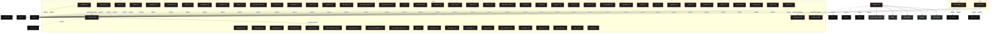
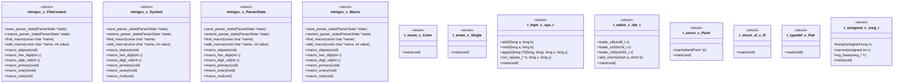

# Polyglot Codebase Knowledge Graph

> Generated offline by **readmenator**. 68 files, 964 symbols, 55 imports. Supports C, C++, Python, Go, Rust, JS/TS, Java, C#, Shell, PHP, Dart, GDScript, Nim, ASM, Ruby, Swift, Kotlin, Scala, Lua, Elixir.
> No LLMs. No tokens. Pure static analysis. See more [here](https://github.com/grisuno/ReadMenator)

**Start here:** Statistics Dashboard for scope, God Nodes for blast radius, Architecture Reference for per-file API. Agents: prefer `readmenator-agent/INDEX.md` + `SYMBOLS.md`.

**Wiki:** prefer `readmenator-wiki/index.md` for progressive disclosure: one synthesis page per community, `connections.json` with EXTRACTED vs INFERRED confidence, `queries.md` log, `REPORT.md` audit.

**Confidence:** EXTRACTED = parsed from source, INFERRED = heuristic bridge, AMBIGUOUS = reported, never hidden. See `readmenator-wiki/REPORT.md`.

**Total Files Parsed:** 68 | **Total Symbols Extracted:** 964 | **Total Imports:** 55
 | **Resolved Imports:** 4

<!-- ranking_model: v1.0 | weights: {ppr:0.45,auth:0.2,test:0.15,doc:0.1,fresh:0.1} | alpha:0.85 | commit:26d6642 | date:2026-07-18 -->


## Table of Contents

1. [Statistics Dashboard](#statistics-dashboard)
2. [Architectural Layers](#architectural-layers)
3. [Ranked Context](#ranked-context)
4. [God Nodes](#god-nodes)
5. [Community Analysis](#community-analysis)
6. [Suggested Questions](#suggested-questions)
7. [Hotspot Analysis](#hotspot-analysis)
8. [Change Impact Analysis](#change-impact-analysis)
9. [Suggested Linting Rules](#suggested-linting-rules)
10. [Dataflow Analysis](#dataflow-analysis)
11. [Orphans](#orphans)
12. [Query Recipes](#query-recipes)
13. [Structural Knowledge Map](#structural-knowledge-map)
14. [UML Class Diagram](#uml-class-diagram)
15. [Code Property Graph](#code-property-graph)
16. [Architecture Reference](#architecture-reference)
    - [C (58 files)](#c-58-files)
    - [H (4 files)](#h-4-files)
    - [S (3 files)](#s-3-files)
    - [SH (3 files)](#sh-3-files)

---

## Statistics Dashboard

| Metric | Value |
|--------|-------|
| Total Files | 68 |
| Total Symbols | 964 |
| Total Imports | 55 |
| Call Edges | 0 |
| Inheritance Edges | 0 |
| Languages | 4 |
| Avg Symbols/File | 14.2 |
| Avg Imports/File | 0.8 |
| Resolved Imports | 4 |

### Top Files by Import Count (Fan-Out)

| File | Imports | Symbols | Language |
|------|---------|---------|----------|
| `minigcc.c` | 4 | 152 | c |
| `test_include.c` | 2 | 2 | c |
| `t_asm_ds.c` | 2 | 10 | c |
| `t_attr.c` | 2 | 6 | c |
| `t_include.c` | 2 | 1 | c |
| `t_inline.c` | 2 | 4 | c |
| `t_stdint.c` | 2 | 6 | c |
| `test_for.c` | 1 | 1 | c |
| `neg_fnptr.c` | 1 | 2 | c |
| `neg_fnptr_call.c` | 1 | 1 | c |

### Top Files by Imported-By Count (Fan-In)

| File | Imported By | Symbols | Language |
|------|-------------|---------|----------|
| `my_library.h` | 1 | 2 | h |

---

## Architectural Layers

Auto-detected from path patterns, naming conventions, and imported frameworks.

| Layer | Files |
|-------|-------|
| testing | 60 |
| utility | 5 |
| infrastructure | 2 |
| business_logic | 1 |

### utility

- `minigcc.c` (c, 152 symbols)
- `minigccg2.s` (s, 221 symbols)
- `minigccg3.s` (s, 221 symbols)
- `minigccg4.s` (s, 221 symbols)
- `my_library.h` (h, 2 symbols)

### testing

- `test.c` (c, 1 symbols)
- `test.sh` (sh, 0 symbols)
- `test_all.sh` (sh, 4 symbols)
- `test_for.c` (c, 1 symbols)
- `test_include.c` (c, 2 symbols)
- `test_ld_selfhost.sh` (sh, 2 symbols)
- `neg_asm.c` (c, 1 symbols)
- `neg_asm2.c` (c, 1 symbols)
- `neg_asm3.c` (c, 1 symbols)
- `neg_asm_ds.c` (c, 2 symbols)
- `neg_attr.c` (c, 1 symbols)
- `neg_comment.c` (c, 1 symbols)
- `neg_float.c` (c, 1 symbols)
- `neg_fnptr.c` (c, 2 symbols)
- `neg_fnptr_call.c` (c, 1 symbols)
- *... and 45 more*

### business_logic

- `t_logic.c` (c, 1 symbols)

### infrastructure

- `t_stdint.c` (c, 6 symbols)
- `t_variadic.c` (c, 5 symbols)

---

## Ranked Context

Files ranked by composite score for the current query context. The ranking combines Personalized PageRank (query relevance), global authority, test coverage, documentation coverage, and code freshness. Model: v1.0.

| Rank | File | Composite | PPR | Authority | Test | Doc |
|------|------|-----------|-----|-----------|------|-----|
| 1 | `my_library.h` | 0.2081 | 0.1663 | 0.1663 | 0.00 | 1.00 |
| 2 | `t_inner_h.h` | 0.1503 | 0.2313 | 0.2313 | 0.00 | 0.00 |
| 3 | `t_inline_h.h` | 0.1081 | 0.1663 | 0.1663 | 0.00 | 0.00 |
| 4 | `t_outer_h.h` | 0.1081 | 0.1663 | 0.1663 | 0.00 | 0.00 |
| 5 | `test.sh` | 0.1000 | 0.0000 | 0.0000 | 0.00 | 1.00 |
| 6 | `test_include.c` | 0.0584 | 0.0899 | 0.0899 | 0.00 | 0.00 |
| 7 | `t_include.c` | 0.0584 | 0.0899 | 0.0899 | 0.00 | 0.00 |
| 8 | `t_inline.c` | 0.0584 | 0.0899 | 0.0899 | 0.00 | 0.00 |
| 9 | `test_ld_selfhost.sh` | 0.0500 | 0.0000 | 0.0000 | 0.00 | 0.50 |
| 10 | `t_typedef.c` | 0.0333 | 0.0000 | 0.0000 | 0.00 | 0.33 |

---

## God Nodes

Most architecturally central files ranked by combined import/export degree and symbol richness.

| File | Score | Connections | PageRank |
|------|-------|-------------|----------|
| `minigccg2.s` | 22.1 | | 0.0000 |
| `minigccg3.s` | 22.1 | | 0.0000 |
| `minigccg4.s` | 22.1 | | 0.0000 |
| `minigcc.c` | 15.2 | | 0.0000 |
| `t_outer_h.h` | 4.2 | | 0.1663 |
| `t_inline.c` | 2.4 | | 0.0899 |
| `t_inner_h.h` | 2.3 | | 0.2313 |
| `my_library.h` | 2.2 | | 0.1663 |
| `test_include.c` | 2.2 | | 0.0899 |
| `t_inline_h.h` | 2.2 | | 0.1663 |

---

## Community Analysis

Files grouped by import-based community detection. Cohesion measures how tightly connected each community is internally.

### root (Cohesion: 1.00)

**2 files** in this community:

- `my_library.h` (h, 2 symbols)
- `test_include.c` (c, 2 symbols)

### tests (Cohesion: 1.00)

**3 files** in this community:

- `t_include.c` (c, 1 symbols)
- `t_inner_h.h` (h, 3 symbols)
- `t_outer_h.h` (h, 2 symbols)

### tests (Cohesion: 1.00)

**2 files** in this community:

- `t_inline.c` (c, 4 symbols)
- `t_inline_h.h` (h, 2 symbols)

---

## Suggested Questions

Auto-generated exploration prompts based on graph structure:

- What does minigccg2.s depend on, and what depends on it? (0 connections)
- What does minigccg3.s depend on, and what depends on it? (0 connections)
- What does minigccg4.s depend on, and what depends on it? (0 connections)
- How are the 3 files in 'tests' related to each other?
- What is FileContext in minigcc.c and how is it used?

---

## Hotspot Analysis

Files ranked by combined complexity (symbol count) and centrality (connection count). High-scoring files are architecturally critical and may need refactoring attention.

| File | Complexity | Centrality | Combined | Symbols | Connections |
|------|-----------|------------|----------|---------|-------------|
| `my_library.h` | 0.009 | 0.500 | 0.304 | 2 | 2 |
| `t_inner_h.h` | 0.014 | 0.250 | 0.155 | 3 | 1 |
| `t_inline_h.h` | 0.009 | 0.250 | 0.154 | 2 | 1 |
| `t_outer_h.h` | 0.009 | 0.750 | 0.454 | 2 | 3 |
| `test.sh` | 0.000 | 0.000 | 0.000 | 0 | 0 |
| `test_include.c` | 0.009 | 0.750 | 0.454 | 2 | 3 |
| `t_include.c` | 0.004 | 0.750 | 0.452 | 1 | 3 |
| `t_inline.c` | 0.018 | 0.750 | 0.457 | 4 | 3 |
| `test_ld_selfhost.sh` | 0.009 | 0.000 | 0.004 | 2 | 0 |
| `t_typedef.c` | 0.014 | 0.250 | 0.155 | 3 | 1 |
| `minigcc.c` | 0.688 | 1.000 | 0.875 | 152 | 4 |
| `minigccg2.s` | 1.000 | 0.000 | 0.400 | 221 | 0 |
| `minigccg3.s` | 1.000 | 0.000 | 0.400 | 221 | 0 |
| `minigccg4.s` | 1.000 | 0.000 | 0.400 | 221 | 0 |
| `t_asm_ds.c` | 0.045 | 0.500 | 0.318 | 10 | 2 |

---

## Dataflow Analysis

Procedural intra-function dataflow findings (zero tokens, regex-based heuristics, all INFERRED). Each lead is grounded at file:line for manual review.

**6 findings** (DEAD_STORE: 6).

| File | Function | Line | Kind | Variable | Description |
|------|----------|------|------|----------|-------------|
| `tests/neg_float.c` | `main` | 2 | `DEAD_STORE` | `d` | `d` assigned at line 2 but never read afterwards. |
| `tests/t_pointers.c` | `main` | 30 | `DEAD_STORE` | `cp` | `cp` assigned at line 30 but never read afterwards. |
| `tests/t_sizeof.c` | `main` | 6 | `DEAD_STORE` | `lv` | `lv` assigned at line 6 but never read afterwards. |
| `tests/t_sizeof.c` | `main` | 7 | `DEAD_STORE` | `c` | `c` assigned at line 7 but never read afterwards. |
| `tests/t_sizeof.c` | `main` | 8 | `DEAD_STORE` | `d` | `d` assigned at line 8 but never read afterwards. |
| `tests/t_sizeof.c` | `main` | 9 | `DEAD_STORE` | `p` | `p` assigned at line 9 but never read afterwards. |

---

## Change Impact Analysis

Files sorted by how many other files would be affected if they changed. High-impact files should be changed with caution.

| File | Direct Dependents | Transitive Dependents | Total Impact |
|------|------------------|----------------------|--------------|
| `t_inner_h.h` | 1 | 1 | 2 |
| `my_library.h` | 1 | 0 | 1 |
| `t_inline_h.h` | 1 | 0 | 1 |
| `t_outer_h.h` | 1 | 0 | 1 |
| `minigcc.c` | 0 | 0 | 0 |
| `minigccg2.s` | 0 | 0 | 0 |
| `minigccg3.s` | 0 | 0 | 0 |
| `minigccg4.s` | 0 | 0 | 0 |
| `test.c` | 0 | 0 | 0 |
| `test.sh` | 0 | 0 | 0 |
| `test_all.sh` | 0 | 0 | 0 |
| `test_for.c` | 0 | 0 | 0 |
| `test_include.c` | 0 | 0 | 0 |
| `test_ld_selfhost.sh` | 0 | 0 | 0 |
| `neg_asm.c` | 0 | 0 | 0 |

---

## Suggested Linting Rules

Automatically suggested linting and security rules based on patterns detected in the codebase. These can be exported as Semgrep rules using the `--export-rules` flag.

| Rule ID | Severity | Description | Language | Matches |
|---------|----------|-------------|----------|---------|
| `RM001` | info | Large number of functions in c: 234 total | c | 234 |
| `RM002` | info | Large number of functions in s: 663 total | s | 663 |
| `RM003` | info | Large number of functions in h: 3 total | h | 3 |
| `RM004` | info | Large number of functions in sh: 6 total | sh | 6 |

---

## Orphans

Files with no documentation or low connectivity. These are candidates for documentation investment or cleanup.

- `t_inner_h.h` (3 symbols, no doc)
- `t_inline_h.h` (2 symbols, no doc)
- `t_outer_h.h` (2 symbols, no doc)
- `test_include.c` (2 symbols, no doc)
- `t_include.c` (1 symbols, no doc)
- `t_inline.c` (4 symbols, no doc)
- `minigccg2.s` (221 symbols, no doc)
- `minigccg3.s` (221 symbols, no doc)
- `minigccg4.s` (221 symbols, no doc)
- `test.c` (1 symbols, no doc)
- `test_for.c` (1 symbols, no doc)
- `neg_asm.c` (1 symbols, no doc)
- `neg_asm2.c` (1 symbols, no doc)
- `neg_asm3.c` (1 symbols, no doc)
- `neg_asm_ds.c` (2 symbols, no doc)
- `neg_attr.c` (1 symbols, no doc)
- `neg_comment.c` (1 symbols, no doc)
- `neg_float.c` (1 symbols, no doc)
- `neg_fnptr.c` (2 symbols, no doc)
- `neg_fnptr_call.c` (1 symbols, no doc)
- *... and 39 more*

---

## Query Recipes

Example queries you can run against this knowledge base using the ranking engine:

```
# Find files most relevant to a concept
readmenator query "Where is the import resolver implemented?"

# Rank files by relevance to a topic
readmenator query "How does documentation generation work?"

# Explain why a file ranks highly
readmenator query "explain readmenator/_documentation.py"

# Trace dependency paths with ranked context
readmenator query "path from CLI to exporter"
```

The ranking model uses the following signals:

- **Personalized PageRank** (45% weight): query-specific relevance via seed propagation
- **Global Authority** (20% weight): structural importance via standard PageRank
- **Test Coverage** (15% weight): fraction of symbols referenced in test files
- **Doc Coverage** (10% weight): presence of docstrings and file-level docs
- **Freshness** (10% weight): recent modification activity

Results include score decomposition and justification paths for each ranked item.

---

## Structural Knowledge Map


```mermaid
graph TD
    classDef mod fill:#1e1e1e,stroke:#ff6666,stroke-width:2px,color:#fff;
    classDef cls fill:#2d2d2d,stroke:#4ec9b0,stroke-width:2px,color:#fff;
    classDef fn fill:#333,stroke:#dcdcaa,stroke-width:1px,color:#dcdcaa;
    classDef ext fill:#111,stroke:#666,stroke-dasharray:5 5,color:#aaa;
    minigcc_c["minigcc.c (c)"]
    class minigcc_c mod;
    minigcc_c_FileContext["FileContext"]
    class minigcc_c_FileContext cls;
    minigcc_c --> minigcc_c_FileContext
    minigcc_c_Symbol["Symbol"]
    class minigcc_c_Symbol cls;
    minigcc_c --> minigcc_c_Symbol
    minigcc_c_ParserState["ParserState"]
    class minigcc_c_ParserState cls;
    minigcc_c --> minigcc_c_ParserState
    minigcc_c_Macro["Macro"]
    class minigcc_c_Macro cls;
    minigcc_c --> minigcc_c_Macro
    minigcc_c_save_parser_state["save_parser_state"]
    class minigcc_c_save_parser_state fn;
    minigcc_c --> minigcc_c_save_parser_state
    subgraph community_2 ["tests"]
    tests_t_inline_c["t_inline.c (c)"]
    class tests_t_inline_c mod;
    end
    subgraph community_0 ["root"]
    test_include_c["test_include.c (c)"]
    class test_include_c mod;
    end
    subgraph community_1 ["tests"]
    tests_t_include_c["t_include.c (c)"]
    class tests_t_include_c mod;
    tests_t_asm_ds_c["t_asm_ds.c (c)"]
    class tests_t_asm_ds_c mod;
    tests_t_attr_c["t_attr.c (c)"]
    class tests_t_attr_c mod;
    tests_t_stdint_c["t_stdint.c (c)"]
    class tests_t_stdint_c mod;
    tests_t_outer_h_h["t_outer_h.h (h)"]
    class tests_t_outer_h_h mod;
    tests_t_unsigned_c["t_unsigned.c (c)"]
    class tests_t_unsigned_c mod;
    tests_t_macros_c["t_macros.c (c)"]
    class tests_t_macros_c mod;
    tests_t_fnptr_c["t_fnptr.c (c)"]
    class tests_t_fnptr_c mod;
    tests_t_longlong_c["t_longlong.c (c)"]
    class tests_t_longlong_c mod;
    tests_t_variadic_c["t_variadic.c (c)"]
    class tests_t_variadic_c mod;
    tests_t_args7_c["t_args7.c (c)"]
    class tests_t_args7_c mod;
    tests_neg_fnptr_cmp_c["neg_fnptr_cmp.c (c)"]
    class tests_neg_fnptr_cmp_c mod;
    tests_t_enum_c["t_enum.c (c)"]
    class tests_t_enum_c mod;
    tests_t_recursion_c["t_recursion.c (c)"]
    class tests_t_recursion_c mod;
    tests_t_struct_c["t_struct.c (c)"]
    class tests_t_struct_c mod;
    tests_t_typedef_c["t_typedef.c (c)"]
    class tests_t_typedef_c mod;
    tests_neg_fnptr_c["neg_fnptr.c (c)"]
    class tests_neg_fnptr_c mod;
    tests_neg_fnptr_cmp0_c["neg_fnptr_cmp0.c (c)"]
    class tests_neg_fnptr_cmp0_c mod;
    tests_neg_fnptr_tern_c["neg_fnptr_tern.c (c)"]
    class tests_neg_fnptr_tern_c mod;
    tests_t_if_c["t_if.c (c)"]
    class tests_t_if_c mod;
    tests_t_pointers_c["t_pointers.c (c)"]
    class tests_t_pointers_c mod;
    tests_t_scope_c["t_scope.c (c)"]
    class tests_t_scope_c mod;
    tests_t_struct_ul_c["t_struct_ul.c (c)"]
    class tests_t_struct_ul_c mod;
    tests_t_switch_c["t_switch.c (c)"]
    class tests_t_switch_c mod;
    test_for_c["test_for.c (c)"]
    class test_for_c mod;
    tests_neg_fnptr_call_c["neg_fnptr_call.c (c)"]
    class tests_neg_fnptr_call_c mod;
    tests_t_args_c["t_args.c (c)"]
    class tests_t_args_c mod;
    tests_t_arith_c["t_arith.c (c)"]
    class tests_t_arith_c mod;
    tests_t_arrays_c["t_arrays.c (c)"]
    class tests_t_arrays_c mod;
    tests_t_asm_c["t_asm.c (c)"]
    class tests_t_asm_c mod;
    tests_t_asm3_c["t_asm3.c (c)"]
    class tests_t_asm3_c mod;
    tests_t_compound_c["t_compound.c (c)"]
    class tests_t_compound_c mod;
    tests_t_dowhile_c["t_dowhile.c (c)"]
    class tests_t_dowhile_c mod;
    tests_t_float_c["t_float.c (c)"]
    class tests_t_float_c mod;
    tests_t_for_c["t_for.c (c)"]
    class tests_t_for_c mod;
    tests_t_globinit_c["t_globinit.c (c)"]
    class tests_t_globinit_c mod;
    tests_t_goto_c["t_goto.c (c)"]
    class tests_t_goto_c mod;
    tests_t_hexoct_c["t_hexoct.c (c)"]
    class tests_t_hexoct_c mod;
    tests_t_logic_c["t_logic.c (c)"]
    class tests_t_logic_c mod;
    tests_t_sizeof_c["t_sizeof.c (c)"]
    class tests_t_sizeof_c mod;
    tests_t_strings_c["t_strings.c (c)"]
    class tests_t_strings_c mod;
    tests_t_sync_c["t_sync.c (c)"]
    class tests_t_sync_c mod;
    tests_t_while_c["t_while.c (c)"]
    class tests_t_while_c mod;
    minigccg2_s["minigccg2.s (s)"]
    class minigccg2_s mod;
    minigccg3_s["minigccg3.s (s)"]
    class minigccg3_s mod;
    minigccg4_s["minigccg4.s (s)"]
    class minigccg4_s mod;
    test_all_sh["test_all.sh (sh)"]
    class test_all_sh mod;
    tests_t_inner_h_h["t_inner_h.h (h)"]
    class tests_t_inner_h_h mod;
    my_library_h["my_library.h (h)"]
    class my_library_h mod;
    test_ld_selfhost_sh["test_ld_selfhost.sh (sh)"]
    class test_ld_selfhost_sh mod;
    tests_neg_asm_ds_c["neg_asm_ds.c (c)"]
    class tests_neg_asm_ds_c mod;
    tests_neg_fnptr_globalinit_c["neg_fnptr_globalinit.c (c)"]
    class tests_neg_fnptr_globalinit_c mod;
    tests_neg_typedef_arrcont_c["neg_typedef_arrcont.c (c)"]
    class tests_neg_typedef_arrcont_c mod;
    tests_t_inline_h_h["t_inline_h.h (h)"]
    class tests_t_inline_h_h mod;
    test_c["test.c (c)"]
    class test_c mod;
    tests_neg_asm_c["neg_asm.c (c)"]
    class tests_neg_asm_c mod;
    tests_neg_asm2_c["neg_asm2.c (c)"]
    class tests_neg_asm2_c mod;
    tests_neg_asm3_c["neg_asm3.c (c)"]
    class tests_neg_asm3_c mod;
    tests_neg_attr_c["neg_attr.c (c)"]
    class tests_neg_attr_c mod;
    tests_neg_comment_c["neg_comment.c (c)"]
    class tests_neg_comment_c mod;
    tests_neg_float_c["neg_float.c (c)"]
    class tests_neg_float_c mod;
    tests_neg_hex_c["neg_hex.c (c)"]
    class tests_neg_hex_c mod;
    tests_neg_octal_c["neg_octal.c (c)"]
    class tests_neg_octal_c mod;
    tests_neg_va_c["neg_va.c (c)"]
    class tests_neg_va_c mod;
    test_sh["test.sh (sh)"]
    class test_sh mod;
    end
    test_include_c -- resolved_imports --> my_library_h
    tests_t_include_c -- resolved_imports --> tests_t_outer_h_h
    tests_t_inline_c -- resolved_imports --> tests_t_inline_h_h
    tests_t_outer_h_h -- resolved_imports --> tests_t_inner_h_h
    ext_stdio_h["stdio.h"]
    class ext_stdio_h ext;
    minigcc_c -.->|imports| ext_stdio_h
    ext_stdlib_h["stdlib.h"]
    class ext_stdlib_h ext;
    minigcc_c -.->|imports| ext_stdlib_h
    ext_string_h["string.h"]
    class ext_string_h ext;
    minigcc_c -.->|imports| ext_string_h
    ext_errno_h["errno.h"]
    class ext_errno_h ext;
    minigcc_c -.->|imports| ext_errno_h
    test_for_c -.->|imports| ext_stdio_h
    test_include_c -.->|imports| ext_stdio_h
    ext_my_library_h["my_library.h"]
    class ext_my_library_h ext;
    test_include_c -.->|imports| ext_my_library_h
    tests_neg_fnptr_c -.->|imports| ext_stdio_h
    tests_neg_fnptr_call_c -.->|imports| ext_stdio_h
    tests_neg_fnptr_cmp_c -.->|imports| ext_stdio_h
    tests_neg_fnptr_cmp0_c -.->|imports| ext_stdio_h
    tests_neg_fnptr_tern_c -.->|imports| ext_stdio_h
    tests_t_args_c -.->|imports| ext_stdio_h
    tests_t_args7_c -.->|imports| ext_stdio_h
    tests_t_arith_c -.->|imports| ext_stdio_h
    tests_t_arrays_c -.->|imports| ext_stdio_h
    tests_t_asm_c -.->|imports| ext_stdio_h
    tests_t_asm3_c -.->|imports| ext_stdio_h
    tests_t_asm_ds_c -.->|imports| ext_stdio_h
    ext_stdint_h["stdint.h"]
    class ext_stdint_h ext;
    tests_t_asm_ds_c -.->|imports| ext_stdint_h
    tests_t_attr_c -.->|imports| ext_stdio_h
    tests_t_attr_c -.->|imports| ext_stdint_h
    tests_t_compound_c -.->|imports| ext_stdio_h
    tests_t_dowhile_c -.->|imports| ext_stdio_h
    tests_t_enum_c -.->|imports| ext_stdio_h
    tests_t_float_c -.->|imports| ext_stdio_h
    tests_t_fnptr_c -.->|imports| ext_stdio_h
    tests_t_for_c -.->|imports| ext_stdio_h
    tests_t_globinit_c -.->|imports| ext_stdio_h
    tests_t_goto_c -.->|imports| ext_stdio_h
    tests_t_hexoct_c -.->|imports| ext_stdio_h
    tests_t_if_c -.->|imports| ext_stdio_h
    tests_t_include_c -.->|imports| ext_stdio_h
    ext_t_outer_h_h["t_outer_h.h"]
    class ext_t_outer_h_h ext;
    tests_t_include_c -.->|imports| ext_t_outer_h_h
    tests_t_inline_c -.->|imports| ext_stdio_h
    ext_t_inline_h_h["t_inline_h.h"]
    class ext_t_inline_h_h ext;
    tests_t_inline_c -.->|imports| ext_t_inline_h_h
    tests_t_logic_c -.->|imports| ext_stdio_h
    tests_t_longlong_c -.->|imports| ext_stdio_h
    tests_t_macros_c -.->|imports| ext_stdio_h
    ext_t_inner_h_h["t_inner_h.h"]
    class ext_t_inner_h_h ext;
    tests_t_outer_h_h -.->|imports| ext_t_inner_h_h
    tests_t_pointers_c -.->|imports| ext_stdio_h
    tests_t_recursion_c -.->|imports| ext_stdio_h
    tests_t_scope_c -.->|imports| ext_stdio_h
    tests_t_sizeof_c -.->|imports| ext_stdio_h
    tests_t_stdint_c -.->|imports| ext_stdio_h
    tests_t_stdint_c -.->|imports| ext_stdint_h
    tests_t_strings_c -.->|imports| ext_stdio_h
    tests_t_struct_c -.->|imports| ext_stdio_h
    tests_t_struct_ul_c -.->|imports| ext_stdio_h
    tests_t_switch_c -.->|imports| ext_stdio_h
    tests_t_sync_c -.->|imports| ext_stdio_h
    tests_t_typedef_c -.->|imports| ext_stdio_h
    tests_t_unsigned_c -.->|imports| ext_stdio_h
    tests_t_variadic_c -.->|imports| ext_stdio_h
    tests_t_while_c -.->|imports| ext_stdio_h
```

---

## UML Class Diagram

Auto-generated Mermaid class diagram from parsed class-level symbols. Shows classes, structs, interfaces, traits, and their methods with inheritance and dependency relationships.


```mermaid
classDiagram
  class minigcc_c_FileContext {
    <<struct>>
    +save_parser_state(ParserState *state)
    +restore_parser_state(ParserState *state)
    +find_macro(const char *name)
    +add_macro(const char *name, int value)
    +macro_skipws(void)
    +macro_hex_digit(int c)
    +macro_digit_val(int c)
    +macro_primary(void)
    +macro_unary(void)
    +macro_mul(void)
  }
  class minigcc_c_Symbol {
    <<struct>>
    +save_parser_state(ParserState *state)
    +restore_parser_state(ParserState *state)
    +find_macro(const char *name)
    +add_macro(const char *name, int value)
    +macro_skipws(void)
    +macro_hex_digit(int c)
    +macro_digit_val(int c)
    +macro_primary(void)
    +macro_unary(void)
    +macro_mul(void)
  }
  class minigcc_c_ParserState {
    <<struct>>
    +save_parser_state(ParserState *state)
    +restore_parser_state(ParserState *state)
    +find_macro(const char *name)
    +add_macro(const char *name, int value)
    +macro_skipws(void)
    +macro_hex_digit(int c)
    +macro_digit_val(int c)
    +macro_primary(void)
    +macro_unary(void)
    +macro_mul(void)
  }
  class minigcc_c_Macro {
    <<struct>>
    +save_parser_state(ParserState *state)
    +restore_parser_state(ParserState *state)
    +find_macro(const char *name)
    +add_macro(const char *name, int value)
    +macro_skipws(void)
    +macro_hex_digit(int c)
    +macro_digit_val(int c)
    +macro_primary(void)
    +macro_unary(void)
    +macro_mul(void)
  }
  class t_enum_c_Color {
    <<enum>>
    +main(void)
  }
  class t_enum_c_Single {
    <<enum>>
    +main(void)
  }
  class t_fnptr_c_ops_t {
    <<struct>>
    +add2(long a, long b)
    +mul2(long a, long b)
    +apply2(long (*f)(long, long), long x, long y)
    +run_op(ops_t *o, long x, long y)
    +main(void)
  }
  class t_stdint_c_idtr_t {
    <<struct>>
    +loads_u8(uint8_t v)
    +loads_s16(int16_t v)
    +loads_u32(uint32_t v)
    +add_shorts(short a, short b)
    +main(void)
  }
  class t_struct_c_Point {
    <<struct>>
    +manhattan(Point *p)
    +main(void)
  }
  class t_struct_ul_c_R {
    <<struct>>
    +main(void)
  }
  class t_typedef_c_Pair {
    <<struct>>
    +main(void)
  }
  class t_unsigned_c_ureg_t {
    <<struct>>
    +bump(unsigned long x)
    +narrow(unsigned int x)
    +reg_base(ureg_t *r)
    +main(void)
  }
```

---

## Code Property Graph

Machine-readable Code Property Graph (CPG) in JSON-LD format. This block allows AI agents to parse the full structural graph without additional file reads. Compatible with GraphRAG pipelines.

```json
{"@context": "https://schema.org", "analysis": {"communities": [{"cohesion": 1.0, "id": 0, "label": "root", "size": 2}, {"cohesion": 1.0, "id": 1, "label": "tests", "size": 3}, {"cohesion": 1.0, "id": 2, "label": "tests", "size": 2}], "god_nodes": [{"node_id": "minigccg2.s", "score": 22.1}, {"node_id": "minigccg3.s", "score": 22.1}, {"node_id": "minigccg4.s", "score": 22.1}, {"node_id": "minigcc.c", "score": 15.2}, {"node_id": "tests/t_outer_h.h", "score": 4.2}, {"node_id": "tests/t_inline.c", "score": 2.4}, {"node_id": "tests/t_inner_h.h", "score": 2.3}, {"node_id": "my_library.h", "score": 2.2}, {"node_id": "test_include.c", "score": 2.2}, {"node_id": "tests/t_inline_h.h", "score": 2.2}], "surprising_connections": []}, "edges": [{"confidence": "EXTRACTED", "relation": "imports", "source": "minigcc.c", "target": "stdio.h"}, {"confidence": "EXTRACTED", "relation": "imports", "source": "minigcc.c", "target": "stdlib.h"}, {"confidence": "EXTRACTED", "relation": "imports", "source": "minigcc.c", "target": "string.h"}, {"confidence": "EXTRACTED", "relation": "imports", "source": "minigcc.c", "target": "errno.h"}, {"confidence": "EXTRACTED", "relation": "imports", "source": "test_for.c", "target": "stdio.h"}, {"confidence": "EXTRACTED", "relation": "imports", "source": "test_include.c", "target": "stdio.h"}, {"confidence": "EXTRACTED", "relation": "imports", "source": "test_include.c", "target": "my_library.h"}, {"confidence": "EXTRACTED", "relation": "imports", "source": "tests/neg_fnptr.c", "target": "stdio.h"}, {"confidence": "EXTRACTED", "relation": "imports", "source": "tests/neg_fnptr_call.c", "target": "stdio.h"}, {"confidence": "EXTRACTED", "relation": "imports", "source": "tests/neg_fnptr_cmp.c", "target": "stdio.h"}, {"confidence": "EXTRACTED", "relation": "imports", "source": "tests/neg_fnptr_cmp0.c", "target": "stdio.h"}, {"confidence": "EXTRACTED", "relation": "imports", "source": "tests/neg_fnptr_tern.c", "target": "stdio.h"}, {"confidence": "EXTRACTED", "relation": "imports", "source": "tests/t_args.c", "target": "stdio.h"}, {"confidence": "EXTRACTED", "relation": "imports", "source": "tests/t_args7.c", "target": "stdio.h"}, {"confidence": "EXTRACTED", "relation": "imports", "source": "tests/t_arith.c", "target": "stdio.h"}, {"confidence": "EXTRACTED", "relation": "imports", "source": "tests/t_arrays.c", "target": "stdio.h"}, {"confidence": "EXTRACTED", "relation": "imports", "source": "tests/t_asm.c", "target": "stdio.h"}, {"confidence": "EXTRACTED", "relation": "imports", "source": "tests/t_asm3.c", "target": "stdio.h"}, {"confidence": "EXTRACTED", "relation": "imports", "source": "tests/t_asm_ds.c", "target": "stdio.h"}, {"confidence": "EXTRACTED", "relation": "imports", "source": "tests/t_asm_ds.c", "target": "stdint.h"}, {"confidence": "EXTRACTED", "relation": "imports", "source": "tests/t_attr.c", "target": "stdio.h"}, {"confidence": "EXTRACTED", "relation": "imports", "source": "tests/t_attr.c", "target": "stdint.h"}, {"confidence": "EXTRACTED", "relation": "imports", "source": "tests/t_compound.c", "target": "stdio.h"}, {"confidence": "EXTRACTED", "relation": "imports", "source": "tests/t_dowhile.c", "target": "stdio.h"}, {"confidence": "EXTRACTED", "relation": "imports", "source": "tests/t_enum.c", "target": "stdio.h"}, {"confidence": "EXTRACTED", "relation": "imports", "source": "tests/t_float.c", "target": "stdio.h"}, {"confidence": "EXTRACTED", "relation": "imports", "source": "tests/t_fnptr.c", "target": "stdio.h"}, {"confidence": "EXTRACTED", "relation": "imports", "source": "tests/t_for.c", "target": "stdio.h"}, {"confidence": "EXTRACTED", "relation": "imports", "source": "tests/t_globinit.c", "target": "stdio.h"}, {"confidence": "EXTRACTED", "relation": "imports", "source": "tests/t_goto.c", "target": "stdio.h"}, {"confidence": "EXTRACTED", "relation": "imports", "source": "tests/t_hexoct.c", "target": "stdio.h"}, {"confidence": "EXTRACTED", "relation": "imports", "source": "tests/t_if.c", "target": "stdio.h"}, {"confidence": "EXTRACTED", "relation": "imports", "source": "tests/t_include.c", "target": "stdio.h"}, {"confidence": "EXTRACTED", "relation": "imports", "source": "tests/t_include.c", "target": "t_outer_h.h"}, {"confidence": "EXTRACTED", "relation": "imports", "source": "tests/t_inline.c", "target": "stdio.h"}, {"confidence": "EXTRACTED", "relation": "imports", "source": "tests/t_inline.c", "target": "t_inline_h.h"}, {"confidence": "EXTRACTED", "relation": "imports", "source": "tests/t_logic.c", "target": "stdio.h"}, {"confidence": "EXTRACTED", "relation": "imports", "source": "tests/t_longlong.c", "target": "stdio.h"}, {"confidence": "EXTRACTED", "relation": "imports", "source": "tests/t_macros.c", "target": "stdio.h"}, {"confidence": "EXTRACTED", "relation": "imports", "source": "tests/t_outer_h.h", "target": "t_inner_h.h"}, {"confidence": "EXTRACTED", "relation": "imports", "source": "tests/t_pointers.c", "target": "stdio.h"}, {"confidence": "EXTRACTED", "relation": "imports", "source": "tests/t_recursion.c", "target": "stdio.h"}, {"confidence": "EXTRACTED", "relation": "imports", "source": "tests/t_scope.c", "target": "stdio.h"}, {"confidence": "EXTRACTED", "relation": "imports", "source": "tests/t_sizeof.c", "target": "stdio.h"}, {"confidence": "EXTRACTED", "relation": "imports", "source": "tests/t_stdint.c", "target": "stdio.h"}, {"confidence": "EXTRACTED", "relation": "imports", "source": "tests/t_stdint.c", "target": "stdint.h"}, {"confidence": "EXTRACTED", "relation": "imports", "source": "tests/t_strings.c", "target": "stdio.h"}, {"confidence": "EXTRACTED", "relation": "imports", "source": "tests/t_struct.c", "target": "stdio.h"}, {"confidence": "EXTRACTED", "relation": "imports", "source": "tests/t_struct_ul.c", "target": "stdio.h"}, {"confidence": "EXTRACTED", "relation": "imports", "source": "tests/t_switch.c", "target": "stdio.h"}, {"confidence": "EXTRACTED", "relation": "imports", "source": "tests/t_sync.c", "target": "stdio.h"}, {"confidence": "EXTRACTED", "relation": "imports", "source": "tests/t_typedef.c", "target": "stdio.h"}, {"confidence": "EXTRACTED", "relation": "imports", "source": "tests/t_unsigned.c", "target": "stdio.h"}, {"confidence": "EXTRACTED", "relation": "imports", "source": "tests/t_variadic.c", "target": "stdio.h"}, {"confidence": "EXTRACTED", "relation": "imports", "source": "tests/t_while.c", "target": "stdio.h"}, {"confidence": "EXTRACTED", "relation": "resolved_imports", "source": "test_include.c", "target": "my_library.h"}, {"confidence": "EXTRACTED", "relation": "resolved_imports", "source": "tests/t_include.c", "target": "tests/t_outer_h.h"}, {"confidence": "EXTRACTED", "relation": "resolved_imports", "source": "tests/t_inline.c", "target": "tests/t_inline_h.h"}, {"confidence": "EXTRACTED", "relation": "resolved_imports", "source": "tests/t_outer_h.h", "target": "tests/t_inner_h.h"}], "generator": "readmenator", "metadata": {"edge_count": 59, "file_count": 68, "language_count": 4, "symbol_count": 964}, "nodes": [{"id": "minigcc.c", "kind": "module", "label": "minigcc.c", "language": "c", "sha256": "c17b3d57f5949bee", "symbol_count": 152, "symbols": [{"kind": "struct", "line": 96, "name": "FileContext"}, {"kind": "struct", "line": 109, "name": "Symbol"}, {"kind": "struct", "line": 230, "name": "ParserState"}, {"kind": "struct", "line": 321, "name": "Macro"}, {"kind": "function", "line": 259, "name": "save_parser_state", "signature": "static void save_parser_state(ParserState *state)"}, {"kind": "function", "line": 288, "name": "restore_parser_state", "signature": "static void restore_parser_state(ParserState *state)"}, {"kind": "function", "line": 329, "name": "find_macro", "signature": "static int find_macro(const char *name)"}, {"kind": "function", "line": 337, "name": "add_macro", "signature": "static void add_macro(const char *name, int value)"}, {"kind": "function", "line": 364, "name": "macro_skipws", "signature": "static void macro_skipws(void)"}, {"kind": "function", "line": 368, "name": "macro_hex_digit", "signature": "static int macro_hex_digit(int c)"}, {"kind": "function", "line": 375, "name": "macro_digit_val", "signature": "static int macro_digit_val(int c)"}, {"kind": "function", "line": 382, "name": "macro_primary", "signature": "static int macro_primary(void)"}, {"kind": "function", "line": 456, "name": "macro_unary", "signature": "static int macro_unary(void)"}, {"kind": "function", "line": 465, "name": "macro_mul", "signature": "static int macro_mul(void)"}, {"kind": "function", "line": 490, "name": "macro_add", "signature": "static int macro_add(void)"}, {"kind": "function", "line": 507, "name": "macro_shift", "signature": "static int macro_shift(void)"}, {"kind": "function", "line": 524, "name": "macro_cmp", "signature": "static int macro_cmp(void)"}, {"kind": "function", "line": 547, "name": "macro_eq", "signature": "static int macro_eq(void)"}, {"kind": "function", "line": 564, "name": "macro_bitand", "signature": "static int macro_bitand(void)"}, {"kind": "function", "line": 578, "name": "macro_bitxor", "signature": "static int macro_bitxor(void)"}, {"kind": "function", "line": 592, "name": "macro_bitor", "signature": "static int macro_bitor(void)"}, {"kind": "function", "line": 606, "name": "macro_logand", "signature": "static int macro_logand(void)"}, {"kind": "function", "line": 620, "name": "macro_or_expr", "signature": "static int macro_or_expr(void)"}, {"kind": "function", "line": 634, "name": "macro_fold", "signature": "static int macro_fold(void)"}, {"kind": "function", "line": 639, "name": "error", "signature": "static void error(const char *msg)"}, {"kind": "function", "line": 645, "name": "safe_malloc", "signature": "static void *safe_malloc(size_t size)"}, {"kind": "function", "line": 654, "name": "safe_strcpy", "signature": "static void safe_strcpy(char *dst, const char *src, size_t dst_sz)"}, {"kind": "function", "line": 663, "name": "safe_strtoll", "signature": "static long safe_strtoll(const char *s)"}, {"kind": "function", "line": 676, "name": "is_file_processed", "signature": "static int is_file_processed(const char *path)"}, {"kind": "function", "line": 685, "name": "mark_file_processed", "signature": "static void mark_file_processed(const char *path)"}, {"kind": "function", "line": 697, "name": "get_dir_from_path", "signature": "static void get_dir_from_path(const char *path, char *dir, int dir_sz)"}, {"kind": "function", "line": 716, "name": "resolve_local_include", "signature": "static char *resolve_local_include(const char *target)"}, {"kind": "function", "line": 755, "name": "read_include_file", "signature": "static char *read_include_file(const char *path)"}, {"doc": "Must produce identical results under gcc (32-bit int) and under the compiler's own model (64-bit int), so avoid multiplication overflow.", "kind": "function", "line": 779, "name": "hash_name", "signature": "static int hash_name(const char *name)"}, {"kind": "function", "line": 789, "name": "hash_init", "signature": "static void hash_init(void)"}, {"kind": "function", "line": 794, "name": "push_scope", "signature": "static void push_scope(void)"}, {"kind": "function", "line": 802, "name": "pop_scope", "signature": "static void pop_scope(void)"}, {"doc": "Remove all symbols from start_idx onward from the hash table and truncate symbol_count. Does NOT touch the scope stack (needed for the two-pass function body parsing pattern).", "kind": "function", "line": 831, "name": "truncate_symbols", "signature": "static void truncate_symbols(int start_idx)"}, {"kind": "function", "line": 850, "name": "my_isspace", "signature": "static int my_isspace(int c)"}, {"kind": "function", "line": 860, "name": "my_isalpha", "signature": "static int my_isalpha(int c)"}, {"kind": "function", "line": 866, "name": "my_isdigit", "signature": "static int my_isdigit(int c)"}, {"kind": "function", "line": 871, "name": "my_isalnum", "signature": "static int my_isalnum(int c)"}, {"kind": "function", "line": 877, "name": "lex_fail", "signature": "static void lex_fail(const char *msg, char *start, char *end)"}, {"kind": "function", "line": 887, "name": "lex_kw_add", "signature": "static void lex_kw_add(const char *name, int id)"}, {"kind": "function", "line": 900, "name": "lex_init_keywords", "signature": "static void lex_init_keywords(void)"}, {"kind": "function", "line": 940, "name": "lex_kw_lookup", "signature": "static int lex_kw_lookup(void)"}, {"kind": "function", "line": 952, "name": "lex_match_op", "signature": "static int lex_match_op(const char *op, int id)"}, {"kind": "function", "line": 964, "name": "lex_hex_val", "signature": "static int lex_hex_val(int c)"}, {"kind": "function", "line": 971, "name": "lex_is_int_suffix", "signature": "static int lex_is_int_suffix(int c)"}, {"kind": "function", "line": 977, "name": "lex_number", "signature": "static void lex_number(void)"}, {"doc": "float_const_is_float[float_const_count] = (sfx == 'f' || sfx == 'F') ? 1 : 0; safe_strcpy(float_const_str[float_const_count], token, MAX_TOKEN_LEN); float_const_count++; return; } while (lex_is_int_suffix(*q)) q++; input_ptr = q; snprintf(token, MAX_TOKEN_LEN, \"%ld\", v); tok = T_NUM; return; } } /* Lexer", "kind": "function", "line": 1095, "name": "next_token", "signature": "static void next_token(void)"}, {"kind": "function", "line": 1582, "name": "match", "signature": "static void match(int expected)"}, {"kind": "function", "line": 1587, "name": "emit", "signature": "static void emit(const char *s)"}, {"kind": "function", "line": 1601, "name": "emit_i", "signature": "static void emit_i(const char *fmt, int v)"}, {"kind": "function", "line": 1607, "name": "emit_s", "signature": "static void emit_s(const char *fmt, const char *s)"}, {"kind": "function", "line": 1613, "name": "emit_is", "signature": "static void emit_is(const char *fmt, int v, const char *s)"}, {"kind": "function", "line": 1619, "name": "emit_si", "signature": "static void emit_si(const char *fmt, const char *s, int v)"}, {"doc": "Write a C string as the body of a .asciz directive, escaping everything the assembler cannot take literally. Shared by the string pool and by string * initializers of global arrays.", "kind": "function", "line": 1628, "name": "emit_asciz_body", "signature": "static void emit_asciz_body(const char *s)"}, {"kind": "function", "line": 1647, "name": "emit_label", "signature": "static void emit_label(int label)"}, {"doc": "else if (c == '\\a') fprintf(output, \"\\\\a\"); else if (c == '\\b') fprintf(output, \"\\\\b\"); else if (c >= 32 && c <= 126) fputc(c, output); else fprintf(output, \"\\\\%03o\", c); s++; } } static void emit_label(int label) { if (emit_enabled) fprintf(output, \".L%d:\\n\", label); } /* Symbol table", "kind": "function", "line": 1653, "name": "find_symbol", "signature": "static int find_symbol(const char *name)"}, {"kind": "function", "line": 1664, "name": "add_symbol", "signature": "static void add_symbol(const char *name, int is_global, int size, int pointed, int is_array, int ..."}, {"doc": "Argument/parameter register names by ABI index. Written as a function instead of a local array literal because the compiler does not allocate brace-initialized local arrays correctly (they overlap adjacent locals).", "kind": "function", "line": 1745, "name": "arg_reg", "signature": "static const char *arg_reg(int i)"}, {"kind": "function", "line": 1754, "name": "note_defined_func", "signature": "static void note_defined_func(const char *name, int is_uns)"}, {"kind": "function", "line": 1770, "name": "is_defined_func", "signature": "static int is_defined_func(const char *name)"}, {"kind": "function", "line": 1780, "name": "func_return_unsigned", "signature": "static int func_return_unsigned(const char *name)"}, {"kind": "function", "line": 1790, "name": "parse_fnptr_declarator", "signature": "static int parse_fnptr_declarator(char *out_name, int *out_count)"}, {"kind": "function", "line": 1841, "name": "peek_call_argc", "signature": "static int peek_call_argc(void)"}, {"kind": "function", "line": 1879, "name": "emit_spill_reverse", "signature": "static void emit_spill_reverse(int argc)"}, {"kind": "function", "line": 1891, "name": "parse_indirect_call", "signature": "static void parse_indirect_call(void)"}, {"doc": "emit(\"    movq 8(%%r12), %%r10\"); emit(\"    xorl %%eax, %%eax\"); emit(\"    call *%%r10\"); emit(\"    movq %%r12, %%rsp\"); emit(\"    popq %%r12\"); emit(\"    addq $8, %%rsp\"); expr_pointed = 0; expr_fnptr = 0; expr_unsigned = 0; deref_w = 0; deref_u = 0; } /* Predefined libc global symbol names, indexed; returns NULL past the end.", "kind": "function", "line": 1931, "name": "libc_global_name", "signature": "static const char *libc_global_name(int i)"}, {"kind": "function", "line": 1944, "name": "typedef_name", "signature": "static const char *typedef_name(int i)"}, {"kind": "function", "line": 1960, "name": "typedef_size", "signature": "static int typedef_size(int i)"}, {"kind": "function", "line": 1976, "name": "typedef_uns", "signature": "static int typedef_uns(int i)"}, {"kind": "function", "line": 1985, "name": "unary", "signature": "static void unary(void)"}, {"kind": "function", "line": 2030, "name": "strcmp", "signature": "strcmp(id_name, \"__sync_lock_test_and_set\") == 0 ||\n                strcmp(id_name, \"__sync_lock_..."}, {"kind": "function", "line": 2035, "name": "strcmp", "signature": "strcmp(id_name, \"va_start\") == 0)"}, {"kind": "function", "line": 2038, "name": "strcmp", "signature": "strcmp(id_name, \"va_end\") == 0)"}, {"kind": "function", "line": 2041, "name": "strcmp", "signature": "strcmp(id_name, \"va_arg\") == 0)"}, {"kind": "function", "line": 2430, "name": "parse_sync_call", "signature": "static void parse_sync_call(const char *name)"}, {"kind": "function", "line": 2465, "name": "parse_va_start", "signature": "static void parse_va_start(void)"}, {"kind": "function", "line": 2499, "name": "parse_va_arg", "signature": "static void parse_va_arg(void)"}, {"kind": "function", "line": 2550, "name": "parse_va_end", "signature": "static void parse_va_end(void)"}, {"kind": "function", "line": 2566, "name": "lvalue_address", "signature": "static void lvalue_address(void)"}, {"kind": "function", "line": 2623, "name": "handle_postfix", "signature": "static void handle_postfix(int is_lvalue)"}, {"kind": "function", "line": 2829, "name": "unary_expr", "signature": "static void unary_expr(void)"}, {"kind": "function", "line": 2844, "name": "multiplicative_expr", "signature": "static void multiplicative_expr(void)"}, {"kind": "function", "line": 2932, "name": "additive_expr", "signature": "static void additive_expr(void)"}, {"kind": "function", "line": 3001, "name": "shift_expr", "signature": "static void shift_expr(void)"}, {"kind": "function", "line": 3028, "name": "relational_expr", "signature": "static void relational_expr(void)"}, {"kind": "function", "line": 3093, "name": "equality_expr", "signature": "static void equality_expr(void)"}, {"kind": "function", "line": 3144, "name": "bitwise_and_expr", "signature": "static void bitwise_and_expr(void)"}, {"kind": "function", "line": 3162, "name": "bitwise_xor_expr", "signature": "static void bitwise_xor_expr(void)"}, {"kind": "function", "line": 3180, "name": "bitwise_or_expr", "signature": "static void bitwise_or_expr(void)"}, {"kind": "function", "line": 3198, "name": "logical_and_expr", "signature": "static void logical_and_expr(void)"}, {"kind": "function", "line": 3219, "name": "logical_or_expr", "signature": "static void logical_or_expr(void)"}, {"kind": "function", "line": 3240, "name": "conditional_expr", "signature": "static void conditional_expr(void)"}, {"kind": "function", "line": 3260, "name": "emit_compound_op", "signature": "static void emit_compound_op(int op, int asize, int is_uns)"}, {"kind": "function", "line": 3316, "name": "assignment_expr", "signature": "static void assignment_expr(void)"}, {"kind": "function", "line": 3561, "name": "asm_scratch", "signature": "static const char *asm_scratch(int i)"}, {"kind": "function", "line": 3570, "name": "asm_home_text", "signature": "static void asm_home_text(int home, char *buf)"}, {"kind": "function", "line": 3580, "name": "asm_reg_sized", "signature": "static void asm_reg_sized(int home, int size, char *buf)"}, {"kind": "function", "line": 3622, "name": "asm_fixed_home", "signature": "static int asm_fixed_home(int c)"}, {"kind": "function", "line": 3632, "name": "asm_emit_template", "signature": "static void asm_emit_template(void)"}, {"kind": "function", "line": 3659, "name": "asm_parse_mem", "signature": "static void asm_parse_mem(int idx, int is_out)"}, {"kind": "function", "line": 3717, "name": "asm_emit_ss", "signature": "static void asm_emit_ss(const char *fmt, const char *a, const char *b)"}, {"kind": "function", "line": 3723, "name": "asm_parse_one", "signature": "static void asm_parse_one(int idx, int is_out)"}, {"kind": "function", "line": 3791, "name": "asm_assign_homes", "signature": "static void asm_assign_homes(void)"}, {"kind": "function", "line": 3853, "name": "asm_emit_all", "signature": "static void asm_emit_all(void)"}, {"kind": "function", "line": 3901, "name": "skip_gcc_attribute", "signature": "static int skip_gcc_attribute(void)"}, {"kind": "function", "line": 3921, "name": "strcmp", "signature": "strcmp(token, \"returns_twice\") == 0 ||\n                       strcmp(token, \"always_inline\") == 0)"}, {"kind": "function", "line": 3951, "name": "parse_trailing_align", "signature": "static void parse_trailing_align(void)"}, {"kind": "function", "line": 3958, "name": "parse_asm_block", "signature": "static void parse_asm_block(void)"}, {"kind": "function", "line": 4022, "name": "statement", "signature": "static void statement(void)"}, {"kind": "function", "line": 4768, "name": "parse_function", "signature": "static void parse_function(const char *name, int ret_type)"}, {"kind": "function", "line": 4980, "name": "parse_enum", "signature": "static void parse_enum(void)"}, {"kind": "function", "line": 5031, "name": "skip_struct_fields", "signature": "static void skip_struct_fields(int fsize, int funs, int ffloat)"}, {"kind": "function", "line": 5090, "name": "skip_struct", "signature": "static void skip_struct(void)"}, {"kind": "function", "line": 5159, "name": "record_typedef_alias", "signature": "static void record_typedef_alias(const char *name, int size, int uns, int fnptr)"}, {"kind": "function", "line": 5190, "name": "skip_typedef", "signature": "static void skip_typedef(void)"}, {"doc": "if (struct_total_size > 0) s->const_value = struct_total_size; { int h = hash_name(last_name); s->next_hash = hash_table[h]; hash_table[h] = symbol_count - 1; } } } td_stash_valid = 0; match(';'); } /* Storage directive for a datum of `size` bytes.", "kind": "function", "line": 5338, "name": "data_directive", "signature": "static const char *data_directive(int size)"}, {"doc": "} td_stash_valid = 0; match(';'); } /* Storage directive for a datum of `size` bytes. static const char *data_directive(int size) { if (size == 1) return \"    .byte %d\"; if (size == 2) return \"    .word %d\"; if (size == 4) return \"    .long %d\"; return \"    .quad %d\"; } /* Reserve zero-initialized storage for a global.", "kind": "function", "line": 5346, "name": "emit_global_bss", "signature": "static void emit_global_bss(const char *name, int is_static, int size)"}, {"kind": "function", "line": 5358, "name": "emit_global_data_head", "signature": "static void emit_global_data_head(const char *name, int is_static)"}, {"doc": "Parse an integer constant usable as a static initializer: an optionally signed numeric or character literal, or a macro standing for one. * Returns 1 when a constant was consumed.", "kind": "function", "line": 5371, "name": "parse_const_int", "signature": "static int parse_const_int(long long *out)"}, {"doc": "} if (tok == T_ID) { int mi = find_macro(token); if (mi >= 0) { long long v = macros[mi].value; next_token(); out = neg ? -v : v; return 1; } } return 0; } /* Record a string literal in the pool and return its label index.", "kind": "function", "line": 5394, "name": "intern_string", "signature": "static int intern_string(const char *text)"}, {"doc": "Emit the definition of a global that carries an initializer. On entry the current token is the one after '='. `size` is the declared byte size and is updated in place when the initializer determines the length of an unsized array. Returns 1 when the initializer was materialized, 0 when the form is unsupported, in which case nothing was emitted and the caller falls back to * zero-initialized storage.", "kind": "function", "line": 5411, "name": "emit_global_initializer", "signature": "static int emit_global_initializer(const char *name, int is_static, int *size,\n                  ..."}, {"kind": "function", "line": 5476, "name": "parse_program", "signature": "static void parse_program(void)"}, {"kind": "function", "line": 5696, "name": "emit_float_consts", "signature": "static void emit_float_consts(void)"}, {"kind": "function", "line": 5706, "name": "emit_string_pool", "signature": "static void emit_string_pool(void)"}, {"kind": "function", "line": 5716, "name": "main", "signature": "int main(int argc, char **argv)"}, {"kind": "macro", "line": 15, "name": "MAX_TOKEN_LEN", "signature": "#define MAX_TOKEN_LEN"}, {"kind": "macro", "line": 16, "name": "MAX_SYMBOLS", "signature": "#define MAX_SYMBOLS"}, {"kind": "macro", "line": 17, "name": "MAX_IDENT_LEN", "signature": "#define MAX_IDENT_LEN"}, {"kind": "macro", "line": 18, "name": "MAX_SOURCE_SIZE", "signature": "#define MAX_SOURCE_SIZE"}, {"kind": "macro", "line": 19, "name": "MAX_INCLUDE_DEPTH", "signature": "#define MAX_INCLUDE_DEPTH"}, {"kind": "macro", "line": 20, "name": "MAX_PROCESSED_FILES", "signature": "#define MAX_PROCESSED_FILES"}, {"kind": "macro", "line": 21, "name": "STACK_ALIGN", "signature": "#define STACK_ALIGN"}, {"kind": "macro", "line": 81, "name": "LEX_KW_CAP", "signature": "#define LEX_KW_CAP"}, {"kind": "macro", "line": 82, "name": "LEX_KW_BLOB", "signature": "#define LEX_KW_BLOB"}, {"kind": "macro", "line": 132, "name": "HASH_TABLE_SIZE", "signature": "#define HASH_TABLE_SIZE"}, {"kind": "macro", "line": 135, "name": "MAX_SCOPE_DEPTH", "signature": "#define MAX_SCOPE_DEPTH"}, {"kind": "macro", "line": 167, "name": "MAX_FLOAT_CONSTS", "signature": "#define MAX_FLOAT_CONSTS"}, {"kind": "macro", "line": 172, "name": "MAX_CASES_PER_SWITCH", "signature": "#define MAX_CASES_PER_SWITCH"}, {"kind": "macro", "line": 184, "name": "MAX_STRINGS", "signature": "#define MAX_STRINGS"}, {"kind": "macro", "line": 193, "name": "MAX_PTR_INITS", "signature": "#define MAX_PTR_INITS"}, {"kind": "macro", "line": 203, "name": "MAX_STRUCT_MEMBERS", "signature": "#define MAX_STRUCT_MEMBERS"}, {"kind": "macro", "line": 214, "name": "MAX_DEFINED_FUNCS", "signature": "#define MAX_DEFINED_FUNCS"}, {"kind": "macro", "line": 219, "name": "MAX_IF_NESTING", "signature": "#define MAX_IF_NESTING"}, {"kind": "macro", "line": 220, "name": "CONST_VAR_FLAG", "signature": "#define CONST_VAR_FLAG"}, {"kind": "macro", "line": 227, "name": "MAX_MACROS", "signature": "#define MAX_MACROS"}, {"kind": "macro", "line": 3546, "name": "ASM_MAX_OPS", "signature": "#define ASM_MAX_OPS"}, {"kind": "macro", "line": 3547, "name": "ASM_TMPL_SZ", "signature": "#define ASM_TMPL_SZ"}, {"kind": "macro", "line": 3548, "name": "ASM_TXT_SZ", "signature": "#define ASM_TXT_SZ"}]}, {"id": "minigccg2.s", "kind": "module", "label": "minigccg2.s", "language": "s", "sha256": "33ef36bd7bb6040d", "symbol_count": 221, "symbols": [{"kind": "function", "line": 3, "name": "lex_kw_blob"}, {"kind": "function", "line": 7, "name": "lex_kw_ids"}, {"kind": "function", "line": 11, "name": "lex_kw_count"}, {"kind": "function", "line": 15, "name": "lex_pass_top"}, {"kind": "function", "line": 19, "name": "input_ptr"}, {"kind": "function", "line": 23, "name": "source_start"}, {"kind": "function", "line": 27, "name": "token"}, {"kind": "function", "line": 31, "name": "tok"}, {"kind": "function", "line": 35, "name": "line"}, {"kind": "function", "line": 39, "name": "output"}, {"kind": "function", "line": 43, "name": "ctx_stack"}, {"kind": "function", "line": 47, "name": "ctx_top"}, {"kind": "function", "line": 51, "name": "current_file"}, {"kind": "function", "line": 55, "name": "processed_files"}, {"kind": "function", "line": 59, "name": "processed_count"}, {"kind": "function", "line": 63, "name": "symbols"}, {"kind": "function", "line": 67, "name": "symbol_count"}, {"kind": "function", "line": 71, "name": "hash_table"}, {"kind": "function", "line": 75, "name": "scope_stack_sym"}, {"kind": "function", "line": 79, "name": "scope_stack_stk"}, {"kind": "function", "line": 83, "name": "scope_depth"}, {"kind": "function", "line": 87, "name": "stack_size"}, {"kind": "function", "line": 91, "name": "label_counter"}, {"kind": "function", "line": 95, "name": "function_has_return"}, {"kind": "function", "line": 99, "name": "emit_enabled"}, {"kind": "function", "line": 103, "name": "max_func_stack"}, {"kind": "function", "line": 107, "name": "assign_size"}, {"kind": "function", "line": 111, "name": "expr_pointed"}, {"kind": "function", "line": 115, "name": "expr_fnptr"}, {"kind": "function", "line": 119, "name": "subscript_base_fnptr"}, {"kind": "function", "line": 123, "name": "current_elem_size"}, {"kind": "function", "line": 127, "name": "current_elem_size2"}, {"kind": "function", "line": 131, "name": "current_elem_unsigned"}, {"kind": "function", "line": 135, "name": "deref_w"}, {"kind": "function", "line": 139, "name": "deref_u"}, {"kind": "function", "line": 143, "name": "no_postfix_deref"}, {"kind": "function", "line": 147, "name": "expr_type"}, {"kind": "function", "line": 151, "name": "expr_unsigned"}, {"kind": "function", "line": 155, "name": "static_flag"}, {"kind": "function", "line": 159, "name": "unsigned_type"}, {"kind": "function", "line": 163, "name": "const_flag"}, {"kind": "function", "line": 167, "name": "extern_flag"}, {"kind": "function", "line": 171, "name": "global_emit_deferred"}, {"kind": "function", "line": 175, "name": "pending_align"}, {"kind": "function", "line": 179, "name": "func_is_variadic"}, {"kind": "function", "line": 183, "name": "vararg_nfixed"}, {"kind": "function", "line": 187, "name": "vararg_save_off"}, {"kind": "function", "line": 191, "name": "float_const_str"}, {"kind": "function", "line": 195, "name": "float_const_is_float"}, {"kind": "function", "line": 199, "name": "float_const_count"}, {"kind": "function", "line": 203, "name": "switch_case_values"}, {"kind": "function", "line": 207, "name": "switch_case_labels"}, {"kind": "function", "line": 211, "name": "switch_case_count"}, {"kind": "function", "line": 215, "name": "switch_has_default"}, {"kind": "function", "line": 219, "name": "switch_default_label"}, {"kind": "function", "line": 223, "name": "break_target"}, {"kind": "function", "line": 227, "name": "break_target_valid"}, {"kind": "function", "line": 231, "name": "continue_target"}, {"kind": "function", "line": 235, "name": "continue_target_valid"}, {"kind": "function", "line": 239, "name": "str_label_counter"}, {"kind": "function", "line": 243, "name": "string_pool"}, {"kind": "function", "line": 247, "name": "string_count"}, {"kind": "function", "line": 251, "name": "ptr_init_name"}, {"kind": "function", "line": 255, "name": "ptr_init_label"}, {"kind": "function", "line": 259, "name": "ptr_init_count"}, {"kind": "function", "line": 263, "name": "struct_total_size"}, {"kind": "function", "line": 267, "name": "struct_member_names"}, {"kind": "function", "line": 271, "name": "struct_member_offsets"}, {"kind": "function", "line": 275, "name": "struct_member_sizes"}, {"kind": "function", "line": 279, "name": "struct_member_elem_sizes"}, {"kind": "function", "line": 283, "name": "struct_member_unsigned"}, {"kind": "function", "line": 287, "name": "struct_member_is_float"}, {"kind": "function", "line": 291, "name": "struct_member_is_fnptr"}, {"kind": "function", "line": 295, "name": "struct_member_count"}, {"kind": "function", "line": 299, "name": "defined_func_names"}, {"kind": "function", "line": 303, "name": "defined_func_unsigned"}, {"kind": "function", "line": 307, "name": "defined_func_count"}, {"kind": "function", "line": 311, "name": "if_nest"}, {"kind": "function", "line": 315, "name": "if_depth"}, {"kind": "function", "line": 320, "name": "macro_count"}, {"kind": "function", "line": 324, "name": "save_parser_state"}, {"kind": "function", "line": 487, "name": "restore_parser_state"}, {"kind": "function", "line": 703, "name": "macros"}, {"kind": "function", "line": 707, "name": "find_macro"}, {"kind": "function", "line": 770, "name": "add_macro"}, {"kind": "function", "line": 900, "name": "macro_p"}, {"kind": "function", "line": 904, "name": "macro_ok"}, {"kind": "function", "line": 908, "name": "macro_skipws"}, {"kind": "function", "line": 949, "name": "macro_hex_digit"}, {"kind": "function", "line": 1047, "name": "macro_digit_val"}, {"kind": "function", "line": 1168, "name": "macro_primary"}, {"kind": "function", "line": 1966, "name": "macro_unary"}, {"kind": "function", "line": 2094, "name": "macro_mul"}, {"kind": "function", "line": 2297, "name": "macro_add"}, {"kind": "function", "line": 2395, "name": "macro_shift"}, {"kind": "function", "line": 2548, "name": "macro_cmp"}, {"kind": "function", "line": 2769, "name": "macro_eq"}, {"kind": "function", "line": 2922, "name": "macro_bitand"}, {"kind": "function", "line": 3008, "name": "macro_bitxor"}, {"kind": "function", "line": 3073, "name": "macro_bitor"}, {"kind": "function", "line": 3159, "name": "macro_logand"}, {"kind": "function", "line": 3256, "name": "macro_or_expr"}, {"kind": "function", "line": 3353, "name": "macro_fold"}, {"kind": "function", "line": 3374, "name": "error"}, {"kind": "function", "line": 3425, "name": "safe_malloc"}, {"kind": "function", "line": 3479, "name": "safe_strcpy"}, {"kind": "function", "line": 3556, "name": "safe_strtoll"}, {"kind": "function", "line": 3671, "name": "is_file_processed"}, {"kind": "function", "line": 3731, "name": "mark_file_processed"}, {"kind": "function", "line": 3842, "name": "get_dir_from_path"}, {"kind": "function", "line": 3985, "name": "resolve_local_include"}, {"kind": "function", "line": 4433, "name": "read_include_file"}, {"kind": "function", "line": 4639, "name": "hash_name"}, {"kind": "function", "line": 4697, "name": "hash_init"}, {"kind": "function", "line": 4736, "name": "push_scope"}, {"kind": "function", "line": 4788, "name": "pop_scope"}, {"kind": "function", "line": 4984, "name": "truncate_symbols"}, {"kind": "function", "line": 5137, "name": "my_isspace"}, {"kind": "function", "line": 5226, "name": "my_isalpha"}, {"kind": "function", "line": 5295, "name": "my_isdigit"}, {"kind": "function", "line": 5335, "name": "my_isalnum"}, {"kind": "function", "line": 5380, "name": "lex_fail"}, {"kind": "function", "line": 5484, "name": "lex_kw_add"}, {"kind": "function", "line": 5647, "name": "lex_init_keywords"}, {"kind": "function", "line": 6134, "name": "lex_kw_lookup"}, {"kind": "function", "line": 6227, "name": "lex_match_op"}, {"kind": "function", "line": 6310, "name": "lex_hex_val"}, {"kind": "function", "line": 6432, "name": "lex_is_int_suffix"}, {"kind": "function", "line": 6501, "name": "lex_number"}, {"kind": "function", "line": 8028, "name": "next_token"}, {"kind": "function", "line": 8032, "name": "restart"}, {"kind": "function", "line": 13434, "name": "match"}, {"kind": "function", "line": 13472, "name": "emit"}, {"kind": "function", "line": 13583, "name": "emit_i"}, {"kind": "function", "line": 13631, "name": "emit_s"}, {"kind": "function", "line": 13679, "name": "emit_is"}, {"kind": "function", "line": 13730, "name": "emit_si"}, {"kind": "function", "line": 13781, "name": "emit_asciz_body"}, {"kind": "function", "line": 14095, "name": "emit_label"}, {"kind": "function", "line": 14124, "name": "find_symbol"}, {"kind": "function", "line": 14210, "name": "add_symbol"}, {"kind": "function", "line": 14619, "name": "arg_reg"}, {"kind": "function", "line": 14695, "name": "note_defined_func"}, {"kind": "function", "line": 14818, "name": "is_defined_func"}, {"kind": "function", "line": 14877, "name": "func_return_unsigned"}, {"kind": "function", "line": 14942, "name": "parse_fnptr_declarator"}, {"kind": "function", "line": 15361, "name": "peek_call_argc"}, {"kind": "function", "line": 15652, "name": "emit_spill_reverse"}, {"kind": "function", "line": 15789, "name": "parse_indirect_call"}, {"kind": "function", "line": 16137, "name": "libc_global_name"}, {"kind": "function", "line": 16265, "name": "typedef_name"}, {"kind": "function", "line": 16432, "name": "typedef_size"}, {"kind": "function", "line": 16599, "name": "typedef_uns"}, {"kind": "function", "line": 16675, "name": "unary"}, {"kind": "function", "line": 20973, "name": "parse_sync_call"}, {"kind": "function", "line": 21295, "name": "parse_va_start"}, {"kind": "function", "line": 21639, "name": "parse_va_arg"}, {"kind": "function", "line": 22175, "name": "parse_va_end"}, {"kind": "function", "line": 22286, "name": "lvalue_address"}, {"kind": "function", "line": 22845, "name": "handle_postfix"}, {"kind": "function", "line": 24452, "name": "unary_expr"}, {"kind": "function", "line": 24477, "name": "multiplicative_expr"}, {"kind": "function", "line": 25263, "name": "additive_expr"}, {"kind": "function", "line": 25832, "name": "shift_expr"}, {"kind": "function", "line": 26034, "name": "relational_expr"}, {"kind": "function", "line": 26748, "name": "equality_expr"}, {"kind": "function", "line": 27236, "name": "bitwise_and_expr"}, {"kind": "function", "line": 27363, "name": "bitwise_xor_expr"}, {"kind": "function", "line": 27490, "name": "bitwise_or_expr"}, {"kind": "function", "line": 27617, "name": "logical_and_expr"}, {"kind": "function", "line": 27782, "name": "logical_or_expr"}, {"kind": "function", "line": 27947, "name": "conditional_expr"}, {"kind": "function", "line": 28087, "name": "emit_compound_op"}, {"kind": "function", "line": 28680, "name": "assignment_expr"}, {"kind": "function", "line": 32435, "name": "asm_tmpl"}, {"kind": "function", "line": 32439, "name": "asm_text"}, {"kind": "function", "line": 32443, "name": "asm_mem"}, {"kind": "function", "line": 32447, "name": "asm_is_out"}, {"kind": "function", "line": 32451, "name": "asm_home"}, {"kind": "function", "line": 32455, "name": "asm_slot"}, {"kind": "function", "line": 32459, "name": "asm_size"}, {"kind": "function", "line": 32463, "name": "asm_nops"}, {"kind": "function", "line": 32467, "name": "asm_nslots"}, {"kind": "function", "line": 32471, "name": "asm_unique"}, {"kind": "function", "line": 32475, "name": "asm_scratch"}, {"kind": "function", "line": 32551, "name": "asm_home_text"}, {"kind": "function", "line": 32766, "name": "asm_reg_sized"}, {"kind": "function", "line": 33746, "name": "asm_fixed_home"}, {"kind": "function", "line": 33836, "name": "asm_emit_template"}, {"kind": "function", "line": 34072, "name": "asm_parse_mem"}, {"kind": "function", "line": 34627, "name": "asm_emit_ss"}, {"kind": "function", "line": 34678, "name": "asm_parse_one"}, {"kind": "function", "line": 35749, "name": "asm_assign_homes"}, {"kind": "function", "line": 36375, "name": "asm_emit_all"}, {"kind": "function", "line": 36951, "name": "skip_gcc_attribute"}, {"kind": "function", "line": 37426, "name": "parse_trailing_align"}, {"kind": "function", "line": 37468, "name": "parse_asm_block"}, {"kind": "function", "line": 38033, "name": "statement"}, {"kind": "function", "line": 41754, "name": "restart_typedef"}, {"kind": "function", "line": 43004, "name": "restart_int"}, {"kind": "function", "line": 44373, "name": "parse_function"}, {"kind": "function", "line": 46458, "name": "parse_enum"}, {"kind": "function", "line": 46895, "name": "skip_struct_fields"}, {"kind": "function", "line": 47462, "name": "skip_struct"}, {"kind": "function", "line": 48156, "name": "td_stash_valid"}, {"kind": "function", "line": 48160, "name": "td_stash_size"}, {"kind": "function", "line": 48164, "name": "td_stash_uns"}, {"kind": "function", "line": 48168, "name": "td_stash_fnptr"}, {"kind": "function", "line": 48172, "name": "record_typedef_alias"}, {"kind": "function", "line": 48414, "name": "skip_typedef"}, {"kind": "function", "line": 49649, "name": "data_directive"}, {"kind": "function", "line": 49699, "name": "emit_global_bss"}, {"kind": "function", "line": 49809, "name": "emit_global_data_head"}, {"kind": "function", "line": 49884, "name": "parse_const_int"}, {"kind": "function", "line": 50047, "name": "intern_string"}, {"kind": "function", "line": 50140, "name": "emit_global_initializer"}, {"kind": "function", "line": 50847, "name": "parse_program"}, {"kind": "function", "line": 53215, "name": "emit_float_consts"}, {"kind": "function", "line": 53312, "name": "emit_string_pool"}, {"kind": "function", "line": 53413, "name": "main"}, {"kind": "function", "line": 58569, "name": "_start"}]}, {"id": "minigccg3.s", "kind": "module", "label": "minigccg3.s", "language": "s", "sha256": "964a646a837f8bc8", "symbol_count": 221, "symbols": [{"kind": "function", "line": 3, "name": "lex_kw_blob"}, {"kind": "function", "line": 7, "name": "lex_kw_ids"}, {"kind": "function", "line": 11, "name": "lex_kw_count"}, {"kind": "function", "line": 15, "name": "lex_pass_top"}, {"kind": "function", "line": 19, "name": "input_ptr"}, {"kind": "function", "line": 23, "name": "source_start"}, {"kind": "function", "line": 27, "name": "token"}, {"kind": "function", "line": 31, "name": "tok"}, {"kind": "function", "line": 35, "name": "line"}, {"kind": "function", "line": 39, "name": "output"}, {"kind": "function", "line": 43, "name": "ctx_stack"}, {"kind": "function", "line": 47, "name": "ctx_top"}, {"kind": "function", "line": 51, "name": "current_file"}, {"kind": "function", "line": 55, "name": "processed_files"}, {"kind": "function", "line": 59, "name": "processed_count"}, {"kind": "function", "line": 63, "name": "symbols"}, {"kind": "function", "line": 67, "name": "symbol_count"}, {"kind": "function", "line": 71, "name": "hash_table"}, {"kind": "function", "line": 75, "name": "scope_stack_sym"}, {"kind": "function", "line": 79, "name": "scope_stack_stk"}, {"kind": "function", "line": 83, "name": "scope_depth"}, {"kind": "function", "line": 87, "name": "stack_size"}, {"kind": "function", "line": 91, "name": "label_counter"}, {"kind": "function", "line": 95, "name": "function_has_return"}, {"kind": "function", "line": 99, "name": "emit_enabled"}, {"kind": "function", "line": 103, "name": "max_func_stack"}, {"kind": "function", "line": 107, "name": "assign_size"}, {"kind": "function", "line": 111, "name": "expr_pointed"}, {"kind": "function", "line": 115, "name": "expr_fnptr"}, {"kind": "function", "line": 119, "name": "subscript_base_fnptr"}, {"kind": "function", "line": 123, "name": "current_elem_size"}, {"kind": "function", "line": 127, "name": "current_elem_size2"}, {"kind": "function", "line": 131, "name": "current_elem_unsigned"}, {"kind": "function", "line": 135, "name": "deref_w"}, {"kind": "function", "line": 139, "name": "deref_u"}, {"kind": "function", "line": 143, "name": "no_postfix_deref"}, {"kind": "function", "line": 147, "name": "expr_type"}, {"kind": "function", "line": 151, "name": "expr_unsigned"}, {"kind": "function", "line": 155, "name": "static_flag"}, {"kind": "function", "line": 159, "name": "unsigned_type"}, {"kind": "function", "line": 163, "name": "const_flag"}, {"kind": "function", "line": 167, "name": "extern_flag"}, {"kind": "function", "line": 171, "name": "global_emit_deferred"}, {"kind": "function", "line": 175, "name": "pending_align"}, {"kind": "function", "line": 179, "name": "func_is_variadic"}, {"kind": "function", "line": 183, "name": "vararg_nfixed"}, {"kind": "function", "line": 187, "name": "vararg_save_off"}, {"kind": "function", "line": 191, "name": "float_const_str"}, {"kind": "function", "line": 195, "name": "float_const_is_float"}, {"kind": "function", "line": 199, "name": "float_const_count"}, {"kind": "function", "line": 203, "name": "switch_case_values"}, {"kind": "function", "line": 207, "name": "switch_case_labels"}, {"kind": "function", "line": 211, "name": "switch_case_count"}, {"kind": "function", "line": 215, "name": "switch_has_default"}, {"kind": "function", "line": 219, "name": "switch_default_label"}, {"kind": "function", "line": 223, "name": "break_target"}, {"kind": "function", "line": 227, "name": "break_target_valid"}, {"kind": "function", "line": 231, "name": "continue_target"}, {"kind": "function", "line": 235, "name": "continue_target_valid"}, {"kind": "function", "line": 239, "name": "str_label_counter"}, {"kind": "function", "line": 243, "name": "string_pool"}, {"kind": "function", "line": 247, "name": "string_count"}, {"kind": "function", "line": 251, "name": "ptr_init_name"}, {"kind": "function", "line": 255, "name": "ptr_init_label"}, {"kind": "function", "line": 259, "name": "ptr_init_count"}, {"kind": "function", "line": 263, "name": "struct_total_size"}, {"kind": "function", "line": 267, "name": "struct_member_names"}, {"kind": "function", "line": 271, "name": "struct_member_offsets"}, {"kind": "function", "line": 275, "name": "struct_member_sizes"}, {"kind": "function", "line": 279, "name": "struct_member_elem_sizes"}, {"kind": "function", "line": 283, "name": "struct_member_unsigned"}, {"kind": "function", "line": 287, "name": "struct_member_is_float"}, {"kind": "function", "line": 291, "name": "struct_member_is_fnptr"}, {"kind": "function", "line": 295, "name": "struct_member_count"}, {"kind": "function", "line": 299, "name": "defined_func_names"}, {"kind": "function", "line": 303, "name": "defined_func_unsigned"}, {"kind": "function", "line": 307, "name": "defined_func_count"}, {"kind": "function", "line": 311, "name": "if_nest"}, {"kind": "function", "line": 315, "name": "if_depth"}, {"kind": "function", "line": 320, "name": "macro_count"}, {"kind": "function", "line": 324, "name": "save_parser_state"}, {"kind": "function", "line": 487, "name": "restore_parser_state"}, {"kind": "function", "line": 703, "name": "macros"}, {"kind": "function", "line": 707, "name": "find_macro"}, {"kind": "function", "line": 770, "name": "add_macro"}, {"kind": "function", "line": 900, "name": "macro_p"}, {"kind": "function", "line": 904, "name": "macro_ok"}, {"kind": "function", "line": 908, "name": "macro_skipws"}, {"kind": "function", "line": 949, "name": "macro_hex_digit"}, {"kind": "function", "line": 1047, "name": "macro_digit_val"}, {"kind": "function", "line": 1168, "name": "macro_primary"}, {"kind": "function", "line": 1966, "name": "macro_unary"}, {"kind": "function", "line": 2094, "name": "macro_mul"}, {"kind": "function", "line": 2297, "name": "macro_add"}, {"kind": "function", "line": 2395, "name": "macro_shift"}, {"kind": "function", "line": 2548, "name": "macro_cmp"}, {"kind": "function", "line": 2769, "name": "macro_eq"}, {"kind": "function", "line": 2922, "name": "macro_bitand"}, {"kind": "function", "line": 3008, "name": "macro_bitxor"}, {"kind": "function", "line": 3073, "name": "macro_bitor"}, {"kind": "function", "line": 3159, "name": "macro_logand"}, {"kind": "function", "line": 3256, "name": "macro_or_expr"}, {"kind": "function", "line": 3353, "name": "macro_fold"}, {"kind": "function", "line": 3374, "name": "error"}, {"kind": "function", "line": 3425, "name": "safe_malloc"}, {"kind": "function", "line": 3479, "name": "safe_strcpy"}, {"kind": "function", "line": 3556, "name": "safe_strtoll"}, {"kind": "function", "line": 3671, "name": "is_file_processed"}, {"kind": "function", "line": 3731, "name": "mark_file_processed"}, {"kind": "function", "line": 3842, "name": "get_dir_from_path"}, {"kind": "function", "line": 3985, "name": "resolve_local_include"}, {"kind": "function", "line": 4433, "name": "read_include_file"}, {"kind": "function", "line": 4639, "name": "hash_name"}, {"kind": "function", "line": 4697, "name": "hash_init"}, {"kind": "function", "line": 4736, "name": "push_scope"}, {"kind": "function", "line": 4788, "name": "pop_scope"}, {"kind": "function", "line": 4984, "name": "truncate_symbols"}, {"kind": "function", "line": 5137, "name": "my_isspace"}, {"kind": "function", "line": 5226, "name": "my_isalpha"}, {"kind": "function", "line": 5295, "name": "my_isdigit"}, {"kind": "function", "line": 5335, "name": "my_isalnum"}, {"kind": "function", "line": 5380, "name": "lex_fail"}, {"kind": "function", "line": 5484, "name": "lex_kw_add"}, {"kind": "function", "line": 5647, "name": "lex_init_keywords"}, {"kind": "function", "line": 6134, "name": "lex_kw_lookup"}, {"kind": "function", "line": 6227, "name": "lex_match_op"}, {"kind": "function", "line": 6310, "name": "lex_hex_val"}, {"kind": "function", "line": 6432, "name": "lex_is_int_suffix"}, {"kind": "function", "line": 6501, "name": "lex_number"}, {"kind": "function", "line": 8028, "name": "next_token"}, {"kind": "function", "line": 8032, "name": "restart"}, {"kind": "function", "line": 13434, "name": "match"}, {"kind": "function", "line": 13472, "name": "emit"}, {"kind": "function", "line": 13583, "name": "emit_i"}, {"kind": "function", "line": 13631, "name": "emit_s"}, {"kind": "function", "line": 13679, "name": "emit_is"}, {"kind": "function", "line": 13730, "name": "emit_si"}, {"kind": "function", "line": 13781, "name": "emit_asciz_body"}, {"kind": "function", "line": 14095, "name": "emit_label"}, {"kind": "function", "line": 14124, "name": "find_symbol"}, {"kind": "function", "line": 14210, "name": "add_symbol"}, {"kind": "function", "line": 14619, "name": "arg_reg"}, {"kind": "function", "line": 14695, "name": "note_defined_func"}, {"kind": "function", "line": 14818, "name": "is_defined_func"}, {"kind": "function", "line": 14877, "name": "func_return_unsigned"}, {"kind": "function", "line": 14942, "name": "parse_fnptr_declarator"}, {"kind": "function", "line": 15361, "name": "peek_call_argc"}, {"kind": "function", "line": 15652, "name": "emit_spill_reverse"}, {"kind": "function", "line": 15789, "name": "parse_indirect_call"}, {"kind": "function", "line": 16137, "name": "libc_global_name"}, {"kind": "function", "line": 16265, "name": "typedef_name"}, {"kind": "function", "line": 16432, "name": "typedef_size"}, {"kind": "function", "line": 16599, "name": "typedef_uns"}, {"kind": "function", "line": 16675, "name": "unary"}, {"kind": "function", "line": 20973, "name": "parse_sync_call"}, {"kind": "function", "line": 21295, "name": "parse_va_start"}, {"kind": "function", "line": 21639, "name": "parse_va_arg"}, {"kind": "function", "line": 22175, "name": "parse_va_end"}, {"kind": "function", "line": 22286, "name": "lvalue_address"}, {"kind": "function", "line": 22845, "name": "handle_postfix"}, {"kind": "function", "line": 24452, "name": "unary_expr"}, {"kind": "function", "line": 24477, "name": "multiplicative_expr"}, {"kind": "function", "line": 25263, "name": "additive_expr"}, {"kind": "function", "line": 25832, "name": "shift_expr"}, {"kind": "function", "line": 26034, "name": "relational_expr"}, {"kind": "function", "line": 26748, "name": "equality_expr"}, {"kind": "function", "line": 27236, "name": "bitwise_and_expr"}, {"kind": "function", "line": 27363, "name": "bitwise_xor_expr"}, {"kind": "function", "line": 27490, "name": "bitwise_or_expr"}, {"kind": "function", "line": 27617, "name": "logical_and_expr"}, {"kind": "function", "line": 27782, "name": "logical_or_expr"}, {"kind": "function", "line": 27947, "name": "conditional_expr"}, {"kind": "function", "line": 28087, "name": "emit_compound_op"}, {"kind": "function", "line": 28680, "name": "assignment_expr"}, {"kind": "function", "line": 32435, "name": "asm_tmpl"}, {"kind": "function", "line": 32439, "name": "asm_text"}, {"kind": "function", "line": 32443, "name": "asm_mem"}, {"kind": "function", "line": 32447, "name": "asm_is_out"}, {"kind": "function", "line": 32451, "name": "asm_home"}, {"kind": "function", "line": 32455, "name": "asm_slot"}, {"kind": "function", "line": 32459, "name": "asm_size"}, {"kind": "function", "line": 32463, "name": "asm_nops"}, {"kind": "function", "line": 32467, "name": "asm_nslots"}, {"kind": "function", "line": 32471, "name": "asm_unique"}, {"kind": "function", "line": 32475, "name": "asm_scratch"}, {"kind": "function", "line": 32551, "name": "asm_home_text"}, {"kind": "function", "line": 32766, "name": "asm_reg_sized"}, {"kind": "function", "line": 33746, "name": "asm_fixed_home"}, {"kind": "function", "line": 33836, "name": "asm_emit_template"}, {"kind": "function", "line": 34072, "name": "asm_parse_mem"}, {"kind": "function", "line": 34627, "name": "asm_emit_ss"}, {"kind": "function", "line": 34678, "name": "asm_parse_one"}, {"kind": "function", "line": 35749, "name": "asm_assign_homes"}, {"kind": "function", "line": 36375, "name": "asm_emit_all"}, {"kind": "function", "line": 36951, "name": "skip_gcc_attribute"}, {"kind": "function", "line": 37426, "name": "parse_trailing_align"}, {"kind": "function", "line": 37468, "name": "parse_asm_block"}, {"kind": "function", "line": 38033, "name": "statement"}, {"kind": "function", "line": 41754, "name": "restart_typedef"}, {"kind": "function", "line": 43004, "name": "restart_int"}, {"kind": "function", "line": 44373, "name": "parse_function"}, {"kind": "function", "line": 46458, "name": "parse_enum"}, {"kind": "function", "line": 46895, "name": "skip_struct_fields"}, {"kind": "function", "line": 47462, "name": "skip_struct"}, {"kind": "function", "line": 48156, "name": "td_stash_valid"}, {"kind": "function", "line": 48160, "name": "td_stash_size"}, {"kind": "function", "line": 48164, "name": "td_stash_uns"}, {"kind": "function", "line": 48168, "name": "td_stash_fnptr"}, {"kind": "function", "line": 48172, "name": "record_typedef_alias"}, {"kind": "function", "line": 48414, "name": "skip_typedef"}, {"kind": "function", "line": 49649, "name": "data_directive"}, {"kind": "function", "line": 49699, "name": "emit_global_bss"}, {"kind": "function", "line": 49809, "name": "emit_global_data_head"}, {"kind": "function", "line": 49884, "name": "parse_const_int"}, {"kind": "function", "line": 50047, "name": "intern_string"}, {"kind": "function", "line": 50140, "name": "emit_global_initializer"}, {"kind": "function", "line": 50847, "name": "parse_program"}, {"kind": "function", "line": 53215, "name": "emit_float_consts"}, {"kind": "function", "line": 53312, "name": "emit_string_pool"}, {"kind": "function", "line": 53413, "name": "main"}, {"kind": "function", "line": 58569, "name": "_start"}]}, {"id": "minigccg4.s", "kind": "module", "label": "minigccg4.s", "language": "s", "sha256": "d531aa3c7ac2bd1a", "symbol_count": 221, "symbols": [{"kind": "function", "line": 3, "name": "lex_kw_blob"}, {"kind": "function", "line": 7, "name": "lex_kw_ids"}, {"kind": "function", "line": 11, "name": "lex_kw_count"}, {"kind": "function", "line": 15, "name": "lex_pass_top"}, {"kind": "function", "line": 19, "name": "input_ptr"}, {"kind": "function", "line": 23, "name": "source_start"}, {"kind": "function", "line": 27, "name": "token"}, {"kind": "function", "line": 31, "name": "tok"}, {"kind": "function", "line": 35, "name": "line"}, {"kind": "function", "line": 39, "name": "output"}, {"kind": "function", "line": 43, "name": "ctx_stack"}, {"kind": "function", "line": 47, "name": "ctx_top"}, {"kind": "function", "line": 51, "name": "current_file"}, {"kind": "function", "line": 55, "name": "processed_files"}, {"kind": "function", "line": 59, "name": "processed_count"}, {"kind": "function", "line": 63, "name": "symbols"}, {"kind": "function", "line": 67, "name": "symbol_count"}, {"kind": "function", "line": 71, "name": "hash_table"}, {"kind": "function", "line": 75, "name": "scope_stack_sym"}, {"kind": "function", "line": 79, "name": "scope_stack_stk"}, {"kind": "function", "line": 83, "name": "scope_depth"}, {"kind": "function", "line": 87, "name": "stack_size"}, {"kind": "function", "line": 91, "name": "label_counter"}, {"kind": "function", "line": 95, "name": "function_has_return"}, {"kind": "function", "line": 99, "name": "emit_enabled"}, {"kind": "function", "line": 103, "name": "max_func_stack"}, {"kind": "function", "line": 107, "name": "assign_size"}, {"kind": "function", "line": 111, "name": "expr_pointed"}, {"kind": "function", "line": 115, "name": "expr_fnptr"}, {"kind": "function", "line": 119, "name": "subscript_base_fnptr"}, {"kind": "function", "line": 123, "name": "current_elem_size"}, {"kind": "function", "line": 127, "name": "current_elem_size2"}, {"kind": "function", "line": 131, "name": "current_elem_unsigned"}, {"kind": "function", "line": 135, "name": "deref_w"}, {"kind": "function", "line": 139, "name": "deref_u"}, {"kind": "function", "line": 143, "name": "no_postfix_deref"}, {"kind": "function", "line": 147, "name": "expr_type"}, {"kind": "function", "line": 151, "name": "expr_unsigned"}, {"kind": "function", "line": 155, "name": "static_flag"}, {"kind": "function", "line": 159, "name": "unsigned_type"}, {"kind": "function", "line": 163, "name": "const_flag"}, {"kind": "function", "line": 167, "name": "extern_flag"}, {"kind": "function", "line": 171, "name": "global_emit_deferred"}, {"kind": "function", "line": 175, "name": "pending_align"}, {"kind": "function", "line": 179, "name": "func_is_variadic"}, {"kind": "function", "line": 183, "name": "vararg_nfixed"}, {"kind": "function", "line": 187, "name": "vararg_save_off"}, {"kind": "function", "line": 191, "name": "float_const_str"}, {"kind": "function", "line": 195, "name": "float_const_is_float"}, {"kind": "function", "line": 199, "name": "float_const_count"}, {"kind": "function", "line": 203, "name": "switch_case_values"}, {"kind": "function", "line": 207, "name": "switch_case_labels"}, {"kind": "function", "line": 211, "name": "switch_case_count"}, {"kind": "function", "line": 215, "name": "switch_has_default"}, {"kind": "function", "line": 219, "name": "switch_default_label"}, {"kind": "function", "line": 223, "name": "break_target"}, {"kind": "function", "line": 227, "name": "break_target_valid"}, {"kind": "function", "line": 231, "name": "continue_target"}, {"kind": "function", "line": 235, "name": "continue_target_valid"}, {"kind": "function", "line": 239, "name": "str_label_counter"}, {"kind": "function", "line": 243, "name": "string_pool"}, {"kind": "function", "line": 247, "name": "string_count"}, {"kind": "function", "line": 251, "name": "ptr_init_name"}, {"kind": "function", "line": 255, "name": "ptr_init_label"}, {"kind": "function", "line": 259, "name": "ptr_init_count"}, {"kind": "function", "line": 263, "name": "struct_total_size"}, {"kind": "function", "line": 267, "name": "struct_member_names"}, {"kind": "function", "line": 271, "name": "struct_member_offsets"}, {"kind": "function", "line": 275, "name": "struct_member_sizes"}, {"kind": "function", "line": 279, "name": "struct_member_elem_sizes"}, {"kind": "function", "line": 283, "name": "struct_member_unsigned"}, {"kind": "function", "line": 287, "name": "struct_member_is_float"}, {"kind": "function", "line": 291, "name": "struct_member_is_fnptr"}, {"kind": "function", "line": 295, "name": "struct_member_count"}, {"kind": "function", "line": 299, "name": "defined_func_names"}, {"kind": "function", "line": 303, "name": "defined_func_unsigned"}, {"kind": "function", "line": 307, "name": "defined_func_count"}, {"kind": "function", "line": 311, "name": "if_nest"}, {"kind": "function", "line": 315, "name": "if_depth"}, {"kind": "function", "line": 320, "name": "macro_count"}, {"kind": "function", "line": 324, "name": "save_parser_state"}, {"kind": "function", "line": 487, "name": "restore_parser_state"}, {"kind": "function", "line": 703, "name": "macros"}, {"kind": "function", "line": 707, "name": "find_macro"}, {"kind": "function", "line": 770, "name": "add_macro"}, {"kind": "function", "line": 900, "name": "macro_p"}, {"kind": "function", "line": 904, "name": "macro_ok"}, {"kind": "function", "line": 908, "name": "macro_skipws"}, {"kind": "function", "line": 949, "name": "macro_hex_digit"}, {"kind": "function", "line": 1047, "name": "macro_digit_val"}, {"kind": "function", "line": 1168, "name": "macro_primary"}, {"kind": "function", "line": 1966, "name": "macro_unary"}, {"kind": "function", "line": 2094, "name": "macro_mul"}, {"kind": "function", "line": 2297, "name": "macro_add"}, {"kind": "function", "line": 2395, "name": "macro_shift"}, {"kind": "function", "line": 2548, "name": "macro_cmp"}, {"kind": "function", "line": 2769, "name": "macro_eq"}, {"kind": "function", "line": 2922, "name": "macro_bitand"}, {"kind": "function", "line": 3008, "name": "macro_bitxor"}, {"kind": "function", "line": 3073, "name": "macro_bitor"}, {"kind": "function", "line": 3159, "name": "macro_logand"}, {"kind": "function", "line": 3256, "name": "macro_or_expr"}, {"kind": "function", "line": 3353, "name": "macro_fold"}, {"kind": "function", "line": 3374, "name": "error"}, {"kind": "function", "line": 3425, "name": "safe_malloc"}, {"kind": "function", "line": 3479, "name": "safe_strcpy"}, {"kind": "function", "line": 3556, "name": "safe_strtoll"}, {"kind": "function", "line": 3671, "name": "is_file_processed"}, {"kind": "function", "line": 3731, "name": "mark_file_processed"}, {"kind": "function", "line": 3842, "name": "get_dir_from_path"}, {"kind": "function", "line": 3985, "name": "resolve_local_include"}, {"kind": "function", "line": 4433, "name": "read_include_file"}, {"kind": "function", "line": 4639, "name": "hash_name"}, {"kind": "function", "line": 4697, "name": "hash_init"}, {"kind": "function", "line": 4736, "name": "push_scope"}, {"kind": "function", "line": 4788, "name": "pop_scope"}, {"kind": "function", "line": 4984, "name": "truncate_symbols"}, {"kind": "function", "line": 5137, "name": "my_isspace"}, {"kind": "function", "line": 5226, "name": "my_isalpha"}, {"kind": "function", "line": 5295, "name": "my_isdigit"}, {"kind": "function", "line": 5335, "name": "my_isalnum"}, {"kind": "function", "line": 5380, "name": "lex_fail"}, {"kind": "function", "line": 5484, "name": "lex_kw_add"}, {"kind": "function", "line": 5647, "name": "lex_init_keywords"}, {"kind": "function", "line": 6134, "name": "lex_kw_lookup"}, {"kind": "function", "line": 6227, "name": "lex_match_op"}, {"kind": "function", "line": 6310, "name": "lex_hex_val"}, {"kind": "function", "line": 6432, "name": "lex_is_int_suffix"}, {"kind": "function", "line": 6501, "name": "lex_number"}, {"kind": "function", "line": 8028, "name": "next_token"}, {"kind": "function", "line": 8032, "name": "restart"}, {"kind": "function", "line": 13434, "name": "match"}, {"kind": "function", "line": 13472, "name": "emit"}, {"kind": "function", "line": 13583, "name": "emit_i"}, {"kind": "function", "line": 13631, "name": "emit_s"}, {"kind": "function", "line": 13679, "name": "emit_is"}, {"kind": "function", "line": 13730, "name": "emit_si"}, {"kind": "function", "line": 13781, "name": "emit_asciz_body"}, {"kind": "function", "line": 14095, "name": "emit_label"}, {"kind": "function", "line": 14124, "name": "find_symbol"}, {"kind": "function", "line": 14210, "name": "add_symbol"}, {"kind": "function", "line": 14619, "name": "arg_reg"}, {"kind": "function", "line": 14695, "name": "note_defined_func"}, {"kind": "function", "line": 14818, "name": "is_defined_func"}, {"kind": "function", "line": 14877, "name": "func_return_unsigned"}, {"kind": "function", "line": 14942, "name": "parse_fnptr_declarator"}, {"kind": "function", "line": 15361, "name": "peek_call_argc"}, {"kind": "function", "line": 15652, "name": "emit_spill_reverse"}, {"kind": "function", "line": 15789, "name": "parse_indirect_call"}, {"kind": "function", "line": 16137, "name": "libc_global_name"}, {"kind": "function", "line": 16265, "name": "typedef_name"}, {"kind": "function", "line": 16432, "name": "typedef_size"}, {"kind": "function", "line": 16599, "name": "typedef_uns"}, {"kind": "function", "line": 16675, "name": "unary"}, {"kind": "function", "line": 20973, "name": "parse_sync_call"}, {"kind": "function", "line": 21295, "name": "parse_va_start"}, {"kind": "function", "line": 21639, "name": "parse_va_arg"}, {"kind": "function", "line": 22175, "name": "parse_va_end"}, {"kind": "function", "line": 22286, "name": "lvalue_address"}, {"kind": "function", "line": 22845, "name": "handle_postfix"}, {"kind": "function", "line": 24452, "name": "unary_expr"}, {"kind": "function", "line": 24477, "name": "multiplicative_expr"}, {"kind": "function", "line": 25263, "name": "additive_expr"}, {"kind": "function", "line": 25832, "name": "shift_expr"}, {"kind": "function", "line": 26034, "name": "relational_expr"}, {"kind": "function", "line": 26748, "name": "equality_expr"}, {"kind": "function", "line": 27236, "name": "bitwise_and_expr"}, {"kind": "function", "line": 27363, "name": "bitwise_xor_expr"}, {"kind": "function", "line": 27490, "name": "bitwise_or_expr"}, {"kind": "function", "line": 27617, "name": "logical_and_expr"}, {"kind": "function", "line": 27782, "name": "logical_or_expr"}, {"kind": "function", "line": 27947, "name": "conditional_expr"}, {"kind": "function", "line": 28087, "name": "emit_compound_op"}, {"kind": "function", "line": 28680, "name": "assignment_expr"}, {"kind": "function", "line": 32435, "name": "asm_tmpl"}, {"kind": "function", "line": 32439, "name": "asm_text"}, {"kind": "function", "line": 32443, "name": "asm_mem"}, {"kind": "function", "line": 32447, "name": "asm_is_out"}, {"kind": "function", "line": 32451, "name": "asm_home"}, {"kind": "function", "line": 32455, "name": "asm_slot"}, {"kind": "function", "line": 32459, "name": "asm_size"}, {"kind": "function", "line": 32463, "name": "asm_nops"}, {"kind": "function", "line": 32467, "name": "asm_nslots"}, {"kind": "function", "line": 32471, "name": "asm_unique"}, {"kind": "function", "line": 32475, "name": "asm_scratch"}, {"kind": "function", "line": 32551, "name": "asm_home_text"}, {"kind": "function", "line": 32766, "name": "asm_reg_sized"}, {"kind": "function", "line": 33746, "name": "asm_fixed_home"}, {"kind": "function", "line": 33836, "name": "asm_emit_template"}, {"kind": "function", "line": 34072, "name": "asm_parse_mem"}, {"kind": "function", "line": 34627, "name": "asm_emit_ss"}, {"kind": "function", "line": 34678, "name": "asm_parse_one"}, {"kind": "function", "line": 35749, "name": "asm_assign_homes"}, {"kind": "function", "line": 36375, "name": "asm_emit_all"}, {"kind": "function", "line": 36951, "name": "skip_gcc_attribute"}, {"kind": "function", "line": 37426, "name": "parse_trailing_align"}, {"kind": "function", "line": 37468, "name": "parse_asm_block"}, {"kind": "function", "line": 38033, "name": "statement"}, {"kind": "function", "line": 41754, "name": "restart_typedef"}, {"kind": "function", "line": 43004, "name": "restart_int"}, {"kind": "function", "line": 44373, "name": "parse_function"}, {"kind": "function", "line": 46458, "name": "parse_enum"}, {"kind": "function", "line": 46895, "name": "skip_struct_fields"}, {"kind": "function", "line": 47462, "name": "skip_struct"}, {"kind": "function", "line": 48156, "name": "td_stash_valid"}, {"kind": "function", "line": 48160, "name": "td_stash_size"}, {"kind": "function", "line": 48164, "name": "td_stash_uns"}, {"kind": "function", "line": 48168, "name": "td_stash_fnptr"}, {"kind": "function", "line": 48172, "name": "record_typedef_alias"}, {"kind": "function", "line": 48414, "name": "skip_typedef"}, {"kind": "function", "line": 49649, "name": "data_directive"}, {"kind": "function", "line": 49699, "name": "emit_global_bss"}, {"kind": "function", "line": 49809, "name": "emit_global_data_head"}, {"kind": "function", "line": 49884, "name": "parse_const_int"}, {"kind": "function", "line": 50047, "name": "intern_string"}, {"kind": "function", "line": 50140, "name": "emit_global_initializer"}, {"kind": "function", "line": 50847, "name": "parse_program"}, {"kind": "function", "line": 53215, "name": "emit_float_consts"}, {"kind": "function", "line": 53312, "name": "emit_string_pool"}, {"kind": "function", "line": 53413, "name": "main"}, {"kind": "function", "line": 58569, "name": "_start"}]}, {"doc": "Test function to verify that inclusion works correctly", "id": "my_library.h", "kind": "module", "label": "my_library.h", "language": "h", "sha256": "e0f4932331e5dce6", "symbol_count": 2, "symbols": [{"doc": "Test function to verify that inclusion works correctly", "kind": "function", "line": 5, "name": "greet", "signature": "void greet(void);"}, {"kind": "macro", "line": 2, "name": "MY_LIBRARY_H", "signature": "#define MY_LIBRARY_H"}]}, {"id": "test.c", "kind": "module", "label": "test.c", "language": "c", "sha256": "2106b8757a54e31b", "symbol_count": 1, "symbols": [{"kind": "function", "line": 1, "name": "main", "signature": "int main(void)"}]}, {"doc": "Cleaning env", "id": "test.sh", "kind": "module", "label": "test.sh", "language": "sh", "sha256": "2a5a4539c1bfb714", "symbol_count": 0, "symbols": []}, {"doc": "test_all.sh: feature test suite for miniGCC. For each tests/t_NAME.c: build a gcc reference, run it, and require its stdout to equal tests/t_NAME.expected; then build the same file with the miniGCC under test and require byte-identical stdout. Negative tests (tests/neg_NAME.c) must fail compilation with a diagnostic. Usage: bash test_all.sh", "id": "test_all.sh", "kind": "module", "label": "test_all.sh", "language": "sh", "sha256": "a218e95e9a304374", "symbol_count": 4, "symbols": [{"kind": "function", "line": 20, "name": "pass"}, {"kind": "function", "line": 25, "name": "fail"}, {"kind": "function", "line": 37, "name": "run_test"}, {"kind": "function", "line": 101, "name": "run_neg"}]}, {"id": "test_for.c", "kind": "module", "label": "test_for.c", "language": "c", "sha256": "28f4a24ff579c56b", "symbol_count": 1, "symbols": [{"kind": "function", "line": 3, "name": "main", "signature": "int main()"}]}, {"id": "test_include.c", "kind": "module", "label": "test_include.c", "language": "c", "sha256": "b79871e53bf77dab", "symbol_count": 2, "symbols": [{"kind": "function", "line": 4, "name": "main", "signature": "int main(void)"}, {"kind": "function", "line": 10, "name": "greet", "signature": "void greet(void)"}]}, {"doc": "Self-host test: miniGCC bootstraps itself with the sibling 'ld' repository as the assembler and linker. GNU as/ld are not used after generation 1:  gcc    -> minigcc (gen1, the only foreign binary) gen1   -> g2.s  -> ld -> g2.elf g2.elf -> g3.s  -> ld -> g3.elf g3.elf -> g4.s  Success requires the fixed point (g3.s == g4.s) and that the self-hosted compiler behaves exactly like generation 1 on the test fixtures.  Environment overrides: LD_DIR (path to the ld repository, default ../ld).", "id": "test_ld_selfhost.sh", "kind": "module", "label": "test_ld_selfhost.sh", "language": "sh", "sha256": "0a33ea3718b4aa9d", "symbol_count": 2, "symbols": [{"kind": "function", "line": 27, "name": "pass"}, {"kind": "function", "line": 32, "name": "fail"}]}, {"id": "tests/neg_asm.c", "kind": "module", "label": "neg_asm.c", "language": "c", "sha256": "756c834e4b5adafc", "symbol_count": 1, "symbols": [{"kind": "function", "line": 1, "name": "main", "signature": "int main(void)"}]}, {"id": "tests/neg_asm2.c", "kind": "module", "label": "neg_asm2.c", "language": "c", "sha256": "24d49185bd5c850b", "symbol_count": 1, "symbols": [{"kind": "function", "line": 1, "name": "main", "signature": "int main(void)"}]}, {"id": "tests/neg_asm3.c", "kind": "module", "label": "neg_asm3.c", "language": "c", "sha256": "241f25d75da27213", "symbol_count": 1, "symbols": [{"kind": "function", "line": 1, "name": "main", "signature": "int main(void)"}]}, {"id": "tests/neg_asm_ds.c", "kind": "module", "label": "neg_asm_ds.c", "language": "c", "sha256": "f35691f63348e520", "symbol_count": 2, "symbols": [{"kind": "function", "line": 1, "name": "sum_d5", "signature": "long sum_d5(long d, long a, long b, long c, long e, long f)"}, {"kind": "function", "line": 8, "name": "main", "signature": "int main(void)"}]}, {"id": "tests/neg_attr.c", "kind": "module", "label": "neg_attr.c", "language": "c", "sha256": "bdbf3362dc07cc96", "symbol_count": 1, "symbols": [{"kind": "function", "line": 3, "name": "main", "signature": "int main(void)"}]}, {"id": "tests/neg_comment.c", "kind": "module", "label": "neg_comment.c", "language": "c", "sha256": "8ee84447be8bfbef", "symbol_count": 1, "symbols": [{"kind": "function", "line": 1, "name": "main", "signature": "int main(void)"}]}, {"id": "tests/neg_float.c", "kind": "module", "label": "neg_float.c", "language": "c", "sha256": "e97ae19b21bf2226", "symbol_count": 1, "symbols": [{"kind": "function", "line": 1, "name": "main", "signature": "int main(void)"}]}, {"id": "tests/neg_fnptr.c", "kind": "module", "label": "neg_fnptr.c", "language": "c", "sha256": "5b8efd1916ac2066", "symbol_count": 2, "symbols": [{"kind": "function", "line": 3, "name": "add2", "signature": "long add2(long a, long b)"}, {"kind": "function", "line": 7, "name": "main", "signature": "int main(void)"}]}, {"id": "tests/neg_fnptr_call.c", "kind": "module", "label": "neg_fnptr_call.c", "language": "c", "sha256": "f150f121d6db7e2d", "symbol_count": 1, "symbols": [{"kind": "function", "line": 3, "name": "main", "signature": "int main(void)"}]}, {"id": "tests/neg_fnptr_cmp.c", "kind": "module", "label": "neg_fnptr_cmp.c", "language": "c", "sha256": "1c1985c100c21ba9", "symbol_count": 3, "symbols": [{"kind": "function", "line": 3, "name": "add2", "signature": "long add2(long a, long b)"}, {"kind": "function", "line": 7, "name": "mul2", "signature": "long mul2(long a, long b)"}, {"kind": "function", "line": 11, "name": "main", "signature": "int main(void)"}]}, {"id": "tests/neg_fnptr_cmp0.c", "kind": "module", "label": "neg_fnptr_cmp0.c", "language": "c", "sha256": "f374d15b8d9bda74", "symbol_count": 2, "symbols": [{"kind": "function", "line": 3, "name": "add2", "signature": "long add2(long a, long b)"}, {"kind": "function", "line": 7, "name": "main", "signature": "int main(void)"}]}, {"id": "tests/neg_fnptr_globalinit.c", "kind": "module", "label": "neg_fnptr_globalinit.c", "language": "c", "sha256": "93d341627667a67e", "symbol_count": 2, "symbols": [{"kind": "function", "line": 1, "name": "add2", "signature": "long add2(long a, long b)"}, {"kind": "function", "line": 7, "name": "main", "signature": "int main(void)"}]}, {"id": "tests/neg_fnptr_tern.c", "kind": "module", "label": "neg_fnptr_tern.c", "language": "c", "sha256": "64c281475eb508bb", "symbol_count": 2, "symbols": [{"kind": "function", "line": 3, "name": "add2", "signature": "long add2(long a, long b)"}, {"kind": "function", "line": 7, "name": "main", "signature": "int main(void)"}]}, {"id": "tests/neg_hex.c", "kind": "module", "label": "neg_hex.c", "language": "c", "sha256": "ce25304b92b78b88", "symbol_count": 1, "symbols": [{"kind": "function", "line": 1, "name": "main", "signature": "int main(void)"}]}, {"id": "tests/neg_octal.c", "kind": "module", "label": "neg_octal.c", "language": "c", "sha256": "105a58287fab8c13", "symbol_count": 1, "symbols": [{"kind": "function", "line": 1, "name": "main", "signature": "int main(void)"}]}, {"id": "tests/neg_typedef_arrcont.c", "kind": "module", "label": "neg_typedef_arrcont.c", "language": "c", "sha256": "fc54c192e2326bfd", "symbol_count": 2, "symbols": [{"kind": "type_alias", "line": 1, "name": "c", "signature": "typedef int b, c[4];"}, {"kind": "function", "line": 3, "name": "main", "signature": "int main(void)"}]}, {"id": "tests/neg_va.c", "kind": "module", "label": "neg_va.c", "language": "c", "sha256": "a88cfb00072ade46", "symbol_count": 1, "symbols": [{"kind": "function", "line": 1, "name": "main", "signature": "int main(void)"}]}, {"id": "tests/t_args.c", "kind": "module", "label": "t_args.c", "language": "c", "sha256": "cba5097e0986d1a3", "symbol_count": 1, "symbols": [{"kind": "function", "line": 3, "name": "main", "signature": "int main(int argc, char **argv)"}]}, {"id": "tests/t_args7.c", "kind": "module", "label": "t_args7.c", "language": "c", "sha256": "d33ecf509d6d6dec", "symbol_count": 4, "symbols": [{"kind": "function", "line": 3, "name": "sum7", "signature": "long sum7(long a, long b, long c, long d, long e, long f, long g)"}, {"kind": "function", "line": 7, "name": "sum8", "signature": "long sum8(long a, long b, long c, long d, long e, long f, long g, long h)"}, {"kind": "function", "line": 11, "name": "mix8", "signature": "long mix8(long a, long b, long c, long d, long e, long f, long g, long h)"}, {"kind": "function", "line": 16, "name": "main", "signature": "int main(void)"}]}, {"id": "tests/t_arith.c", "kind": "module", "label": "t_arith.c", "language": "c", "sha256": "843c94973976f8ff", "symbol_count": 1, "symbols": [{"kind": "function", "line": 3, "name": "main", "signature": "int main(void)"}]}, {"id": "tests/t_arrays.c", "kind": "module", "label": "t_arrays.c", "language": "c", "sha256": "82ac331c25f76ed2", "symbol_count": 1, "symbols": [{"kind": "function", "line": 3, "name": "main", "signature": "int main(void)"}]}, {"id": "tests/t_asm.c", "kind": "module", "label": "t_asm.c", "language": "c", "sha256": "6c6a431e9c258ffa", "symbol_count": 1, "symbols": [{"kind": "function", "line": 5, "name": "main", "signature": "int main(void)"}]}, {"id": "tests/t_asm3.c", "kind": "module", "label": "t_asm3.c", "language": "c", "sha256": "16f13fc9a42be820", "symbol_count": 1, "symbols": [{"kind": "function", "line": 6, "name": "main", "signature": "int main(void)"}]}, {"id": "tests/t_asm_ds.c", "kind": "module", "label": "t_asm_ds.c", "language": "c", "sha256": "bc80a5912c4a70e2", "symbol_count": 10, "symbols": [{"kind": "function", "line": 4, "name": "via_d", "signature": "long via_d(long x)"}, {"kind": "function", "line": 10, "name": "via_s", "signature": "long via_s(long x)"}, {"kind": "function", "line": 16, "name": "add_ds", "signature": "long add_ds(long a, long b)"}, {"kind": "function", "line": 22, "name": "ret_d", "signature": "long ret_d(long x)"}, {"kind": "function", "line": 28, "name": "ret_s", "signature": "long ret_s(long x)"}, {"kind": "function", "line": 34, "name": "ret_di", "signature": "int ret_di(void)"}, {"kind": "function", "line": 40, "name": "ret_dc", "signature": "char ret_dc(void)"}, {"kind": "function", "line": 46, "name": "ret_ds", "signature": "int16_t ret_ds(void)"}, {"kind": "function", "line": 52, "name": "ret_dw", "signature": "int32_t ret_dw(void)"}, {"kind": "function", "line": 58, "name": "main", "signature": "int main(void)"}]}, {"id": "tests/t_attr.c", "kind": "module", "label": "t_attr.c", "language": "c", "sha256": "fec81c188419daa8", "symbol_count": 6, "symbols": [{"doc": "include <stdio.h> include <stdint.h>", "kind": "type_alias", "line": 3, "name": "limit", "signature": "typedef struct __attribute__((packed)) { uint16_t limit;"}, {"kind": "function", "line": 4, "name": "__attribute__", "signature": "typedef struct __attribute__((packed))"}, {"kind": "function", "line": 12, "name": "__attribute__", "signature": "__attribute__((always_inline)) static inline int sq(int x)"}, {"kind": "function", "line": 17, "name": "ksetjmp", "signature": "int ksetjmp(long buf)"}, {"kind": "function", "line": 22, "name": "knoreturn", "signature": "void knoreturn(void)"}, {"kind": "function", "line": 25, "name": "main", "signature": "int main(void)"}]}, {"id": "tests/t_compound.c", "kind": "module", "label": "t_compound.c", "language": "c", "sha256": "d22371fb691add08", "symbol_count": 1, "symbols": [{"kind": "function", "line": 3, "name": "main", "signature": "int main(void)"}]}, {"id": "tests/t_dowhile.c", "kind": "module", "label": "t_dowhile.c", "language": "c", "sha256": "088b83b4864ab860", "symbol_count": 1, "symbols": [{"kind": "function", "line": 3, "name": "main", "signature": "int main(void)"}]}, {"id": "tests/t_enum.c", "kind": "module", "label": "t_enum.c", "language": "c", "sha256": "235f6e2cb9fd6390", "symbol_count": 3, "symbols": [{"kind": "enum", "line": 3, "name": "Color"}, {"kind": "enum", "line": 9, "name": "Single"}, {"kind": "function", "line": 13, "name": "main", "signature": "int main(void)"}]}, {"id": "tests/t_float.c", "kind": "module", "label": "t_float.c", "language": "c", "sha256": "acaa02336ce0a1d7", "symbol_count": 1, "symbols": [{"kind": "function", "line": 3, "name": "main", "signature": "int main(void)"}]}, {"id": "tests/t_fnptr.c", "kind": "module", "label": "t_fnptr.c", "language": "c", "sha256": "5f5a566e9389375e", "symbol_count": 6, "symbols": [{"kind": "struct", "line": 15, "name": "ops_t"}, {"kind": "function", "line": 3, "name": "add2", "signature": "long add2(long a, long b)"}, {"kind": "function", "line": 7, "name": "mul2", "signature": "long mul2(long a, long b)"}, {"kind": "function", "line": 11, "name": "apply2", "signature": "long apply2(long (*f)(long, long), long x, long y)"}, {"kind": "function", "line": 22, "name": "run_op", "signature": "long run_op(ops_t *o, long x, long y)"}, {"kind": "function", "line": 26, "name": "main", "signature": "int main(void)"}]}, {"id": "tests/t_for.c", "kind": "module", "label": "t_for.c", "language": "c", "sha256": "4a4a9c33304e819b", "symbol_count": 1, "symbols": [{"kind": "function", "line": 3, "name": "main", "signature": "int main(void)"}]}, {"id": "tests/t_globinit.c", "kind": "module", "label": "t_globinit.c", "language": "c", "sha256": "7bc36c2d054605d1", "symbol_count": 1, "symbols": [{"kind": "function", "line": 8, "name": "main", "signature": "int main(void)"}]}, {"id": "tests/t_goto.c", "kind": "module", "label": "t_goto.c", "language": "c", "sha256": "f256eb16bda645b9", "symbol_count": 1, "symbols": [{"kind": "function", "line": 3, "name": "main", "signature": "int main(void)"}]}, {"id": "tests/t_hexoct.c", "kind": "module", "label": "t_hexoct.c", "language": "c", "sha256": "791c3beecf78931b", "symbol_count": 1, "symbols": [{"kind": "function", "line": 3, "name": "main", "signature": "int main(void)"}]}, {"id": "tests/t_if.c", "kind": "module", "label": "t_if.c", "language": "c", "sha256": "74ef20abab3d5f65", "symbol_count": 2, "symbols": [{"kind": "function", "line": 3, "name": "grade", "signature": "int grade(int s)"}, {"kind": "function", "line": 10, "name": "main", "signature": "int main(void)"}]}, {"id": "tests/t_include.c", "kind": "module", "label": "t_include.c", "language": "c", "sha256": "cc5310d5f5336d00", "symbol_count": 1, "symbols": [{"kind": "function", "line": 5, "name": "main", "signature": "int main(void)"}]}, {"id": "tests/t_inline.c", "kind": "module", "label": "t_inline.c", "language": "c", "sha256": "af1595378f1d399a", "symbol_count": 4, "symbols": [{"kind": "function", "line": 4, "name": "icube", "signature": "static inline int icube(int x)"}, {"kind": "function", "line": 8, "name": "idbl", "signature": "__inline__ static int idbl(int x)"}, {"kind": "function", "line": 12, "name": "iinc", "signature": "__inline static int iinc(int x)"}, {"kind": "function", "line": 16, "name": "main", "signature": "int main(void)"}]}, {"id": "tests/t_inline_h.h", "kind": "module", "label": "t_inline_h.h", "language": "h", "sha256": "c48ea718971f757a", "symbol_count": 2, "symbols": [{"kind": "function", "line": 4, "name": "isq", "signature": "static inline int isq(int x)"}, {"kind": "macro", "line": 2, "name": "T_INLINE_H", "signature": "#define T_INLINE_H"}]}, {"id": "tests/t_inner_h.h", "kind": "module", "label": "t_inner_h.h", "language": "h", "sha256": "2f24515669b886ae", "symbol_count": 3, "symbols": [{"kind": "function", "line": 6, "name": "inner_add", "signature": "static inline int inner_add(int a, int b)"}, {"kind": "macro", "line": 2, "name": "T_INNER_H", "signature": "#define T_INNER_H"}, {"kind": "macro", "line": 4, "name": "INNER_VAL", "signature": "#define INNER_VAL"}]}, {"id": "tests/t_logic.c", "kind": "module", "label": "t_logic.c", "language": "c", "sha256": "272fafb237c397e6", "symbol_count": 1, "symbols": [{"kind": "function", "line": 3, "name": "main", "signature": "int main(void)"}]}, {"id": "tests/t_longlong.c", "kind": "module", "label": "t_longlong.c", "language": "c", "sha256": "6de54060a7d4c171", "symbol_count": 6, "symbols": [{"doc": "include <stdio.h>", "kind": "type_alias", "line": 2, "name": "u64", "signature": "typedef unsigned long long u64;"}, {"kind": "type_alias", "line": 4, "name": "s64", "signature": "typedef long long s64;"}, {"kind": "function", "line": 6, "name": "bump", "signature": "u64 bump(u64 x)"}, {"kind": "function", "line": 10, "name": "negate", "signature": "s64 negate(s64 x)"}, {"kind": "function", "line": 14, "name": "add64", "signature": "unsigned long long add64(unsigned long long a, unsigned long long b)"}, {"kind": "function", "line": 20, "name": "main", "signature": "int main(void)"}]}, {"id": "tests/t_macros.c", "kind": "module", "label": "t_macros.c", "language": "c", "sha256": "9b4526fd6dfd8a8a", "symbol_count": 7, "symbols": [{"kind": "function", "line": 10, "name": "main", "signature": "int main(void)"}, {"kind": "macro", "line": 3, "name": "KONST", "signature": "#define KONST"}, {"kind": "macro", "line": 4, "name": "SHIFTED", "signature": "#define SHIFTED"}, {"kind": "macro", "line": 5, "name": "HEXED", "signature": "#define HEXED"}, {"kind": "macro", "line": 6, "name": "SUMMED", "signature": "#define SUMMED"}, {"kind": "macro", "line": 7, "name": "NEGD", "signature": "#define NEGD"}, {"kind": "macro", "line": 8, "name": "SZ", "signature": "#define SZ"}]}, {"id": "tests/t_outer_h.h", "kind": "module", "label": "t_outer_h.h", "language": "h", "sha256": "2d153ec44207039e", "symbol_count": 2, "symbols": [{"kind": "macro", "line": 2, "name": "T_OUTER_H", "signature": "#define T_OUTER_H"}, {"kind": "macro", "line": 6, "name": "OUTER_VAL", "signature": "#define OUTER_VAL"}]}, {"id": "tests/t_pointers.c", "kind": "module", "label": "t_pointers.c", "language": "c", "sha256": "e417ca94128267f8", "symbol_count": 2, "symbols": [{"kind": "function", "line": 3, "name": "bump", "signature": "void bump(int *p)"}, {"kind": "function", "line": 7, "name": "main", "signature": "int main(void)"}]}, {"id": "tests/t_recursion.c", "kind": "module", "label": "t_recursion.c", "language": "c", "sha256": "186cae5c0dbc3d3b", "symbol_count": 3, "symbols": [{"kind": "function", "line": 3, "name": "fib", "signature": "int fib(int n)"}, {"kind": "function", "line": 8, "name": "fact", "signature": "int fact(int n)"}, {"kind": "function", "line": 13, "name": "main", "signature": "int main(void)"}]}, {"id": "tests/t_scope.c", "kind": "module", "label": "t_scope.c", "language": "c", "sha256": "ecb712651edc8633", "symbol_count": 2, "symbols": [{"kind": "function", "line": 7, "name": "touch", "signature": "void touch(void)"}, {"kind": "function", "line": 12, "name": "main", "signature": "int main(void)"}]}, {"id": "tests/t_sizeof.c", "kind": "module", "label": "t_sizeof.c", "language": "c", "sha256": "49e96f33d0f0508a", "symbol_count": 1, "symbols": [{"kind": "function", "line": 3, "name": "main", "signature": "int main(void)"}]}, {"id": "tests/t_stdint.c", "kind": "module", "label": "t_stdint.c", "language": "c", "sha256": "2c6f35a25c7c1e30", "symbol_count": 6, "symbols": [{"kind": "struct", "line": 4, "name": "idtr_t"}, {"kind": "function", "line": 22, "name": "loads_u8", "signature": "uint8_t loads_u8(uint8_t v)"}, {"kind": "function", "line": 26, "name": "loads_s16", "signature": "int16_t loads_s16(int16_t v)"}, {"kind": "function", "line": 30, "name": "loads_u32", "signature": "uint32_t loads_u32(uint32_t v)"}, {"kind": "function", "line": 34, "name": "add_shorts", "signature": "short add_shorts(short a, short b)"}, {"kind": "function", "line": 38, "name": "main", "signature": "int main(void)"}]}, {"id": "tests/t_strings.c", "kind": "module", "label": "t_strings.c", "language": "c", "sha256": "4a6d58b0e41b8ac9", "symbol_count": 1, "symbols": [{"kind": "function", "line": 3, "name": "main", "signature": "int main(void)"}]}, {"id": "tests/t_struct.c", "kind": "module", "label": "t_struct.c", "language": "c", "sha256": "9ac2f0cabc0a1a39", "symbol_count": 3, "symbols": [{"kind": "struct", "line": 3, "name": "Point"}, {"kind": "function", "line": 10, "name": "manhattan", "signature": "int manhattan(Point *p)"}, {"kind": "function", "line": 18, "name": "main", "signature": "int main(void)"}]}, {"id": "tests/t_struct_ul.c", "kind": "module", "label": "t_struct_ul.c", "language": "c", "sha256": "476924082f3eb0c7", "symbol_count": 2, "symbols": [{"kind": "struct", "line": 3, "name": "R"}, {"kind": "function", "line": 13, "name": "main", "signature": "int main(void)"}]}, {"id": "tests/t_switch.c", "kind": "module", "label": "t_switch.c", "language": "c", "sha256": "2efeae35c805a955", "symbol_count": 2, "symbols": [{"kind": "function", "line": 3, "name": "classify", "signature": "int classify(int v)"}, {"kind": "function", "line": 14, "name": "main", "signature": "int main(void)"}]}, {"id": "tests/t_sync.c", "kind": "module", "label": "t_sync.c", "language": "c", "sha256": "842d9f5565e98a45", "symbol_count": 1, "symbols": [{"kind": "function", "line": 6, "name": "main", "signature": "int main(void)"}]}, {"id": "tests/t_typedef.c", "kind": "module", "label": "t_typedef.c", "language": "c", "sha256": "e826cc87dcf47293", "symbol_count": 3, "symbols": [{"kind": "struct", "line": 9, "name": "Pair"}, {"doc": "include <stdio.h>", "kind": "type_alias", "line": 2, "name": "myint", "signature": "typedef int myint;"}, {"kind": "function", "line": 16, "name": "main", "signature": "int main(void)"}]}, {"id": "tests/t_unsigned.c", "kind": "module", "label": "t_unsigned.c", "language": "c", "sha256": "0d5b209a753e5bf2", "symbol_count": 11, "symbols": [{"kind": "struct", "line": 17, "name": "ureg_t"}, {"doc": "include <stdio.h>", "kind": "type_alias", "line": 2, "name": "u64", "signature": "typedef unsigned long u64;"}, {"kind": "type_alias", "line": 4, "name": "u32", "signature": "typedef unsigned int u32;"}, {"kind": "type_alias", "line": 94, "name": "u8", "signature": "typedef unsigned char u8;"}, {"kind": "type_alias", "line": 96, "name": "u8b", "signature": "typedef u8 u8b;"}, {"kind": "type_alias", "line": 108, "name": "uword", "signature": "typedef u32 uword;"}, {"kind": "type_alias", "line": 114, "name": "ureg2", "signature": "typedef ureg_t ureg2;"}, {"kind": "function", "line": 9, "name": "bump", "signature": "unsigned long bump(unsigned long x)"}, {"kind": "function", "line": 13, "name": "narrow", "signature": "unsigned int narrow(unsigned int x)"}, {"kind": "function", "line": 23, "name": "reg_base", "signature": "unsigned long reg_base(ureg_t *r)"}, {"kind": "function", "line": 27, "name": "main", "signature": "int main(void)"}]}, {"id": "tests/t_variadic.c", "kind": "module", "label": "t_variadic.c", "language": "c", "sha256": "2dd40bff032e99ed", "symbol_count": 5, "symbols": [{"kind": "function", "line": 5, "name": "mini_puts", "signature": "void mini_puts(const char *s)"}, {"kind": "function", "line": 12, "name": "mini_kprintf", "signature": "void mini_kprintf(const char *fmt, ...)"}, {"kind": "function", "line": 46, "name": "vsum", "signature": "long vsum(int n, ...)"}, {"kind": "function", "line": 59, "name": "main", "signature": "int main(void)"}, {"kind": "function", "line": 3, "name": "putchar", "signature": "int putchar(int c);"}]}, {"id": "tests/t_while.c", "kind": "module", "label": "t_while.c", "language": "c", "sha256": "dac9a14be03cb666", "symbol_count": 1, "symbols": [{"kind": "function", "line": 3, "name": "main", "signature": "int main(void)"}]}], "type": "CodePropertyGraph", "version": "1.0"}
```

---

## Architecture Reference

### C (58 files)

#### `minigcc.c`
**Path:** `minigcc.c`

**Functions:**
- `save_parser_state` (line 259) `static void save_parser_state(ParserState *state)`
- `restore_parser_state` (line 288) `static void restore_parser_state(ParserState *state)`
- `find_macro` (line 329) `static int find_macro(const char *name)`
- `add_macro` (line 337) `static void add_macro(const char *name, int value)`
- `macro_skipws` (line 364) `static void macro_skipws(void)`
- `macro_hex_digit` (line 368) `static int macro_hex_digit(int c)`
- `macro_digit_val` (line 375) `static int macro_digit_val(int c)`
- `macro_primary` (line 382) `static int macro_primary(void)`
- `macro_unary` (line 456) `static int macro_unary(void)`
- `macro_mul` (line 465) `static int macro_mul(void)`
- `macro_add` (line 490) `static int macro_add(void)`
- `macro_shift` (line 507) `static int macro_shift(void)`
- `macro_cmp` (line 524) `static int macro_cmp(void)`
- `macro_eq` (line 547) `static int macro_eq(void)`
- `macro_bitand` (line 564) `static int macro_bitand(void)`
- `macro_bitxor` (line 578) `static int macro_bitxor(void)`
- `macro_bitor` (line 592) `static int macro_bitor(void)`
- `macro_logand` (line 606) `static int macro_logand(void)`
- `macro_or_expr` (line 620) `static int macro_or_expr(void)`
- `macro_fold` (line 634) `static int macro_fold(void)`
- `error` (line 639) `static void error(const char *msg)`
- `safe_malloc` (line 645) `static void *safe_malloc(size_t size)`
- `safe_strcpy` (line 654) `static void safe_strcpy(char *dst, const char *src, size_t dst_sz)`
- `safe_strtoll` (line 663) `static long safe_strtoll(const char *s)`
- `is_file_processed` (line 676) `static int is_file_processed(const char *path)`
- `mark_file_processed` (line 685) `static void mark_file_processed(const char *path)`
- `get_dir_from_path` (line 697) `static void get_dir_from_path(const char *path, char *dir, int dir_sz)`
- `resolve_local_include` (line 716) `static char *resolve_local_include(const char *target)`
- `read_include_file` (line 755) `static char *read_include_file(const char *path)`
- `hash_name` (line 779) `static int hash_name(const char *name)` - *Must produce identical results under gcc (32-bit int) and under the compiler's own model (64-bit int), so avoid multiplication overflow.*
- `hash_init` (line 789) `static void hash_init(void)`
- `push_scope` (line 794) `static void push_scope(void)`
- `pop_scope` (line 802) `static void pop_scope(void)`
- `truncate_symbols` (line 831) `static void truncate_symbols(int start_idx)` - *Remove all symbols from start_idx onward from the hash table and truncate symbol_count. Does NOT touch the scope stack (needed for the two-pass function body parsing pattern).*
- `my_isspace` (line 850) `static int my_isspace(int c)`
- `my_isalpha` (line 860) `static int my_isalpha(int c)`
- `my_isdigit` (line 866) `static int my_isdigit(int c)`
- `my_isalnum` (line 871) `static int my_isalnum(int c)`
- `lex_fail` (line 877) `static void lex_fail(const char *msg, char *start, char *end)`
- `lex_kw_add` (line 887) `static void lex_kw_add(const char *name, int id)`
- `lex_init_keywords` (line 900) `static void lex_init_keywords(void)`
- `lex_kw_lookup` (line 940) `static int lex_kw_lookup(void)`
- `lex_match_op` (line 952) `static int lex_match_op(const char *op, int id)`
- `lex_hex_val` (line 964) `static int lex_hex_val(int c)`
- `lex_is_int_suffix` (line 971) `static int lex_is_int_suffix(int c)`
- `lex_number` (line 977) `static void lex_number(void)`
- `next_token` (line 1095) `static void next_token(void)` - *float_const_is_float[float_const_count] = (sfx == 'f' || sfx == 'F') ? 1 : 0; safe_strcpy(float_const_str[float_const_count], token, MAX_TOKEN_LEN); float_const_count++; return; } while (lex_is_int_suffix(*q)) q++; input_ptr = q; snprintf(token, MAX_TOKEN_LEN, "%ld", v); tok = T_NUM; return; } } /* Lexer*
- `match` (line 1582) `static void match(int expected)`
- `emit` (line 1587) `static void emit(const char *s)`
- `emit_i` (line 1601) `static void emit_i(const char *fmt, int v)`
- `emit_s` (line 1607) `static void emit_s(const char *fmt, const char *s)`
- `emit_is` (line 1613) `static void emit_is(const char *fmt, int v, const char *s)`
- `emit_si` (line 1619) `static void emit_si(const char *fmt, const char *s, int v)`
- `emit_asciz_body` (line 1628) `static void emit_asciz_body(const char *s)` - *Write a C string as the body of a .asciz directive, escaping everything the assembler cannot take literally. Shared by the string pool and by string * initializers of global arrays.*
- `emit_label` (line 1647) `static void emit_label(int label)`
- `find_symbol` (line 1653) `static int find_symbol(const char *name)` - *else if (c == '\a') fprintf(output, "\\a"); else if (c == '\b') fprintf(output, "\\b"); else if (c >= 32 && c <= 126) fputc(c, output); else fprintf(output, "\\%03o", c); s++; } } static void emit_label(int label) { if (emit_enabled) fprintf(output, ".L%d:\n", label); } /* Symbol table*
- `add_symbol` (line 1664) `static void add_symbol(const char *name, int is_global, int size, int pointed, int is_array, int ...`
- `arg_reg` (line 1745) `static const char *arg_reg(int i)` - *Argument/parameter register names by ABI index. Written as a function instead of a local array literal because the compiler does not allocate brace-initialized local arrays correctly (they overlap adjacent locals).*
- `note_defined_func` (line 1754) `static void note_defined_func(const char *name, int is_uns)`
- `is_defined_func` (line 1770) `static int is_defined_func(const char *name)`
- `func_return_unsigned` (line 1780) `static int func_return_unsigned(const char *name)`
- `parse_fnptr_declarator` (line 1790) `static int parse_fnptr_declarator(char *out_name, int *out_count)`
- `peek_call_argc` (line 1841) `static int peek_call_argc(void)`
- `emit_spill_reverse` (line 1879) `static void emit_spill_reverse(int argc)`
- `parse_indirect_call` (line 1891) `static void parse_indirect_call(void)`
- `libc_global_name` (line 1931) `static const char *libc_global_name(int i)` - *emit("    movq 8(%%r12), %%r10"); emit("    xorl %%eax, %%eax"); emit("    call *%%r10"); emit("    movq %%r12, %%rsp"); emit("    popq %%r12"); emit("    addq $8, %%rsp"); expr_pointed = 0; expr_fnptr = 0; expr_unsigned = 0; deref_w = 0; deref_u = 0; } /* Predefined libc global symbol names, indexed; returns NULL past the end.*
- `typedef_name` (line 1944) `static const char *typedef_name(int i)`
- `typedef_size` (line 1960) `static int typedef_size(int i)`
- `typedef_uns` (line 1976) `static int typedef_uns(int i)`
- `unary` (line 1985) `static void unary(void)`
- `strcmp` (line 2030) `strcmp(id_name, "__sync_lock_test_and_set") == 0 ||
                strcmp(id_name, "__sync_lock_...`
- `strcmp` (line 2035) `strcmp(id_name, "va_start") == 0)`
- `strcmp` (line 2038) `strcmp(id_name, "va_end") == 0)`
- `strcmp` (line 2041) `strcmp(id_name, "va_arg") == 0)`
- `parse_sync_call` (line 2430) `static void parse_sync_call(const char *name)`
- `parse_va_start` (line 2465) `static void parse_va_start(void)`
- `parse_va_arg` (line 2499) `static void parse_va_arg(void)`
- `parse_va_end` (line 2550) `static void parse_va_end(void)`
- `lvalue_address` (line 2566) `static void lvalue_address(void)`
- `handle_postfix` (line 2623) `static void handle_postfix(int is_lvalue)`
- `unary_expr` (line 2829) `static void unary_expr(void)`
- `multiplicative_expr` (line 2844) `static void multiplicative_expr(void)`
- `additive_expr` (line 2932) `static void additive_expr(void)`
- `shift_expr` (line 3001) `static void shift_expr(void)`
- `relational_expr` (line 3028) `static void relational_expr(void)`
- `equality_expr` (line 3093) `static void equality_expr(void)`
- `bitwise_and_expr` (line 3144) `static void bitwise_and_expr(void)`
- `bitwise_xor_expr` (line 3162) `static void bitwise_xor_expr(void)`
- `bitwise_or_expr` (line 3180) `static void bitwise_or_expr(void)`
- `logical_and_expr` (line 3198) `static void logical_and_expr(void)`
- `logical_or_expr` (line 3219) `static void logical_or_expr(void)`
- `conditional_expr` (line 3240) `static void conditional_expr(void)`
- `emit_compound_op` (line 3260) `static void emit_compound_op(int op, int asize, int is_uns)`
- `assignment_expr` (line 3316) `static void assignment_expr(void)`
- `asm_scratch` (line 3561) `static const char *asm_scratch(int i)`
- `asm_home_text` (line 3570) `static void asm_home_text(int home, char *buf)`
- `asm_reg_sized` (line 3580) `static void asm_reg_sized(int home, int size, char *buf)`
- `asm_fixed_home` (line 3622) `static int asm_fixed_home(int c)`
- `asm_emit_template` (line 3632) `static void asm_emit_template(void)`
- `asm_parse_mem` (line 3659) `static void asm_parse_mem(int idx, int is_out)`
- `asm_emit_ss` (line 3717) `static void asm_emit_ss(const char *fmt, const char *a, const char *b)`
- `asm_parse_one` (line 3723) `static void asm_parse_one(int idx, int is_out)`
- `asm_assign_homes` (line 3791) `static void asm_assign_homes(void)`
- `asm_emit_all` (line 3853) `static void asm_emit_all(void)`
- `skip_gcc_attribute` (line 3901) `static int skip_gcc_attribute(void)`
- `strcmp` (line 3921) `strcmp(token, "returns_twice") == 0 ||
                       strcmp(token, "always_inline") == 0)`
- `parse_trailing_align` (line 3951) `static void parse_trailing_align(void)`
- `parse_asm_block` (line 3958) `static void parse_asm_block(void)`
- `statement` (line 4022) `static void statement(void)`
- `parse_function` (line 4768) `static void parse_function(const char *name, int ret_type)`
- `parse_enum` (line 4980) `static void parse_enum(void)`
- `skip_struct_fields` (line 5031) `static void skip_struct_fields(int fsize, int funs, int ffloat)`
- `skip_struct` (line 5090) `static void skip_struct(void)`
- `record_typedef_alias` (line 5159) `static void record_typedef_alias(const char *name, int size, int uns, int fnptr)`
- `skip_typedef` (line 5190) `static void skip_typedef(void)`
- `data_directive` (line 5338) `static const char *data_directive(int size)` - *if (struct_total_size > 0) s->const_value = struct_total_size; { int h = hash_name(last_name); s->next_hash = hash_table[h]; hash_table[h] = symbol_count - 1; } } } td_stash_valid = 0; match(';'); } /* Storage directive for a datum of `size` bytes.*
- `emit_global_bss` (line 5346) `static void emit_global_bss(const char *name, int is_static, int size)` - *} td_stash_valid = 0; match(';'); } /* Storage directive for a datum of `size` bytes. static const char *data_directive(int size) { if (size == 1) return "    .byte %d"; if (size == 2) return "    .word %d"; if (size == 4) return "    .long %d"; return "    .quad %d"; } /* Reserve zero-initialized storage for a global.*
- `emit_global_data_head` (line 5358) `static void emit_global_data_head(const char *name, int is_static)`
- `parse_const_int` (line 5371) `static int parse_const_int(long long *out)` - *Parse an integer constant usable as a static initializer: an optionally signed numeric or character literal, or a macro standing for one. * Returns 1 when a constant was consumed.*
- `intern_string` (line 5394) `static int intern_string(const char *text)` - *} if (tok == T_ID) { int mi = find_macro(token); if (mi >= 0) { long long v = macros[mi].value; next_token(); out = neg ? -v : v; return 1; } } return 0; } /* Record a string literal in the pool and return its label index.*
- `emit_global_initializer` (line 5411) `static int emit_global_initializer(const char *name, int is_static, int *size,
                  ...` - *Emit the definition of a global that carries an initializer. On entry the current token is the one after '='. `size` is the declared byte size and is updated in place when the initializer determines the length of an unsized array. Returns 1 when the initializer was materialized, 0 when the form is unsupported, in which case nothing was emitted and the caller falls back to * zero-initialized storage.*
- `parse_program` (line 5476) `static void parse_program(void)`
- `emit_float_consts` (line 5696) `static void emit_float_consts(void)`
- `emit_string_pool` (line 5706) `static void emit_string_pool(void)`
- `main` (line 5716) `int main(int argc, char **argv)`

**Macros:**
- `MAX_TOKEN_LEN` (line 15) `#define MAX_TOKEN_LEN`
- `MAX_SYMBOLS` (line 16) `#define MAX_SYMBOLS`
- `MAX_IDENT_LEN` (line 17) `#define MAX_IDENT_LEN`
- `MAX_SOURCE_SIZE` (line 18) `#define MAX_SOURCE_SIZE`
- `MAX_INCLUDE_DEPTH` (line 19) `#define MAX_INCLUDE_DEPTH`
- `MAX_PROCESSED_FILES` (line 20) `#define MAX_PROCESSED_FILES`
- `STACK_ALIGN` (line 21) `#define STACK_ALIGN`
- `LEX_KW_CAP` (line 81) `#define LEX_KW_CAP`
- `LEX_KW_BLOB` (line 82) `#define LEX_KW_BLOB`
- `HASH_TABLE_SIZE` (line 132) `#define HASH_TABLE_SIZE`
- `MAX_SCOPE_DEPTH` (line 135) `#define MAX_SCOPE_DEPTH`
- `MAX_FLOAT_CONSTS` (line 167) `#define MAX_FLOAT_CONSTS`
- `MAX_CASES_PER_SWITCH` (line 172) `#define MAX_CASES_PER_SWITCH`
- `MAX_STRINGS` (line 184) `#define MAX_STRINGS`
- `MAX_PTR_INITS` (line 193) `#define MAX_PTR_INITS`
- `MAX_STRUCT_MEMBERS` (line 203) `#define MAX_STRUCT_MEMBERS`
- `MAX_DEFINED_FUNCS` (line 214) `#define MAX_DEFINED_FUNCS`
- `MAX_IF_NESTING` (line 219) `#define MAX_IF_NESTING`
- `CONST_VAR_FLAG` (line 220) `#define CONST_VAR_FLAG`
- `MAX_MACROS` (line 227) `#define MAX_MACROS`
- `ASM_MAX_OPS` (line 3546) `#define ASM_MAX_OPS`
- `ASM_TMPL_SZ` (line 3547) `#define ASM_TMPL_SZ`
- `ASM_TXT_SZ` (line 3548) `#define ASM_TXT_SZ`

**Structs:**
- `FileContext` (line 96)
- `Symbol` (line 109)
- `ParserState` (line 230)
- `Macro` (line 321)

#### `test.c`
**Path:** `test.c`

**Functions:**
- `main` (line 1) `int main(void)`

#### `test_for.c`
**Path:** `test_for.c`

**Functions:**
- `main` (line 3) `int main()`

#### `test_include.c`
**Path:** `test_include.c`

**Functions:**
- `main` (line 4) `int main(void)`
- `greet` (line 10) `void greet(void)`

#### `neg_asm.c`
**Path:** `tests/neg_asm.c`

**Functions:**
- `main` (line 1) `int main(void)`

#### `neg_asm2.c`
**Path:** `tests/neg_asm2.c`

**Functions:**
- `main` (line 1) `int main(void)`

#### `neg_asm3.c`
**Path:** `tests/neg_asm3.c`

**Functions:**
- `main` (line 1) `int main(void)`

#### `neg_asm_ds.c`
**Path:** `tests/neg_asm_ds.c`

**Functions:**
- `sum_d5` (line 1) `long sum_d5(long d, long a, long b, long c, long e, long f)`
- `main` (line 8) `int main(void)`

#### `neg_attr.c`
**Path:** `tests/neg_attr.c`

**Functions:**
- `main` (line 3) `int main(void)`

#### `neg_comment.c`
**Path:** `tests/neg_comment.c`

**Functions:**
- `main` (line 1) `int main(void)`

#### `neg_float.c`
**Path:** `tests/neg_float.c`

**Functions:**
- `main` (line 1) `int main(void)`

#### `neg_fnptr.c`
**Path:** `tests/neg_fnptr.c`

**Functions:**
- `add2` (line 3) `long add2(long a, long b)`
- `main` (line 7) `int main(void)`

#### `neg_fnptr_call.c`
**Path:** `tests/neg_fnptr_call.c`

**Functions:**
- `main` (line 3) `int main(void)`

#### `neg_fnptr_cmp.c`
**Path:** `tests/neg_fnptr_cmp.c`

**Functions:**
- `add2` (line 3) `long add2(long a, long b)`
- `mul2` (line 7) `long mul2(long a, long b)`
- `main` (line 11) `int main(void)`

#### `neg_fnptr_cmp0.c`
**Path:** `tests/neg_fnptr_cmp0.c`

**Functions:**
- `add2` (line 3) `long add2(long a, long b)`
- `main` (line 7) `int main(void)`

#### `neg_fnptr_globalinit.c`
**Path:** `tests/neg_fnptr_globalinit.c`

**Functions:**
- `add2` (line 1) `long add2(long a, long b)`
- `main` (line 7) `int main(void)`

#### `neg_fnptr_tern.c`
**Path:** `tests/neg_fnptr_tern.c`

**Functions:**
- `add2` (line 3) `long add2(long a, long b)`
- `main` (line 7) `int main(void)`

#### `neg_hex.c`
**Path:** `tests/neg_hex.c`

**Functions:**
- `main` (line 1) `int main(void)`

#### `neg_octal.c`
**Path:** `tests/neg_octal.c`

**Functions:**
- `main` (line 1) `int main(void)`

#### `neg_typedef_arrcont.c`
**Path:** `tests/neg_typedef_arrcont.c`

**Functions:**
- `main` (line 3) `int main(void)`

**Type_Aliases:**
- `c` (line 1) `typedef int b, c[4];`

#### `neg_va.c`
**Path:** `tests/neg_va.c`

**Functions:**
- `main` (line 1) `int main(void)`

#### `t_args.c`
**Path:** `tests/t_args.c`

**Functions:**
- `main` (line 3) `int main(int argc, char **argv)`

#### `t_args7.c`
**Path:** `tests/t_args7.c`

**Functions:**
- `sum7` (line 3) `long sum7(long a, long b, long c, long d, long e, long f, long g)`
- `sum8` (line 7) `long sum8(long a, long b, long c, long d, long e, long f, long g, long h)`
- `mix8` (line 11) `long mix8(long a, long b, long c, long d, long e, long f, long g, long h)`
- `main` (line 16) `int main(void)`

#### `t_arith.c`
**Path:** `tests/t_arith.c`

**Functions:**
- `main` (line 3) `int main(void)`

#### `t_arrays.c`
**Path:** `tests/t_arrays.c`

**Functions:**
- `main` (line 3) `int main(void)`

#### `t_asm.c`
**Path:** `tests/t_asm.c`

**Functions:**
- `main` (line 5) `int main(void)`

#### `t_asm3.c`
**Path:** `tests/t_asm3.c`

**Functions:**
- `main` (line 6) `int main(void)`

#### `t_asm_ds.c`
**Path:** `tests/t_asm_ds.c`

**Functions:**
- `via_d` (line 4) `long via_d(long x)`
- `via_s` (line 10) `long via_s(long x)`
- `add_ds` (line 16) `long add_ds(long a, long b)`
- `ret_d` (line 22) `long ret_d(long x)`
- `ret_s` (line 28) `long ret_s(long x)`
- `ret_di` (line 34) `int ret_di(void)`
- `ret_dc` (line 40) `char ret_dc(void)`
- `ret_ds` (line 46) `int16_t ret_ds(void)`
- `ret_dw` (line 52) `int32_t ret_dw(void)`
- `main` (line 58) `int main(void)`

#### `t_attr.c`
**Path:** `tests/t_attr.c`

**Functions:**
- `__attribute__` (line 4) `typedef struct __attribute__((packed))`
- `__attribute__` (line 12) `__attribute__((always_inline)) static inline int sq(int x)`
- `ksetjmp` (line 17) `int ksetjmp(long buf)`
- `knoreturn` (line 22) `void knoreturn(void)`
- `main` (line 25) `int main(void)`

**Type_Aliases:**
- `limit` (line 3) `typedef struct __attribute__((packed)) { uint16_t limit;` - *include <stdio.h> include <stdint.h>*

#### `t_compound.c`
**Path:** `tests/t_compound.c`

**Functions:**
- `main` (line 3) `int main(void)`

#### `t_dowhile.c`
**Path:** `tests/t_dowhile.c`

**Functions:**
- `main` (line 3) `int main(void)`

#### `t_enum.c`
**Path:** `tests/t_enum.c`

**Enums:**
- `Color` (line 3)
- `Single` (line 9)

**Functions:**
- `main` (line 13) `int main(void)`

#### `t_float.c`
**Path:** `tests/t_float.c`

**Functions:**
- `main` (line 3) `int main(void)`

#### `t_fnptr.c`
**Path:** `tests/t_fnptr.c`

**Functions:**
- `add2` (line 3) `long add2(long a, long b)`
- `mul2` (line 7) `long mul2(long a, long b)`
- `apply2` (line 11) `long apply2(long (*f)(long, long), long x, long y)`
- `run_op` (line 22) `long run_op(ops_t *o, long x, long y)`
- `main` (line 26) `int main(void)`

**Structs:**
- `ops_t` (line 15)

#### `t_for.c`
**Path:** `tests/t_for.c`

**Functions:**
- `main` (line 3) `int main(void)`

#### `t_globinit.c`
**Path:** `tests/t_globinit.c`

**Functions:**
- `main` (line 8) `int main(void)`

#### `t_goto.c`
**Path:** `tests/t_goto.c`

**Functions:**
- `main` (line 3) `int main(void)`

#### `t_hexoct.c`
**Path:** `tests/t_hexoct.c`

**Functions:**
- `main` (line 3) `int main(void)`

#### `t_if.c`
**Path:** `tests/t_if.c`

**Functions:**
- `grade` (line 3) `int grade(int s)`
- `main` (line 10) `int main(void)`

#### `t_include.c`
**Path:** `tests/t_include.c`

**Functions:**
- `main` (line 5) `int main(void)`

#### `t_inline.c`
**Path:** `tests/t_inline.c`

**Functions:**
- `icube` (line 4) `static inline int icube(int x)`
- `idbl` (line 8) `__inline__ static int idbl(int x)`
- `iinc` (line 12) `__inline static int iinc(int x)`
- `main` (line 16) `int main(void)`

#### `t_logic.c`
**Path:** `tests/t_logic.c`

**Functions:**
- `main` (line 3) `int main(void)`

#### `t_longlong.c`
**Path:** `tests/t_longlong.c`

**Functions:**
- `bump` (line 6) `u64 bump(u64 x)`
- `negate` (line 10) `s64 negate(s64 x)`
- `add64` (line 14) `unsigned long long add64(unsigned long long a, unsigned long long b)`
- `main` (line 20) `int main(void)`

**Type_Aliases:**
- `u64` (line 2) `typedef unsigned long long u64;` - *include <stdio.h>*
- `s64` (line 4) `typedef long long s64;`

#### `t_macros.c`
**Path:** `tests/t_macros.c`

**Functions:**
- `main` (line 10) `int main(void)`

**Macros:**
- `KONST` (line 3) `#define KONST`
- `SHIFTED` (line 4) `#define SHIFTED`
- `HEXED` (line 5) `#define HEXED`
- `SUMMED` (line 6) `#define SUMMED`
- `NEGD` (line 7) `#define NEGD`
- `SZ` (line 8) `#define SZ`

#### `t_pointers.c`
**Path:** `tests/t_pointers.c`

**Functions:**
- `bump` (line 3) `void bump(int *p)`
- `main` (line 7) `int main(void)`

#### `t_recursion.c`
**Path:** `tests/t_recursion.c`

**Functions:**
- `fib` (line 3) `int fib(int n)`
- `fact` (line 8) `int fact(int n)`
- `main` (line 13) `int main(void)`

#### `t_scope.c`
**Path:** `tests/t_scope.c`

**Functions:**
- `touch` (line 7) `void touch(void)`
- `main` (line 12) `int main(void)`

#### `t_sizeof.c`
**Path:** `tests/t_sizeof.c`

**Functions:**
- `main` (line 3) `int main(void)`

#### `t_stdint.c`
**Path:** `tests/t_stdint.c`

**Functions:**
- `loads_u8` (line 22) `uint8_t loads_u8(uint8_t v)`
- `loads_s16` (line 26) `int16_t loads_s16(int16_t v)`
- `loads_u32` (line 30) `uint32_t loads_u32(uint32_t v)`
- `add_shorts` (line 34) `short add_shorts(short a, short b)`
- `main` (line 38) `int main(void)`

**Structs:**
- `idtr_t` (line 4)

#### `t_strings.c`
**Path:** `tests/t_strings.c`

**Functions:**
- `main` (line 3) `int main(void)`

#### `t_struct.c`
**Path:** `tests/t_struct.c`

**Functions:**
- `manhattan` (line 10) `int manhattan(Point *p)`
- `main` (line 18) `int main(void)`

**Structs:**
- `Point` (line 3)

#### `t_struct_ul.c`
**Path:** `tests/t_struct_ul.c`

**Functions:**
- `main` (line 13) `int main(void)`

**Structs:**
- `R` (line 3)

#### `t_switch.c`
**Path:** `tests/t_switch.c`

**Functions:**
- `classify` (line 3) `int classify(int v)`
- `main` (line 14) `int main(void)`

#### `t_sync.c`
**Path:** `tests/t_sync.c`

**Functions:**
- `main` (line 6) `int main(void)`

#### `t_typedef.c`
**Path:** `tests/t_typedef.c`

**Functions:**
- `main` (line 16) `int main(void)`

**Structs:**
- `Pair` (line 9)

**Type_Aliases:**
- `myint` (line 2) `typedef int myint;` - *include <stdio.h>*

#### `t_unsigned.c`
**Path:** `tests/t_unsigned.c`

**Functions:**
- `bump` (line 9) `unsigned long bump(unsigned long x)`
- `narrow` (line 13) `unsigned int narrow(unsigned int x)`
- `reg_base` (line 23) `unsigned long reg_base(ureg_t *r)`
- `main` (line 27) `int main(void)`

**Structs:**
- `ureg_t` (line 17)

**Type_Aliases:**
- `u64` (line 2) `typedef unsigned long u64;` - *include <stdio.h>*
- `u32` (line 4) `typedef unsigned int u32;`
- `u8` (line 94) `typedef unsigned char u8;`
- `u8b` (line 96) `typedef u8 u8b;`
- `uword` (line 108) `typedef u32 uword;`
- `ureg2` (line 114) `typedef ureg_t ureg2;`

#### `t_variadic.c`
**Path:** `tests/t_variadic.c`

**Functions:**
- `mini_puts` (line 5) `void mini_puts(const char *s)`
- `mini_kprintf` (line 12) `void mini_kprintf(const char *fmt, ...)`
- `vsum` (line 46) `long vsum(int n, ...)`
- `main` (line 59) `int main(void)`
- `putchar` (line 3) `int putchar(int c);`

#### `t_while.c`
**Path:** `tests/t_while.c`

**Functions:**
- `main` (line 3) `int main(void)`

### H (4 files)

#### `my_library.h`
**Path:** `my_library.h`
**File Doc:** *Test function to verify that inclusion works correctly*

**Imported by:** `test_include.c`

**Functions:**
- `greet` (line 5) `void greet(void);` - *Test function to verify that inclusion works correctly*

**Macros:**
- `MY_LIBRARY_H` (line 2) `#define MY_LIBRARY_H`

#### `t_inline_h.h`
**Path:** `tests/t_inline_h.h`

**Functions:**
- `isq` (line 4) `static inline int isq(int x)`

**Macros:**
- `T_INLINE_H` (line 2) `#define T_INLINE_H`

#### `t_inner_h.h`
**Path:** `tests/t_inner_h.h`

**Functions:**
- `inner_add` (line 6) `static inline int inner_add(int a, int b)`

**Macros:**
- `T_INNER_H` (line 2) `#define T_INNER_H`
- `INNER_VAL` (line 4) `#define INNER_VAL`

#### `t_outer_h.h`
**Path:** `tests/t_outer_h.h`

**Macros:**
- `T_OUTER_H` (line 2) `#define T_OUTER_H`
- `OUTER_VAL` (line 6) `#define OUTER_VAL`

### S (3 files)

#### `minigccg2.s`
**Path:** `minigccg2.s`

**Functions:**
- `lex_kw_blob` (line 3)
- `lex_kw_ids` (line 7)
- `lex_kw_count` (line 11)
- `lex_pass_top` (line 15)
- `input_ptr` (line 19)
- `source_start` (line 23)
- `token` (line 27)
- `tok` (line 31)
- `line` (line 35)
- `output` (line 39)
- `ctx_stack` (line 43)
- `ctx_top` (line 47)
- `current_file` (line 51)
- `processed_files` (line 55)
- `processed_count` (line 59)
- `symbols` (line 63)
- `symbol_count` (line 67)
- `hash_table` (line 71)
- `scope_stack_sym` (line 75)
- `scope_stack_stk` (line 79)
- `scope_depth` (line 83)
- `stack_size` (line 87)
- `label_counter` (line 91)
- `function_has_return` (line 95)
- `emit_enabled` (line 99)
- `max_func_stack` (line 103)
- `assign_size` (line 107)
- `expr_pointed` (line 111)
- `expr_fnptr` (line 115)
- `subscript_base_fnptr` (line 119)
- `current_elem_size` (line 123)
- `current_elem_size2` (line 127)
- `current_elem_unsigned` (line 131)
- `deref_w` (line 135)
- `deref_u` (line 139)
- `no_postfix_deref` (line 143)
- `expr_type` (line 147)
- `expr_unsigned` (line 151)
- `static_flag` (line 155)
- `unsigned_type` (line 159)
- `const_flag` (line 163)
- `extern_flag` (line 167)
- `global_emit_deferred` (line 171)
- `pending_align` (line 175)
- `func_is_variadic` (line 179)
- `vararg_nfixed` (line 183)
- `vararg_save_off` (line 187)
- `float_const_str` (line 191)
- `float_const_is_float` (line 195)
- `float_const_count` (line 199)
- `switch_case_values` (line 203)
- `switch_case_labels` (line 207)
- `switch_case_count` (line 211)
- `switch_has_default` (line 215)
- `switch_default_label` (line 219)
- `break_target` (line 223)
- `break_target_valid` (line 227)
- `continue_target` (line 231)
- `continue_target_valid` (line 235)
- `str_label_counter` (line 239)
- `string_pool` (line 243)
- `string_count` (line 247)
- `ptr_init_name` (line 251)
- `ptr_init_label` (line 255)
- `ptr_init_count` (line 259)
- `struct_total_size` (line 263)
- `struct_member_names` (line 267)
- `struct_member_offsets` (line 271)
- `struct_member_sizes` (line 275)
- `struct_member_elem_sizes` (line 279)
- `struct_member_unsigned` (line 283)
- `struct_member_is_float` (line 287)
- `struct_member_is_fnptr` (line 291)
- `struct_member_count` (line 295)
- `defined_func_names` (line 299)
- `defined_func_unsigned` (line 303)
- `defined_func_count` (line 307)
- `if_nest` (line 311)
- `if_depth` (line 315)
- `macro_count` (line 320)
- `save_parser_state` (line 324)
- `restore_parser_state` (line 487)
- `macros` (line 703)
- `find_macro` (line 707)
- `add_macro` (line 770)
- `macro_p` (line 900)
- `macro_ok` (line 904)
- `macro_skipws` (line 908)
- `macro_hex_digit` (line 949)
- `macro_digit_val` (line 1047)
- `macro_primary` (line 1168)
- `macro_unary` (line 1966)
- `macro_mul` (line 2094)
- `macro_add` (line 2297)
- `macro_shift` (line 2395)
- `macro_cmp` (line 2548)
- `macro_eq` (line 2769)
- `macro_bitand` (line 2922)
- `macro_bitxor` (line 3008)
- `macro_bitor` (line 3073)
- `macro_logand` (line 3159)
- `macro_or_expr` (line 3256)
- `macro_fold` (line 3353)
- `error` (line 3374)
- `safe_malloc` (line 3425)
- `safe_strcpy` (line 3479)
- `safe_strtoll` (line 3556)
- `is_file_processed` (line 3671)
- `mark_file_processed` (line 3731)
- `get_dir_from_path` (line 3842)
- `resolve_local_include` (line 3985)
- `read_include_file` (line 4433)
- `hash_name` (line 4639)
- `hash_init` (line 4697)
- `push_scope` (line 4736)
- `pop_scope` (line 4788)
- `truncate_symbols` (line 4984)
- `my_isspace` (line 5137)
- `my_isalpha` (line 5226)
- `my_isdigit` (line 5295)
- `my_isalnum` (line 5335)
- `lex_fail` (line 5380)
- `lex_kw_add` (line 5484)
- `lex_init_keywords` (line 5647)
- `lex_kw_lookup` (line 6134)
- `lex_match_op` (line 6227)
- `lex_hex_val` (line 6310)
- `lex_is_int_suffix` (line 6432)
- `lex_number` (line 6501)
- `next_token` (line 8028)
- `restart` (line 8032)
- `match` (line 13434)
- `emit` (line 13472)
- `emit_i` (line 13583)
- `emit_s` (line 13631)
- `emit_is` (line 13679)
- `emit_si` (line 13730)
- `emit_asciz_body` (line 13781)
- `emit_label` (line 14095)
- `find_symbol` (line 14124)
- `add_symbol` (line 14210)
- `arg_reg` (line 14619)
- `note_defined_func` (line 14695)
- `is_defined_func` (line 14818)
- `func_return_unsigned` (line 14877)
- `parse_fnptr_declarator` (line 14942)
- `peek_call_argc` (line 15361)
- `emit_spill_reverse` (line 15652)
- `parse_indirect_call` (line 15789)
- `libc_global_name` (line 16137)
- `typedef_name` (line 16265)
- `typedef_size` (line 16432)
- `typedef_uns` (line 16599)
- `unary` (line 16675)
- `parse_sync_call` (line 20973)
- `parse_va_start` (line 21295)
- `parse_va_arg` (line 21639)
- `parse_va_end` (line 22175)
- `lvalue_address` (line 22286)
- `handle_postfix` (line 22845)
- `unary_expr` (line 24452)
- `multiplicative_expr` (line 24477)
- `additive_expr` (line 25263)
- `shift_expr` (line 25832)
- `relational_expr` (line 26034)
- `equality_expr` (line 26748)
- `bitwise_and_expr` (line 27236)
- `bitwise_xor_expr` (line 27363)
- `bitwise_or_expr` (line 27490)
- `logical_and_expr` (line 27617)
- `logical_or_expr` (line 27782)
- `conditional_expr` (line 27947)
- `emit_compound_op` (line 28087)
- `assignment_expr` (line 28680)
- `asm_tmpl` (line 32435)
- `asm_text` (line 32439)
- `asm_mem` (line 32443)
- `asm_is_out` (line 32447)
- `asm_home` (line 32451)
- `asm_slot` (line 32455)
- `asm_size` (line 32459)
- `asm_nops` (line 32463)
- `asm_nslots` (line 32467)
- `asm_unique` (line 32471)
- `asm_scratch` (line 32475)
- `asm_home_text` (line 32551)
- `asm_reg_sized` (line 32766)
- `asm_fixed_home` (line 33746)
- `asm_emit_template` (line 33836)
- `asm_parse_mem` (line 34072)
- `asm_emit_ss` (line 34627)
- `asm_parse_one` (line 34678)
- `asm_assign_homes` (line 35749)
- `asm_emit_all` (line 36375)
- `skip_gcc_attribute` (line 36951)
- `parse_trailing_align` (line 37426)
- `parse_asm_block` (line 37468)
- `statement` (line 38033)
- `restart_typedef` (line 41754)
- `restart_int` (line 43004)
- `parse_function` (line 44373)
- `parse_enum` (line 46458)
- `skip_struct_fields` (line 46895)
- `skip_struct` (line 47462)
- `td_stash_valid` (line 48156)
- `td_stash_size` (line 48160)
- `td_stash_uns` (line 48164)
- `td_stash_fnptr` (line 48168)
- `record_typedef_alias` (line 48172)
- `skip_typedef` (line 48414)
- `data_directive` (line 49649)
- `emit_global_bss` (line 49699)
- `emit_global_data_head` (line 49809)
- `parse_const_int` (line 49884)
- `intern_string` (line 50047)
- `emit_global_initializer` (line 50140)
- `parse_program` (line 50847)
- `emit_float_consts` (line 53215)
- `emit_string_pool` (line 53312)
- `main` (line 53413)
- `_start` (line 58569)

#### `minigccg3.s`
**Path:** `minigccg3.s`

**Functions:**
- `lex_kw_blob` (line 3)
- `lex_kw_ids` (line 7)
- `lex_kw_count` (line 11)
- `lex_pass_top` (line 15)
- `input_ptr` (line 19)
- `source_start` (line 23)
- `token` (line 27)
- `tok` (line 31)
- `line` (line 35)
- `output` (line 39)
- `ctx_stack` (line 43)
- `ctx_top` (line 47)
- `current_file` (line 51)
- `processed_files` (line 55)
- `processed_count` (line 59)
- `symbols` (line 63)
- `symbol_count` (line 67)
- `hash_table` (line 71)
- `scope_stack_sym` (line 75)
- `scope_stack_stk` (line 79)
- `scope_depth` (line 83)
- `stack_size` (line 87)
- `label_counter` (line 91)
- `function_has_return` (line 95)
- `emit_enabled` (line 99)
- `max_func_stack` (line 103)
- `assign_size` (line 107)
- `expr_pointed` (line 111)
- `expr_fnptr` (line 115)
- `subscript_base_fnptr` (line 119)
- `current_elem_size` (line 123)
- `current_elem_size2` (line 127)
- `current_elem_unsigned` (line 131)
- `deref_w` (line 135)
- `deref_u` (line 139)
- `no_postfix_deref` (line 143)
- `expr_type` (line 147)
- `expr_unsigned` (line 151)
- `static_flag` (line 155)
- `unsigned_type` (line 159)
- `const_flag` (line 163)
- `extern_flag` (line 167)
- `global_emit_deferred` (line 171)
- `pending_align` (line 175)
- `func_is_variadic` (line 179)
- `vararg_nfixed` (line 183)
- `vararg_save_off` (line 187)
- `float_const_str` (line 191)
- `float_const_is_float` (line 195)
- `float_const_count` (line 199)
- `switch_case_values` (line 203)
- `switch_case_labels` (line 207)
- `switch_case_count` (line 211)
- `switch_has_default` (line 215)
- `switch_default_label` (line 219)
- `break_target` (line 223)
- `break_target_valid` (line 227)
- `continue_target` (line 231)
- `continue_target_valid` (line 235)
- `str_label_counter` (line 239)
- `string_pool` (line 243)
- `string_count` (line 247)
- `ptr_init_name` (line 251)
- `ptr_init_label` (line 255)
- `ptr_init_count` (line 259)
- `struct_total_size` (line 263)
- `struct_member_names` (line 267)
- `struct_member_offsets` (line 271)
- `struct_member_sizes` (line 275)
- `struct_member_elem_sizes` (line 279)
- `struct_member_unsigned` (line 283)
- `struct_member_is_float` (line 287)
- `struct_member_is_fnptr` (line 291)
- `struct_member_count` (line 295)
- `defined_func_names` (line 299)
- `defined_func_unsigned` (line 303)
- `defined_func_count` (line 307)
- `if_nest` (line 311)
- `if_depth` (line 315)
- `macro_count` (line 320)
- `save_parser_state` (line 324)
- `restore_parser_state` (line 487)
- `macros` (line 703)
- `find_macro` (line 707)
- `add_macro` (line 770)
- `macro_p` (line 900)
- `macro_ok` (line 904)
- `macro_skipws` (line 908)
- `macro_hex_digit` (line 949)
- `macro_digit_val` (line 1047)
- `macro_primary` (line 1168)
- `macro_unary` (line 1966)
- `macro_mul` (line 2094)
- `macro_add` (line 2297)
- `macro_shift` (line 2395)
- `macro_cmp` (line 2548)
- `macro_eq` (line 2769)
- `macro_bitand` (line 2922)
- `macro_bitxor` (line 3008)
- `macro_bitor` (line 3073)
- `macro_logand` (line 3159)
- `macro_or_expr` (line 3256)
- `macro_fold` (line 3353)
- `error` (line 3374)
- `safe_malloc` (line 3425)
- `safe_strcpy` (line 3479)
- `safe_strtoll` (line 3556)
- `is_file_processed` (line 3671)
- `mark_file_processed` (line 3731)
- `get_dir_from_path` (line 3842)
- `resolve_local_include` (line 3985)
- `read_include_file` (line 4433)
- `hash_name` (line 4639)
- `hash_init` (line 4697)
- `push_scope` (line 4736)
- `pop_scope` (line 4788)
- `truncate_symbols` (line 4984)
- `my_isspace` (line 5137)
- `my_isalpha` (line 5226)
- `my_isdigit` (line 5295)
- `my_isalnum` (line 5335)
- `lex_fail` (line 5380)
- `lex_kw_add` (line 5484)
- `lex_init_keywords` (line 5647)
- `lex_kw_lookup` (line 6134)
- `lex_match_op` (line 6227)
- `lex_hex_val` (line 6310)
- `lex_is_int_suffix` (line 6432)
- `lex_number` (line 6501)
- `next_token` (line 8028)
- `restart` (line 8032)
- `match` (line 13434)
- `emit` (line 13472)
- `emit_i` (line 13583)
- `emit_s` (line 13631)
- `emit_is` (line 13679)
- `emit_si` (line 13730)
- `emit_asciz_body` (line 13781)
- `emit_label` (line 14095)
- `find_symbol` (line 14124)
- `add_symbol` (line 14210)
- `arg_reg` (line 14619)
- `note_defined_func` (line 14695)
- `is_defined_func` (line 14818)
- `func_return_unsigned` (line 14877)
- `parse_fnptr_declarator` (line 14942)
- `peek_call_argc` (line 15361)
- `emit_spill_reverse` (line 15652)
- `parse_indirect_call` (line 15789)
- `libc_global_name` (line 16137)
- `typedef_name` (line 16265)
- `typedef_size` (line 16432)
- `typedef_uns` (line 16599)
- `unary` (line 16675)
- `parse_sync_call` (line 20973)
- `parse_va_start` (line 21295)
- `parse_va_arg` (line 21639)
- `parse_va_end` (line 22175)
- `lvalue_address` (line 22286)
- `handle_postfix` (line 22845)
- `unary_expr` (line 24452)
- `multiplicative_expr` (line 24477)
- `additive_expr` (line 25263)
- `shift_expr` (line 25832)
- `relational_expr` (line 26034)
- `equality_expr` (line 26748)
- `bitwise_and_expr` (line 27236)
- `bitwise_xor_expr` (line 27363)
- `bitwise_or_expr` (line 27490)
- `logical_and_expr` (line 27617)
- `logical_or_expr` (line 27782)
- `conditional_expr` (line 27947)
- `emit_compound_op` (line 28087)
- `assignment_expr` (line 28680)
- `asm_tmpl` (line 32435)
- `asm_text` (line 32439)
- `asm_mem` (line 32443)
- `asm_is_out` (line 32447)
- `asm_home` (line 32451)
- `asm_slot` (line 32455)
- `asm_size` (line 32459)
- `asm_nops` (line 32463)
- `asm_nslots` (line 32467)
- `asm_unique` (line 32471)
- `asm_scratch` (line 32475)
- `asm_home_text` (line 32551)
- `asm_reg_sized` (line 32766)
- `asm_fixed_home` (line 33746)
- `asm_emit_template` (line 33836)
- `asm_parse_mem` (line 34072)
- `asm_emit_ss` (line 34627)
- `asm_parse_one` (line 34678)
- `asm_assign_homes` (line 35749)
- `asm_emit_all` (line 36375)
- `skip_gcc_attribute` (line 36951)
- `parse_trailing_align` (line 37426)
- `parse_asm_block` (line 37468)
- `statement` (line 38033)
- `restart_typedef` (line 41754)
- `restart_int` (line 43004)
- `parse_function` (line 44373)
- `parse_enum` (line 46458)
- `skip_struct_fields` (line 46895)
- `skip_struct` (line 47462)
- `td_stash_valid` (line 48156)
- `td_stash_size` (line 48160)
- `td_stash_uns` (line 48164)
- `td_stash_fnptr` (line 48168)
- `record_typedef_alias` (line 48172)
- `skip_typedef` (line 48414)
- `data_directive` (line 49649)
- `emit_global_bss` (line 49699)
- `emit_global_data_head` (line 49809)
- `parse_const_int` (line 49884)
- `intern_string` (line 50047)
- `emit_global_initializer` (line 50140)
- `parse_program` (line 50847)
- `emit_float_consts` (line 53215)
- `emit_string_pool` (line 53312)
- `main` (line 53413)
- `_start` (line 58569)

#### `minigccg4.s`
**Path:** `minigccg4.s`

**Functions:**
- `lex_kw_blob` (line 3)
- `lex_kw_ids` (line 7)
- `lex_kw_count` (line 11)
- `lex_pass_top` (line 15)
- `input_ptr` (line 19)
- `source_start` (line 23)
- `token` (line 27)
- `tok` (line 31)
- `line` (line 35)
- `output` (line 39)
- `ctx_stack` (line 43)
- `ctx_top` (line 47)
- `current_file` (line 51)
- `processed_files` (line 55)
- `processed_count` (line 59)
- `symbols` (line 63)
- `symbol_count` (line 67)
- `hash_table` (line 71)
- `scope_stack_sym` (line 75)
- `scope_stack_stk` (line 79)
- `scope_depth` (line 83)
- `stack_size` (line 87)
- `label_counter` (line 91)
- `function_has_return` (line 95)
- `emit_enabled` (line 99)
- `max_func_stack` (line 103)
- `assign_size` (line 107)
- `expr_pointed` (line 111)
- `expr_fnptr` (line 115)
- `subscript_base_fnptr` (line 119)
- `current_elem_size` (line 123)
- `current_elem_size2` (line 127)
- `current_elem_unsigned` (line 131)
- `deref_w` (line 135)
- `deref_u` (line 139)
- `no_postfix_deref` (line 143)
- `expr_type` (line 147)
- `expr_unsigned` (line 151)
- `static_flag` (line 155)
- `unsigned_type` (line 159)
- `const_flag` (line 163)
- `extern_flag` (line 167)
- `global_emit_deferred` (line 171)
- `pending_align` (line 175)
- `func_is_variadic` (line 179)
- `vararg_nfixed` (line 183)
- `vararg_save_off` (line 187)
- `float_const_str` (line 191)
- `float_const_is_float` (line 195)
- `float_const_count` (line 199)
- `switch_case_values` (line 203)
- `switch_case_labels` (line 207)
- `switch_case_count` (line 211)
- `switch_has_default` (line 215)
- `switch_default_label` (line 219)
- `break_target` (line 223)
- `break_target_valid` (line 227)
- `continue_target` (line 231)
- `continue_target_valid` (line 235)
- `str_label_counter` (line 239)
- `string_pool` (line 243)
- `string_count` (line 247)
- `ptr_init_name` (line 251)
- `ptr_init_label` (line 255)
- `ptr_init_count` (line 259)
- `struct_total_size` (line 263)
- `struct_member_names` (line 267)
- `struct_member_offsets` (line 271)
- `struct_member_sizes` (line 275)
- `struct_member_elem_sizes` (line 279)
- `struct_member_unsigned` (line 283)
- `struct_member_is_float` (line 287)
- `struct_member_is_fnptr` (line 291)
- `struct_member_count` (line 295)
- `defined_func_names` (line 299)
- `defined_func_unsigned` (line 303)
- `defined_func_count` (line 307)
- `if_nest` (line 311)
- `if_depth` (line 315)
- `macro_count` (line 320)
- `save_parser_state` (line 324)
- `restore_parser_state` (line 487)
- `macros` (line 703)
- `find_macro` (line 707)
- `add_macro` (line 770)
- `macro_p` (line 900)
- `macro_ok` (line 904)
- `macro_skipws` (line 908)
- `macro_hex_digit` (line 949)
- `macro_digit_val` (line 1047)
- `macro_primary` (line 1168)
- `macro_unary` (line 1966)
- `macro_mul` (line 2094)
- `macro_add` (line 2297)
- `macro_shift` (line 2395)
- `macro_cmp` (line 2548)
- `macro_eq` (line 2769)
- `macro_bitand` (line 2922)
- `macro_bitxor` (line 3008)
- `macro_bitor` (line 3073)
- `macro_logand` (line 3159)
- `macro_or_expr` (line 3256)
- `macro_fold` (line 3353)
- `error` (line 3374)
- `safe_malloc` (line 3425)
- `safe_strcpy` (line 3479)
- `safe_strtoll` (line 3556)
- `is_file_processed` (line 3671)
- `mark_file_processed` (line 3731)
- `get_dir_from_path` (line 3842)
- `resolve_local_include` (line 3985)
- `read_include_file` (line 4433)
- `hash_name` (line 4639)
- `hash_init` (line 4697)
- `push_scope` (line 4736)
- `pop_scope` (line 4788)
- `truncate_symbols` (line 4984)
- `my_isspace` (line 5137)
- `my_isalpha` (line 5226)
- `my_isdigit` (line 5295)
- `my_isalnum` (line 5335)
- `lex_fail` (line 5380)
- `lex_kw_add` (line 5484)
- `lex_init_keywords` (line 5647)
- `lex_kw_lookup` (line 6134)
- `lex_match_op` (line 6227)
- `lex_hex_val` (line 6310)
- `lex_is_int_suffix` (line 6432)
- `lex_number` (line 6501)
- `next_token` (line 8028)
- `restart` (line 8032)
- `match` (line 13434)
- `emit` (line 13472)
- `emit_i` (line 13583)
- `emit_s` (line 13631)
- `emit_is` (line 13679)
- `emit_si` (line 13730)
- `emit_asciz_body` (line 13781)
- `emit_label` (line 14095)
- `find_symbol` (line 14124)
- `add_symbol` (line 14210)
- `arg_reg` (line 14619)
- `note_defined_func` (line 14695)
- `is_defined_func` (line 14818)
- `func_return_unsigned` (line 14877)
- `parse_fnptr_declarator` (line 14942)
- `peek_call_argc` (line 15361)
- `emit_spill_reverse` (line 15652)
- `parse_indirect_call` (line 15789)
- `libc_global_name` (line 16137)
- `typedef_name` (line 16265)
- `typedef_size` (line 16432)
- `typedef_uns` (line 16599)
- `unary` (line 16675)
- `parse_sync_call` (line 20973)
- `parse_va_start` (line 21295)
- `parse_va_arg` (line 21639)
- `parse_va_end` (line 22175)
- `lvalue_address` (line 22286)
- `handle_postfix` (line 22845)
- `unary_expr` (line 24452)
- `multiplicative_expr` (line 24477)
- `additive_expr` (line 25263)
- `shift_expr` (line 25832)
- `relational_expr` (line 26034)
- `equality_expr` (line 26748)
- `bitwise_and_expr` (line 27236)
- `bitwise_xor_expr` (line 27363)
- `bitwise_or_expr` (line 27490)
- `logical_and_expr` (line 27617)
- `logical_or_expr` (line 27782)
- `conditional_expr` (line 27947)
- `emit_compound_op` (line 28087)
- `assignment_expr` (line 28680)
- `asm_tmpl` (line 32435)
- `asm_text` (line 32439)
- `asm_mem` (line 32443)
- `asm_is_out` (line 32447)
- `asm_home` (line 32451)
- `asm_slot` (line 32455)
- `asm_size` (line 32459)
- `asm_nops` (line 32463)
- `asm_nslots` (line 32467)
- `asm_unique` (line 32471)
- `asm_scratch` (line 32475)
- `asm_home_text` (line 32551)
- `asm_reg_sized` (line 32766)
- `asm_fixed_home` (line 33746)
- `asm_emit_template` (line 33836)
- `asm_parse_mem` (line 34072)
- `asm_emit_ss` (line 34627)
- `asm_parse_one` (line 34678)
- `asm_assign_homes` (line 35749)
- `asm_emit_all` (line 36375)
- `skip_gcc_attribute` (line 36951)
- `parse_trailing_align` (line 37426)
- `parse_asm_block` (line 37468)
- `statement` (line 38033)
- `restart_typedef` (line 41754)
- `restart_int` (line 43004)
- `parse_function` (line 44373)
- `parse_enum` (line 46458)
- `skip_struct_fields` (line 46895)
- `skip_struct` (line 47462)
- `td_stash_valid` (line 48156)
- `td_stash_size` (line 48160)
- `td_stash_uns` (line 48164)
- `td_stash_fnptr` (line 48168)
- `record_typedef_alias` (line 48172)
- `skip_typedef` (line 48414)
- `data_directive` (line 49649)
- `emit_global_bss` (line 49699)
- `emit_global_data_head` (line 49809)
- `parse_const_int` (line 49884)
- `intern_string` (line 50047)
- `emit_global_initializer` (line 50140)
- `parse_program` (line 50847)
- `emit_float_consts` (line 53215)
- `emit_string_pool` (line 53312)
- `main` (line 53413)
- `_start` (line 58569)

### SH (3 files)

#### `test.sh`
**Path:** `test.sh`
**File Doc:** *Cleaning env*

*No symbols extracted*

#### `test_all.sh`
**Path:** `test_all.sh`
**File Doc:** *test_all.sh: feature test suite for miniGCC. For each tests/t_NAME.c: build a gcc reference, run it, and require its stdout to equal tests/t_NAME.expected; then build the same file with the miniGCC under test and require byte-identical stdout. Negative tests (tests/neg_NAME.c) must fail compilation with a diagnostic. Usage: bash test_all.sh*

**Functions:**
- `pass` (line 20)
- `fail` (line 25)
- `run_test` (line 37)
- `run_neg` (line 101)

#### `test_ld_selfhost.sh`
**Path:** `test_ld_selfhost.sh`
**File Doc:** *Self-host test: miniGCC bootstraps itself with the sibling 'ld' repository as the assembler and linker. GNU as/ld are not used after generation 1:  gcc    -> minigcc (gen1, the only foreign binary) gen1   -> g2.s  -> ld -> g2.elf g2.elf -> g3.s  -> ld -> g3.elf g3.elf -> g4.s  Success requires the fixed point (g3.s == g4.s) and that the self-hosted compiler behaves exactly like generation 1 on the test fixtures.  Environment overrides: LD_DIR (path to the ld repository, default ../ld).*

**Functions:**
- `pass` (line 27)
- `fail` (line 32)
